# 节点管理和任务管理流程图

## 文档信息

- **版本**: v1.0
- **日期**: 2026-01-11
- **用途**: 可视化展示节点管理和任务管理流程
- **格式**: Mermaid 流程图

---

## 一、节点注册流程

### 1.1 流程图

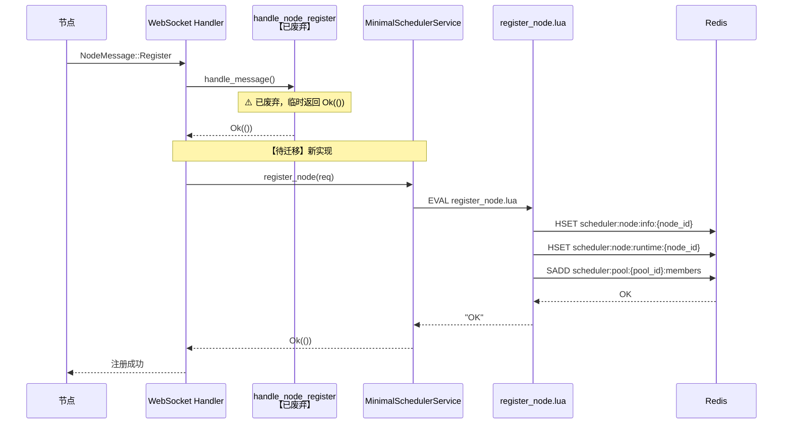

### 1.2 方法调用链

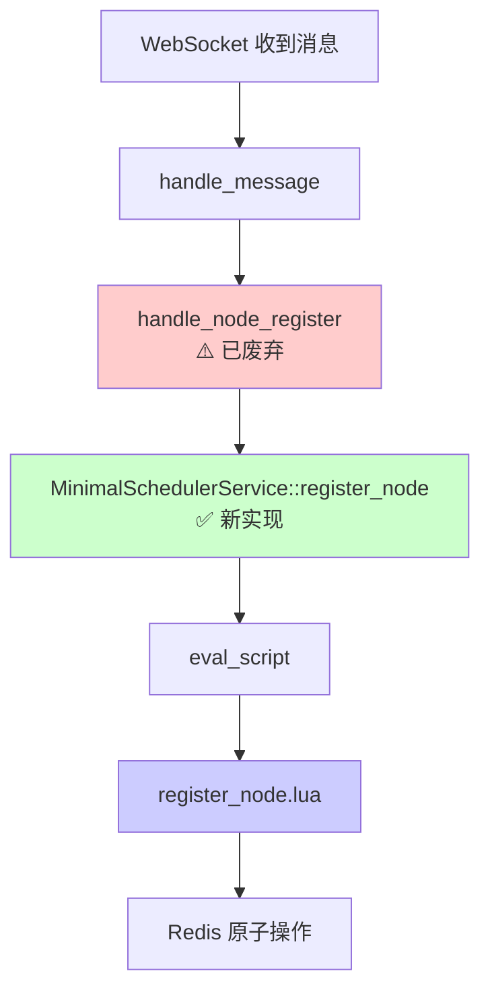

---

## 二、节点心跳流程

### 2.1 流程图

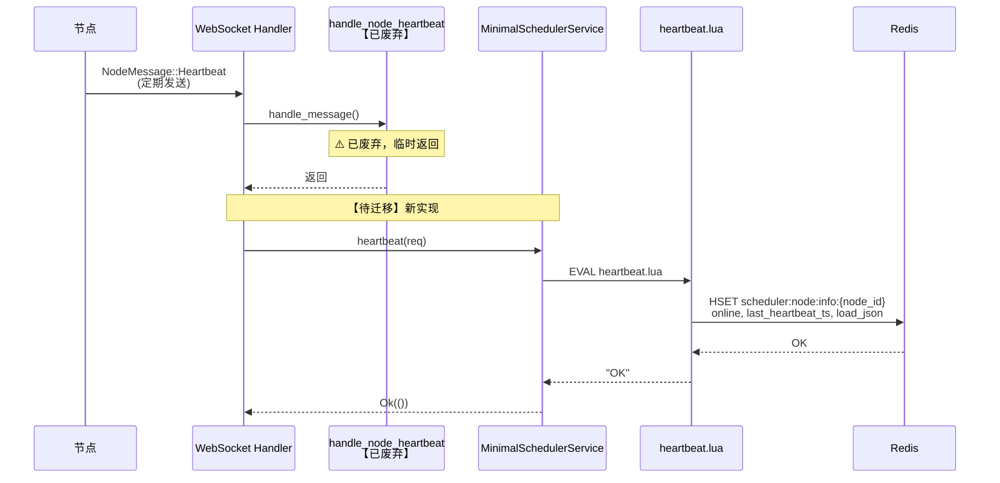

### 2.2 方法调用链

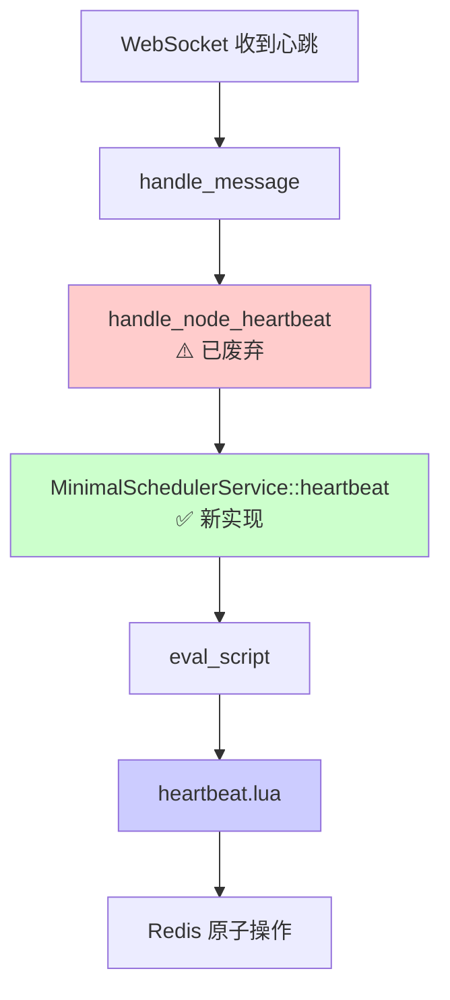

---

## 三、任务调度流程

### 3.1 流程图

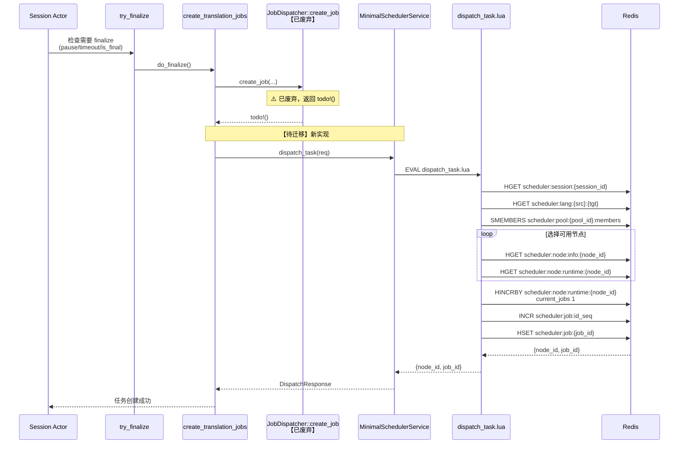

### 3.2 方法调用链

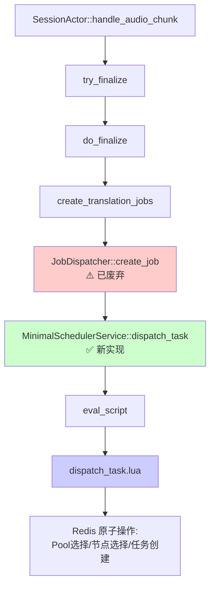

---

## 四、任务完成流程

### 4.1 流程图

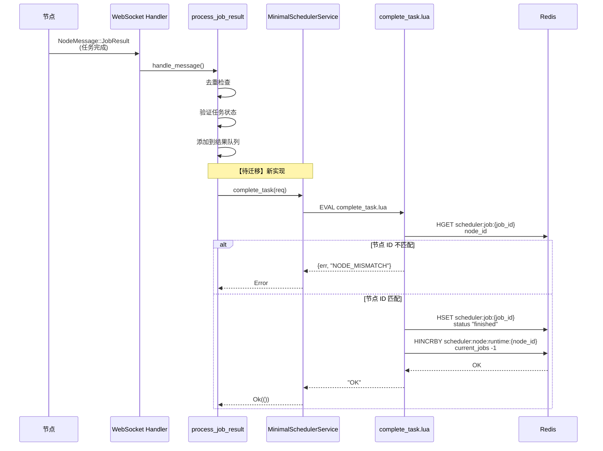

### 4.2 方法调用链

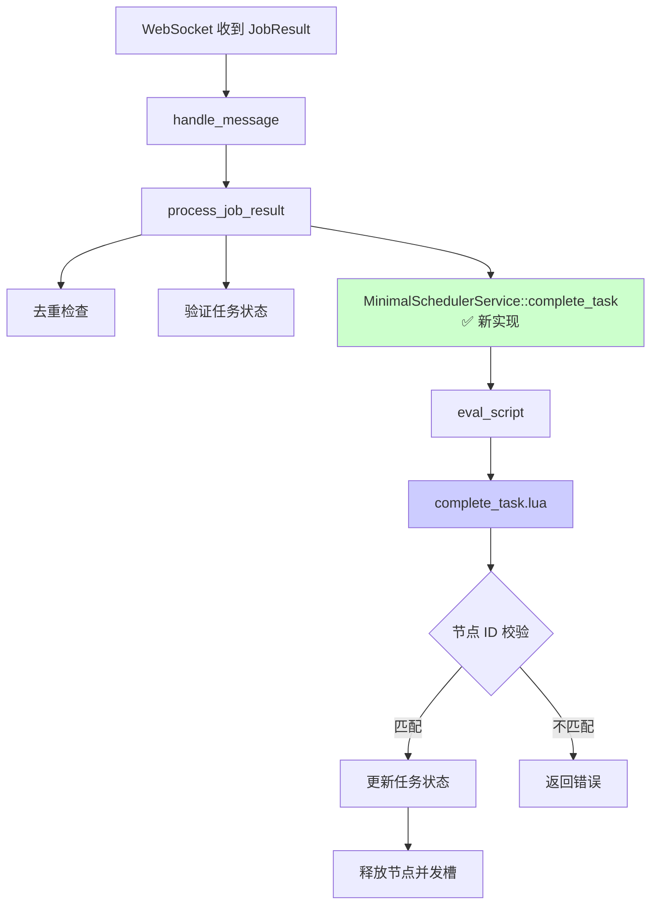

---

## 五、完整流程（端到端）

### 5.1 完整流程图

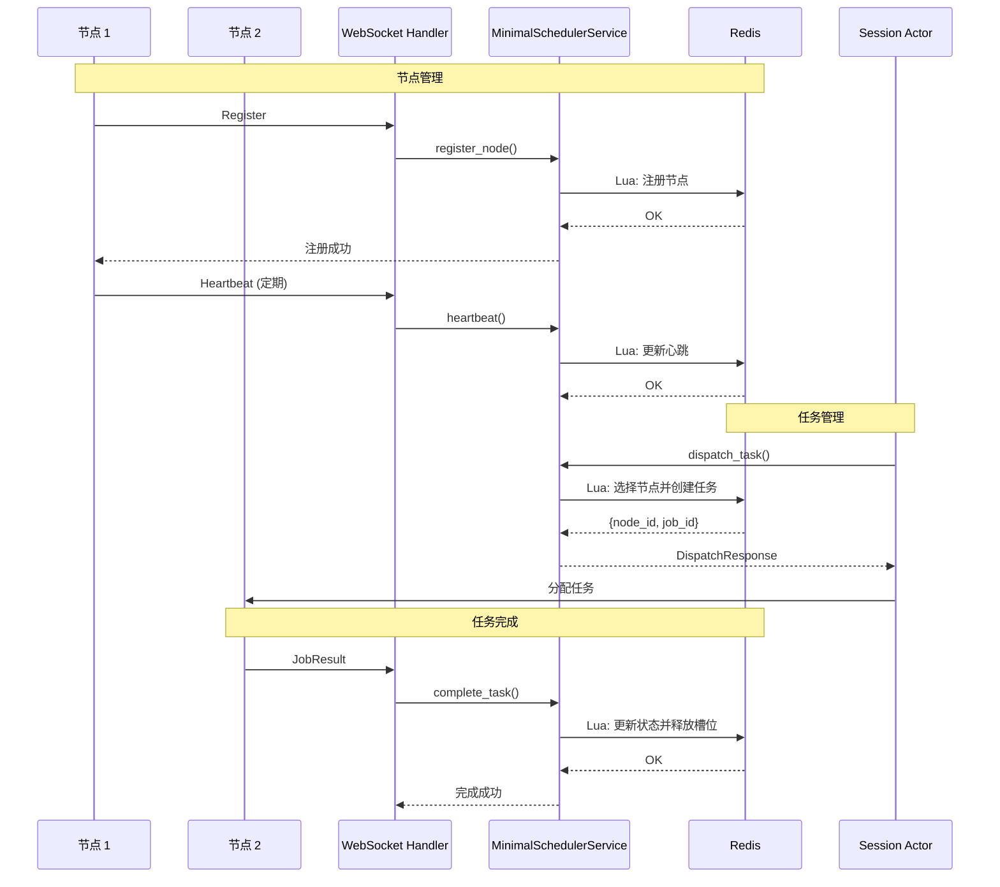

---

## 六、Redis 数据结构关系图

### 6.1 数据结构关系

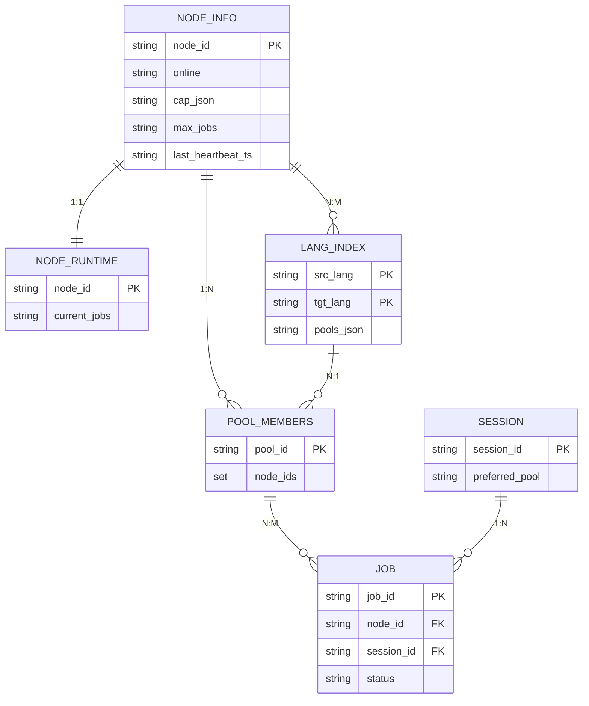

---

## 七、并发处理流程

### 7.1 并发任务调度

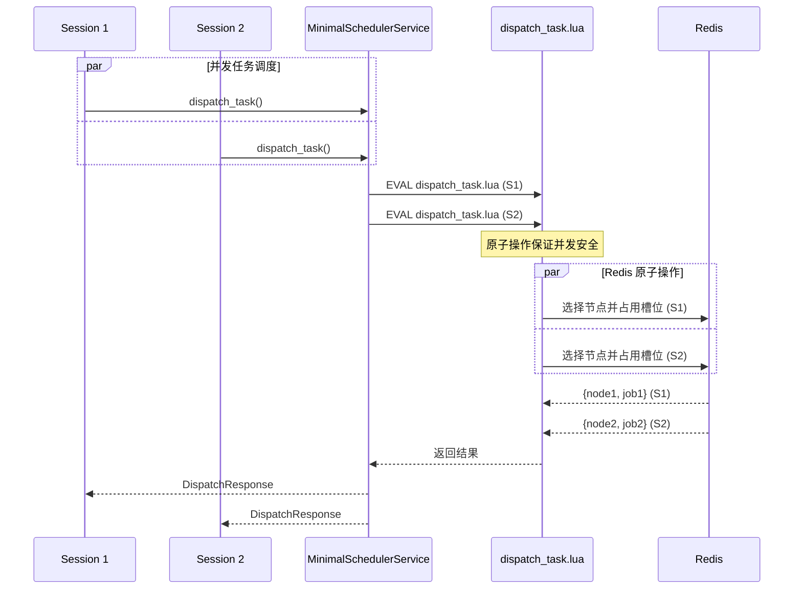

---

## 八、错误处理流程

### 8.1 任务调度错误

```mermaid
flowchart TD
    A[dispatch_task] --> B[执行 Lua 脚本]
    B --> C{检查会话绑定}
    C -->|不存在| D{检查语言索引}
    C -->|存在| E[使用 preferred_pool]
    D -->|不存在| F[返回错误:<br/>NO_POOL_FOR_LANG_PAIR]
    D -->|存在| G[选择 Pool]
    E --> H[获取 Pool 成员]
    G --> H
    H --> I{Pool 是否为空?}
    I -->|是| J[返回错误:<br/>EMPTY_POOL]
    I -->|否| K[选择可用节点]
    K --> L{找到可用节点?}
    L -->|否| M[返回错误:<br/>NO_AVAILABLE_NODE]
    L -->|是| N[占用并发槽]
    N --> O[创建任务记录]
    O --> P[返回成功:<br/>{node_id, job_id}]
    
    style F fill:#ffcccc
    style J fill:#ffcccc
    style M fill:#ffcccc
    style P fill:#ccffcc
```

### 8.2 任务完成错误

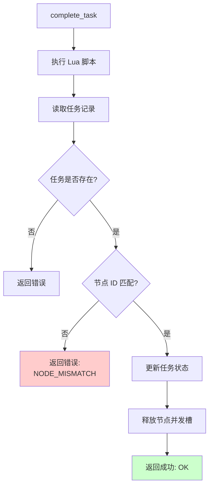

---

## 九、状态转换图

### 9.1 节点状态转换

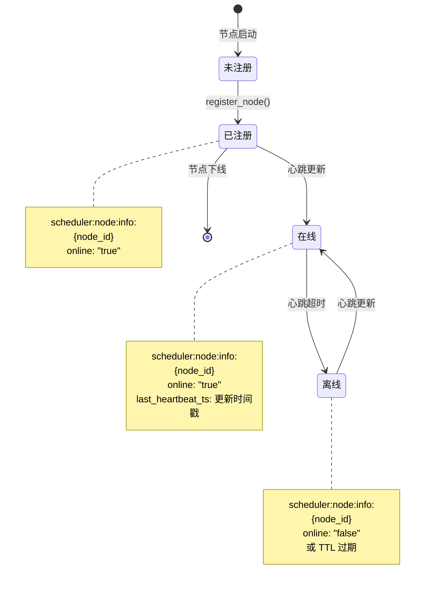

### 9.2 任务状态转换

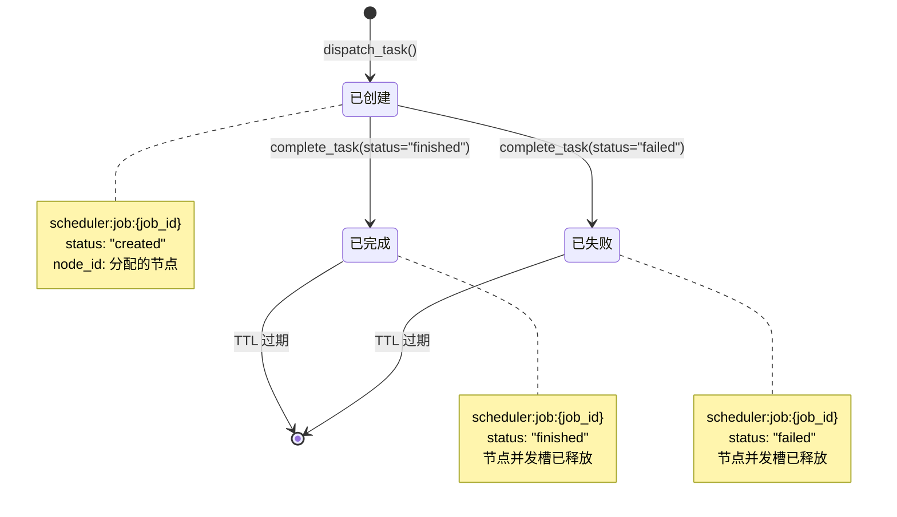

---

## 十、性能特征

### 10.1 操作复杂度

| 操作 | 时间复杂度 | Redis 调用次数 | Lua 脚本 |
|------|-----------|---------------|---------|
| 节点注册 | O(1) | 1 | ✅ |
| 节点心跳 | O(1) | 1 | ✅ |
| 任务调度 | O(N) | 1 | ✅ (N = Pool 节点数) |
| 任务完成 | O(1) | 1 | ✅ |

### 10.2 并发性能

- **节点注册**: ✅ 支持并发，Lua 脚本保证原子性
- **节点心跳**: ✅ 支持并发，Lua 脚本保证原子性
- **任务调度**: ✅ 支持并发，Lua 脚本保证节点并发槽正确占用
- **任务完成**: ✅ 支持并发，Lua 脚本保证节点并发槽正确释放

---

## 十一、关键代码位置索引

### 11.1 节点管理

| 功能 | 文件路径 | 行号 | 状态 |
|------|---------|------|------|
| WebSocket 消息处理 | `src/websocket/node_handler/message/mod.rs` | 42, 73 | ✅ |
| 节点注册（旧） | `src/websocket/node_handler/message/register.rs` | 10 | ⚠️ 已废弃 |
| 节点心跳（旧） | `src/websocket/node_handler/message/register.rs` | 55 | ⚠️ 已废弃 |
| 节点注册（新） | `src/services/minimal_scheduler.rs` | 125 | ✅ |
| 节点心跳（新） | `src/services/minimal_scheduler.rs` | 155 | ✅ |

### 11.2 任务管理

| 功能 | 文件路径 | 行号 | 状态 |
|------|---------|------|------|
| 任务创建入口 | `src/websocket/session_actor/actor/actor_finalize.rs` | 85 | ✅ |
| 任务创建 | `src/websocket/job_creator.rs` | 10 | ✅ |
| 任务调度（旧） | `src/core/dispatcher/job_creation.rs` | 17 | ⚠️ 已废弃 |
| 任务调度（新） | `src/services/minimal_scheduler.rs` | 180 | ✅ |
| 任务完成（新） | `src/services/minimal_scheduler.rs` | 256 | ✅ |
| 任务结果处理 | `src/websocket/node_handler/message/job_result/job_result_processing.rs` | - | ✅ |

### 11.3 Lua 脚本

| 功能 | 文件路径 | 状态 |
|------|---------|------|
| 节点注册 | `scripts/lua/register_node.lua` | ✅ |
| 节点心跳 | `scripts/lua/heartbeat.lua` | ✅ |
| 任务调度 | `scripts/lua/dispatch_task.lua` | ✅ |
| 任务完成 | `scripts/lua/complete_task.lua` | ✅ |

---

**文档版本**: v1.0  
**最后更新**: 2026-01-11  
**状态**: ✅ 流程图已完成
