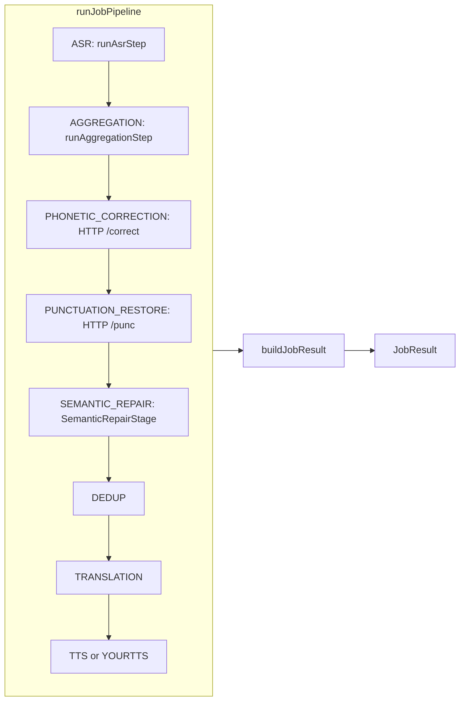

# CTC / Lexicon / Window Phonetic / KenLM 恢复前代码审计报告（只读）

**审计日期**：2026-05-16  
**仓库根路径**：`D:\Programs\github\lingua_1`  
**范围**：Electron 主进程 `electron_node/electron-node/main/src` 与 CTC ASR Python 服务 `electron_node/services/asr_sherpa_{lm,en}`；**未修改任何业务代码**，仅新增本 Markdown。

**说明**：本报告依据**当前仓库内真实 import / 调用与类型定义**整理，**不引用**历史设计文档作事实断言。与「P3.x / P3.5 frozen baseline」的对比，以「baseline 中应存在的模块/字段/约束」在当前树中**是否可定位**为准。

---

## 1. 总体结论

| 判断项 | 结论 |
|--------|------|
| 相对 P3.5 frozen baseline | **大面积丢失**（Node 主链上 lexicon / window phonetic / selector / safe writeback / KenLM meta 透传 / 对应 extra 与报告脚本**整段不存在**） |
| 是否需要重做 CTC n-best（Node 透传 + 类型 + ctx + extra） | **是**——ASR HTTP 仍返回 `nbest`，但 `ctc-asr-strategy.ts` **未映射**到 `ASRResult` |
| 是否需要重做 SQLite 词库（Node `lexicon/**`） | **是**——`main/src/lexicon` **不存在** |
| 是否需要重做 window phonetic | **是**——全仓库 `electron_node/electron-node` 下 **无** `windowPhonetic` / `buildWindowPhoneticDiagnostics` 等符号 |
| 是否需要重做 KenLM gate（Node 侧 gate + meta） | **是（Node 侧）**——Python CTC 解码仍用 KenLM 参与 beam，但 **无** `kenlm_decision` / veto 计数等字段；Node **无** `asr_kenlm_meta` |
| 是否需要重做 selector | **是**——**无** `activeSelector` / `buildLexiconSelectorGateEvidence` 等实现 |
| 是否需要重做 report / extra | **是**——`result-builder.ts` 的 `extra` **仅**含语言概率、LID、router、buffer 等；**无** `asr_lexicon_*`、`asr_window_phonetic`、`latency_audit` 等 |

**Python ASR 侧**：`asr-sherpa-lm` / `asr-sherpa-en` 仍含 **CTC + pyctcdecode `decode_beams` + nbest 列表 +（可选）KenLM .arpa 参与打分**；与 baseline 差距主要在 **Node 编排层与词库/选择器整条链路**。

---

## 2. 当前真实主链（JobPipeline）

**入口**：`inference-service.ts` 调用 `runJobPipeline`（`pipeline/job-pipeline.ts`）。

**步骤编排**：由 `inferPipelineMode` + `shouldExecuteStep`（`pipeline-mode-config.ts`）决定；`executeStep`（`pipeline-step-registry.ts`）分发。

**典型语音转译模式步骤顺序**（`PIPELINE_MODES.GENERAL_VOICE_TRANSLATION` 等）：

```text
ASR → AGGREGATION → PHONETIC_CORRECTION → PUNCTUATION_RESTORE → SEMANTIC_REPAIR → DEDUP → TRANSLATION → TTS（或 YOURTTS）
```

**与审计目标链的差异（事实）**：

- 主链中 **不存在**「CTC n-best → KenLM meta → lexicon recall → window phonetic → safe writeback → selector」任一独立步骤或子模块目录。
- `PHONETIC_CORRECTION` 为 **HTTP 调用**独立服务 `phonetic-correction`（`phonetic-correction-step.ts` → `getPhoneticCorrectionUrl()`，默认端口 **5016**），**不是** window phonetic / lexicon selector 链。



**ASR 子链（真实）**：`runAsrStep` → `PipelineOrchestratorASRHandler` / `taskRouter.routeASRTask` → `TaskRouterASRHandler.routeASRTaskWithEndpoint` → `asr-sherpa-*` 时 **`executeCTCASR`**（`task-router/ctc-asr-strategy.ts`）。

---

## 3. CTC n-best 审计

### 3.1 ASR 服务是否仍返回 n-best

**是**（Python）：

- `electron_node/services/asr_sherpa_lm/service_main.py`：`UtteranceResponse` 含 `nbest=nbest_list`。
- `electron_node/services/asr_sherpa_en/service_main.py`：同样返回 `nbest`。
- `api_models.py`：`UtteranceResponse.nbest: List[Dict[str, Any]]`。
- `ctc_decode.py`：`decode_beams` → 条目含 `text`, `score`, `logit_score`, `lm_score`（**未见** `rank`、`kenlm_decision` 字段名；`rank` 可由客户端按序推断）。

### 3.2 Node 层是否透传 n-best

**否（丢弃）**：

- `task-router/types.ts` 中 `ASRResult` **无** `nbest` 或等价字段。
- `task-router/ctc-asr-strategy.ts` 构造 `ASRResult` 时仅赋值 `text`, `confidence`, `language*`, `segments`, `is_final` 及可选 `text_zh`/`text_en`；**未读取** `response.data.nbest`。
- `pipeline/steps/asr-step.ts` 将 `asrResult` 赋给 `ctx.asrResult`，下游仅使用 `text` / `segments` / `language_probabilities` 等。

### 3.3 结论与丢失项

| 项 | 状态 |
|----|------|
| CTC n-best（服务 HTTP） | **完整存在** |
| CTC n-best（Node `ASRResult` / ctx / extra） | **已丢失**（等价于仅 top1 文本主链） |
| 丢失/缺口 | `ASRResult` 类型无 nbest；`ctc-asr-strategy.ts` 未透传；`JobContext` 无 `asrNbest` 等；`result-builder.ts` 未写入 `extra` |

---

## 4. KenLM 透传与过滤审计

### 4.1 ASR 服务侧

- **KenLM scoring**：`asr_sherpa_lm/ctc_decode.py`、`asr_sherpa_en/ctc_decode.py` 在提供 `.arpa` 时通过 pyctcdecode **参与 beam / n-best 打分**。
- **用户清单中的字段**（`kenlm_decision`, `kenlm_called_count`, `kenlm_veto_count`, `kenlm_vote_boost_count`, `lm_score_raw`, `lm_score_candidate`）：在 `electron_node/services` 下 **grep 无匹配** → **当前实现中不存在**这些命名诊断字段。

### 4.2 Node 层

- **无** `asr_kenlm_meta`、`KenlmServiceDiagnostics`、`gateEvidence`、`buildLexiconSelectorGateEvidence` 等符号（`main/src` 检索无匹配）。
- **无** selector gate 逻辑，故 **无法** 验证「full sentence n-best 禁止进入排序池」「veto 仅屏蔽整句」等 baseline 规则是否成立——**规则代码缺失**。

### 4.3 结论

| 项 | 状态 |
|----|------|
| KenLM 参与 CTC 解码（Python） | **存在** |
| KenLM 诊断 / veto / Node meta / gate | **已丢失**（相对 baseline 描述） |

---

## 5. SQLite 词库系统审计

| 项 | 状态 |
|----|------|
| `main/src/lexicon/**` | **路径不存在**（0 文件） |
| `LexiconRuntimeManager` / manifest / checksum / bundle | **未找到** |
| `lexicon_terms`、`backend=sqlite`、recall API 等 | **Node 主链无** |
| `recallLexiconCandidates`、`LexiconRecallRequest`、`mergeSerialRecall` 等 | **无符号** |

**结论**：相对 baseline 的 **SQLite 词库主链在 Node 侧视为已丢失**。Python 侧另有独立 `phonetic_correction_zh` 服务（仓库 `electron_node/services/phonetic_correction_zh`），**不等于** baseline 所述 Node 内嵌 lexicon + selector 架构。

---

## 6. 拼音候选 / window phonetic / safe writeback / multi-window / P3.5 phrase

全仓库在 `electron_node/electron-node` 下对以下模式的 **grep 无匹配**：

- `windowPhonetic`、`buildWindowPhoneticDiagnostics`、`lexiconWindowCandidates`
- `phraseProbeLegality`、`termBoundPhoneticRecall`、`writebackNbestSupport`
- `replacementSpanGeometry`、`multiWindowWritebacks`、`exactNbestAltSafeWriteback`
- `p35PhraseSupplement`、`appendDefaultP35PhraseLexicon`、`mergeP35PhraseSupplement`

**结论**：上述能力在当前树中 **视为已丢失**（无实现可审计）。

---

## 7. selector 审计

- **无** `activeSelector.ts`、`selectActiveUtteranceText`、`buildLexiconSelectorGateEvidence`。
- **无** `assertLexiconBound`、`selectedReason`、`asr_lexicon_selection` 等。

**结论**：selector **已丢失**；无法验证 baseline 的候选池约束。

---

## 8. JobResult.extra / report

### 8.1 `result-builder.ts` 当前写入的 `extra`

约包含：`language_probability`、`language_probabilities`、`detected_src_lang`、`audioBuffered`、`pendingEmptyJobs`、`lid`、`router`。

### 8.2 用户列出的字段

| 字段 | 当前 |
|------|------|
| `asr_kenlm_meta` | **无** |
| `asr_lexicon_meta` | **无** |
| `lexicon_recall_preview` | **无** |
| `asr_window_phonetic` | **无** |
| `asr_lexicon_selection` | **无** |
| `latency_audit` | **无** |
| `candidateSummary` | **无** |
| 旧字段 `asr_lexicon_candidates`、`lexicon_candidates_shadow`、`lexicon_core_shadow`、`asrLexiconCandidatesShadow`、`asrNbestRecallMeta.nbest_used_count` | **无**（亦未见「半残留」字符串） |

### 8.3 脚本与集成测试

| 路径 | 状态 |
|------|------|
| `electron_node/electron-node/scripts/window-phonetic-report.mjs` | **不存在** |
| `electron_node/electron-node/tests/integration/jobpipeline-wav-batch.integration.test.ts` | **不存在**（`tests/integration` 目录未找到） |

---

## 9. 冻结边界（硬约束）审计

用户列出的 9 条硬约束依赖 **lexicon / window phonetic / selector / 计数器** 等实现；当前代码中 **未找到** 对应常量、断言或计数（如 `full_sentence_nbest_writeback_count` 等 **全树无匹配**）。

**结论**：

- **不能**报告「约束仍成立」——**无执行体**。
- 相对 P3.5 baseline，应记为 **Blocker：冻结边界无代码承载**，主链已简化为「ASR 文本 top1 → 聚合 → 外呼同音/断句 → 语义修复…」，**无** n-best 污染防护实现可验证。

**语义修复与拼音步骤关系（事实）**：

- `pipeline-mode-config.ts`：`PHONETIC_CORRECTION` 与 `SEMANTIC_REPAIR` 为**顺序独立步骤**；同音服务为单独 HTTP，语义修复走 `semantic-repair-en-zh`（见 `task-router-semantic-repair.ts`）。
- **未发现**「5015 与 zh candidate rank 耦合」的 lexicon 代码路径（因 lexicon 缺失）。

**标点（punctuation）**：

- `PUNCTUATION_RESTORE` 在 `shouldExecuteStep` 中依赖 `ctx.shouldSendToSemanticRepair` 与源语言为 zh/en；**未见** job 级 feature flag「完全禁用标点且不占主链」的单独开关（仅能通过不进入该步骤的条件间接跳过）。

---

## 10. 测试与报告现状

| 测试类型 | 状态 |
|----------|------|
| windowPhonetic tests | **已丢失**（无对应源文件） |
| phrase-legality / multi-window geometry / activeSelector | **已丢失** |
| `result-builder.test.ts` | **仍存在**——断言当前精简版 `extra`（无 lexicon/kenlm 字段） |
| `asr-step.test.ts`、`pipeline-job-flow.test.ts` 等 | **仍存在**，覆盖当前 ASR/聚合/ mock 步骤，**不覆盖** baseline lexicon 主链 |
| `punctuation-restore-step.test.ts` | **仍存在** |
| `semantic-repair-step.test.ts` 等 | **仍存在** |
| jobpipeline WAV **integration** | **已丢失**（指定路径不存在） |

**风险**：现有测试**无法**证明 n-best / lexicon / selector 行为；与 baseline 对齐前，测试通过**不等于**主链正确。

---

## 11. 功能状态矩阵

| 功能 | 当前状态 | 证据文件 / 位置 | 丢失或残留问题 | 恢复优先级 |
|------|----------|-----------------|----------------|------------|
| CTC n-best（HTTP） | 保留 | `asr_sherpa_lm/service_main.py`, `asr_sherpa_en/service_main.py` | 字段与 baseline  schema 可能不完全一致（无 `rank`/`kenlm_decision`） | P1 |
| CTC n-best（Node） | 已丢失 | `ctc-asr-strategy.ts`, `types.ts` | 未进入 `ASRResult`/ctx/extra | **P0** |
| KenLM meta / gate（Node） | 已丢失 | 无匹配符号 | 无透传、无 selector gate | **P0** |
| KenLM（Python 解码） | 保留 | `ctc_decode.py` | 无 veto 诊断字段 | P2 |
| SQLite lexicon | 已丢失 | `main/src/lexicon` 不存在 | 整模块缺失 | **P0** |
| recall top1-only / shadow | 无法评估 | 无 lexicon 代码 | 主链无 recall | P0 |
| window phonetic | 已丢失 | 全树无符号 | 整段缺失 | P0–P1 |
| phraseProbe / safe writeback / multi-window | 已丢失 | 无 | 整段缺失 | P1–P2 |
| selector | 已丢失 | 无 | 整段缺失 | **P0** |
| extra / report | 大幅缺失 | `result-builder.ts` | 无 baseline 诊断字段 | P1 |
| punctuation disable | 部分/弱 | `pipeline-mode-config.ts` | 无显式「禁用标点步骤」flag | P3 |
| semantic repair 边界 | 与当前链一致 | `semantic-repair-step.ts`, `task-router-semantic-repair.ts` | 与 baseline「lexicon 解耦」比对：**无 lexicon 故无旧耦合**，但也无新边界测试 | P2 |

---

## 12. Blocker 清单

1. **Node 侧不消费 n-best**：上游若扩展候选，当前主链**无法**消费，报告**不可信**（相对 n-best 设计目标）。
2. **无 lexicon / selector**：任何依赖「仅允许 lexiconBound 候选排序」的质量保证**不存在**。
3. **冻结边界无实现**：无法运行时断言 `full_sentence_nbest_writeback_count == 0` 等；**回归无法检测**旧逻辑回流（除非补测试与实现）。
4. **集成测试缺失**：无 `jobpipeline-wav-batch` 类端到端，**易误并**未验证代码。

---

## 13. 半残留清单

| 类型 | 说明 |
|------|------|
| `ASRTask` 上 beam 等字段 | `types.ts` 中 **仍有** `beam_size`/`patience` 等；`ctc-asr-strategy.ts` **会**把 `beam_size` 传入 request body，但 **与 n-best/lexicon 主链无衔接** |
| `asr/candidate-provider.ts` | 讨论 N-best / faster-whisper **不支持** n-best；**与当前 CTC Sherpa 主链未形成闭环**（易误导维护者） |
| `phonetic-correction`（5016） | **独立服务步骤**存在，**不是** window phonetic selector 的替代实现 |

---

## 14. 最小恢复路线（建议）

### P0（必须先恢复）

1. 扩展 `ASRResult`（及 `executeCTCASR`）**显式**映射 `nbest` 与必要 meta（与 HTTP 契约对齐）。
2. `JobContext` + `buildJobResult`：**结构化**写入 `extra`（至少能证明 n-best 未丢弃）。
3. 恢复 **selector + gate 证据** 的最小可测切片（哪怕先只记录 diagnostics，不参与改文）。

### P1（主链恢复）

4. 新建/恢复 `lexicon/**`（runtime + sqlite）与 **recall top1-only** 契约的单测锁定。
5. `aggregation-step` / 后续步骤间数据契约：明确 **仅 raw top1** 进入 recall（若 baseline 如此）。

### P2（window phonetic / safe writeback）

6. 按模块恢复 `windowPhonetic`、phraseProbe、safe writeback 规则与计数器（与冻结边界一一对应测试）。

### P3（report / tests）

7. 恢复 `window-phonetic-report.mjs`、`jobpipeline-wav-batch.integration.test.ts` 或等价物。
8. `result-builder` 测试扩展为覆盖 `asr_kenlm_meta`、`asr_lexicon_selection` 等。

### P4（cleanup）

9. 清理或标注 `candidate-provider` 等与真实 CTC 路径不一致的注释/模块，避免双轨认知。

---

## 15. 不建议恢复的旧逻辑（清单）

按用户要求，以下在恢复时**不应**以「旧灰度」形式回流：

- `LEXICON_CORE_MODE`、shadow / active **双路径**并行写回
- recall **直接使用 n-best 全量**作为 recall API 输入（若 baseline 已禁止）
- **整句** n-best 进入 selector 排序池
- **单字** safe writeback、**context replacement**、**semantic free rewrite**
- **强制**标点步骤不可禁用（若产品要求可禁用，应以显式 flag + 单测固定）
- 将 **phonetic_pinyin** 与 **n-best 全文** 混排序的旧 selector 策略

---

## 16. 建议下一步（最小 patch plan + 验收）

1. **契约先行**：在 `shared` 或 `types.ts` 中定义 `NBestRow` / `UtteranceResponse` 对齐类型；`ctc-asr-strategy` 单测：mock HTTP 含 `nbest` → 断言 `ctx.asrResult` 带列表。
2. **最小 extra**：`buildJobResult` 增加 `extra.asr_nbest`（或命名与 baseline 一致），并由集成测试断言非空（Sherpa mock）。
3. **恢复 lexicon 包目录**（空壳 + SQLite probe + fallback）后再挂 recall。
4. **验收命令**（在 `electron_node/electron-node` 下，按项目实际 script 调整）：

```bash
npm test -- --testPathPattern="result-builder|ctc-asr|asr-step"
```

（待恢复集成测试后增加：）

```bash
npm test -- --testPathPattern="jobpipeline-wav-batch"
```

---

## 17. 证据索引（便于人工复核）

| 文件 | 与审计关系 |
|------|------------|
| `electron_node/electron-node/main/src/pipeline/job-pipeline.ts` | 唯一编排器、`buildJobResult` 出口 |
| `electron_node/electron-node/main/src/pipeline/pipeline-step-registry.ts` | 步骤表（无 TEXT_CORRECTION / LEXICON 步骤） |
| `electron_node/electron-node/main/src/pipeline/pipeline-mode-config.ts` | 步骤顺序与 `shouldExecuteStep` |
| `electron_node/electron-node/main/src/pipeline/steps/asr-step.ts` | 写 `ctx.asrResult` |
| `electron_node/electron-node/main/src/pipeline/context/job-context.ts` | 无 nbest/lexicon 字段 |
| `electron_node/electron-node/main/src/pipeline/result-builder.ts` | `extra` 字段精简 |
| `electron_node/electron-node/main/src/task-router/ctc-asr-strategy.ts` | **丢弃** `data.nbest` |
| `electron_node/electron-node/main/src/task-router/types.ts` | `ASRResult` 无 nbest |
| `electron_node/services/asr_sherpa_lm/service_main.py` | 返回 `nbest` |
| `electron_node/services/asr_sherpa_lm/ctc_decode.py` | `decode_beams` + KenLM |

---

*本文件为只读审计产物；若后续代码变更，请重新跑审计并更新版本日期。*
