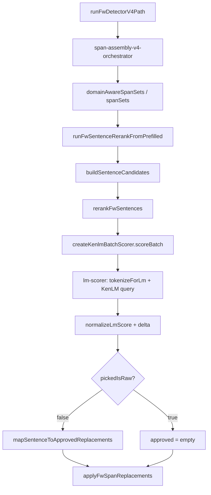

# KenLM Audit P1 — Call Chain

**审计日期：** 2026-06-17  
**数据批次：** dialog_200 冻结批测（81 案，`same-domain-per-span-dialog200-batch-result.json`）  
**代码基线：** FW Repair V4 SameDomain + Base Per-Span Assembly（FINAL FROZEN）

---

## 目标

确认 `SentenceCandidate → KenLM → Score → Delta → Apply` 链路是否完整、无断点。

---

## 代码位置

| 阶段 | 文件 | 函数 |
|------|------|------|
| V4 入口 | `electron_node/electron-node/main/src/fw-detector/fw-detector-v4-path.ts` | `runFwDetectorV4Path` |
| Scorer 创建 | `electron_node/electron-node/main/src/asr-repair/sentence-rerank/kenlm-scorer.ts` | `createKenlmBatchScorer` |
| LM 子进程 | `electron_node/electron-node/main/src/phonetic-correction/lm-scorer.ts` | `createLmScorer` / `runKenlmQuery` |
| Tokenize | `electron_node/electron-node/main/src/phonetic-correction/char-tokenize.ts` | `tokenizeForLm` |
| 句候选组合 | `electron_node/electron-node/main/src/fw-detector/build-sentence-candidates.ts` | `buildSentenceCandidates` |
| Rerank + Delta | `electron_node/electron-node/main/src/fw-detector/rerank-fw-sentences.ts` | `rerankFwSentences` |
| Prefilled 编排 | `electron_node/electron-node/main/src/fw-detector/kenlm/run-fw-sentence-rerank-from-prefilled.ts` | `runFwSentenceRerankFromPrefilled` |
| Approved 映射 | `electron_node/electron-node/main/src/fw-detector/map-sentence-to-approved.ts` | `mapSentenceToApprovedReplacements` |
| Apply | `electron_node/electron-node/main/src/fw-detector/apply-span-replacements.ts` | `applyFwSpanReplacements` |

---

## 调用链



### 数据流

```text
rawText (ASR)
  └─ spanSets[][]  (per-span SpanReplacementPick)
       └─ buildSentenceCandidates → SentenceCombination[]{ text, replacements, candidateScore }
            └─ rerankFwSentences:
                 sentences = [rawText, ...candidate.text]
                 batch.scores[i] → { score, normalizedScore }
                 delta[i] = norm(candidate_i) - norm(raw)
                 maxDelta = max(delta)
                 pickedIsRaw = (maxDelta < minDeltaToReplace)
            └─ if !pickedIsRaw → mapSentenceToApprovedReplacements(picked)
            └─ applyFwSpanReplacements(rawText, approved)
```

---

## 审计回答

### 1. raw sentence 在哪里进入候选集？

**不在 `SentenceCombination[]` 内。** raw 作为 **baseline**，在 `rerankFwSentences` 中单独置于评分数组首位：

```44:46:electron_node/electron-node/main/src/fw-detector/rerank-fw-sentences.ts
  const sentences = [rawText, ...candidates.map((c) => c.text)];
  const batch = await scorer.scoreBatch(sentences);
  const baselineNorm = batch.scores[0]?.normalizedScore ?? 0;
```

raw 不参与笛卡尔积组合，但 **必定进入 KenLM 评分**（index 0）。

### 2. candidate sentence 在哪里进入候选集？

1. `buildSentenceCandidates(rawText, spanSets, maxSentenceCandidates=16)` — 对各 span 候选做笛卡尔积，按 `candidateScore` 排序后截断至 16 条。
2. 每条 `SentenceCombination.text` 由 `applyReplacementsRightToLeft(rawText, picks)` 生成。
3. 进入 KenLM 时映射为 `sentences[1..N]`。

### 3. KenLM 实际评分数量（81 案统计）

| 指标 | 值 |
|------|-----|
| 每案 raw 评分 | 1 |
| 每案 candidate 评分（均值） | 9.48 |
| 每案 total（均值） | **10.48**（= 1 raw + 9.48 candidate） |
| kenlmQueryCount（诊断均值） | 10.48 |
| 全批次 total 查询 | **848**（81 × 10.48） |

`kenlmQueryCount` 与 `1 + combinationCount` 一致（d001：17 = 1 + 16）。

### 4. 是否存在候选未评分 / 重复评分 / 跳过评分 / 提前返回？

| 检查项 | 结论 |
|--------|------|
| 候选未进入 KenLM | **否**（在 `combinationCount > 0` 且 scorer 可用时，所有组合均评分） |
| raw 未进入 KenLM | **否**（scorer 可用时 index 0 必为 raw） |
| 重复评分 | **否**（每句一次 `scorer.score`，无缓存复用也无二次 rerank） |
| 跳过评分 | **有条件**：`candidates.length === 0` 或 `scorer === null` 时提前返回，kenlmQueryCount=0 |
| 提前返回 | **是**：空组合 / 无 scorer → `pickedIsRaw=true`，不调用 KenLM |

批测 81 案：`combinationCount > 0` 且 KenLM gate 开启，**无跳过评分案**。

### 5. KenLM 输出结构

**运行时内部结构**（`KenLMScore`）：

```3:7:electron_node/electron-node/main/src/asr-repair/kenlm-batch-types.ts
export type KenLMScore = {
  sentence: string;
  score: number;
  normalizedScore: number;
};
```

**对外诊断结构**（`FwSentenceRerankDiagnostics`）：

| 字段 | 是否输出 | 说明 |
|------|----------|------|
| rawScore | **否** | 原始 log-prob 未写入 diagnostics |
| bestScore | **否** | 同上 |
| delta | **部分** | 仅 `maxDelta` + `allCombinationDeltas[]` + `topCandidates[].kenlmDelta` |
| pickedIsRaw | **是** | |
| bestSentence | **部分** | `topCandidates[0].text`（按 delta 排序后）；`picked` 仅在通过 gate 时有值 |

**d001 实测（独立 query 复核）：**

| 句 | raw score | normalized | delta |
|----|-----------|------------|-------|
| raw ASR | -97.79 | 0.0000566 | — |
| best candidate | -86.80 | 0.0001699 | **0.000113** |

### 6. Apply 最终消费哪些字段

Apply 路径：

```139:141:electron_node/electron-node/main/src/fw-detector/kenlm/run-fw-sentence-rerank-from-prefilled.ts
  const approved =
    rerank.pickedIsRaw || !rerank.picked
      ? []
      : mapSentenceToApprovedReplacements(rerank.picked, input.config.candidateRequireRepairTarget);
```

```239:239:electron_node/electron-node/main/src/fw-detector/fw-detector-v4-path.ts
  ctx.segmentForJobResult = applyFwSpanReplacements(rawText, decision.approved);
```

Apply **直接消费**：

- `rerank.pickedIsRaw` — 为 true 则 approved 为空
- `rerank.picked.replacements[]` — `{ span.start, span.end, word, repairTarget }`
- `candidateRequireRepairTarget` — 过滤非 repairTarget 替换

Apply **不消费**：rawScore、normalizedScore、kenlmDelta（除 gate 决策外）、topCandidates。

---

## 统计结果

- 链路完整度：**逻辑链完整**（Assembly → 组合 → KenLM → Delta → Gate → Apply）
- 诊断完整度：**rawScore / bestScore 未落盘**
- 81 案 KenLM 调用：**848 次 query**，0 案 scorer 缺失，0 案空组合

---

## PASS / FAIL

| 维度 | 判定 |
|------|------|
| 调用链完整性 | **PASS** |
| raw + candidate 均进入 KenLM | **PASS** |
| 诊断字段完整性（rawScore/bestScore） | **FAIL** |
| Apply 消费路径清晰 | **PASS** |

**综合：PASS（链路可用）/ 诊断 FAIL（score 原始值不可追溯）**

---

## 风险项

1. **原始 KenLM score 未写入 diagnostics**，后续 Score 尺度审计只能离线复跑 query。
2. **`scoreBatch` 为串行逐句 query**，非真正 batch；timing.queryCount 等于句子数。
3. **`topCandidates` 仅保留组合排序前 5 条**（评分前 slice），与 maxDelta 来源（全量 16 条）不一致，诊断可能漏展示最优句。
4. scorer 不可用时 fail-open 为 `pickedIsRaw=true`，与「KenLM 关闭 = 不替换」一致，但无显式 reason 字段。

---

## 结论

`SentenceCandidate → KenLM → Delta → Apply` **主链路无断点**，raw 与全部 sentence combination 均在同一次 `scoreBatch` 中评分。  
Apply 仅依赖 **delta gate 结果（pickedIsRaw）+ picked.replacements**，不读原始 LM 分数。  
问题不在链路缺失，而在 **诊断层未导出 rawScore/bestScore**，以及 **delta 过小导致 gate 恒 false**（见 P2/P6）。
