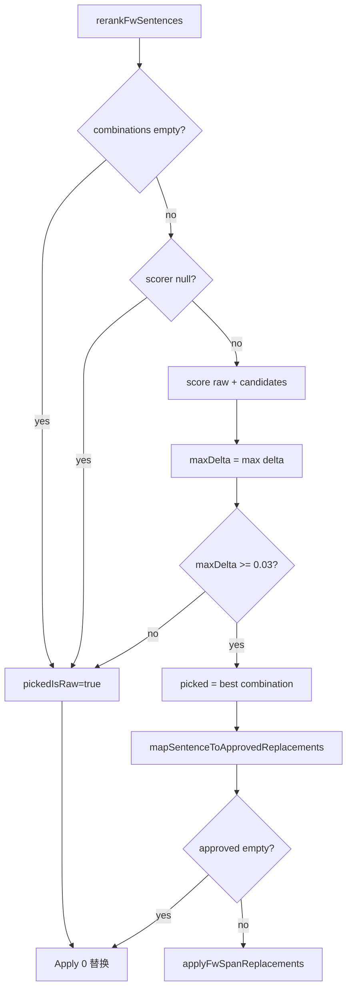

# KenLM Audit P6 — Apply Gate

**审计日期：** 2026-06-17  
**数据批次：** dialog_200 冻结批测（81 案，FW Apply = **0**）

---

## 目标

解释 FW Apply=0 的原因；审计 `minDeltaToReplace`、`pickedIsRaw`、replace gate；统计 81 案卡在哪个 Gate。

---

## 代码位置

| Gate | 文件 | 条件 |
|------|------|------|
| KenLM 开关 | `fw-detector-v4-path.ts` | `enableKenLMGate ? createKenlmBatchScorer() : null` |
| 空组合 | `rerank-fw-sentences.ts` | `!candidates.length` |
| 无 scorer | `rerank-fw-sentences.ts` | `!scorer` |
| **Delta gate** | `rerank-fw-sentences.ts` | `bestDelta < minDeltaToReplace` |
| pickedIsRaw | `run-fw-sentence-rerank-from-prefilled.ts` | `pickedIsRaw \|\| !picked → approved=[]` |
| repairTarget | `map-sentence-to-approved.ts` | `requireRepairTarget && !repairTarget` |
| 同词跳过 | `map-sentence-to-approved.ts` | `word === span.text` |
| Apply | `apply-span-replacements.ts` | `replacements.length === 0 → 原文` |

默认配置（`fw-config.ts`）：`minDeltaToReplace = 0.03`，`enableKenLMGate = true`，`maxSentenceCandidates = 16`。

---

## 调用链（Apply 决策）



---

## Apply 条件（完整列出）

**必要条件（全部满足才 Apply > 0）：**

1. `enableKenLMGate === true` 且 scorer 可用  
2. `combinationCount > 0`  
3. `maxDelta >= minDeltaToReplace`（**0.03**）  
4. `pickedIsRaw === false` 且 `picked !== null`  
5. `mapSentenceToApprovedReplacements` 返回非空（至少一处 `word !== span.text` 且满足 repairTarget）

**任一失败 → appliedCount = 0。**

---

## 81 案 Gate 分布

| Gate | 案数 | 占比 | 说明 |
|------|------|------|------|
| **delta gate**（maxDelta < 0.03） | **81** | **100%** | 全部 pickedIsRaw=true |
| pickedIsRaw gate（delta 通过但仍 raw） | 0 | 0% | 无 delta 通过案 |
| noCombinations | 0 | 0% | |
| noScorer | 0 | 0% | |
| repairTarget / 同词 / 其它 | 0 | 0% | 未到达 map 阶段 |

**批测诊断：**

| 指标 | 值 |
|------|-----|
| pickedIsRaw_count | 81 |
| applied_count | 0 |
| maxDelta 最大 | 0.007483 |
| maxDelta P95 | 0.002773 |
| maxDelta 均值 | 0.000176 |

---

## Delta 分桶 vs Gate

| maxDelta 区间 | 案数 |
|---------------|------|
| < 0 | 26 |
| = 0 | 22 |
| 0 ~ 0.001 | 23 |
| 0.001 ~ 0.01 | 10 |
| 0.01 ~ 0.03 | 0 |
| **≥ 0.03** | **0** |

---

## 若仅放宽 delta gate（统计观测，非建议）

| 阈值 | 理论通过 delta gate 案数 |
|------|--------------------------|
| 0.03（当前） | **0** |
| 0.01 | **0** |
| 0.007 | **1**（d079） |
| 0.005 | **2** |
| 0.001 | **10** |

即使放宽至 0.01，**仍为 0 Apply**；需降至 ~0.007 才有 1 案通过 delta gate。通过后尚需 `mapSentenceToApprovedReplacements` 非空（当前未观测 repairTarget 阻断，因无案到达该步）。

---

## Gate 占比汇总

```text
delta gate:        100%  (81/81)
pickedIsRaw gate:    0%  (0/81)   ← 与 delta gate 合并，delta 失败即 pickedIsRaw
noCombinations:      0%
noScorer:            0%
repairTarget/其它:   0%  (未触发)
```

---

## PASS / FAIL

| 维度 | 判定 |
|------|------|
| Gate 逻辑可追溯 | **PASS** |
| 81 案 Apply=0 原因可解释 | **PASS** |
| Gate 与 delta 尺度一致 | **FAIL**（见 P2） |

**综合：Gate 行为 PASS / 尺度匹配 FAIL**

---

## 风险项

1. **单一硬 gate**：仅 `minDeltaToReplace`，无次级置信度或 per-span gate。  
2. **delta 未达阈值时 `picked=null`**，丢失「最佳未 apply 句」的结构化 picked 记录。  
3. **`candidateRequireRepairTarget`** 在 delta 通过后可能进一步削减 approved，本次 **0 案触达**。  
4. **enableKenLMGate=false** 时 silent apply=0，批测已强制 true。

---

## 结论

**FW Apply = 0 的原因：100% 卡在 delta gate** — 全部 81 案 `maxDelta < minDeltaToReplace (0.03)`，导致 `pickedIsRaw=true` → `approved=[]` → `applyFwSpanReplacements` 无替换。  

无案因 noCombinations、noScorer、repairTarget、同词跳过而阻断。  

KenLM **完成了评分** 但未 **给出 Apply**，因为 **Gate 阈值与 normalized delta 尺度失配**（P2：最大 delta 0.0075 ≪ 0.03）。  

**问题位于：Apply Gate 层（minDeltaToReplace）← 上游 Delta/Score 尺度层**
