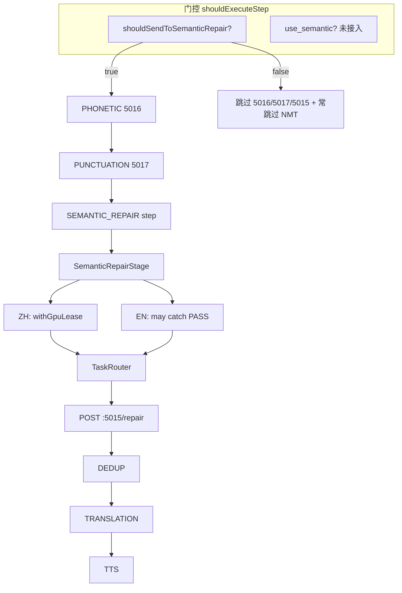

# 主链 · 语义修复代码审计（只读）

**审计日期**：2026-05-16  
**仓库**：`D:\Programs\github\lingua_1`  
**范围**：`electron_node/electron-node/main/src` — JobPipeline、TaskRouter、postprocess 语义修复链路  
**性质**：只读审计，**未修改任何业务代码**。

---

## 1. 总体结论

| 审计项 | 结论 |
|--------|------|
| 主链是否强制依赖 semantic repair（5015）？ | **部分强制**：`SEMANTIC_REPAIR` 是否执行由 `ctx.shouldSendToSemanticRepair`（聚合/长度策略）决定，**未**接入 `job.pipeline.use_semantic` 或 `features.semanticRepair.enabled`。 |
| 5015 未启动时是否会发 HTTP？ | **生产路径通常不会**（端点需 `status==='running'`）；无 running 端点时 router **throw**，但被上层 **catch / EN PASS** 软化。 |
| 中文是否误挂 `candidate_rank_zh` / 5018？ | **否**。仓库内**无** `candidate-rank-zh.ts`、`5018` 服务；中文后处理为 **5016 同音 + 5017 标点 + 5015 语义修复 HTTP**。 |
| `semantic_repair_applied` 语义是否混乱？ | **与 5018 无混淆**；**存在** EN 仅 normalize 时也可能 `applied=true` 的报表歧义。 |
| `semantic_repair_ms` 是否代表 5015 耗时？ | **代码库无此字段**；外部 ~1–2ms 多为未走 HTTP 或 step 空跑，非 5015 SLA。 |
| 热插拔改造工作量 | **中**（开关接线 + flag 拆分 + 失败策略统一 + 字段/指标命名） |

**总评：不通过**（相对目标：`features.semanticRepair=false` → 不发 5015、NMT/TTS 仍正常）。

---

## 2. 审计范围与方法

### 2.1 搜索关键词（已执行）

`SEMANTIC_REPAIR`、`semantic_repair`、`semanticRepair`、`semantic-repair`、`runSemanticRepairStep`、`shouldSendToSemanticRepair`、`use_semantic`、`features.semanticRepair`、`5015`、`semantic-repair-en-zh`、`withGpuLease`、`STEP_REGISTRY`、`shouldExecuteStep`、`/repair` 等。

### 2.2 重点文件（均已阅读）

| 路径 | 角色 |
|------|------|
| `pipeline/pipeline-mode-config.ts` | 模式步骤列表、`shouldExecuteStep` |
| `pipeline/pipeline-step-registry.ts` | `STEP_REGISTRY` → `runSemanticRepairStep` |
| `pipeline/job-pipeline.ts` | 唯一编排器、关键步骤失败策略 |
| `pipeline/steps/semantic-repair-step.ts` | Pipeline 内语义修复步骤 |
| `pipeline/steps/aggregation-step.ts` | 设置 `shouldSendToSemanticRepair` |
| `pipeline/steps/phonetic-correction-step.ts` | 5016 HTTP |
| `pipeline/steps/punctuation-restore-step.ts` | 5017 HTTP |
| `pipeline/steps/translation-step.ts` | NMT 门控（绑 `shouldSendToSemanticRepair`） |
| `pipeline/context/job-context.ts` | 上下文字段 |
| `pipeline/result-builder.ts` | `semantic_repair_applied` 写出 |
| `task-router/task-router-semantic-repair.ts` | **5015 HTTP 生产入口** `POST /repair` |
| `task-router/task-router.ts` | 注入 `isServiceRunningCallback` |
| `agent/postprocess/postprocess-semantic-repair-initializer.ts` | Stage 初始化（registry.has） |
| `agent/postprocess/semantic-repair-stage.ts` | 语言路由 |
| `agent/postprocess/semantic-repair-stage-zh.ts` | 中文 + `withGpuLease` |
| `agent/postprocess/semantic-repair-stage-en.ts` | 英文 + catch 吞错 |
| `inference/inference-service.ts` | 创建 `SemanticRepairInitializer` |
| `services/semantic_repair_en_zh/service.json` | 端口 **5015**、`/repair` |

### 2.3 不存在于本仓库的路径

- `pipeline/steps/candidate-rank-zh.ts`
- `apply5018Fallback`
- 端口 **5018** 专用节点服务目录

---

## 3. 当前真实调用链

### 3.1 主链步骤顺序（通用语音转译模式）

```
ASR → AGGREGATION → PHONETIC_CORRECTION → PUNCTUATION_RESTORE → SEMANTIC_REPAIR → DEDUP → TRANSLATION → TTS
```

定义于 `pipeline-mode-config.ts` 的 `GENERAL_VOICE_TRANSLATION`（及 PERSONAL_VOICE_TRANSLATION、SUBTITLE_MODE、ASR_ONLY 等）。

### 3.2 中文路径（zh）

```
aggregation-step
  → ctx.shouldSendToSemanticRepair = true（满足长度/合并策略时）
  → phonetic-correction-step → HTTP 5016 /correct（改 ctx.segmentForJobResult）
  → punctuation-restore-step → HTTP 5017 /punc
  → semantic-repair-step
       → SemanticRepairInitializer.getSemanticRepairStage()
       → SemanticRepairStage.processChinese()
       → SemanticRepairStageZH.process()
       → withGpuLease('SEMANTIC_REPAIR', …)
       → TaskRouter.routeSemanticRepairTask()
       → TaskRouterSemanticRepairHandler → POST http://127.0.0.1:5015/repair
  → dedup-step（读 ctx.repairedText）
  → translation-step（读 ctx.repairedText）
  → tts-step
```

### 3.3 英文路径（en）

与中文共用 `SEMANTIC_REPAIR` 步骤；`SemanticRepairStage.processEnglish()` 可先 `EnNormalizeStage`，再 `SemanticRepairStageEN` → 同一 `routeSemanticRepairTask` → `POST /repair`（`lang: 'en'`）。

**差异**：`semantic-repair-stage-en.ts` 在 HTTP 失败时 **catch → decision PASS + 原文 + reasonCodes SERVICE_ERROR**，不向上 throw。

### 3.4 跳过 / 空跑路径

| 条件 | 行为 |
|------|------|
| `ctx.shouldSendToSemanticRepair !== true` | 跳过 PHONETIC、PUNCTUATION、SEMANTIC_REPAIR；`repairedText` 常为空 |
| `shouldSendToSemanticRepair === false` | `translation-step` **跳过 NMT**（`translatedText=''`） |
| `segmentForJobResult` 为空 | `runSemanticRepairStep` 早退 |
| registry 无 `semantic-repair-en-zh` | initializer 无 stage → step 设 **`shouldSend=false`**（整 job 不送） |
| 5015 无端点 / 非 running | router throw → step catch **原文** 或 EN **PASS** |

### 3.5 调用链示意（Mermaid）



---

## 4. 分项审计结论

### 4.1 `SEMANTIC_REPAIR` 是否被强制执行？

**`shouldExecuteStep('SEMANTIC_REPAIR')` 当前条件**（`pipeline-mode-config.ts` L240–241）：

```typescript
case 'SEMANTIC_REPAIR':
    return ctx?.shouldSendToSemanticRepair === true;
```

**未使用**：

- `use_semantic`（L226 已读取但未进入 switch）
- `features.semanticRepair`
- 服务是否 running
- 语言对

**单元测试佐证**：`pipeline-mode-config.semantic-repair.test.ts` 在 `use_semantic: false` 且 `shouldSendToSemanticRepair: true` 时仍期望执行 `SEMANTIC_REPAIR`。

**结论**：`use_semantic=false` 时仍可能执行语义修复步骤 → **Blocker（假开关）**。

---

### 4.2 5015 未启动时是否仍会 HTTP？

**生产路径**（`task-router.ts` L117–139）：

- 构造 `TaskRouterSemanticRepairHandler` 时注入 `isServiceRunningCallback`
- `getServiceEndpointById` 仅返回 `status === 'running'` 的 `semantic-repair-en-zh` 端点

**`task-router-semantic-repair.ts`**：

- 无端点 → `throw SEM_REPAIR_UNAVAILABLE`（L98–104），**不会** `fetch`
- 有 callback 时做 health/warm 检查（L108–128）
- HTTP：`POST ${endpoint.baseUrl}/repair`（L251）

**测试路径**：`isServiceRunningCallback` 可为 `undefined` → **跳过**健康检查；若 mock 返回端点仍可能发 HTTP（`task-router-semantic-repair.test.ts`）。

**结论**：

| 环境 | 是否发 HTTP |
|------|-------------|
| Electron 生产（running 端点） | 会发 |
| 无 running 端点 | 不发（throw） |
| Jest 无 callback + mock 端点 | 可能发 |

失败后被 **EN PASS** 或 **step catch 原文** 吸收，主链仍可能继续。

---

### 4.3 中文路径 vs candidate_rank / 5018

| 能力 | 实现 | 端口 |
|------|------|------|
| 同音纠错 | `phonetic-correction-step.ts` | 5016 |
| 标点恢复 | `punctuation-restore-step.ts` | 5017 |
| 语义修复 LLM | `SemanticRepairStageZH` → router | **5015** |
| candidate_rank_zh | **不存在** | — |
| 5018 | **不存在** | — |

**结论**：中文主链**不是** BGE reranker/5018；**是** 5015 HTTP 语义修复（外加 5016/5017）。

---

### 4.4 `semantic_repair_applied` 语义

**写入链**：

1. `semantic-repair-stage.ts`：`semanticRepairApplied = (decision === 'REPAIR')`（含 EN normalize 分支）
2. `semantic-repair-step.ts`：`ctx.semanticRepairApplied = repairResult.semanticRepairApplied`
3. `result-builder.ts`：`semantic_repair_applied: ctx.semanticRepairApplied`

**phonetic-correction-step** 只修改 `segmentForJobResult`，**不写** `semanticRepairApplied`。

**结论**：无 5018 混淆；**Major**：`applied=true` 不能严格等价于「5015 LLM 已生效」。

---

### 4.5 `semantic_repair_ms` 来源

全仓 **无** `semantic_repair_ms`、`semantic_repair_calls` 符号。

相近指标：

| 名称 | 位置 |
|------|------|
| `repairTimeMs` | `semantic-repair-stage-zh/en` |
| `serviceCallDurationMs` | `task-router-semantic-repair.ts` 日志 |
| `step_duration_ms` | `phonetic-correction-step` |

**结论**：报表中的 `semantic_repair_ms` 若仅 1–2ms，**不能**当作 5015 HTTP 耗时。

---

### 4.6 EN 路径吞错

`semantic-repair-stage-en.ts` L119–134：`catch` → `decision: 'PASS'`、`textOut: 原文`、`reasonCodes: ['SERVICE_ERROR']`。

**不是**严格热插拔 skip，而是 **silent fallback（软成功）**。

建议：

- **A**：skip + `semantic_repair_skipped_reason`
- **B**：文档化 soft fallback + `extra.semantic_repair_degraded`

---

### 4.7 `SemanticRepairStageZH` 与 GPU lease

`semantic-repair-stage-zh.ts` L132–141：`withGpuLease('SEMANTIC_REPAIR', () => routeSemanticRepairTask(...))`。

JobPipeline 在 `shouldSendToSemanticRepair===true` 时**仍会进入**该路径 → **非 dead code**。

语义修复 disabled 但 step 仍调度时，可能**白占** `SEMANTIC_REPAIR` lease（Minor）。

---

### 4.8 `use_semantic` 与 `features.semanticRepair`

| 配置 | 读取位置 | 是否控制 SEMANTIC_REPAIR step |
|------|----------|-------------------------------|
| `job.pipeline.use_semantic` | `pipeline-mode-config.ts` L226 | **否** |
| `features.semanticRepair.*` | `postprocess-semantic-repair-initializer.ts`（阈值等） | **否**（不控制 step 是否执行） |
| 调度 `use_semantic` | `central_server/...` | 节点 **未接线** |

**结论**：**假开关 / 未连接配置**。

---

### 4.9 与 `PUNCTUATION_RESTORE` 共享 flag

`shouldExecuteStep` 中以下步骤**均**依赖 `ctx.shouldSendToSemanticRepair === true`：

- `PHONETIC_CORRECTION`（且 zh）
- `PUNCTUATION_RESTORE`（zh/en）
- `SEMANTIC_REPAIR`

`translation-step` 亦用同一 flag 决定是否调用 NMT。

**结论**：应拆分为 `shouldRunPhoneticCorrection`、`shouldRunPunctuationRestore`、`shouldRunSemanticRepairHttp`、`shouldAllowTranslation` 等，避免一名多义。

---

## 5. 问题清单（Blocker / Major / Minor）

### B1 — `use_semantic` 未接入 step 门控（Blocker）

| 项 | 内容 |
|----|------|
| 文件 | `pipeline-mode-config.ts` |
| 函数 | `shouldExecuteStep` |
| 问题 | 读取 `use_semantic` 但 `SEMANTIC_REPAIR` 只看 `shouldSendToSemanticRepair` |
| 最小修复 | `SEMANTIC_REPAIR` 增加 `use_semantic !== false && features.semanticRepair?.enabled !== false` |

### B2 — `shouldSendToSemanticRepair` 一名多义（Blocker）

| 项 | 内容 |
|----|------|
| 文件 | `pipeline-mode-config.ts`、`translation-step.ts`、`aggregation-step.ts` |
| 问题 | 同时门控 5016/5017/5015 与 NMT |
| 最小修复 | 拆分 flag；翻译改为「有有效 `repairedText`」或独立开关 |

### B3 — 无 stage 时 `shouldSend=false`（Blocker）

| 项 | 内容 |
|----|------|
| 文件 | `semantic-repair-step.ts`、`postprocess-semantic-repair-initializer.ts` |
| 问题 | registry 有包但进程未起 → 整 job 不送，严于「5015 可选」 |
| 最小修复 | 无 running 时 skip + `repairedText = segmentForJobResult`，保持 `shouldSend=true` |

### M1 — EN catch 伪装 PASS（Major）

见 §4.6。

### M2 — step 注释「失败即失败」与 catch 矛盾（Major）

`semantic-repair-step.ts` catch 使用原文；`job-pipeline` 将 `SEMANTIC_REPAIR` 标为关键步骤但常收不到 throw。

### M3 — 无 callback 跳过健康检查（Major）

`task-router-semantic-repair.ts` L107–128；测试环境风险。

### M4 — `semantic_repair_applied` 语义偏宽（Major）

EN normalize 也可 `applied=true`。

### m1 — GPU lease 与 disabled 不对齐（Minor）

### m2 — 无 `semantic_repair_ms` 字段（Minor / 澄清）

### m3 — 无 candidate_rank_zh/5018（信息）

---

## 6. 热插拔目标状态

```text
features.semanticRepair.enabled === false
  OR job.pipeline.use_semantic === false
    → shouldExecuteStep('SEMANTIC_REPAIR') === false
    → 不调用 routeSemanticRepairTask
    → 不发 POST :5015/repair
    → 不申请 SEMANTIC_REPAIR GPU lease
    → repairedText := 上游文本（segment / phonetic / punc 之后）
    → TRANSLATION / TTS 正常

5016 / 5017 独立于 5015 开关（除非产品明确要求捆绑）
```

---

## 7. 最小 Patch Plan（仅边界清理）

1. `use_semantic` + `features.semanticRepair.enabled` 接入 `shouldExecuteStep('SEMANTIC_REPAIR')`  
2. 5015：无 running / health 失败 → **skip**（禁止无 callback 发 HTTP）  
3. 拆分 `shouldSendToSemanticRepair`  
4. 字段：`semantic_repair_http_applied`、`semantic_repair_skipped_reason`；legacy 兼容一版  
5. 指标：`semantic_repair_http_ms`（仅 HTTP 成功）  
6. 补全 §8 验收测试  

**改动量：中**（约 6–10 文件 + 测试）。

---

## 8. 验收测试建议

1. `use_semantic=false` + zh + `shouldSendToSemanticRepair=true` → 不执行 `SEMANTIC_REPAIR`，无 `/repair`，NMT/TTS 正常  
2. 同上 en job  
3. `use_semantic=true`，5015 未 running → skip，`semantic_repair_http_applied=false`，非假 PASS  
4. 5015 running → 才调用 `/repair`  
5. 仅 phonetic 改字 → `semantic_repair_http_applied=false`  
6. semantic disabled → `gpuLeaseCalls` 不含 `SEMANTIC_REPAIR`  

---

## 9. 附录：关键代码摘录

### 9.1 `shouldExecuteStep` — SEMANTIC_REPAIR

```240:241:electron_node/electron-node/main/src/pipeline/pipeline-mode-config.ts
        case 'SEMANTIC_REPAIR':
            return ctx?.shouldSendToSemanticRepair === true;
```

### 9.2 HTTP 入口

```94:104:electron_node/electron-node/main/src/task-router/task-router-semantic-repair.ts
    const serviceId = 'semantic-repair-en-zh';
    const endpoint = this.getServiceEndpointById?.(serviceId) ?? null;

    if (!endpoint) {
      ...
      throw new Error('SEM_REPAIR_UNAVAILABLE: SERVICE_NOT_AVAILABLE');
    }
```

```251:251:electron_node/electron-node/main/src/task-router/task-router-semantic-repair.ts
    const url = `${endpoint.baseUrl}/repair`;
```

### 9.3 step catch 软化失败

```165:177:electron_node/electron-node/main/src/pipeline/steps/semantic-repair-step.ts
  } catch (error: any) {
    ...
    ctx.repairedText = textToRepair;
  }
```

### 9.4 EN 吞错

```119:134:electron_node/electron-node/main/src/agent/postprocess/semantic-repair-stage-en.ts
    } catch (error: any) {
      ...
      return {
        textOut: text,
        decision: 'PASS',
        ...
        reasonCodes: ['SERVICE_ERROR'],
      };
    }
```

### 9.5 服务定义（5015）

`electron_node/services/semantic_repair_en_zh/service.json`：`"port": 5015`，统一端点 `POST /repair`。

---

*本报告基于 2026-05-16 仓库快照；若后续合并热插拔 PR，请以 `shouldExecuteStep` 与 `task-router-semantic-repair` 最新实现为准。*
