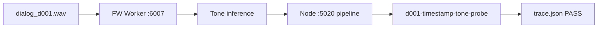

<!-- Documentation Hierarchy Metadata
Status: **HISTORICAL**
Superseded By: docs/current/INDEX.md
Archive Path: docs/archive/HISTORICAL/Dialog200_Corpus_Restore_Report_2026_06_28.md
-->

> **HISTORICAL** — 非 CURRENT。阅读顺序：Framework Snapshot → `docs/current/` → Supporting → Acceptance → Archive。  
> Superseded By: docs/current/INDEX.md

# Dialog200 语料恢复报告

**日期**：2026-06-28  
**范围**：`test wav/dialog_200/` minimal 语料恢复 + Tone / FW 节点端验证  
**裁决**：**CONDITIONAL PASS**

---

## Executive Summary

回滚后缺失的 `test wav/dialog_200/cases.manifest.json` 与 `dialog_d001.wav` 已通过 `restore-dialog200-smoke.py` 恢复为 **minimal subset 版**（`restored_minimal_v1`，1 条 case）。在 FW Worker（`:6007`）与 Electron Node 测试服务（`:5020`，`faster-whisper-vad: true`）运行条件下：

- `python -m tone_module.audit_runtime_acceptance --part all` — **PASS**
- `node tests/experiments/d001-timestamp-tone-probe.mjs` — **PASS**（不再因 missing manifest / missing wav 失败）

完整 200 条 wav + manifest **尚未恢复**；batch dialog200 与 Pre-Phase1 全量回归仍依赖后续 `restored_full_v1` 工作。

---

## Restored Files

| 路径 | 状态 | 说明 |
|------|------|------|
| `test wav/dialog_200/cases.manifest.json` | ✅ 已恢复 | `restored_minimal_v1`，`caseCount: 1` |
| `test wav/dialog_200/dialog_d001.wav` | ✅ 已恢复 | 158,682 bytes，自 `context_prior/cp_001_hotel_latte.wav` 复制 |
| `test wav/dialog_200/README.md` | ✅ 已有 | minimal 语料说明 |
| `electron_node/electron-node/scripts/test-corpus/restore-dialog200-smoke.py` | ✅ 已有 | 幂等恢复脚本 |
| `electron_node/electron-node/tests/lib/load-dialog200-manifest.mjs` | ✅ 已有 | 支持包装 schema + legacy 数组 |

**本轮未修改**：FW Runtime 主链、Recall、Ranking、Assembly、KenLM、Apply、Lexicon、Tone 模型、Gateway、Scheduler、Web、SQLite schema、JSON required schema。

**测试侧微调**（仅 manifest 字段兼容）：

- `tone_module/audit_runtime_acceptance.py` — `_resolve_case_file()` 同时支持 `file` / `audio` 字段

---

## Manifest Schema

```json
{
  "corpus": "dialog_200",
  "version": "restored_minimal_v1",
  "caseCount": 1,
  "isFullCorpus": false,
  "restoredAt": "2026-06-28",
  "audioSourceNote": "dialog_d001.wav copied from context_prior/cp_001_hotel_latte.wav; utterance text from tone-module-p1-dialog-fw-scan.json (historical d001).",
  "cases": [
    {
      "id": "d001",
      "file": "dialog_d001.wav",
      "audio": "dialog_d001.wav",
      "utterance": "你好，我想点一杯热拿铁，中杯，少糖。顺便问一下今天有蓝莓马芬吗？",
      "text": "你好，我想点一杯热拿铁，中杯，少糖。顺便问一下今天有蓝莓马芬吗？",
      "expectedText": "你好，我想点一杯热拿铁，中杯，少糖。顺便问一下今天有蓝莓马芬吗？",
      "language": "zh",
      "scenario": "cafe",
      "sourceAudio": "context_prior/cp_001_hotel_latte.wav"
    }
  ]
}
```

**合规确认**：

- ✅ 含 `id` / `audio` / `text` / `expectedText` / `language`
- ✅ 无 word timestamp、无 tone label、无 refTones
- ✅ 未生成 fake / equal-split timestamp 或 text-derived tone 作为 runtime 输入

---

## Audio Source

| 项 | 值 |
|----|-----|
| d001 音频来源 | `test wav/dialog_200/context_prior/cp_001_hotel_latte.wav`（复制，非 TTS 新生成） |
| 格式 | WAV，mono，FW Worker 可处理 |
| 参考文本来源 | `electron_node/electron-node/tests/experiments/tone-module-p1-dialog-fw-scan.json` 历史 d001 |
| 文本 / 音频对齐 | **不对齐**（context_prior 酒店拿铁场景 vs manifest 咖啡馆点单句）；minimal corpus 用途为路径 / manifest / tone 链路探针，非 ASR 文本 golden |

---

## Existing Corpus Matrix

| 资产 | 路径 | 磁盘状态 |
|------|------|----------|
| dialog_200 manifest | `test wav/dialog_200/cases.manifest.json` | ✅ 存在（minimal v1） |
| dialog_d001.wav | `test wav/dialog_200/dialog_d001.wav` | ✅ 存在 |
| dialog_d002..d200.wav | `test wav/dialog_200/dialog_dNNN.wav` | ❌ 不存在（d002–d005 已 spot-check） |
| context_prior wav | `test wav/dialog_200/context_prior/cp_*.wav` | ✅ 10 条 |
| context_prior manifest | `test wav/dialog_200/context_prior/context_prior_manifest.json` | ✅ 存在 |
| 历史 utterance 200 条 | `tone-module-p1-dialog-fw-scan.json` | ✅ 200 cases（仅文本 + 扫描元数据） |
| dialog_200_v2 | `test wav/dialog_200_v2/` | ⚠️ 空目录 |
| p3_multi wav | `test wav/p3_multi/` | ❌ 0 wav（目录存在，无音频） |
| Git 跟踪 dialog_d*.wav | `git ls-files` | ❌ 0 条（未入库） |

**dialog_200 目录 wav 合计**：11（1× dialog_d001 + 10× context_prior）

---

## Missing Corpus Matrix（恢复前 → 恢复后）

| 项 | 恢复前 | 恢复后 |
|----|--------|--------|
| `cases.manifest.json` | ❌ 缺失 | ✅ minimal v1 |
| `dialog_d001.wav` | ❌ 缺失 | ✅ 已复制 |
| `dialog_d002..d200.wav` | ❌ 缺失 | ❌ 仍缺失 |
| 完整 200 case manifest | ❌ 缺失 | ❌ 仍缺失（仅 1 case） |
| `gen_dialog_200_wavs.py` | ❌ 不在仓库 | ❌ 仍不在仓库 |

---

## Reusable Asset Matrix

| 资产 | 可复用性 | 用途 |
|------|----------|------|
| `context_prior/cp_001..cp_010.wav` | ✅ 高 | minimal d001 来源；context-prior 探针 |
| `tone-module-p1-dialog-fw-scan.json` | ✅ 高 | 200 条 utterance 文本 → 未来 full manifest |
| `restore-dialog200-smoke.py` | ✅ 高 | 幂等 minimal corpus 恢复 |
| `context_prior/gen_context_prior_wavs.py` | ⚠️ 中 | 可再生成 context_prior，非 dialog_dNNN |
| 工作区索引中的 dialog_d002+ | ❌ 不可用 | glob/索引显示存在，**磁盘实际不存在**（非 git 跟踪） |

---

## Validation Result

### 1. Manifest / 路径 dry-run

```text
node -e "loadDialog200Manifest(...)" 
→ d001Id=d001, wavExists=true, utteranceLen=32
```

**结果**：**PASS** — manifest 可读，`dialog_d001.wav` 路径正确，`id=d001`。

### 2. `audit_runtime_acceptance --part all`（FW `:6007`）

| 段 | 结果 |
|----|------|
| fwHealth | true |
| toneTokenSample20 d001 | toneEnabled=true, toneSliceCount=22, httpOk=true |
| performanceDialog200 | n=1, p95=11ms, passP95Le20=true |
| failOpen | 全部 case 符合 fail-closed 预期 |

**结果**：**PASS**

### 3. `d001-timestamp-tone-probe.mjs`（Node `:5020` + FW）

| 检查项 | 结果 |
|--------|------|
| manifest / wav 缺失错误 | ✅ 未出现 |
| asr_service_id | `faster-whisper-vad` |
| utterance_tone.toneEnabled | true |
| utterance_tone.sliceCount | 22 |
| beiShao_hasWindowTimeRange | true |
| beiShao_hasAcousticTonePattern | true |
| beiShao_pattern | `[2, 4]` |
| peishao_in_span_candidates | `[]`（无「焙烧」误召回） |
| 退出码 | 0 |

Trace 输出：`tests/experiments/d001-timestamp-tone-probe-trace.json`

**结果**：**PASS**

### 4. Electron Node 配置

已将 `%APPDATA%/lingua-electron-node/electron-node-config.json` 中：

```json
"servicePreferences": { "faster-whisper-vad": true }
```

（`serviceLastRuntimeState` 同步为 true）。**未修改主链代码**。

---

## Runtime Probe Result



- **FW → Tone HTTP**：d001 22 slices，confidence avg ≈ 0.63  
- **Node FW → Tone → Recall 消费层**：probe 通过，timestamp-only tone window 可解析  
- **限制**：仅 1 条 minimal case；raw ASR 与 manifest 参考句不一致（预期内，因音频来自 context_prior）

---

## Remaining Gaps

1. **完整 200 条 wav** — 磁盘仅 d001；无 git 历史可 checkout  
2. **完整 manifest** — 需从 `tone-module-p1-dialog-fw-scan.json` 生成 200 entries + 配套 wav（TTS 或重新录制）  
3. **`run-dialog200-timed-batch.mjs`** — 需 `isFullCorpus: true` + 200 wav  
4. **文本–音频对齐** — minimal d001 音频与 utterance 不对齐；full restore 应保证配对  
5. **`gen_dialog_200_wavs.py`** — 历史生成脚本不在仓库，需重建或替代方案  

---

## KEEP / MODIFY / RESTORE / DELETE

| 项 | 裁决 |
|----|------|
| `restore-dialog200-smoke.py` | **KEEP** |
| `load-dialog200-manifest.mjs` | **KEEP** |
| minimal `cases.manifest.json` + `dialog_d001.wav` | **KEEP** |
| `context_prior/*` | **KEEP** |
| `tone-module-p1-dialog-fw-scan.json` | **KEEP**（full manifest 文本 SSOT） |
| `audit_runtime_acceptance` `_resolve_case_file` | **KEEP**（测试兼容） |
| 工作区索引中 phantom `dialog_d002+` | **DELETE**（若误创建；当前磁盘无） |
| 完整 200 wav + `restored_full_v1` manifest | **RESTORE**（后续任务） |
| `gen_dialog_200_wavs.py` 或等价生成器 | **RESTORE**（后续任务） |

---

## Final Verdict — 问题清单

| 问题 | 答案 |
|------|------|
| `test wav/dialog_200/cases.manifest.json` 是否恢复？ | **是**（minimal v1） |
| `dialog_d001.wav` 是否恢复？ | **是** |
| `d001-timestamp-tone-probe.mjs` 是否能读取语料？ | **是** |
| 是否已成功跑通 FW Worker + Tone probe？ | **是**（audit all + d001 probe exit 0） |
| 是否可以重新执行 Tone V2 Pre-Phase1 Runtime Verification？ | **部分可以** — minimal corpus / d001 / FW-Tone audit **可以**；全量 dialog200 batch **不可以** |
| 若仅为 minimal subset 版，是否需要后续恢复完整 200 条？ | **是** — batch、性能分位、200-case 回归均需 `restored_full_v1` |

### 总裁决：**CONDITIONAL PASS**

- **PASS 部分**：minimal 语料恢复、manifest 契约、FW audit、d001 Node probe、无 missing asset 失败  
- **CONDITIONAL 原因**：`isFullCorpus: false`，199 条 wav 与 full manifest 未恢复；Pre-Phase1 **全量** dialog200 回归仍阻塞  

---

## 恢复命令（可重复执行）

```powershell
python electron_node/electron-node/scripts/test-corpus/restore-dialog200-smoke.py

# FW Worker（需 venv + CUDA EP）
cd electron_node/services/faster_whisper_vad
$env:PYTHONUTF8="1"
.\.venv\Scripts\python.exe faster_whisper_vad_service.py

# 验证
.\.venv\Scripts\python.exe -m tone_module.audit_runtime_acceptance --part all
cd electron_node/electron-node
node tests/experiments/d001-timestamp-tone-probe.mjs
```

---

## 后续建议（full restore）

1. 自 `tone-module-p1-dialog-fw-scan.json` 导出 200 case manifest（`version: restored_full_v1`）  
2. 使用 edge-tts / 本地 TTS 或 `gen_context_prior_wavs.py` 模式批量生成 `dialog_d001..d200.wav`  
3. 更新 `isFullCorpus: true`, `caseCount: 200`  
4. 跑 `run-dialog200-timed-batch.mjs` 与 Pre-Phase1 全量 acceptance  
