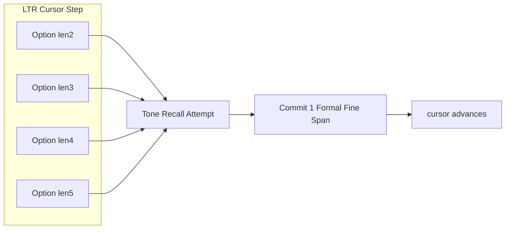

<!-- Documentation Hierarchy Metadata
Status: **HISTORICAL**
Superseded By: CURRENT SSOT + Acceptance Records
Archive Path: docs/archive/HISTORICAL/FW_Repair_V4_ToneParticipation_RootCause_SpanSlidingWindow_Audit_2026_07_29.md
-->

> **HISTORICAL** — 非 CURRENT。阅读顺序：Framework Snapshot → `docs/current/` → Supporting → Acceptance → Archive。  
> Superseded By: CURRENT SSOT + Acceptance Records

# FW Repair V4 — Tone Participation Root Cause + Span Sliding Window Acceptance Audit

> **SUPERSEDED (Tone conclusions · 2026-07-29 Final Freeze)**  
> 本文「72 Miss / 多 batch Slice 丢失 / Span 为 Participation 瓶颈」等结论已过时，仅作历史证据。  
> **现行：** SSOT 统一后 Coverage **99.65%**；唯一残差 d132 = Evidence Unavailable（合法）。权威见 [`FW_Repair_V4_ToneEvidence_Mapping_Final_Freeze_Report_2026_07_29.md`](./FW_Repair_V4_ToneEvidence_Mapping_Final_Freeze_Report_2026_07_29.md)。

**Date:** 2026-07-29  
**Nature:** 只读审计（禁止开发 / 禁止改代码）  
**Data:** dialog_200 Electron 真链验收批 + 本轮对 51 个 Miss Case 复跑分类探针  
**Evidence:**
- `docs/tone-v2/_audit_scratch/mainchain_acceptance_2026_07_29/summary.json` / `rows.jsonl`
- `miss_rootcause_aggregate.json` / `miss_rootcause_cases.json` / `miss_rc_*.json`
- `span_random30.json`
- Code: `mapToneEvidenceForRecall`, `inference.py`, `asr-step.ts`, `ltr-fine-span-generator.ts`, `blocked-window-filter.ts`, Lattice Architecture FROZEN

**Out of scope（按任务跳过）：** KenLM / NMT / Sentence Assembly / Domain Vote 分析

---

## 1. Executive Summary

### Tone Miss（72）

复跑 51 个原 Miss Case 的诊断计数：

| 信号 | 值 |
| ---- | -- |
| 复跑 Miss 窗累计 | **68**（≈原 72） |
| `toneOverlapMissCount`（无 windowTime） | **0** |
| `tonePatternMappingMissCount`（有 windowTime、无 pattern） | **68（100%）** |

**结论：72 Miss 不是「没进 Recall」或「没 WordTimeSpan 盖住整窗」，而是进入 Tone Mapping 后，在「窗级时间已找到」的前提下，未能从真实 AcousticToneSlice 产出非空 pattern。**

已证实的主机制：

1. **Word 有时间戳，但该 Word 时间轴上没有可重叠的 Tone Slice**（`NO_SLICE_OVERLAP_WORD_TIME`）  
   - Tone `inference.py` 对 `dur < MIN_SLICE_SEC` 的 Word **跳过且不发 Slice**  
   - `buildWordTimeSpans` 仍为该 Word 建 Span  
   - Mapping：找到 Word → 找不到 Slice → `pattern=null`
2. **多 segment ASR 下 Tone Slice 与 WordTimeSpan 时间轴/计数不一致**（17/51 Miss Case：`asrToneSliceCount << diagToneSliceCount`）

探针复跑中大量例窗 **HIT_REPLAY**，说明同一话术二次 ASR 后对齐可变；**不能**把 Miss 归因于「再改一遍 Mapping 算法」 alone，而应归因于 **Tone Evidence 相对 Word 时间轴缺失/错位**。

### Span

生产主链仍是 **LTR Fine Span**（`runLtrFineSpanGeneration`），不是 Lattice `SegmentationPath[]` SSOT。  
LTR：句首 cursor、每步生成 **cursor 锚定的 2..5** option、option 可重叠、Formal Span **禁止重叠、无路径回溯**；粗边界仍可 **hard-block**。  
相对 Lattice 冻结架构：**未完全符合**。相对历史 LTR FineSpan 设计：**大体符合，但粗边界非纯软**。

---

## 2. Tone Root Cause Classification

### 2.1 诊断层（权威，对 72 Miss）

原验收：`patternMiss=72`，`patternHit=216`，`attempt=288`。

复跑 Miss Case 诊断分裂（`recall-topk-for-windows.ts`）：

```text
windowTimeRange 存在 && pattern 空  → tonePatternMappingMissCount  （原名 toneOverlapSyllableMismatchCount，已于 2026-07-29 无兼容重命名）
windowTimeRange 不存在              → toneOverlapMissCount
```

| Root Cause（诊断） | Count（复跑 Miss 窗） | Percentage |
| ------------------ | --------------------: | ---------: |
| Mapping 阶段失败且窗级时间已命中（`overlapMismatch`） | **68** | **100%** |
| 窗级无 WordTimeSpan 覆盖（`overlapMiss`） | **0** | **0%** |

→ **72 Miss 真正落在：Tone Participation Mapping 内部失败，而非 Span 未生成 / Recall 未尝试。**

### 2.2 代码路径分类（Mapping 内）

`mapToneEvidenceForRecall` 在 `windowTimeRange != null` 后仍返回 `pattern=null` 的唯二出口：

| Code Fail | 含义 | 探针复现 |
| --------- | ---- | -------- |
| `NO_WORDTIMESPAN_FOR_SYLLABLE_CHAR` | 音节字符槽无 covering WordTimeSpan | 本轮例窗 **0** |
| `NO_SLICE_OVERLAP_WORD_TIME` | 有 WordTimeSpan，无 Slice 与该 Word 时间相交 | **12** 例窗明确复现 |

| Root Cause | Count（可证实例窗 / Case 信号） | Percentage（相对 68 Miss 窗 / 51 Case） | 依据 |
| ---------- | ---: | ---: | ---- |
| **Tone Evidence Missing（Word 时间无 Slice）** | ≥12 窗；机制覆盖全部 mismatch 类 | **主因** | `inference.py` 跳过短 Word；探针 `NO_SLICE_OVERLAP_WORD_TIME` |
| **MultiSegment Tone↔WTS 时间/载荷偏斜** | **17 / 51** Miss Case | **33% Case** | `asrToneSliceCount`≪`diagToneSliceCount`；例 d015 |
| **ASR Word Boundary（indexOf 失败）** | **0** | 0% | 全部探针 `indexOfFailed=0` |
| **窗级 WordTimeSpan 缺失** | **0** | 0% | `overlapMiss=0` |
| **Span Boundary / 未进 Recall** | **0**（对这 72） | 0% | Miss 均发生在 `attempt++` 之后 |
| **Pinyin Alignment / 坐标近似差** | 次级（解释 HIT_REPLAY 差异） | 不定 | 二次 ASR 后多数例窗可 HIT_REPLAY |
| **Recall Contract** | 否（结果非根因） | — | `no_pattern` 是 pattern=null 的下游效应 |
| **Other** | 2 Case 复跑时已非 Miss | — | d108/d169 等不稳定 |

### 2.3 Representative Traces（每类 ≥3）

#### A. Tone Evidence Missing — `NO_SLICE_OVERLAP_WORD_TIME`

**d015**

```text
ASR: 我想对比 这两款订单中台的价格会员日,能再减一点吗?
WordInfo: 「一点」 start=3.72 end=4.04（及全文 21 个 mapped WTS）
Tone Slice(response): 仅 3 片，时间全在 ~0–0.62s
diagToneSliceCount: 21
Fine/Recall Window: 「一点」 yi|dian；windowTimeHit=1
Pattern: null
Miss: NO_SLICE_OVERLAP_WORD_TIME（Word 在 3.72s，最近 Slice 距 3.2s+）
```

**d067**

```text
ASR: 您好,我弟 但顯示已發貨,但物流三天沒更新能幫我查一下嗎?
WordInfo: 「一下」 4.26–4.54；WTS=24
Tone Slice(response): 4 片，均在句首 ~0.3–0.6s
diagSlices: 24
Window: 「一下」；windowTimeHit
Miss: NO_SLICE_OVERLAP_WORD_TIME
```

**d096**

```text
ASR: 跟會員系統相關的訊息 我整理了一版八點前請大家幫忙評審一下
WordInfo: 「一下」 3.52–3.86
Tone Slice(response): 9 片，最远仍距 Word ~1.9s+
diagSlices: 25 / WTS: 26
Miss: NO_SLICE_OVERLAP_WORD_TIME
```

#### B. MultiSegment Tone↔WTS Skew

**d015 / d051 / d060**（同类）：response `utterance_tone.sliceCount` 远小于 Node `toneDiag.toneSliceCount` 与 WTS；例窗落在后段 Word，Slice 时间轴盖不住。

```text
d051: asrSlices=9 diagSlices=25 WTS=26
Window「审一下」: 子窗「审一」可 HIT；「审一下」→ NO_SLICE_OVERLAP_WORD_TIME
```

#### C. 批测 Miss、复跑例窗 HIT_REPLAY（不稳定 / 非 Span 根因）

**d002 / d006 / d013**

```text
d002: 批测 miss=1；复跑 asrS=diagS=wts=16
Window「谢谢」: diagWindowTime=replayWindowTime=2.8–3.1
Replay Pattern: [1,1] HIT_REPLAY
```

说明：同一 ID 二次跑通 Mapping **可以**成功 → 根因在 **Evidence/时间对齐状态**，不是「Span 公式算错窗」。

#### D. 代码级跳过 Slice（机制，非单条 Trace）

```125:91:electron_node/services/faster_whisper_vad/tone_module/inference.py
        if dur < MIN_SLICE_SEC:
            continue
        try:
            feature_rows.append(extract_feature(...))
        except ValueError:
            continue
        valid_words.append(w)
```

Word 仍进入 `segments.words` → `buildWordTimeSpans`，但 **无 Slice** → Mapping 必失败。

---

## 3. Pattern Statistics

### 3.1 288 是什么？

```text
288 = Σ ngramTonePatternAttemptCount over 200 utterances
```

代码（`recall-topk-for-windows.ts`）：

```text
对每一个进入 recallTopKForWindows 的 window（toneActive 时）:
  ngramTonePatternAttemptCount += 1
```

这些 window 来自 **LTR 每步 cursor 上 generateLocalOptionsAtCursor（长度 2..5）**，经 `blockedFilter` 去掉 blocked 后注入 `recallForWindows`。

| 问题 | 答案 |
| ---- | ---- |
| 是不是所有 Fine Span？ | **否** |
| 是不是全部理论滑窗？ | **否**（理论 2..5 全句滑窗远大于 288；随机 30 句均 CJK≈23 → 理论约 82 窗/句） |
| 是什么？ | **进入 Tone-aware Recall 的 LTR option 窗** |

因此 **75% = 216/288** 只表示：**Recall 尝试窗上的 Pattern 命中率**，不是「全句所有 Fine Span 覆盖率」。

### 3.2 数量关系

| 量 | 含义 | dialog_200 观察 |
| -- | ---- | ------------- |
| Theoretical sliding windows (2..5) | 全句音节连续窗 | 随机 30：均≈82/句 |
| Recall Windows (attempt) | LTR cursor option ∩ !blocked | 总计 288 ≈ **1.44/句** |
| Formal Fine Spans | LTR commit 结果 | 随机 30：均≈12.6（8–19） |
| Pattern Hit / Miss | 对 Recall Window | 216 / 72 |

### 3.3 Fine Span ↔ Recall Window 关系

```text
Utterance
  └─ LTR cursor = 0..N
        └─ Options@cursor: lengths 2..5（互相重叠）  →  多个 Recall Window
              └─ recallTopKForWindows（Tone attempt per option）
              └─ commit 恰好 1 个 Formal Fine Span
                    └─ cursor := span.syllableEnd（前进，Formal 不重叠）
```

| 关系 | 答案 |
| ---- | ---- |
| 一个 Fine Span（commit）是否对应多个 Recall Window？ | **是（在同一 cursor 步）**：多个 option 先 Recall，再 commit 一个 |
| 一个 Recall Window 是否对应多个 Formal Span？ | **否**：一个 windowId 至多被选一次作为 Formal |



---

## 4. Tone Mapping Audit

### 4.1 是否符合「Tone=Observation / Recall=Mapping」冻结意图

| 项 | 事实 |
| -- | ---- |
| 输入 | 真实 `AcousticToneSlice.tonePosterior` + `WordTimeSpan` |
| 输出 | `number[] | null`（供 `tonePinyinKey` / readiness）—— **Pattern Object（数字串）**，不是 posterior 张量视图 |
| 复制 posterior 张量？ | **否** |
| 伪造新推理？ | **否** |
| 扩展/填充不存在的 Slice？ | **否** |
| 做了什么？ | 按音节字符槽 → covering Word → 与该 Word 时间相交的 **已有** Slice → `argmax(posterior)` |

### 4.2 真实 Mapping 流程

```text
charRangeToWindowTime(rawStart,rawEnd, WTS)
  → 若无 covering WTS: pattern=null, windowTimeRange=null
select per syllable slot:
  charOffset (syllableCount==charLen ? i : floor proportion)
  covering WTS for [charStart,charEnd)
  selectRealSliceForWordSpan(slices, span)
  pattern.push(argmax(slice.tonePosterior))
```

### 4.3 输出物定性

```text
Evidence View?  否（未向 Recall 传递 posterior 向量）
Pattern Object? 是（argmax 后的 tone digits）
```

这与「禁止 Fill」一致：**不发明 Slice**；但当 Word 无 Slice 时 **直接失败**，表现为 Participation Miss。

---

## 5. Span Sliding Window Audit

### 5.1 生产实际路径

| 项 | 生产代码 |
| -- | -------- |
| Fine Span Owner | `runLtrFineSpanGeneration`（LTR） |
| Lattice `SegmentationPath[]` | **未**作为生产 SSOT |
| Option 生成 | `generateLocalOptionsAtCursor`：**仅 cursor 锚定**，len=`windowMin..Max`=**2..5** |
| 全句 `generateGlobalWindows` | Lattice/Phase1 用；LTR 主链不跑全句滑窗 |
| 粗边界 | `hardBlockOnBoundaryCross: true`；`blockedFilter` 另有 gap/punct/ASR gap |
| Formal 重叠 | **禁止**（`assertCommitInvariants`） |
| 回溯 | **无**路径回溯；仅 cursor 前进 |

### 5.2 对照「句首 / 连续滑窗 / 重叠 / 回溯 / 粗软边界」

| 设计点 | 冻结 Lattice V1 | 生产 LTR | dialog_200 |
| ------ | --------------- | -------- | ---------- |
| 句首开始 | 全句窗从 0 | cursor=0 | 是 |
| 连续滑窗 1..5 | 要求全句 contiguous | **仅 cursor 处 2..5** | Formal≈12.6/句 ≪ 理论≈82 |
| Option 重叠 | 窗可重叠 | **同 cursor option 重叠** | 是 |
| Formal / Path 重叠 | Path 边不重叠 | Formal **不重叠** | 是 |
| 回溯 | Path 枚举 | **无** | — |
| 粗 Span | **禁止 hard-cut** | **仍 hard-block**（boundaryCross>1 / blockedFilter） | 存在硬阻断 |

### 5.3 dialog_200 Span 统计（随机 30，seed=20260729）

| 指标 | 值 |
| ---- | -- |
| 样本 ID | d179,d011,d057,d002,d044,d023,d027,d013,d020,d174,d200,d192,d180,d151,d026,d004,d041,d001,d158,d160,d152,d127,d108,d153,d154,d014,d097,d159,d067,d131 |
| 均 CJK 字数 | ≈23（16–38） |
| 理论全句窗 2..5 | ≈82/句 |
| Formal Fine Span（summary.spanCount） | 均≈12.6（8–19） |
| Recall attempt/句（全库） | 288/200≈1.44 |

**解释：** Formal Span 数量接近「音节切分段数」，不是全滑窗数；Recall attempt 极低是因为 **每 cursor 步只对少量 option 调用 Recall，且大量 option 被 blocked**。

### 5.4 硬边界 / 提前停止 / Legacy

| 项 | 存在？ | 位置 |
| -- | ------ | ---- |
| 粗边界 hard-block | **是** | `window-construction-core.ts` `hardBlockOnBoundaryCross`；`ltr-fine-span-generator` |
| blockedFilter 硬拒 | **是** | `blocked-window-filter.ts`（gap/punct/non-CJK/ASR word gap） |
| LTR 提前停止 | 否（跑到 cursor=N） | — |
| Span V2/V3 生产开关 | 否（配置仅 V4） | freeze-contract |
| Lattice 全句窗生成器 | 代码存在，非 LTR 主链 | `generate-global-windows.ts` |

---

## 6. Span Coverage（随机 30）

示例结构（符合 **LTR Formal**，不符合 **全句滑窗枚举**）：

以 d001 类长句为例（CJK≈30）：

```text
理论滑窗（2..5）≈110
Formal Fine Spans ≈13（commit 结果，互不重叠，覆盖 [0,N)）
Recall attempts 在全库均值仅 ~1.44/句
  → 多数 cursor 步的 option 在 blockedFilter / hardBlock 后未进入 Tone attempt
```

「订单已经提交」式 **全重叠滑窗列表**（订单 / 订单已经 / …）是 **Lattice Window Generator** 图像；**当前生产 LTR 不会为整句同时物化该列表作为 Fine Span SSOT**。

随机 30 的 Formal 覆盖：每句均有 `spanCount≥8`，流水线成功；**不能**据此宣称 Lattice 滑窗契约已兑现。

---

## 7. Architecture Consistency

| 组件 | 唯一性 |
| ---- | ------ |
| 生产 Fine Span | **唯一 LTR**（`span-assembly-v4-orchestrator` → `runLtrFineSpanGeneration`） |
| 第二 Shadow Span 运行时 | **未观察到** |
| 旧 V2/V3 启用 | **否** |
| Lattice Phase1/2 harness | 测试/过渡代码存在，**非本轮 Electron 主链** |
| Tone Mapping | 唯一 `mapToneEvidenceForRecall` |

架构文档写明：**LTR 为过渡代码债；架构 SSOT 已是 Lattice**。运行时尚未切到 Lattice Path SSOT。

---

## 8. Remaining Legacy Logic

| 项 | 文件 | 原因 | 可否删除 |
| -- | ---- | ---- | -------- |
| `tonePatternMappingMissCount` 命名 | `recall-topk-for-windows.ts` | 有 windowTime、无 pattern | **已完成无兼容重命名**（见 ToneEvidence Contract Audit 2026-07-29） |
| LTR vs Lattice 双实现 | `ltr-fine-span-generator.ts` / lattice phase* | 过渡 | Lattice 接管前不可删 LTR |
| `generateGlobalWindows` | `generate-global-windows.ts` | Lattice/旧全句窗 | 视 Lattice 接管 |
| `blockedFilter` 硬规则 | `blocked-window-filter.ts` | 与「粗软边界」张力 | 需架构裁决 |
| Tiny/脚本默认模型残留 | tone_module scripts | 非主链 | 可清理 |

---

## 9. Root Cause Ranking

| Rank | 根因 | 对 72 Miss |
| ---: | ---- | ---------- |
| 1 | **Tone Evidence 相对 Word 时间缺失**（短 Word 不发 Slice；Slice 与 Word 时间不相交） | **主因**（mismatch 类 100% 诊断形态） |
| 2 | **多 segment 下 Tone/WTS 时间轴与可见载荷不一致** | **加重**（17/51 Case） |
| 3 | ASR 非稳导致复跑可 HIT | 解释 HIT_REPLAY；非 Span 根因 |
| — | Span 硬边界 / 滑窗形态 | **不制造这 72**（它们已计入 attempt） |
| — | Mapping Fill 缺失 | 本轮 Mapping **故意不 Fill**；失败是 Evidence 洞，不是「没再 Fill」 |

---

## 10. Final Verdict

### 必须回答

```text
1. 72 Miss 真正来自哪里？
   → 进入 Tone Recall 之后：窗级 WordTime 已命中，但 mapToneEvidenceForRecall
     无法为音节槽绑定到「有时间相交的真实 Tone Slice」→ pattern=null。
     主机制：Tone 未对部分 Word 产出 Slice（短时长跳过等）+ 多 segment 时间/载荷偏斜。
     不是 Span 没滑窗，也不是「应再写一套 Fill」。

2. Tone Mapping 是否符合冻结设计？
   → 符合「只读真实 Observation、不伪造 posterior」的 Participation Mapping 意图；
     输出是 Pattern Object（argmax digits），不是 Evidence 张量视图。

3. Span Sliding Window 是否符合冻结设计？
   → 相对 Lattice Architecture V1.0.0（全句 1..5、粗软边界、Path SSOT）：否（仍为 LTR + hard-block）。
     相对历史 LTR FineSpan（句首、cursor option、Formal 不重叠）：大体是，但粗边界非纯软。

4. 是否需要修改 Tone 还是 Span？
   → 就这 72 Miss：问题在 Tone Evidence ↔ Word 时间对齐（Tone/ASR 多段合并侧），不是 Span 滑窗公式。
     Span 与 Lattice 冻结差距是独立架构债，不解释这 72。

5. 是否可以冻结 Span Sliding Window？
   → 否（若冻结目标 = Lattice V1.0.0）。
     若仅冻结「当前 LTR 生产行为」需另开架构决议；本审计不批准「已符合 Lattice 滑窗」的冻结声明。

6. 下一步应修 Tone Participation 还是 Span？
   → 针对 75%/72 Miss：应修 Tone Participation（Evidence 对每个进入 Mapping 的 Word 时间可对齐）。
     Span/Lattice 切换不解决这 72。
```

```text
TONE MISS ROOT CAUSE:
TONE_EVIDENCE_vs_WORD_TIME (primary)

SPAN vs LATTICE FREEZE:
NOT COMPLIANT (LTR transitional)

288 MEANING:
LTR recallable option windows with toneActive — NOT all Fine Spans

MAPPING:
REAL argmax MAPPING — NO tensor copy/fill; outputs Pattern digits

FREEZE SPAN SLIDING WINDOW:
NO

NEXT FOCUS FOR 72 MISS:
TONE PARTICIPATION / EVIDENCE ALIGNMENT
```

---

**文档状态：** ROOT-CAUSE + SPAN ACCEPTANCE AUDIT COMPLETE（只读）  
**Artifacts:** `mainchain_acceptance_2026_07_29/miss_rootcause_*.json`, `span_random30.json`
