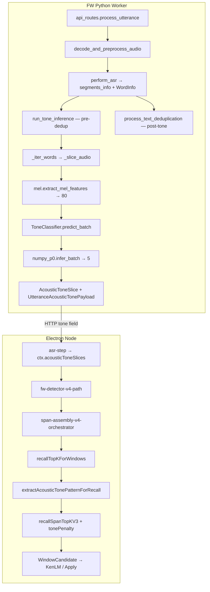

<!-- Documentation Hierarchy Metadata
Status: **HISTORICAL**
Superseded By: CURRENT SSOT + Acceptance Records
Archive Path: docs/archive/HISTORICAL/Tone_V2_P10_Runtime_V2_Direct_Replacement_PreDev_Audit_Report.md
-->

> **HISTORICAL** — 非 CURRENT。阅读顺序：Framework Snapshot → `docs/current/` → Supporting → Acceptance → Archive。  
> Superseded By: CURRENT SSOT + Acceptance Records

# Tone V2 P10 — Runtime V2 Direct Replacement PreDev Audit Report

**Date:** 2026-07-11  
**Phase:** P10（Runtime V2 Direct Replacement）  
**Audit Type:** Proposal Audit（**只读** · **非开发** · **非训练** · **非修改代码**）  
**Goal:** 审计如何将已通过全量训练与验收的 `tone_cnn_p1_v1_full.npz` **直接接入** FW Runtime，并在条件满足时**彻底移除** p0 Tone Runtime 链路（Direct Replacement；禁止 Shadow / Switch / 双链路 / Fallback）。

**审计依据：**

- Lingua Project Constitution / 当前 Frozen Architecture SSOT
- [Tone V2 P8-C — Feature Contract Specification](./Tone%20V2%20P8-C%20%E2%80%94%20Feature%20Contract%20Specification.md)
- [Tone V2 P8-C Feature V2 Foundation Specification](./Tone%20V2%20P8-C%20Feature%20V2%20Foundation%20Development%20Specification.md)
- [Tone_V2_P8_D_Training_Path_Acceptance](./Tone_V2_P8_D_Training_Path_Acceptance.md)（如存在）
- [Tone_V2_P9_A_FW_WordInfo_V2_CNN_Training_Foundation_Development_Report](./Tone_V2_P9_A_FW_WordInfo_V2_CNN_Training_Foundation_Development_Report.md)
- [Tone_V2_P9_B_FW_WordInfo_V2_CNN_1k_Pilot_Training_Report](./Tone_V2_P9_B_FW_WordInfo_V2_CNN_1k_Pilot_Training_Report.md)
- [Tone_V2_P9_C2_Feature_Generation_Acceleration_Development_Report](./Tone_V2_P9_C2_Feature_Generation_Acceleration_Development_Report.md)
- [Tone_V2_P9_C3_Full_Feature_Cache_GPU_CNN_Training_Report](./Tone_V2_P9_C3_Full_Feature_Cache_GPU_CNN_Training_Report.md)
- `tone_module/models/tone_cnn_p1_v1_full_validate.json`
- `tone_module/models/tone_cnn_p1_v1_full_probe.json`
- **当前实际代码**（以代码与 artifact 为准，非仅信开发报告）

**目标主链（冻结）：**

```text
FW processed_audio + FW WordInfo
→ feature_v2.extract_feature
→ Feature Tensor (64, 83)
→ ToneModelLoaderV1
→ numpy_p1
→ TonePosterior (5)
→ AcousticToneSlice（冻结 Tone Runtime Contract）
→ Recall
→ Candidate Ranking
→ Final Candidate
```

---

## Executive Summary

| 维度 | 结论 |
|------|------|
| 生产 Runtime 现状 | **仍为 p0 单链**：`mel(80)` + `numpy_p0` + `ToneModelLoader` |
| V2 artifact | **`tone_cnn_p1_v1_full.npz` 具备加载与推理条件**（validate/probe PASS；loader 实测 `ready=True`） |
| V2 Runtime 接入代码 | **未实现** — `inference.py` / `classifier.py` / `config.py` 仍指向 p0 |
| Node Recall 消费 | **已就绪** — `AcousticToneSlice` / `TonePosterior` schema 与 p0 同构；V2  posterior 可直接进入 Recall |
| 双链路 / Registry / Shadow | **当前不存在**；门禁测试明确禁止 |
| Direct DELETE 可行性 | **架构上可行**；开发后应一次性删除 Runtime p0 引用，Training legacy 可保留 |
| 训练–Runtime 音频域差 | **存在** — 训练用 AISHELL 原始 wav；Runtime 用 peak-normalize + silence-trim 的 `processed_audio` |
| 边界粒度差 | **存在** — 训练 TextGrid 音节级；Runtime FW 字级 `WordInfo`（P8-0 已记录） |
| 性能 | **可接受** — 实测 ~4.4 ms/syllable feature + ~1.8 ms/syllable infer（8 词 batch） |
| Runtime torch | **当前无**；V2 路径无需 torch |

### Final Verdict: **CONDITIONAL PASS**

**可进入 P10 Direct Replacement Development**，但须满足本文「REQUIRED BEFORE ACCEPTANCE」清单；不得引入双链路、p0 fallback 或 model registry。全量生产切换须在开发 + 验收完成后一次性执行。

---

## 一、审计范围与方法

本轮为 **Proposal Audit**：追踪实际代码路径、核对 artifact 契约、比对训练/Runtime Feature Contract、输出 DELETE/KEEP 矩阵与反事实验收设计。**未**执行任何代码修改或训练。

证据来源优先级：

1. 仓库内 Python/TypeScript 源码  
2. 磁盘上的 `tone_cnn_p1_v1_full.npz` 及 validate/probe JSON  
3. P8–P9 冻结文档与报告（用于架构对照，不覆盖代码事实）

---

## 二、Current Runtime Audit（p0 生产决策路径）

### 2.1 端到端决策路径



### 2.2 关键定位表

| 环节 | 文件 | 符号 | 说明 |
|------|------|------|------|
| **Runtime 入口** | `api_routes.py` | `process_utterance` | ASR 成功后、dedup **之前**调用 tone |
| **推理主函数** | `tone_module/inference.py` | `run_tone_inference` | 唯一对外推理 API（`tone_module/__init__.py` 懒导出） |
| **audio 输入** | `api_routes.py` | `processed_audio`, `sr` | 与 ASR 同一缓冲；经 `utterance_audio.decode_and_preprocess_audio` → `preprocess_pcm_f32` |
| **WordInfo 来源** | `inference._iter_words` | `SegmentInfo.words` | 要求 `word` + `start` + `end` |
| **audio slice** | `inference._slice_audio` | 外置切片 | **与 V2 目标冲突** — V2 应由 `extract_feature` 内聚切片 |
| **Feature 提取** | `tone_module/mel.py` | `extract_mel_features` | mean-pool log-mel → `(80,)` |
| **p0 loader** | `tone_module/loader.py` | `get_tone_loader` → `ToneModelLoader.load(None)` | 进程单例；fail-closed |
| **p0 artifact** | `config.TONE_MODEL_PATH` / 默认 `models/tone_cnn_p0.npz` | env 覆盖 | 仓库内 npz 通常 gitignore；缺失 → `model_error` |
| **numpy_p0** | `backends/numpy_p0.py` | `infer_batch(mel_batch, weights)` | MLP softmax |
| **分类器单例** | `classifier.py` | `get_tone_classifier` | 硬编码 `numpy_p0` |
| **Posterior 构造** | `inference._posterior_from_probs` | `TonePosterior(t1..t5)` | `confidence = max(probs)` |
| **Payload** | `tone_types.py` | `UtteranceAcousticTonePayload` | `toneEnabled` / `skippedReason` fail-closed |
| **HTTP 序列化** | `api_models.py` | camelCase JSON | Node 消费 |
| **Node 注入** | `asr-step.ts` | `ctx.acousticToneSlices` | `normalizeAcousticSlices` + `offsetAcousticSlices` |
| **Recall 入口** | `recall-topk-for-windows.ts` | `recallTopKForWindows` | per-window pattern + SQL |
| **Pattern 提取** | `tone-time-align.ts` | `extractAcousticTonePatternByTime` | 时间重叠 → argmax posterior |
| **打分** | `tone-match-score.ts` | `computeToneScoreResult` | mismatch → `tonePenalty=0.8` |
| **Ranking 生效** | `recall-span-topkv3.ts` | `hit.candidateScore *= tonePenalty` | **真实乘入候选分** |
| **fail-closed** | `inference.py` L68–84 | `no_audio` / `non_zh` / `no_timestamps` / `model_error` | 无 silent fallback |
| **Diagnostics** | `api_routes.py` L292–302 | `p0_diagnostics.toneModule` | `metadata_as_diagnostics()` 来自 p0 loader |

### 2.3 Current Decision Path（文字版）

1. 客户端音频 → FW 解码 → **16 kHz mono float32** + peak normalize + silence trim → `processed_audio`  
2. ASR（同 `processed_audio`）产出 `segments[].words[]`（秒级 `start/end`）  
3. **Tone（pre-dedup）**：逐 word 外置 `_slice_audio` → `extract_mel_features` → `numpy_p0` → `AcousticToneSlice[]`  
4. Dedup 修改文本，**不**回写 tone 切片时间（tone 与 pre-dedup 时间轴对齐 — 门禁 `test_phase8_runtime_mainline`）  
5. Node `asr-step` 收集 `tone.acousticToneSlices` → V4 orchestrator  
6. `buildWordTimeSpans` 将 ASR word 时间映射到 rawText 字符范围  
7. 每 window：`extractAcousticTonePatternForRecall` → 整数 pattern `[1..5]`  
8. `recallSpanTopKV3`：tone_exact SQL + `candidateScore *= tonePenalty`  
9. 后续 KenLM rerank / Apply 在 **已带 tone 惩罚的候选集** 上继续；Tone **不**被 KenLM 覆盖，但 KenLM 可能改变最终选句

### 2.4 fail-closed 与跳过关卡

| skippedReason | 触发条件 | 是否 fallback p0 |
|---------------|----------|------------------|
| `no_audio` | 空 `processed_audio` | 否 |
| `non_zh` | 语言非 zh | 否 |
| `no_timestamps` | 无 word 或全部 `< MIN_SLICE_SEC` | 否 |
| `model_error` | classifier 未 ready | 否 |

Node 侧额外门控：`toneTimestampOnlyEnabled=false` → `toneSkippedReason='tone_timestamp_disabled'`（默认 **true**）。

---

## 三、V2 Runtime Target Audit

### 3.1 目标主链（应为唯一 Runtime 主链）

```text
processed_audio (float32 PCM)
+ segments[].words[] (WordInfo)
→ feature_v2.extract_feature(audio, sampleRate, wordInfo)  # 内聚 slice + resample + tensor
→ (64, 83) float32
→ ToneModelLoaderV1.load(artifact)  # 启动时一次
→ numpy_p1.infer_batch(feature_batch, weights)
→ (N, 5) posterior
→ AcousticToneSlice（schema 不变）
→ Node Recall（无需改 schema）
```

### 3.2 十项兼容性核对

| # | 检查项 | 结论 | 证据 |
|---|--------|------|------|
| 1 | FW Runtime audio 与 Feature Contract | **部分兼容** | 同函数 `extract_feature` 可消费 `processed_audio`；但训练用 **原始 AISHELL wav**（无 FW peak-trim），见 §七 |
| 2 | WordInfo 类型同构 | **是** | 训练 `syllable_to_wordinfo` → `shared_types.WordInfo`；Runtime 同类型 |
| 3 | start/end 单位与语义 | **秒 float；slice 语义一致** | `feature_v2.slice_audio` 与 `inference._slice_audio` 公式相同 |
| 4 | sample rate 16000 | **是（默认路径）** | `api_routes` 默认 `req.sample_rate or 16000`；`contract.P1_SAMPLE_RATE=16000` |
| 5 | processed_audio 已 resample | **是** | `utterance_audio` L58–62 scipy resample；`feature_v2` 另有防御性 `_resample_to_contract_sr` |
| 6 | 字节 / ndarray / 路径差异 | **Runtime 仅 ndarray** | 训练 `sf.read(wav_path)`；Runtime 无文件路径 — **正常** |
| 7 | Runtime slice vs 训练 slice | **Extractor 内聚后一致**；**边界 provider 不同** | 训练：TextGrid 音节；Runtime：ASR 字级 |
| 8 | V2 artifact Runtime 直接加载 | **是** | `ToneModelLoaderV1.load(path)` 实测 `ready=True` |
| 9 | numpy_p1 Runtime 可运行 | **是** | 纯 NumPy；`probe_v2` PASS |
| 10 | Runtime 无需 torch | **是** | `inference`/`feature_v2`/`numpy_p1` 无 torch import |

### 3.3 当前与目标的差距（代码事实）

| 组件 | 目标 | 实际 |
|------|------|------|
| `inference.py` | `extract_feature` | `extract_mel_features` + 外置 `_slice_audio` |
| `classifier.py` | `numpy_p1` + `ToneModelLoaderV1` | `numpy_p0` + `ToneModelLoader` |
| `config.py` | 默认 `tone_cnn_p1_v1_full.npz` | 默认 `tone_cnn_p0.npz` |
| `loader_v1.py` | Runtime 单例 `get_tone_loader_v1` | **不存在**；仅离线 probe 使用 |
| Node | 不变 | 已 wired |

---

## 四、Direct Replacement Feasibility Audit

### 4.1 可立即 DELETE（仅 Runtime 范围）

| 对象 | 位置 | 说明 |
|------|------|------|
| Runtime `_slice_audio` + 预切片循环 | `inference.py` | 改由 `extract_feature` 内聚切片 |
| Runtime `extract_mel_features` 调用 | `inference.py` | 替换为 `extract_feature` |
| Runtime `mel` import | `inference.py` | 删除 |
| Runtime `numpy_p0` 调用链 | `classifier.py` | 替换为 `numpy_p1` |
| Runtime `ToneModelLoader` / `get_tone_loader` | `classifier.py`, `loader.py` 单例 | 替换为 `ToneModelLoaderV1` |
| Runtime p0 artifact 默认路径 | `config.py` `_DEFAULT_TONE_MODEL` | 指向 `tone_cnn_p1_v1_full.npz` |
| Runtime `(80,)` mean-mel 假设 | `classifier.predict_batch` 输入 | 改为 `(N,64,83)` |
| p0 专属 diagnostics 字段语义 | `api_routes` `toneModule` | 更新为 P1 metadata（`formatVersion`, `backend=numpy_p1`） |
| Runtime 门禁「必须用 mel」 | `test_phase8_runtime_mainline.py` | 反转为「必须用 extract_feature」 |

### 4.2 只能从 Runtime 删除、Training legacy **KEEP**

| 对象 | 保留原因 |
|------|----------|
| `mel.py` | p0 训练/历史测试、`test_phase6e` 等 |
| `backends/numpy_p0.py` | p0 artifact 验证、`train_tone_cnn.py` legacy |
| `loader.py` / `ToneModelLoader` | `test_loader.py`、`test_phase9a` 互斥测试 |
| `validate_artifact.py` | p0 离线验收 |
| `train_tone_cnn.py` | p0 训练 legacy |
| `test_phase2_contracts.py` 中 p0 baseline 部分 | 可拆分为 training-only suite |

### 4.3 禁止项扫描（当前代码）

| 禁止模式 | 扫描结果 |
|----------|----------|
| p0/p1 双模型 Runtime | **不存在** |
| featureVersion runtime switch | **不存在** |
| artifact/model/backend registry | **不存在**（`backends/__init__.py` 注释明确） |
| env toggle 选模型 | 仅 `TONE_MODEL_PATH` 路径，非版本 switch |
| shadow / comparison inference | **不存在**（V4 `shadowBeamSpanSets` 为 Sentence Beam 诊断，非 Tone） |
| hidden try/catch → p0 | **不存在** |
| silent degradation | **不存在** — fail-closed |

**允许的失败策略：仅 Fail Closed**（artifact 缺失、shape mismatch、extract 失败 → `skippedReason`，**不得**回落 p0）。

### 4.4 import / 配置 / 环境变量

| 项 | Runtime 开发后动作 |
|----|-------------------|
| `inference` | 删除 `from tone_module.mel import extract_mel_features`；增加 `feature_v2.extract_feature` |
| `classifier` | 删除 `numpy_p0`、`loader.get_tone_loader`；增加 `numpy_p1`、`loader_v1` |
| `config.TONE_MODEL_PATH` | 默认改为 P1 full artifact；**不**新增第二 env |
| `TONE_MODEL_ID` 等 | **禁止新增** |
| torch | Runtime **禁止** import |

---

## 五、Single Runtime Mainline Audit

**结论：当前为 p0 单主链；V2 栈已建但未接入。开发目标必须为替换后唯一主链，不得并存。**

开发完成后门禁应断言：

- `run_tone_inference` 源码含 `extract_feature`，**不含** `extract_mel_features`
- `classifier` 含 `numpy_p1`，**不含** `numpy_p0`
- 生产文件无 `get_tone_loader`（p0 单例）
- 无 `feature_version_switch` / `model_registry` 等 token（延续 `test_phase2_contracts`）

---

## 六、Artifact and Loader Contract Audit

### 6.1 生产 artifact 实测（`tone_cnn_p1_v1_full.npz`）

| 字段 | 要求 | 实测 |
|------|------|------|
| 文件存在 | 是 | ✅ ~84 KB |
| `formatVersion` | `npz-p1-v1` | ✅ |
| `featureVersion` | `p1-frame-mel-f0-v1` | ✅ |
| `inputShape` | `[64, 83]` | ✅ |
| `outputShape` | `[5]` | ✅ |
| `backend` | `numpy_p1` | ✅ |
| `modelArchitecture` | `conv1d_global_pool_v1` | ✅ |
| 权重 key | `conv1_*`, `conv2_*`, `fc_*`, `feature_mean/std` | ✅ 形状符合 `loader_v1._validate_shapes` |
| `validate_artifact_v1` | PASS | ✅ JSON `passed: true` |
| `probe_v2_inference` | PASS | ✅ 256 samples；`used_p0_loader: false` |
| best epoch 权重 | 真实保存 | ✅ P9-C3：best val_acc **0.699** @ epoch 14 |

> 注：`metrics.npy` 含 pickle 对象，在无 torch 环境 `np.load` 可能失败；**不影响** `ToneModelLoaderV1` 加载（loader 不读 metrics）。

### 6.2 Runtime Loader 要求

| 要求 | 当前 | 开发后 |
|------|------|--------|
| 使用 `ToneModelLoaderV1` | 仅 probe | **必须** |
| 启动时加载一次 | p0 `get_tone_loader()` 模式 | 新增 `get_tone_loader_v1()` 同等单例 |
| fail-closed | ✅ p0 已实现 | 保持 |
| 校验 artifact contract | ✅ loader_v1 | 保持 |
| 禁止 p0 key | ✅ loader_v1 拒绝 `w1/mel_mean` | 保持 |
| 禁止 `(80,)` 输入 | ✅ `numpy_p1` L25–26 | 保持 |
| 禁止 torch | ✅ | 保持 |

---

## 七、Feature Runtime Equality Audit

### 7.1 训练 vs Runtime 路径对比

| 阶段 | Training | Runtime（目标） |
|------|----------|-----------------|
| 音频 | AISHELL `sf.read(wav_path)` 原始 | `processed_audio`（peak -3dBFS + silence trim） |
| 边界 | `SyllableSample` → `WordInfo`（TextGrid 音节） | ASR `WordInfo`（字级 token） |
| Extractor | `feature_v2.extract_feature` | **同一函数** |
| 归一化 | 仅 `numpy_p1` 内 `feature_mean/std` | 同左 |
| 输出 | `(64, 83)` | `(64, 83)` |

**同一函数、同一 Contract、同一数值语义（给定相同 audio + WordInfo）** — Extractor 层 **成立**。  
**给定相同 utterance，训练与 Runtime 输入未必相同** — 见隐藏门控表。

### 7.2 隐藏门控清单

| Gate | Expected | Actual | Impact | Severity | Action |
|------|----------|--------|--------|----------|--------|
| 外置 `_slice_audio` | V2 禁止二次切片 | p0 Runtime 先切片再 mel | 若 V2 保留外置切片则 **双重切片 bug** | **HIGH** | **DELETE** 外置切片；仅 `extract_feature(audio, sr, word)` |
| `MIN_SLICE_SEC=0.02` | 过短跳过 | inference 预过滤；`extract_feature` 对更短 raise | 行为一致若保留预过滤 | LOW | KEEP 预过滤；skip 不进入 batch |
| `word` 非空 | 可选门控 | `_iter_words` 要求非空 `word` | 无文本 timestamp 被丢弃 | MED | KEEP；与 ASR 契约一致 |
| `probability` | 不进 Feature | 未使用 | 无 | — | OK |
| 非 zh 跳过 | skip tone | `_is_zh_language` | 无 | — | OK |
| 音频预处理 | Contract 未规定 FW 预处理 | 训练无 peak-trim；Runtime 有 | **特征分布偏移** | **HIGH** | **ACCEPTANCE**：FW 音频域对齐测试或文档化风险 |
| 边界粒度 | WordInfo SSOT | 训练音节 vs Runtime 字级 | pattern 对齐/recall 误差 | **HIGH** | **ACCEPTANCE**：tone-sensitive 样例 + dialog_200 |
| 非 16kHz | contract 16k | FW 重采样 + extract 内防御 | 极低 | LOW | OK |
| Runtime-only mel 归一化 | 无 | p0 有 `mel_mean/std`；V2 无 | p0 专属 | — | DELETE with p0 |
| 无效 WordInfo 静默丢弃 | fail-closed 或显式 skip | 预过滤后 skip；无 silent 全句 fake tone | 无 | — | OK |

### 7.3 切片公式等价性（代码）

`inference._slice_audio` 与 `feature_v2.slice_audio` 逻辑一致：

```python
s = max(0, int(start * sample_rate))
e = max(s + 1, int(end * sample_rate))
e = min(e, len(audio))
```

开发时 **不得** 保留 Runtime 外置切片。

---

## 八、Decision Path and Semantic Audit

### 8.1 Tone 是否真实进入最终决策？

| 层级 | 功能 | 进入主链 | 真实生效 | 可被覆盖 |
|------|------|----------|----------|----------|
| `TonePosterior` | ✅ | ✅ | ✅ argmax → pattern | Node 不直接用向量，仅 argmax |
| `AcousticToneSlice` | ✅ | ✅ | ✅ 时间对齐 | — |
| Recall SQL tone_exact | ✅ | ✅ | ✅ | `plain_fallback` 仅扩候选，不抹 posterior |
| `tonePenalty` | ✅ | ✅ | ✅ `candidateScore *= 0.8` | KenLM 后续重排不撤销 penalty |
| `no_pattern` | ✅ | ✅ | penalty=1.0（不惩罚） | 设计如此 |
| `toneTimestampOnlyEnabled` | ✅ | 默认 true | false 时 **整链失效** | 配置门控 |

**结论：V2 替换 p0 后，只要 `AcousticToneSlice` schema 不变且 `toneEnabled=true`，Recall **真实消费** Tone，**无需改 Node**。**

### 8.2 最终决策位置

- **Tone 影响候选分**：`recall-span-topkv3.ts` — `hit.candidateScore *= toneResult.tonePenalty`  
- **Recall → WindowCandidate**：`recall-topk-for-windows.ts`  
- **最终选句**：V4 orchestrator 后续 KenLM / Apply — 在已打分候选上运行

### 8.3 Diagnostics 与决策分离

V4 `tone` diagnostics（`CoarseAssemblyToneDiagnostics`）仅记录；**不参与**打分。符合冻结要求。

---

## 九、Counterfactual Acceptance Design

### 9.1 原则

若禁用 V2 Tone 后 tone-sensitive 样例的 Recall/Ranking/Final Candidate **完全不变**，则不能说 Runtime 集成真实生效。

### 9.2 测试矩阵

#### Case A — Python 层 Posterior 反事实

| 项 | 内容 |
|----|------|
| 输入 | 固定 `processed_audio` + `segments`（录制或 golden fixture） |
| 正常 V2 | 运行 `run_tone_inference` → 记录每 slice posterior + argmax |
| 反事实 1 | 替换为均匀 posterior `{0.2×5}` |
| 反事实 2 | `toneEnabled=false`（`model_error` 或测试 hook） |
| PASS | 正常 vs 反事实 posterior **不全等**；argmax 在 tone-sensitive 切片上可变化 |

#### Case B — Node Recall 反事实（tone-sensitive）

| 项 | 内容 |
|----|------|
| 输入样例 | 同音异调歧义对（如「少冰」类 `shao3|bing1` vs `shao4|bing1`），参考 `tone-recall-counterfactual.test.ts` 模式扩展为 E2E |
| 预期 posterior | 正常 V2 产生可区分 argmax pattern |
| Recall 变化 | `toneLookupStage` 在 `tone_exact` vs `plain_fallback` 间可观测变化 |
| Ranking 变化 | 错误 tone → `tonePenalty=0.8` → `candidateScore` 下降 |
| Final Candidate 变化 | tone-sensitive window 上 top candidate **可变化** |
| PASS | 至少 1 个 golden case：禁用 tone（`toneTimestampOnlyEnabled=false` 或空 slices）与启用时 **final candidate 或 ranked top-1 不同** |

#### Case C — 均匀 posterior 注入（Node 单测）

| 项 | 内容 |
|----|------|
| 方法 | 构造 `AcousticToneSlice` 均匀 posterior → `computeToneScoreResult` / `recallTopKForWindows` |
| PASS | mismatch penalty 可触发；diagnostics `toneReason=mismatch` |

### 9.3 禁止的验收方式

- 仅断言 `toneEnabled=true`  
- 仅检查 HTTP 200  
- 仅 probe 离线数据、不经过 FW HTTP + Node V4

---

## 十、Performance Audit

**实测环境：** 开发机 Python 3.10；`tone_cnn_p1_v1_full.npz`；随机 3s 音频、8 syllables。

| 指标 | 实测值 | 评估 |
|------|--------|------|
| 每 syllable `extract_feature` | **~4.4 ms** | 可接受 |
| 8-word batch `numpy_p1.infer_batch` | **~14 ms**（~1.8 ms/词） | 可接受 |
| 每 syllable 合计（feature + infer 摊销） | **~6.2 ms** | 远低于 ASR 主延迟 |
| 模型加载 | **~5 ms** | 启动一次 |
| artifact 内存 | **~84 KB** | 可忽略 |
| 典型每句 WordInfo 数 | 10–40（中文短句） | ~40–250 ms tone 总延迟估算 |
| batch inference | **推荐** | `stack` → 单次 `infer_batch`；**不得**第二 Feature 实现 |

**结论：无需为性能引入双 Feature 或 GPU Runtime。**

---

## 十一、Diagnostics / Trace Audit

### 11.1 目标 Trace

```text
FW WordInfo → extract_feature → Tensor (64,83)
→ TonePosterior → AcousticToneSlice
→ asr-step → recallTopKForWindows
→ tonePenalty → candidateScore → Final Candidate
```

### 11.2 开发后至少记录（`p0_diagnostics.toneModule` 扩展）

| 字段 | 说明 |
|------|------|
| `formatVersion` | `npz-p1-v1` |
| `featureVersion` | `p1-frame-mel-f0-v1` |
| `backend` / `backendAdapter` | `numpy_p1` |
| `artifactPath` / `modelHash` | 来自 loader_v1 metadata |
| `tone_inference_ms` | 已有 |
| `toneSliceCount` | 已有 |
| per-slice（trace 模式可选） | `start/end`, `tensorShape`, `posterior`, `argmaxTone`, `confidence` |
| `skippedReason` | 已有 |
| Recall 消费 | Node V4 diagnostics 已有 `toneReason`, `tonePenalty` |

Diagnostics **不得**参与推理决策。

---

## 十二、Regression Impact Audit

### 12.1 应 DELETE 或 REWRITE 的 p0 Runtime tests

| 文件 | 变更 |
|------|------|
| `test_phase8_runtime_mainline.py` | 断言 `extract_feature`；禁止 `extract_mel_features` |
| `test_phase2_contracts.py` | `ProductionRuntimeScanTest` 更新生产文件列表；p0 loader 测试移至 training group |
| `test_phase3_contracts.py` | 更新 inference 源码扫描 |
| `test_loader.py` | 拆分为 p0 training + p1 runtime 或新增 `test_loader_v1_runtime.py` |
| `test_classifier_fail_closed.py` | 改用 P1 artifact / loader_v1 |
| `tests/test_asr_worker_readiness.py` | 保持 worker 无 tone（不变） |

### 12.2 应 KEEP 的 p0 Training tests

| 文件 | 原因 |
|------|------|
| `test_phase9a_v2_cnn_training.py` | p0/v1 互斥 |
| `test_phase6e_aishell3.py` | 数据集 + mel legacy |
| `test_phase2` 中 mel baseline | 训练 legacy |
| `test_phase9c3_no_p0_fallback.py` | 训练路径 |

### 12.3 应新增

| 测试 | 目的 |
|------|------|
| `test_phase10_runtime_v2_direct.py` | artifact load、shape、(64,83)、无 p0 import、无 torch |
| Runtime extractor equality | 同 audio+WordInfo 重复调用 bit-equal（扩展 `test_phase8_feature_equality`） |
| FW HTTP golden + Node counterfactual | §九 |
| `no_p0_fallback` runtime gate | inference/classifier 无 `numpy_p0` |
| dialog_200 regression | 全链路 |

---

## 十三、Frozen Architecture Verification

| 冻结项 | 状态 |
|--------|------|
| Runtime Timestamp SSOT = WordInfo | ✅ 目标不变 |
| Feature Contract 唯一 = `p1-frame-mel-f0-v1` | ✅ 代码 SSOT 在 `contract.py` + `feature_v2.py` |
| V2 Runtime Extractor 唯一 | ❌ **未接入**；开发后必须 |
| V2 Runtime Loader 唯一 | ❌ **未接入** |
| V2 Runtime Backend 唯一 | ❌ **未接入** |
| Runtime artifact 唯一 | ❌ 仍指向 p0 默认路径 |
| 无 p0 fallback | ✅ 当前无；开发后保持 |
| 无双 Runtime / Shadow / Registry / Switch | ✅ |
| Runtime 不 import Training | ✅ `test_phase9c3_no_runtime_training_import` |
| torch 不进入 Runtime | ✅ |
| TonePosterior 进入 Recall | ✅ Node 已 wired |
| Recall 影响最终决策 | ✅ `tonePenalty` 乘入 `candidateScore` |

---

## 十四、Required Development Matrix

### KEEP

| Object | Expected | Actual | Purpose | Severity |
|--------|----------|--------|---------|----------|
| `feature_v2.py` | 唯一 Extractor | ✅ 已实现 | Training + Runtime 共享 | — |
| `loader_v1.py` | P1 loader | ✅ 已实现 | fail-closed | — |
| `numpy_p1.py` | 唯一 backend | ✅ 已实现 | Runtime 推理 | — |
| `tone_types.py` | AcousticToneSlice schema | ✅ 冻结 | Node 互通 | — |
| Node `tone-time-align` / `recall-topk-for-windows` | Recall 消费 | ✅ 已 wired | 无需改 schema | — |
| `api_routes` pre-dedup tone 顺序 | tone 在 dedup 前 | ✅ | 时间对齐 | — |

### MODIFY

| Object | Expected | Actual | Responsibility | Impact |
|--------|----------|--------|----------------|--------|
| `inference.py` | `extract_feature` + batch | mel + 外置 slice | Tone Runtime | **核心** |
| `classifier.py` | V1 loader + numpy_p1 | p0 | Tone Runtime | **核心** |
| `config.py` | 默认 P1 full npz | p0 默认 | 部署路径 | **高** |
| `loader_v1.py` | 增加 `get_tone_loader_v1()` 单例 | 无单例 | 对齐 p0 加载模式 | 中 |
| `api_routes.py` | diagnostics 字段 P1 | p0 metadata | 可观测性 | 低 |
| `test_phase8_runtime_mainline.py` | V2 门禁 | p0 门禁 | 防回退 | **高** |
| `audit_runtime_acceptance.py` | V2 断言 | p0 | 验收脚本 | 中 |

### RESTORE

| Object | Expected | Actual |
|--------|----------|--------|
| WordInfo 唯一 Timestamp SSOT | `extract_feature(audio, sr, wordInfo)` | p0 外置 slice 偏离 SSOT |
| `feature_v2.extract_feature` 唯一 Runtime Extractor | 是 | 否 |
| `ToneModelLoaderV1` 唯一 Loader | 是 | 否 |
| `numpy_p1` 唯一 Backend | 是 | 否 |
| `tone_cnn_p1_v1_full.npz` 唯一生产 artifact | 是 | 否 |

### DELETE（Runtime）

| Object | File/位置 |
|--------|-----------|
| Runtime `extract_mel_features` | `inference.py` |
| Runtime `_slice_audio` | `inference.py` |
| Runtime `numpy_p0` 引用 | `classifier.py` |
| Runtime `get_tone_loader` 引用 | `classifier.py` |
| 默认 `tone_cnn_p0.npz` 生产引用 | `config.py` |

### ARCHIVE

| Object | 说明 |
|--------|------|
| `tone_cnn_p0.npz`（部署环境） | 替换后移出生产路径，保留备份 |
| p0 Runtime 诊断文案「Phase3」 | 更新为 P10/V2 |

### REQUIRED BEFORE DEVELOPMENT

| # | 项 | 状态 |
|---|-----|------|
| 1 | P1 artifact 存在且 validate/probe PASS | ✅ |
| 2 | `feature_v2` / `loader_v1` / `numpy_p1` 可用 | ✅ |
| 3 | 冻结架构明确 Direct Replacement | ✅ |
| 4 | 无必须先完成的 Shadow 阶段 | ✅ |

**无硬阻塞 — 可开工。**

### REQUIRED BEFORE ACCEPTANCE

| # | 项 |
|---|-----|
| 1 | Runtime 接线完成 + 门禁测试全绿 |
| 2 | FW HTTP → Node E2E：tone-sensitive counterfactual（§九） |
| 3 | 训练–Runtime 音频域差异评估（peak-trim vs raw wav） |
| 4 | 字级 vs 音节级边界差异在 dialog_200 上可接受或有文档化边界 |
| 5 | 无 p0 Runtime import（静态扫描 + 测试） |
| 6 | Runtime 无 torch import |
| 7 | `dialog_200` 回归 |
| 8 | 性能回归在节点 SLA 内 |

---

## 十五、Final Verdict — 十四问

| # | 问题 | 答案 |
|---|------|------|
| 1 | V2 artifact 是否具备生产 Runtime 接入条件？ | **是** — validate/probe PASS；loader 实测成功；权重完整 |
| 2 | Runtime Audio 与训练 Feature Contract 是否兼容？ | **部分** — 同一 `extract_feature`；FW `processed_audio` 经 peak-trim，与训练 raw wav **不同域** |
| 3 | Runtime WordInfo 与训练 WordInfo 是否完全同构？ | **类型同构**；**边界 provider 不同**（ASR 字级 vs TextGrid 音节） |
| 4 | 是否可以直接替换 p0 Runtime？ | **是（开发任务）** — 一次性改 inference/classifier/config；**当前尚未替换** |
| 5 | 是否可以直接删除旧 p0 Runtime 链路？ | **是** — 替换完成后删除 Runtime p0 引用；无技术理由保留双链路 |
| 6 | 哪些 p0 仅能从 Runtime 删、Training 保留？ | `mel.py`, `numpy_p0`, `loader.py`, `train_tone_cnn.py`, `validate_artifact.py` 及关联测试 |
| 7 | 是否存在必须保留双链路的理由？ | **否** |
| 8 | 是否存在 p0 fallback 必要性？ | **否** — 仅 Fail Closed |
| 9 | V2 TonePosterior 是否能真实进入 Recall？ | **是** — Node 已消费 `AcousticToneSlice`；与 p0 同 schema |
| 10 | Recall 是否会覆盖或绕过 Tone？ | **否**（在 `toneTimestampOnlyEnabled=true` 且有 slices 时）；`no_pattern` 不惩罚；KenLM 不撤销 penalty |
| 11 | 需修改哪些核心文件？ | `inference.py`, `classifier.py`, `config.py`, `loader_v1.py`（单例）, `test_phase8_runtime_mainline.py`, `test_phase2/3_contracts.py`, `audit_runtime_acceptance.py` |
| 12 | 需删除哪些历史文件/配置/测试？ | Runtime 层 p0 引用；重写 runtime 门禁测试；**不**删 training legacy 文件 |
| 13 | 如何证明 V2 Tone 真实影响最终决策？ | §九 counterfactual：tone-sensitive 样例上启用 vs 禁用 tone 时 Recall ranking / final candidate 可解释变化 |
| 14 | 是否可以进入 P10 Direct Replacement Development？ | **是（CONDITIONAL PASS）** |

### 裁决

# **CONDITIONAL PASS**

**条件：** 开发须严格 Direct Replacement；验收须完成 §九 counterfactual + dialog_200 + 训练–Runtime 音频域/边界差异评估。不得引入 Shadow、Switch、Registry 或 p0 fallback。

---

## 附录 A — 核心文件索引

**Python Runtime（当前 p0 / 目标修改点）：**

- `electron_node/services/faster_whisper_vad/api_routes.py`
- `electron_node/services/faster_whisper_vad/tone_module/inference.py`
- `electron_node/services/faster_whisper_vad/tone_module/classifier.py`
- `electron_node/services/faster_whisper_vad/tone_module/loader.py`（Runtime 删除引用）
- `electron_node/services/faster_whisper_vad/tone_module/loader_v1.py`（Runtime 新增单例）
- `electron_node/services/faster_whisper_vad/tone_module/feature_v2.py`
- `electron_node/services/faster_whisper_vad/tone_module/backends/numpy_p1.py`
- `electron_node/services/faster_whisper_vad/config.py`

**Node FW Tone 决策（V2 无需改）：**

- `electron_node/electron-node/main/src/pipeline/steps/asr-step.ts`
- `electron_node/electron-node/main/src/fw-detector/fw-detector-v4-path.ts`
- `electron_node/electron-node/main/src/fw-detector/span-assembly-v4/recall-topk-for-windows.ts`
- `electron_node/electron-node/main/src/fw-detector/tone-time-align.ts`
- `electron_node/electron-node/main/src/lexicon-v2/recall-span-topkv3.ts`

**Artifact：**

- `electron_node/services/faster_whisper_vad/tone_module/models/tone_cnn_p1_v1_full.npz`
- `electron_node/services/faster_whisper_vad/tone_module/models/tone_cnn_p1_v1_full_validate.json`
- `electron_node/services/faster_whisper_vad/tone_module/models/tone_cnn_p1_v1_full_probe.json`

---

## 附录 B — 建议开发顺序（非本轮执行）

1. `loader_v1.get_tone_loader_v1()` + `ToneClassifier` 改接 `numpy_p1`  
2. `inference.run_tone_inference` → `extract_feature` + `predict_batch` on `(N,64,83)`  
3. `config.py` 默认 artifact → `tone_cnn_p1_v1_full.npz`  
4. 删除 Runtime p0 import；更新门禁测试  
5. 反事实验收 + dialog_200  
6. 从部署环境移除 p0 artifact 引用（ARCHIVE）

---

*报告版本：P10 PreDev Audit v1.0.0 · 只读 · 基于 2026-07-11 仓库状态*
