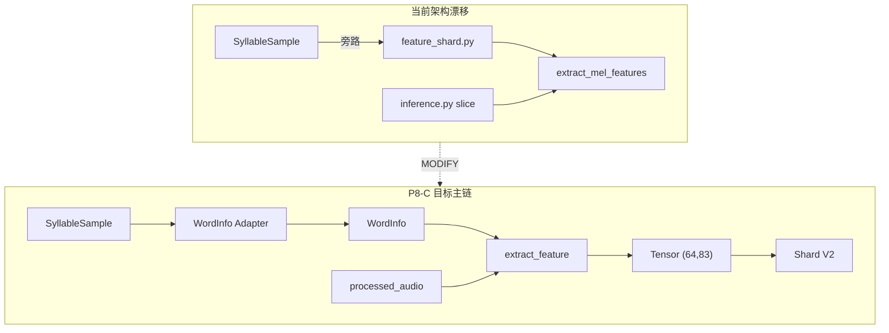

<!-- Documentation Hierarchy Metadata
Status: **HISTORICAL**
Superseded By: CURRENT SSOT + Acceptance Records
Archive Path: docs/archive/HISTORICAL/Tone_V2_P8_C_Feature_V2_Foundation_Specification_Supplement_Audit_Report.md
-->

> **HISTORICAL** — 非 CURRENT。阅读顺序：Framework Snapshot → `docs/current/` → Supporting → Acceptance → Archive。  
> Superseded By: CURRENT SSOT + Acceptance Records

# Tone V2 P8-C — Feature V2 Foundation 规格补充审计报告

**Date:** 2026-07-04  
**Phase:** P8-C（Feature V2 Foundation · 冻结设计规格 vs 代码实现 · 只读审计）  
**Audit Type:** Specification Supplement / Architecture Drift / Implementation Gap Audit（**非开发** · **非训练** · **非冻结修改**）

**审计对象：**

- 设计 SSOT：[Tone V2 P8-C Feature V2 Foundation Development Specification.md](./Tone%20V2%20P8-C%20Feature%20V2%20Foundation%20Development%20Specification.md)（下称 **P8-C**）
- 前置审计：[Tone_V2_P8_FeatureV2_Syllable_Duration_Frame_Length_Audit_Report.md](./Tone_V2_P8_FeatureV2_Syllable_Duration_Frame_Length_Audit_Report.md)（P8 时长）
- [Tone_V2_P8_0_Training_Runtime_Timestamp_Consistency_Audit_Report.md](./Tone_V2_P8_0_Training_Runtime_Timestamp_Consistency_Audit_Report.md)（P8-0）
- [Tone_V2_P8_B_Feature_V2_Contract_Foundation_PreDev_Audit_Report.md](./Tone_V2_P8_B_Feature_V2_Contract_Foundation_PreDev_Audit_Report.md)（P8-B）

**代码锚点（Python ToneModule + Node Recall 接线）：**

`electron_node/services/faster_whisper_vad/tone_module/` · `shared_types.py` · `api_routes.py` · `electron-node/main/src/pipeline/steps/asr-step.ts` · `fw-detector/span-assembly-v4/recall-topk-for-windows.ts`

**禁止项（本轮）：** 修改 Runtime · Dataset Foundation · Training Engineering 冻结层 · p0-v1 Contract · 任何模型权重 · 训练执行

---

## Executive Summary

| 项 | 结论 |
|----|------|
| P8-C 架构原则（WordInfo SSOT · 单 Extractor · 单 Contract · Shard V2 · Loader 只读） | 文档**自洽**；与项目冻结方向**一致** |
| P8-C 可执行实现细节（DSP · F0 · 插值/裁剪数值 · Adapter 字段 · 音频前置 · 验收自动化） | **大量缺失**；须以 P8 时长审计 + 代码事实补充冻结 |
| 当前代码 V2 Foundation 实现度 | **0%**（无 `feature_v2` · 无 Adapter · 无 Shard V2 · 无 P8 回归门） |
| p0 主链与 P8-C 一致性 | **CONDITIONAL** — Runtime 已走 `processed_audio + WordInfo`；训练仍**旁路** `SyllableSample` |
| 语义验收链（Feature → Posterior → Recall） | **已接线**（Node 测试门禁）；但 **P0 mean-mel** 限制实际决策增益 |
| 跨文档冲突 | P8-B **energy 通道** vs P8-C **无 energy**；P8 时长 **overflow 策略** 内部不一致 |
| **Final Verdict** | **CONDITIONAL PASS — 可进入 P8-C 开发，须先补齐本报告 §3 补充清单并消解 §5 冲突项** |

---

## 1. 冻结设计与代码一致性总览

### 1.1 已对齐（KEEP）

| 设计项 | 代码证据 | 判定 |
|--------|----------|------|
| `WordInfo` 为 Runtime Timestamp SSOT | `shared_types.WordInfo`；`inference.py` 以 `start/end` 切片 | **一致** |
| Feature 不消费 `word` / `probability` 进 Tensor | `extract_mel_features(audio)` 无 metadata 参数 | **一致（p0）** |
| Runtime 在 dedup **之前**取 Tone | `api_routes.py` L282–290 注释与调用顺序 | **一致** |
| Dataset `SyllableSample` 非 Runtime SSOT | `dataset_contract.py` 文档注释 | **一致** |
| Loader / Shard Reader 不做 Feature 重算 | `shard_reader.py` 只 `np.load` 读 `mel` | **一致（p0 v1）** |
| p0 Contract 冻结 | `contract.P0_*` · `mel.py` · `training_feature_shard_v1` | **未漂移** |
| Posterior → Recall 主链存在 | `freeze-contract.test.ts` `TONE-PRE-V2-3` | **一致** |

### 1.2 未实现 / 架构漂移（须 MODIFY 或 RESTORE）

| 设计项（P8-C） | 当前代码 | 漂移类型 |
|----------------|----------|----------|
| 唯一 `extract_feature(audio, sr, wordInfo)` | 切片在 `inference.py` / `feature_shard.py` / `train_tone_cnn.py`；特征在 `mel.extract_mel_features(audio)` | **架构漂移** |
| Training 必经 `SyllableSample → WordInfo Adapter` | `feature_shard.py` 直连 `sample.start/end` | **旁路逻辑** |
| `training_feature_shard_v2` + `(64,83)` Tensor | `SCHEMA_VERSION = training_feature_shard_v1` · `mel: (N,80)` | **未实现** |
| `p1-frame-mel-f0-v1` | 仅 `p0-v1` / `mel_mean_80_v1` | **未实现** |
| Boundary Consistency Audit 先于 Canonical V2 Shard | 无脚本 / 无门禁 | **未实现** |
| RG-01~10 / AC-01~10 自动化 | 仅有 `test_phase2/3/6/7*`（p0 / Dataset / Shard v1） | **测试缺口** |

### 1.3 功能存在但效力受限

| 现象 | 说明 | 分类 |
|------|------|------|
| Tone Recall 已接线 | `acousticToneSlices` → `extractAcousticTonePatternForRecall` | **主链有效** |
| P0 Feature 进入 Recall | 经 `numpy_p0.infer_batch`；**mean-pool mel** 信息坍缩 | **功能存在 · 语义增益弱** |
| `skip_text_dedup:false` 时 words 可能被清空 | Tone 在 dedup 前已算；但响应 `segments` 经 dedup 重写 | **Tone 不受影响 · segments 元数据可能不一致** |
| `train_tone_cnn` `data_mini` 路径 | 永远 `_build_feature_matrix`，不经 Shard | **训练旁路 · 仅 fixture** |
| `mel_mean`/`mel_std` 在 **Backend** 应用 | 非 Extractor 输出；与 §26「Loader 不得重新 Normalization」需界定边界 | **隐式第二层归一化** |

---

## 2. 补充项清单（编号 · 来源 · 风险 · 影响 · 建议）

> **来源枚举：** `设计缺失` · `代码实现` · `测试发现` · `架构漂移` · `跨文档冲突`  
> **动作枚举：** `KEEP` · `MODIFY` · `RESTORE` · `DELETE`

### 2.1 Contract / DSP 实现细节（设计缺失为主）

| ID | 补充内容 | 来源 | 风险 | 影响范围 | 建议 |
|----|----------|------|------|----------|------|
| **S-01** | **STFT 参数未冻结：** `sampleRate=16000` · `frameLengthMs=25` · `hopLengthMs=10` · `n_fft=400` · `hop=160`；与 p0（`n_fft=512`·`hop=160`）不同 | 设计缺失；P8 时长审计；代码 `contract.P0_N_FFT` | **P0** | Extractor · Shard V2 · Runtime/Training 等式 · 与 P8 时长证据链 | **MODIFY** P8-C §13 增「DSP Baseline」子节并引用 P8 审计 |
| **S-02** | **Mel 滤波器定义未冻结：** `n_mels=80` · `fmin=50` · `fmax=7600` · `log10(power)` · HTK mel 标尺（与 `mel.py` 一致） | 设计缺失；代码实现 | **P1** | Channel 0–79 数值对齐 | **MODIFY** P8-C §13.3 补充 mel 子规范 |
| **S-03** | **固定帧长与 Tensor 形状：** `fixedFrames=64` · `channels=83` · 形状 **`(64, 83)` = (Frame, Channel)**；行=时间帧 · 列=通道 | 设计缺失；P8 时长审计；P8-C §13.2 仅写数字 | **P0** | CNN 输入 · NPZ 存储 · Loader 校验 | **MODIFY** P8-C 明确轴序与 `numpy`/`torch` 约定 |
| **S-04** | **插值策略未写清：** 建议 `duration_normalized_linear_interp` 至 64 帧（短音频 upsample）；禁止 Training/Runtime 分叉（§13.6 仅写禁止项） | 设计缺失；P8 时长审计 | **P0** | 99%+ 样本需 upsample；Training/Runtime 等式 RG-07 | **MODIFY** P8-C §13.6 写**唯一**算法 |
| **S-05** | **Overflow/Crop 策略冲突：** P8 摘要写「尾部零 pad」；正文建议 `center_crop_if_raw>64`（0.03%）；P8-C §13.7 未选定 | 跨文档冲突；设计缺失 | **P0** | 0.03% 边界样本 · RG-04 Boundary | **MODIFY** 统一为单一策略并写入 Contract |
| **S-06** | **F0 提取算法未定义：** 无 pyin / autocorr / 平滑窗 / 无音高填充值 | 设计缺失 | **P0** | Channel 80–82 · 训练/推理一致性 | **MODIFY** P8-C 新增 §13.8 F0 Contract |
| **S-07** | **ΔlogF0 定义未定义：** 一阶时间差分步长、边界帧处理、无音高帧是否参与 | 设计缺失 | **P1** | Channel 81 | **MODIFY** 随 F0 Contract 一并冻结 |
| **S-08** | **Voiced Flag 定义未定义：** 阈值来源（F0 置信度 / 能量 / 固定 0/1） | 设计缺失 | **P1** | Channel 82 | **MODIFY** 随 F0 Contract 一并冻结 |
| **S-09** | **P8-B vs P8-C 通道冲突：** P8-B 建议 83 维含 **energy**；P8-C §13.3 为 mel+F0+ΔF0+voiced **无 energy** | 跨文档冲突 | **P1** | 文档 SSOT · 下游 CNN 输入 | **DELETE** P8-B energy 表述；**KEEP** P8-C 83 通道布局 |
| **S-10** | **Feature Contract Normalization vs Model Normalization 边界未定义：** §13.4 要求统一；当前 `mel_mean/std` 在 **artifact + `numpy_p0.infer_batch`**，非 Extractor 输出 | 设计缺失；代码实现 | **P1** | §26 Loader 禁令 · V2 训练管线 · artifact schema | **MODIFY** P8-C 明确：信号域归一化（log mel/log f0）属 Contract；数据集 z-score 属 **Model Layer**，不得由 Loader 在读取 Shard 时重算 |
| **S-11** | **`minSliceSec` 门控归属：** 当前 `P0_MIN_SLICE_SEC=0.02` 在 `alignment_textgrid` · `inference.py` · 无 Extractor 级统一 | 代码实现；设计缺失 | **P2** | 训练/推理样本计数对齐 · Boundary Audit | **MODIFY** 写入 Contract：`duration < minSliceSec` → Fail-Closed skip（§19） |

### 2.2 Adapter / Timestamp / 音频前置

| ID | 补充内容 | 来源 | 风险 | 影响范围 | 建议 |
|----|----------|------|------|----------|------|
| **S-12** | **`SyllableSample → WordInfo` 字段映射未定义：** `SyllableSample` 无 `word`；Runtime `_iter_words` 要求 `w.word` 非空（`inference.py` L32） | 设计缺失；代码实现 | **P0** | Adapter · 训练 Shard 构建 · Runtime 门控一致性 | **MODIFY** P8-C §11 增表：`word=""` 禁止；建议 `word="·"` 或 `syllable@{idx}` 占位，**不得**影响 `start/end` |
| **S-13** | **`probability` 默认值：** Adapter 建议固定 `1.0` 或 `None`；不得进入 Feature | 设计缺失 | **P3** | Adapter 输出完整性 | **MODIFY** §11.1 补充 |
| **S-14** | **Runtime 音频 = `processed_audio`；训练 = 数据集原始 wav：** VAD/增益/重采样链是否等价未在 P8-C 写明 | 设计缺失；P8-0 审计 | **P1** | RG-07 Training/Runtime Equality · Boundary Audit | **MODIFY** P8-C §18：Training 使用数据集 16 kHz mono；Runtime 使用 FW 管线 `processed_audio`；V2 验收须抽样对比或接受「边界源不同」仅比 Feature Extractor 等式 |
| **S-15** | **`WordInfo.start/end` 为 `Optional[float]`** 于 `shared_types.py`；P8-C 未写 None 处理 | 代码实现；设计缺失 | **P2** | Fail-Closed（§19） | **KEEP** Optional 类型；**MODIFY** §19 明确 None → skip |
| **S-16** | **禁止 `FeatureTimestampRecord`（FP-01）** — P8-A 曾建议，与 P8-C 冲突 | 跨文档冲突 | **P1** | 全栈 Timestamp | **DELETE** P8-A 该建议；**KEEP** WordInfo only |

### 2.3 Extractor / Shard / Loader

| ID | 补充内容 | 来源 | 风险 | 影响范围 | 建议 |
|----|----------|------|------|----------|------|
| **S-17** | **单入口 `extract_feature(audio, sampleRate, wordInfo)` 未实现** | 架构漂移 | **P0** | FC-03 · AC-02 · 全部 V2 | **MODIFY** 新增 `tone_module/feature_v2.py`（开发项，非本轮） |
| **S-18** | **切片逻辑三处重复：** `inference.py` · `feature_shard.py` · `train_tone_cnn.py` `_slice_audio` 相同实现 | 架构漂移 | **P1** | 边界一致性 · 维护成本 | **RESTORE** 迁入 Extractor 后 **DELETE** 外层重复 |
| **S-19** | **`feature_shard.py` 旁路 Adapter：** 直接 `SyllableSample.start/end` + `extract_mel_features` | 架构漂移 | **P0** | §20–22 训练主链 · AC-03 | **MODIFY** V2 构建链：`Adapter → extract_feature → Shard V2` |
| **S-20** | **`train_tone_cnn._build_feature_matrix` 第二 Feature 路径**（`data_mini` 全路径 + 潜在 aishell3 回退） | 架构漂移 | **P1** | FC-03 · `test_phase7b2` 已禁 `train_tone_p3` 但未禁此函数 | **KEEP** p0 `data_mini` fixture；**MODIFY** V2 训练强制 Shard V2 + 静态审计禁止直连 `SyllableSample` 进 Extractor |
| **S-21** | **Shard V2 存储格式未定义：** NPZ 键名（`feature` vs `mel`）· `featureShape` · `featureVersion` · 可选诊断 `start/end` · `boundaryProvider` 仅 manifest | 设计缺失；P8-B | **P1** | Training Engineering 再冻结 | **MODIFY** P8-C §22.2 增 JSON schema 示例 |
| **S-22** | **`manifest_is_valid` 硬编码 v1：** 只接受 `training_feature_shard_v1` + `p0-v1` | 代码实现 | **P2** | V2 并行共存 | **MODIFY** 新增 `manifest_is_valid_v2`；**KEEP** v1 校验不变 |
| **S-23** | **Loader `nMels` 硬编码维度：** `ShardReader` 用 `manifest["nMels"]` 建 `(N,80)` | 代码实现 | **P2** | V2 `(64,83)` | **MODIFY** V2 Reader 读 `featureShape` |

### 2.4 Runtime / Model / 决策链

| ID | 补充内容 | 来源 | 风险 | 影响范围 | 建议 |
|----|----------|------|------|----------|------|
| **S-24** | **`inference.py` 未调用统一 Extractor：** `slice` + `extract_mel_features` 在 Orchestrator 层 | 架构漂移 | **P0** | §12 · §17–18 | **MODIFY** V2：`extract_feature(processed_audio, sr, w)` 唯一入口 |
| **S-25** | **`numpy_p0` / `loader` 仅支持 `(N,80)` mean-mel** | 代码实现 | **P0** | V2 模型上线 | **KEEP** p0 backend；**MODIFY** 新 `backend` + `featureVersion` 门控 |
| **S-26** | **§34 / §37「Feature Tensor 参与最终 Decision」表述过宽** — 实际路径为 Tensor → Posterior → Recall → Ranking；Tensor 不直连 Decision | 设计缺失 | **P2** | 验收误解 · 与 §17「Foundation 不参与 Decision」 | **MODIFY** 文案改为「Posterior 经 Recall 参与 Candidate Ranking」 |
| **S-27** | **KenLM prefilled rerank 不接 Tone（`TONE-PRE-V2-2`）** — 设计未声明 Tone 不进入 KenLM | 测试发现 | **P3** | 语义验收范围 | **KEEP**；**MODIFY** P8-C §34 脚注 Scope |
| **S-28** | **FW v4 path 无 `toneModule` 字符串（`CLEANUP-1`）** — Tone 在 ASR 步注入 `ctx`，非 v4 文件内联 | 测试发现 | **P3** | 文档读者误解 | **KEEP** 架构；**MODIFY** P8-C §17 注明 Node 注入点 |

### 2.5 验证 / 回归 / 门禁

| ID | 补充内容 | 来源 | 风险 | 影响范围 | 建议 |
|----|----------|------|------|----------|------|
| **S-29** | **Boundary Consistency Audit 无程序与阈值：** §25 要求 PASS 后才可 Canonical V2 Shard；无实现 | 设计缺失 | **P0** | RG-04 · 997k 全量构建 | **MODIFY** 补充审计规范：抽样/全量对比 `Adapter( SyllableSample )` 与直接 `start/end` 边界差分 = 0 |
| **S-30** | **RG-01~10 / AC / FAV / CV 无 `test_phase8*` 映射表** | 设计缺失；测试发现 | **P1** | P8 退出准则 §37 | **MODIFY** P8-C 增 §「验收自动化映射」 |
| **S-31** | **RG-07 Training/Runtime Equality 无黄金样本测试** | 测试发现 | **P0** | 核心 Contract | **MODIFY** 新增：同一 `audio + WordInfo` 训练/推理 bit-exact 或容差阈值 |
| **S-32** | **RG-09 Decision Path：** 已有 `tone-recall-counterfactual.test.ts`；Python 侧无对等 | 测试发现 | **P2** | 跨语言验收 | **KEEP** TS 测试；**MODIFY** 补充 Python 集成探针或文档引用 |
| **S-33** | **Semantic Acceptance 当前仅验证 P0 存在性** — `audit_runtime_acceptance.py` / `audit_tone_reliability.py` 未验 V2 Tensor 影响 Posterior | 测试发现 | **P1** | §34 | **MODIFY** V2 后增加 counterfactual：置乱 Tensor → Posterior 变化 → Recall 分数变化 |
| **S-34** | **`test_phase7b2` 审计 `extract_mel_features` 在 Shard 构建中** — V2 应改为审计 `extract_feature` | 测试发现 | **P2** | Shard 构建门禁 | **MODIFY** probe 规则随 V2 更新 |

### 2.6 历史遗留 / 死代码 / 隐藏门控

| ID | 补充内容 | 来源 | 风险 | 影响范围 | 建议 |
|----|----------|------|------|----------|------|
| **S-35** | **`_iter_words` 空 `word` 隐藏门控** — 有 timestamp 但无 token 的 FW 词被丢弃 | 代码实现 | **P2** | Runtime 覆盖率 · Adapter 占位策略 | **KEEP** p0 行为；**MODIFY** V2 文档化或 Extractor 仅依赖 start/end 时 **RESTORE** 门控为 `start/end not None` |
| **S-36** | **`_is_zh_language` 门控** — 非中文跳过 Tone | 代码实现 | **P3** | 多语扩展 | **KEEP** |
| **S-37** | **`classifier.ready` fail-closed** | 代码实现 | **P3** | §19 | **KEEP** |
| **S-38** | **`offline_tone_eval.py`** — 仅 posterior 质量；注释声明不进 Decision；**非第二 Pipeline** | 代码实现 | **P3** | FC-01 | **KEEP** |
| **S-39** | **`electron-node/.../tone-stage.ts` 文本 Tone** — 与声学 `acousticToneSlices` 无关 | 代码实现 | **P3** | 术语混淆 | **KEEP**；**MODIFY** 术语表区分 Text Tone vs Acoustic Tone |
| **S-40** | **dist/ 下编译产物未纳入审计** — 以 `tone_module` 源为准 | 代码实现 | **P3** | 部署一致性 | **KEEP** 源 SSOT；构建流水线保证 dist 同步 |

---

## 3. 风险等级汇总

| 等级 | 数量 | 含义 |
|------|------|------|
| **P0** | 12 | 阻塞 V2 Foundation 冻结或 RG 通过；须开发前写入 P8-C 或 Implementation Addendum |
| **P1** | 11 | 高概率导致 Training/Runtime 分叉或验收争议 |
| **P2** | 9 | 边界/测试/文档；可在 V2 首版并行补齐 |
| **P3** | 8 | 低影响 · 术语 · 多语 · 遗留门控说明 |

---

## 4. 影响分析（按子系统）



| 子系统 | 现状 | P8-C 目标 | 主要补充项 |
|--------|------|-----------|------------|
| **Feature Foundation** | `mel.py` mean-pool p0 | `feature_v2` 帧级 64×83 | S-01~11, S-17~18, S-24~25 |
| **Training Engineering** | Shard v1 · 直连 SyllableSample | Adapter + Shard v2 | S-19~23, S-29 |
| **Runtime** | 预 dedup Tone · p0 mel | 同 Extractor · 新 backend | S-14, S-24~25 |
| **Model Layer** | MLP + mel z-score in artifact | CNN 消费固定 Tensor | S-10, S-25 |
| **Verification** | Phase 7 门禁 | RG + Boundary + Equality | S-29~34 |
| **Documentation** | P8-C 原则完整 | DSP/F0/Adapter schema | S-01~09, S-12~13, S-21 |

---

## 5. 跨文档冲突消解建议

| 冲突 | 文档 A | 文档 B | 建议动作 |
|------|--------|--------|----------|
| Energy 通道 | P8-B `(64,83)` 含 energy | P8-C §13.3 无 energy | **DELETE** P8-B energy；**KEEP** P8-C |
| FeatureTimestampRecord | P8-A 建议 formalize | P8-C FP-01 禁止 | **DELETE** P8-A 建议 |
| Overflow 策略 | P8 摘要 tail pad | P8 正文 center_crop | **MODIFY** P8 时长报告统一；写入 P8-C §13.7 |
| 通道数演进 | P8 时长 81 (mel+f0) | P8-C 83 (+ΔF0+voiced) | **KEEP** P8-C；P8 时长仅作帧长证据 |
| Loader Normalization | P8-C §26 禁止 Loader 重算 | `fit_norm_stats` + backend z-score | **MODIFY** P8-C 分层：Loader 禁止；Model 允许读 artifact stats |

---

## 6. 验收与测试要求补充（建议写入 P8-C 或 Implementation Addendum）

### 6.1 必测门禁（V2 Foundation 冻结前）

| 门禁 ID | 测试要求 | 建议实现 |
|---------|----------|----------|
| RG-04 | Boundary Consistency：Adapter 不改变 `start/end` | 全量/抽样 hash 对比 |
| RG-07 | 同一 `(audio, WordInfo)` Training/Runtime `extract_feature` 输出一致 | `test_phase8_feature_equality.py` |
| RG-03 / CV-01~08 | Contract 字段、shape、version 静态 + 运行时断言 | 扩展 `test_phase3_contracts.py` |
| RG-02 / §34 | Posterior 随 Tensor 变化；Recall 分数 counterfactual 变化 | 复用 `tone-recall-counterfactual.test.ts` + Python 探针 |
| RG-08 | Runtime Mainline 无 Registry/Switch/第二 Pipeline | 延续 `test_phase2_contracts` 源扫描 |
| RG-10 | p0 回归不退化 | 现有 Phase 2/3/7 全绿 + p0 artifact 校验 |

### 6.2 建议黄金样本集

- 规模：≥ 32 条 `(wav_clip, WordInfo, label)`，覆盖 upsample / overflow crop / unvoiced / 极短 20 ms 边界
- 存储：`tone_module/fixtures/p8_golden/`（仅诊断，非生产权重）
- 比对：`max_abs_diff < 1e-5`（float32）或文档化容差

---

## 7. KEEP / MODIFY / RESTORE / DELETE 总表

| 动作 | 对象 | 理由 |
|------|------|------|
| **KEEP** | p0-v1 · `mel.py` · `training_feature_shard_v1` · `numpy_p0` · Runtime dedup 前 Tone · WordInfo SSOT · Recall 接线 · fail-closed | 冻结基线；并行 V2 |
| **KEEP** | `SyllableSample` 停留 Dataset Foundation | P8-C FC-06 / FP-07 |
| **MODIFY** | P8-C 规格 | 补充 §3 全部 P0/P1 实现细节与验收映射 |
| **MODIFY** | 新增 `feature_v2.py` · `syllable_to_wordinfo.py` · Shard v2 构建 · V2 backend/loader | 实现 P8-C 主链 |
| **MODIFY** | `inference.py` | 改为调用 `extract_feature`（V2 模型就绪后） |
| **MODIFY** | `feature_shard` 构建路径 | Adapter → Extractor → v2 NPZ |
| **MODIFY** | `train_tone_cnn` | aishell3 禁止 `_build_feature_matrix` 生产路径；V2 仅 Shard |
| **RESTORE** | 单一 `_slice_audio` 语义 | 迁入 Extractor 后删除三处副本 |
| **RESTORE** | Boundary Audit 在 Canonical V2 全量前执行 | §25 顺序 |
| **DELETE** | `FeatureTimestampRecord` 及一切 Timestamp Wrapper 方案 | FP-01 |
| **DELETE** | P8-B「83 维含 energy」表述 | 与 P8-C 冲突 |
| **DELETE** | 训练侧直连 `SyllableSample` 进 Feature（V2 目标态） | FC-03 / §20 |
| **DELETE** | （V2 后）外层重复 `extract_mel_features` 调用链 | 单 Extractor |

---

## 8. 与 P8-C 冻结设计的一致性裁决

| P8-C 章节 | 文档要求 | 代码现状 | 裁决 |
|-----------|----------|----------|------|
| §10 WordInfo SSOT | 唯一 Timestamp | 已满足 | **PASS** |
| §11 Adapter | 仅字段转换 | **未实现** | **FAIL** → 开发项 |
| §12 单 Extractor | `extract_feature(...)` | 切片外置 + `extract_mel_features(audio)` | **FAIL** → RESTORE |
| §13 Contract | `p1-frame-mel-f0-v1` (64,83) | p0 (80,) | **N/A（未开发）** |
| §20–22 Training 链 | Adapter → Extractor → Shard V2 | SyllableSample → mel → v1 | **FAIL** → MODIFY |
| §25 Boundary Audit | PASS 前禁止 Canonical V2 | 未执行 | **FAIL** → RESTORE 流程 |
| §26 Loader | 只读 Tensor | 满足（v1） | **PASS（p0）** |
| §27 Equality | 训练/推理同 Extractor | 同 `mel.py` 但训练无 WordInfo 路径 | **CONDITIONAL** |
| §34 Semantic | Posterior 影响 Recall | 已接线；P0 特征弱 | **CONDITIONAL** |
| §37 退出准则 | 全部 RG PASS | 无 P8 测试 | **FAIL** |

### Final Verdict: **CONDITIONAL PASS**

P8-C **冻结架构设计**可作为 V2 Foundation 开发 SSOT；**不可**在现状代码上视为已实现。进入编码前须：

1. 将本报告 **P0 补充项（S-01~S-06, S-12, S-17, S-19, S-24~S-25, S-29, S-31）** 写入 P8-C 实施补充或冻结增编；
2. 消解 **§5 跨文档冲突**；
3. 建立 **Boundary Audit + RG 自动化** 后再构建 Canonical Feature Shard V2 全量。

---

## 9. 代码锚点索引（审计引用）

```32:34:electron_node/services/faster_whisper_vad/tone_module/inference.py
            if w.word and w.start is not None and w.end is not None:
                yield w
```

```48:52:electron_node/services/faster_whisper_vad/tone_module/inference.py
def _slice_audio(audio: np.ndarray, sample_rate: int, start: float, end: float) -> np.ndarray:
    s = max(0, int(start * sample_rate))
    e = max(s + 1, int(end * sample_rate))
    e = min(e, len(audio))
```

```104:106:electron_node/services/faster_whisper_vad/tone_module/training_io/feature_shard.py
            clip = _slice_audio(audio, sr, sample.start, sample.end)
            mel_buf.append(extract_mel_features(clip, sr))
            label_buf.append(sample.label)
```

```257:270:electron_node/services/faster_whisper_vad/tone_module/train_tone_cnn.py
def _build_feature_matrix(samples: Sequence[SyllableSample]) -> Tuple[np.ndarray, np.ndarray]:
    ...
        clip = _slice_audio(audio, sr, sample.start, sample.end)
        xs.append(extract_mel_features(clip, sr))
```

```17:17:electron_node/services/faster_whisper_vad/tone_module/training_io/feature_shard.py
SCHEMA_VERSION = "training_feature_shard_v1"
```

```282:290:electron_node/services/faster_whisper_vad/api_routes.py
        # P0 ToneModule: infer BEFORE dedup (word timestamps align with processed_audio)
        tone_payload, tone_inference_ms = run_tone_inference(
            processed_audio=processed_audio,
            sample_rate=sr,
            segments=segments_info,
```

---

*本报告为 P8-C 冻结设计的补充审计产物；不修改任何冻结层代码。后续开发须以本清单 + P8-C 正文为合并 SSOT。*
