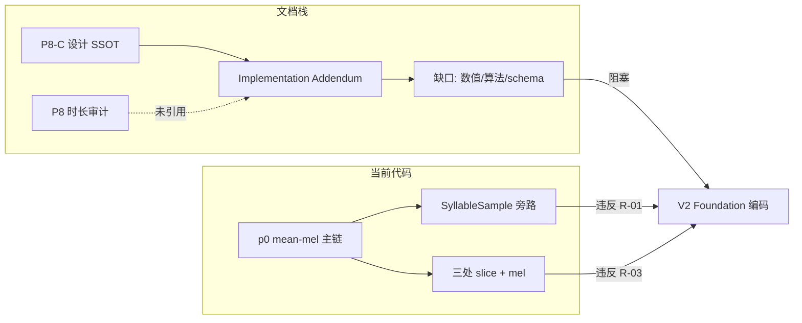

<!-- Documentation Hierarchy Metadata
Status: **HISTORICAL**
Superseded By: CURRENT SSOT + Acceptance Records
Archive Path: docs/archive/HISTORICAL/Tone_V2_P8_C_Implementation_Addendum_Supplement_Audit_Report.md
-->

> **HISTORICAL** — 非 CURRENT。阅读顺序：Framework Snapshot → `docs/current/` → Supporting → Acceptance → Archive。  
> Superseded By: CURRENT SSOT + Acceptance Records

# Tone V2 P8-C — Implementation Addendum 补充审计报告

**Date:** 2026-07-04  
**Phase:** P8-C Implementation Addendum（冻结实施补充 vs 代码实现 · 只读审计）  
**Audit Type:** Addendum Completeness / Code Compliance / Architecture Drift Audit（**非开发** · **非训练** · **非冻结修改**）

**审计对象：**

- 实施 SSOT：[Tone V2 P8-C — Feature V2 Foundation Implementation Addendum.md](./Tone%20V2%20P8-C%20%E2%80%94%20Feature%20V2%20Foundation%20Implementation%20Addendum.md)（下称 **Addendum**）
- 设计 SSOT：[Tone V2 P8-C Feature V2 Foundation Development Specification.md](./Tone%20V2%20P8-C%20Feature%20V2%20Foundation%20Development%20Specification.md)（**P8-C**）
- 前序审计：[Tone_V2_P8_C_Feature_V2_Foundation_Specification_Supplement_Audit_Report.md](./Tone_V2_P8_C_Feature_V2_Foundation_Specification_Supplement_Audit_Report.md)（P8-C 规格补充）
- 数据证据：[Tone_V2_P8_FeatureV2_Syllable_Duration_Frame_Length_Audit_Report.md](./Tone_V2_P8_FeatureV2_Syllable_Duration_Frame_Length_Audit_Report.md)（P8 时长）

**代码锚点：** `electron_node/services/faster_whisper_vad/tone_module/` · `shared_types.py` · `api_routes.py` · `electron-node/main/src/fw-detector/freeze-contract.test.ts`

---

## Executive Summary

| 项 | 结论 |
|----|------|
| Addendum 与 P8-C 原则对齐 | **是** — KEEP/MODIFY/RESTORE/DELETE 方向与 P8-C 一致 |
| Addendum 作为「可实施 SSOT」完备性 | **不足** — M-01~M-11 多为**义务占位符**，缺少数值、算法、schema、容差与测试映射 |
| Addendum 相对 P8-C 的新增冻结内容 | **极少** — 实质新增主要为 M-02（64 frames）、M-07（归一化归属）、FP-21~24 |
| 当前代码对 Addendum 的实现度 | **0%** — 无 V2 Extractor / Adapter / Shard v2 / §8 任一回归门 |
| 代码对 Addendum RESTORE/DELETE 的符合度 | **FAIL** — R-01/R-03 仍被 p0 旁路违反；DELETE 项在 p0 层无违规 |
| **Final Verdict** | **CONDITIONAL PASS — Addendum 可挂接为 P8-C 子文档，但须再出一层「数值/算法冻结增编」后方可编码；当前代码不得宣称满足 Addendum** |

### Addendum 自身定位裁决

Addendum 正文声明「仅补充实现约束与验收要求」，但 **§3 MODIFY 中 M-03~M-06 仅列出须冻结的类目名称，未给出可执行定义**。因此：

- 对 **架构/所有权/禁止项**：Addendum + P8-C **足够**指导方向；
- 对 **Feature Contract 可编码实现**：Addendum **尚未闭合**，实施者仍需回退 P8 时长审计 + 待写的 **Addendum II（数值冻结）**。

---

## 1. Addendum 条款覆盖度审计

### 1.1 Addendum 已覆盖且与 P8-C 一致

| 条款 | 内容 | 判定 |
|------|------|------|
| §2 KEEP | Runtime Mainline · WordInfo SSOT · Fail-Closed · 单 Extractor/Contract/Tensor | 与 P8-C FC/FP 一致 |
| M-01 | `(Frame, Channel)` 轴序 | 补充 P8-C §13.2 形状语义 |
| M-02 | `64 Frames` | 与 P8-C §13.2 + P8 时长审计一致 |
| M-07 | Signal Domain vs Model Layer 归一化归属 | **有价值补充**；消解 Loader 禁令歧义 |
| M-09 | Training/Runtime 统一 Extractor | 重述 P8-C §12 |
| R-01~R-04 | Adapter 主链 · 单 Owner · Boundary 先于 Shard | 重述 P8-C §20/§25 |
| §5 DELETE | Timestamp Wrapper · Dual Pipeline 等 | 与 P8-C FP-01 一致 |
| FP-21~24 | Contract Ownership · Equality Gate · Boundary 独立 | 合理延伸 |

### 1.2 Addendum 声称冻结但未给出可执行定义（设计缺失）

| 条款 | 声称冻结 | Addendum 实际内容 | 缺口 |
|------|----------|-------------------|------|
| M-03 | Interpolation | 「须同一算法」 | **未写算法名**（P8 时长建议 duration-normalized linear） |
| M-04 | F0 Contract | 四类 Policy 标题 | **无算法**（pyin/自相关/填充值/平滑） |
| M-05 | ΔF0 | 差分方向/边界/unvoiced | **无公式** |
| M-06 | Voiced Flag | 生成规则 | **无阈值** |
| M-08 | WordInfo Adapter | 「合法 WordInfo」 | **无字段映射表**（`word` 占位策略） |
| M-10 | Boundary Consistency Gate | PASS 前禁止 Canonical V2 | **无审计程序/阈值/产物路径** |
| M-11 | Training/Runtime Equality | 允许浮点误差 | **无 `max_abs_diff` / `rtol`/`atol`** |
| §8 | 七类 Regression | 仅列名称 | **无 `test_phase8_*` 路径 · 无 PASS 定义 · 无 RG 映射** |

### 1.3 P8-C 已有但 Addendum 未承接的关键项

| P8-C 内容 | Addendum 状态 | 风险 |
|-----------|---------------|------|
| `featureVersion = p1-frame-mel-f0-v1` | **未写** | 实施者可能自造版本名 |
| `Tensor Shape 64 × 83` | M-02 只写 64 frames，**未写 83 channels** | Channel 布局易漂移 |
| Channel 0–79/80/81/82 布局 | **未写** | 与 P8-B energy 争议未在 Addendum 收口 |
| §13.5 Padding / §13.7 Crop | **未写** | overflow 策略仍开放 |
| STFT `25ms/10ms/n_fft=400` | **未写** | 与 p0 `n_fft=512` 分叉无文档锚点 |
| `extract_feature(audio, sr, wordInfo)` 签名 | M-09 未写 API | 接口名/参数易不一致 |
| `training_feature_shard_v2` schema | **未写** | Training Engineering 无法冻结 |
| §26 Loader 只读 | M-07 部分覆盖 | MiniBatchReader z-score 边界仍模糊 |

---

## 2. 代码 vs Addendum + P8-C 一致性

### 2.1 符合（KEEP）

| Addendum / P8-C 要求 | 代码证据 | 判定 |
|----------------------|----------|------|
| WordInfo 为 Timestamp SSOT | `shared_types.WordInfo`；`inference.py` 用 `start/end` | **PASS** |
| Runtime Fail-Closed | `inference.py` 多路 `skipped_reason`；`loader` fail-closed | **PASS** |
| Tone Posterior → Recall 主链 | `freeze-contract.test.ts` `TONE-PRE-V2-3` | **PASS** |
| dedup 前 Tone | `api_routes.py` L282–290 | **PASS** |
| p0 冻结、未静默升级 | `contract.P0_*` · `training_feature_shard_v1` | **PASS** |
| Loader 不重算 Feature（p0） | `shard_reader.py` 只读 NPZ | **PASS（p0）** |
| 无 Registry/Switch/第二 Pipeline（p0） | `test_phase2_contracts.py` 源扫描 | **PASS（p0）** |

### 2.2 违反 RESTORE / MODIFY（架构漂移）

| Addendum 条款 | 期望 | 代码现状 | 分类 |
|---------------|------|----------|------|
| **R-01** | `SyllableSample → Adapter → WordInfo → Extractor` | `feature_shard.py` L104–106 直连 `sample.start/end` + `extract_mel_features` | **旁路逻辑** |
| **R-03 / M-09** | 单 Extractor，不得复制 Feature 逻辑 | `_slice_audio` 三份；`extract_mel_features` 被 `inference.py` / `feature_shard.py` / `train_tone_cnn.py` 分别调用 | **重复实现** |
| **M-09** | 统一 `Feature Extractor` | 切片在 Orchestrator 层，不在 Extractor | **架构漂移** |
| **M-02 / M-01** | `(64, 83)` 帧级 Tensor | `mel.py` 输出 `(80,)` mean-pool | **未实现** |
| **M-10** | Boundary PASS 后再 Canonical V2 Shard | 无 Boundary 审计；仅有 v1 Canonical Shard | **未实现** |
| **M-11 / FP-23** | 同输入 Feature 一致 | 训练无 WordInfo 路径；Runtime 用 `processed_audio` | **未实现/不对等** |
| **§8** | 七类 Regression 全 PASS | 无 `test_phase8*` | **测试缺口** |

### 2.3 功能存在但效力受限 / 未进主链 / 结果被覆盖

| 现象 | 说明 | Addendum 相关条款 |
|------|------|-------------------|
| Recall 已消费 Posterior | 主链有效 | §2 KEEP · §7 |
| P0 mean-mel 语义增益弱 | Tensor 变化对 Recall 影响有限 | §7 Semantic Acceptance **未验 V2** |
| `MiniBatchReader` 内 z-score | L151 `(xb - mean) / std` | M-07 须明确属 **Model Training 循环**，非 Loader Contract 重算 Feature |
| `numpy_p0.infer_batch` 再次 z-score | artifact `mel_mean/std` | M-07 Model Layer — **KEEP**；但 Addendum 未写「推理时 backend 应用 stats」 |
| `skip_text_dedup:false` 后 segments 重写 | Tone 已算；响应 segments 与 Tone 时间轴可能不一致 | 未在 Addendum 写明；**Tone 主链不受影响** |
| `_iter_words` 要求 `w.word` 非空 | 有 timestamp 无 token 的词被丢弃 | M-08 未覆盖；Adapter 占位策略缺失 |
| `data_mini` 训练路径 | `_build_feature_matrix` 永不经过 Shard/Adapter | R-01 违反；Addendum §8 未豁免 fixture |
| KenLM prefilled rerank 无 Tone | `TONE-PRE-V2-2` | §7 路径应注明 KenLM 子路径 Scope |

---

## 3. 补充项清单

> **来源：** `设计缺失` · `代码实现` · `测试发现` · `架构漂移` · `跨文档冲突`  
> **动作：** `KEEP` · `MODIFY` · `RESTORE` · `DELETE`

### 3.1 Addendum 文档层（须 MODIFY Addendum 或新增 Addendum II）

| ID | 补充内容 | 来源 | 风险 | 影响范围 | 建议 |
|----|----------|------|------|----------|------|
| **A-01** | **M-03~M-06 为占位符而非冻结值**：Interpolation / F0 / ΔF0 / Voiced 无算法正文 | 设计缺失 | **P0** | 全部 V2 Contract · RG-03 | **MODIFY** Addendum 增「数值冻结」专章或 **Addendum II** |
| **A-02** | **未冻结 `featureVersion=p1-frame-mel-f0-v1`**（P8-C §13.1 有，Addendum 无） | 设计缺失 | **P0** | Shard manifest · loader 门控 | **MODIFY** Addendum M 节首条增补 |
| **A-03** | **M-02 只写 64 frames，未写 `channels=83` 与通道序** | 设计缺失 | **P0** | CNN 输入 · NPZ 布局 | **MODIFY** M-01/M-02 合并为完整 `(64,83)` Contract |
| **A-04** | **STFT/DSP 未冻结：** `sr=16000` · `frameLengthMs=25` · `hop=160` · `n_fft=400` · mel `fmin/fmax` · `log10` | 设计缺失；P8 时长审计 | **P0** | M-04~M-06 前置依赖 | **MODIFY** 引用 P8 时长 §Methodology |
| **A-05** | **插值算法未点名：** 建议 `duration_normalized_linear` → 64 frames | 设计缺失；P8 时长 | **P0** | M-03 · M-11 | **MODIFY** M-03 写死算法名 |
| **A-06** | **Padding/Crop 策略 Addendum 完全缺失** | 设计缺失；P8-C §13.5–13.7 | **P0** | 0.03% overflow 样本 | **MODIFY** 新增 M-12/M-13；消解 P8 时长 tail-pad vs center-crop 冲突 |
| **A-07** | **M-08 无 Adapter 字段表：** `start/end` 直拷；`word` 非空占位；`probability=1.0` | 设计缺失 | **P0** | R-01 · Runtime `_iter_words` 门控 | **MODIFY** M-08 增表 |
| **A-08** | **Label 并行路径未文档化：** `Tone Label` 来自 `SyllableSample.label`，**不经过** WordInfo/Extractor | 隐含前提 | **P1** | Shard V2 构建 · FP-07 | **MODIFY** 增「Training Label Sidecar」：Adapter 只转 Timestamp，Label 由 Training Engineering 并行挂载 |
| **A-09** | **M-10 Boundary Gate 无可执行规范：** 输入/输出 JSON · 抽样率 · PASS=`max_abs(start,end diff)==0` | 设计缺失 | **P0** | Canonical V2 全量 997k | **MODIFY** M-10 + §8 映射脚本路径 |
| **A-10** | **M-11 浮点容差未定义** | 设计缺失 | **P1** | FP-23 Equality Gate | **MODIFY** 建议 `float32`：`max_abs_diff ≤ 1e-5` 或文档化 rtol |
| **A-11** | **§8 回归门无测试映射表** | 设计缺失 | **P1** | Foundation 冻结退出 | **MODIFY** §8 增表（见 §6） |
| **A-12** | **Shard V2 schema 缺失：** NPZ keys · manifest `schemaVersion` · `featureShape` | 设计缺失 | **P1** | Training Engineering | **MODIFY** 新增附录 JSON 示例 |
| **A-13** | **`extract_feature(audio, sampleRate, wordInfo) -> ndarray(64,83)` 未写入 Addendum** | 设计缺失；P8-C §12.1 | **P0** | M-09 可编码性 | **MODIFY** M-09 增接口块 |
| **A-14** | **Runtime `processed_audio` vs Training 数据集 wav 等价性未写** | 设计缺失；P8-0 | **P1** | M-11 边界解释 | **MODIFY** 增「Audio Input Contract」 |
| **A-15** | **§7 Semantic 仍写「Feature → … → Final Candidate」易误解为 Tensor 直连 Decision** | 设计缺失 | **P2** | 验收范围 | **MODIFY** 改为 Posterior → Recall → Ranking |
| **A-16** | **M-02 未引用 P8 时长证据链**（99.97% @64） | 跨文档 | **P2** | 审计可追溯 | **MODIFY** 增 Evidence 链接 |
| **A-17** | **FP-21~24 与 P8-C FP-01~20 编号并列关系未说明** | 设计缺失 | **P3** | 文档导航 | **MODIFY** 增「FP 编号空间」注记 |

### 3.2 代码实现层（相对 Addendum 的 RESTORE/DELETE）

| ID | 补充内容 | 来源 | 风险 | 影响范围 | 建议 |
|----|----------|------|------|----------|------|
| **A-18** | **无 `feature_v2.py` / `syllable_to_wordinfo.py`** | 架构漂移 | **P0** | R-01/R-03/M-09 | **MODIFY** 开发项（非本轮） |
| **A-19** | **`feature_shard.py` 违反 R-01** | 架构漂移 | **P0** | Canonical 训练 | **MODIFY** V2 构建链 |
| **A-20** | **`train_tone_cnn._build_feature_matrix` 第二 Feature 路径** | 架构漂移 | **P1** | M-09 · DELETE Dual Pipeline | **KEEP** p0 `data_mini` fixture；**MODIFY** V2 静态审计禁止生产路径 |
| **A-21** | **`_slice_audio` 三处重复** | 架构漂移 | **P1** | M-11 | **RESTORE** 迁入 Extractor 后 **DELETE** 副本 |
| **A-22** | **`inference.py` 切片外置** | 架构漂移 | **P0** | M-09 | **MODIFY** 改调 `extract_feature` |
| **A-23** | **`MiniBatchReader` 训练时 z-score** | 代码实现 | **P2** | M-07 | **KEEP** 若定义为 Model Layer；**MODIFY** Addendum 明文 |
| **A-24** | **`numpy_p0` / `loader` 仅 `(N,80)`** | 代码实现 | **P0** | M-01/M-02 V2 上线 | **KEEP** p0；**MODIFY** 新 backend + version 门控 |
| **A-25** | **`P0_COMPATIBLE_FEATURE_VERSIONS` 含 `mel_mean_80_v1`** | 代码实现 | **P3** | §5 DELETE「Compatibility Feature」 | **KEEP** — 属 **p0 artifact 别名**，非 V2 Shadow；**MODIFY** Addendum 脚注区分 p0 compat vs V2 禁止项 |
| **A-26** | **`classifier.py` 注释写 CNN 实为 MLP** | 代码实现 | **P3** | 术语 | **KEEP** 行为；可选 **MODIFY** 注释 |

### 3.3 测试与验收层

| ID | 补充内容 | 来源 | 风险 | 影响范围 | 建议 |
|----|----------|------|------|----------|------|
| **A-27** | **§8 所列七门均不存在** | 测试发现 | **P0** | Addendum Final Verdict | **MODIFY** 实现 `test_phase8_*` |
| **A-28** | **`test_phase7b2` 审计 `extract_mel_features` 而非 `extract_feature`** | 测试发现 | **P2** | M-09 | **MODIFY** V2 后更新 probe |
| **A-29** | **无黄金样本 `p8_golden/`** | 设计缺失 | **P1** | M-11/FP-23 | **MODIFY** 增 fixture 规范 |
| **A-30** | **Semantic counterfactual 仅 TS 侧**（`tone-recall-counterfactual.test.ts`） | 测试发现 | **P2** | §7 | **KEEP** TS；**MODIFY** Python 探针或交叉引用 |
| **A-31** | **`test_phase7b1` 比对 `_build_feature_matrix` 与 ShardReader** | 测试发现 | **P2** | 固化 p0 双路径一致性 | **KEEP** p0；V2 后 **DELETE** 对 `_build_feature_matrix` 的等价依赖 |

### 3.4 隐藏门控与决策覆盖

| ID | 补充内容 | 来源 | 风险 | 影响范围 | 建议 |
|----|----------|------|------|----------|------|
| **A-32** | **`_is_zh_language` 跳过非中文 Tone** | 代码实现 | **P3** | Runtime 覆盖 | **KEEP**；Addendum 可选增 Scope |
| **A-33** | **`dur < MIN_SLICE_SEC` 静默丢词** | 代码实现 | **P2** | M-08/§19 Fail-Closed | **KEEP** p0；**MODIFY** V2 统一为 Extractor 级 skip + Diagnostics |
| **A-34** | **`w.word` 非空门控丢弃 FW 空 token 词** | 代码实现 | **P2** | M-08 | **MODIFY** Adapter 占位或 V2 改门控为仅 `start/end` |
| **A-35** | **`alignment_textgrid` 已滤 `<20ms` 音节** | 代码实现 | **P2** | 训练/推理样本对齐 | **KEEP**；**MODIFY** Addendum 写 `minSliceSec=0.02` SSOT |

---

## 4. 风险等级汇总

| 等级 | 数量 | 说明 |
|------|------|------|
| **P0** | 14 | Addendum 不可编码或 R-01/R-03/M-10/M-11/§8 未满足 |
| **P1** | 9 | 高概率 Training/Runtime 分叉或验收争议 |
| **P2** | 9 | 边界/测试/门控/文档澄清 |
| **P3** | 3 | 术语/compat/多语 Scope |

---

## 5. 影响分析



| 子系统 | Addendum 要求 | 文档完备度 | 代码状态 | 首要补充项 |
|--------|---------------|------------|----------|------------|
| Feature Contract | M-01~M-07 | **~20%**（仅轴序+64帧+归一化归属） | p0 `(80,)` | A-01~A-06, A-13 |
| WordInfo Adapter | M-08, R-01 | **~10%** | 未实现 | A-07, A-08 |
| Extractor | M-09, R-03 | **~30%**（原则仅有） | 切片外置 | A-18, A-21, A-22 |
| Boundary Gate | M-10, R-04 | **0%** | 未实现 | A-09 |
| Equality | M-11, FP-23 | **~10%** | 未实现 | A-10, A-14, A-29 |
| Regression §8 | 七门 | **0%**（无映射） | 未实现 | A-11, A-27 |
| Shard V2 | P8-C §22 | **0%** in Addendum | v1 only | A-12 |
| Semantic §7 | Posterior→Recall | 原则有 · Scope 模糊 | P0 弱增益 | A-15, A-30 |

---

## 6. 建议 §8 回归门映射（供写入 Addendum）

| Addendum §8 名称 | 建议测试/探针 | PASS 条件（建议） |
|------------------|---------------|-------------------|
| Boundary Consistency Gate | `test_phase8_boundary_consistency.py` | Adapter 前后 `start/end` 全量或抽样 bit-equal |
| Feature Equality Test | `test_phase8_feature_equality.py` | 黄金集 + 随机集：`max_abs_diff ≤ 1e-5` |
| Feature Contract Test | `test_phase8_feature_contract.py` | shape `(64,83)` · version · channel 索引 |
| Feature Version Test | 同上 + manifest 断言 | 仅 `p1-frame-mel-f0-v1` 进入 V2 路径 |
| Tensor Shape Test | 同上 | 禁止 `(80,)` 进入 V2 backend |
| Runtime Mainline Test | 扩展 `test_phase2_contracts.py` | 无 registry/switch/第二 extractor 源扫描 |
| Semantic Acceptance Test | TS `tone-recall-counterfactual` + Python 探针 | 置乱 Tensor → Posterior 变 → Recall 分变 |

---

## 7. KEEP / MODIFY / RESTORE / DELETE 总表

| 动作 | 对象 |
|------|------|
| **KEEP** | Addendum 方向（KEEP/DELETE/RESTORE 原则）· M-07 归一化归属 · FP-21~24 · p0 全栈冻结 · Recall 接线 · Fail-Closed |
| **MODIFY** | **Addendum 正文** — 补齐 A-01~A-17；或拆出 **Addendum II（数值冻结）** |
| **MODIFY** | 代码 — `feature_v2` · Adapter · Shard v2 · `test_phase8_*`（开发阶段） |
| **RESTORE** | R-01 训练主链 · R-03 单 Extractor · R-04 Boundary 先于 V2 Canonical |
| **DELETE** | V2 目标态下：训练直连 SyllableSample 进 Feature · 外层重复 slice/mel · Timestamp Wrapper 方案 |
| **DELETE** | 勿删：`mel_mean_80_v1` p0 compat（A-25 与 §5「Compatibility Feature」不同义） |

---

## 8. Addendum 条款合规矩阵

| 条款 | 文档可执行？ | 代码合规？ | 裁决 |
|------|-------------|------------|------|
| §2 KEEP | 是 | **PASS（p0）** | KEEP |
| M-01 轴序 | 部分（无 83） | N/A | **CONDITIONAL** |
| M-02 64 frames | 是 | N/A | **CONDITIONAL** |
| M-03 Interpolation | **否** | N/A | **FAIL** |
| M-04 F0 | **否** | N/A | **FAIL** |
| M-05 ΔF0 | **否** | N/A | **FAIL** |
| M-06 Voiced | **否** | N/A | **FAIL** |
| M-07 Normalization | 是（原则） | p0 backend z-score 符合 Model Layer | **PASS（原则）** |
| M-08 Adapter | **否** | **FAIL** | **FAIL** |
| M-09 Shared Extractor | 原则可 | **FAIL** | **FAIL** |
| M-10 Boundary Gate | **否** | **FAIL** | **FAIL** |
| M-11 Equality | **否** | **FAIL** | **FAIL** |
| R-01~R-04 | 原则可 | **FAIL** | **FAIL** |
| §5 DELETE | 是 | p0 无 V2 违规项 | **PASS** |
| §8 Regression | **否** | **FAIL** | **FAIL** |

### Final Verdict: **CONDITIONAL PASS**

- **Addendum** 成功把 P8-C 中分散的 RESTORE/归一化归属/64 帧等要点**收拢为实施清单**，但 **尚未达到「Frozen Implementation」可编码标准**。
- **P8-C + Addendum** 仍须 **第三层数值冻结**（建议 **Addendum II** 或扩写 §3 MODIFY）方可开工。
- **当前代码** 不满足 Addendum 的 R-01、R-03、M-09、§8；p0 主链按设计保持冻结 **不构成 Addendum 违规**（P8 明确 p0 不变）。

---

## 9. 代码锚点

```32:34:electron_node/services/faster_whisper_vad/tone_module/inference.py
            if w.word and w.start is not None and w.end is not None:
                yield w
```

```104:106:electron_node/services/faster_whisper_vad/tone_module/training_io/feature_shard.py
            clip = _slice_audio(audio, sr, sample.start, sample.end)
            mel_buf.append(extract_mel_features(clip, sr))
            label_buf.append(sample.label)
```

```145:152:electron_node/services/faster_whisper_vad/tone_module/training_io/shard_reader.py
    def iter_epoch_batches(self, rng: np.random.Generator) -> Iterator[Tuple[np.ndarray, np.ndarray]]:
        ...
            xb = (xb - self.mean) / self.std
            yield xb, yb
```

```88:92:electron_node/services/faster_whisper_vad/tone_module/inference.py
    for w in words:
        dur = float(w.end) - float(w.start)
        if dur < MIN_SLICE_SEC:
            continue
```

---

## 10. 与 P8-C 规格补充审计的关系

| 维度 | P8-C 补充审计（S-01~S-40） | 本报告（A-01~A-35） |
|------|---------------------------|-------------------|
| 焦点 | P8-C 设计规格 vs 代码 | **Addendum 完备性** + 代码 |
| Addendum 出现后仍缺的实现细节 | 大部分仍缺 | **A-01~A-17 明确指向 Addendum 未闭合项** |
| 代码漂移 | 已记录 | **一致**；无 V2 新代码 |
| 下一步 | 补 P8-C / 开发 V2 | **先扩写 Addendum（或 Addendum II）→ 再 V2 编码** |

---

*本报告为 Implementation Addendum 的独立补充审计；不修改任何冻结层代码。P8-C + Addendum +（待写）数值冻结增编 = 完整实施 SSOT。*
