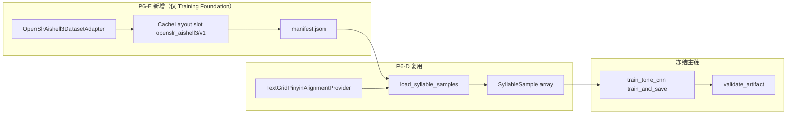

<!-- Documentation Hierarchy Metadata
Status: **HISTORICAL**
Superseded By: CURRENT SSOT + Acceptance Records
Archive Path: docs/archive/HISTORICAL/Tone_V2_Phase6E_AISHELL3_Dataset_Adapter_PreDev_Audit_Report.md
-->

> **HISTORICAL** — 非 CURRENT。阅读顺序：Framework Snapshot → `docs/current/` → Supporting → Acceptance → Archive。  
> Superseded By: CURRENT SSOT + Acceptance Records

# Tone V2 Phase 6-E — AISHELL-3 Dataset Adapter 开发前代码审计报告

**Date:** 2026-06-29  
**Audit Type:** Read-only Pre-Development Code Audit（**非训练** · **非 Runtime 开发**）  
**Scope:** 在不修改 Runtime、Loader、Contract、Feature Baseline、训练主链、Artifact Schema、Validation Pipeline 的前提下，确认如何通过 **新增 `OpenSlrAishell3DatasetAdapter`** 与 **复用 `TextGridPinyinAlignmentProvider`** 接入 AISHELL-3 全量或大子集  
**禁止项（本轮）：** 训练 `tone_cnn_p3` · 生成新模型权重 · 引入第二训练链路 · 修改冻结层

**依据 SSOT：**

- [Tone_V2_Phase6C_Training_Data_Expansion_PreDev_Audit_Report.md](./Tone_V2_Phase6C_Training_Data_Expansion_PreDev_Audit_Report.md)
- [Tone_V2_Phase6D_Dataset_Pipeline_Foundation_PreDev_Audit_Report.md](./Tone_V2_Phase6D_Dataset_Pipeline_Foundation_PreDev_Audit_Report.md)
- [Tone_V2_Phase6D_Dataset_Pipeline_Foundation_Development_Report.md](./Tone_V2_Phase6D_Dataset_Pipeline_Foundation_Development_Report.md)
- **代码锚点：** `tone_module/dataset/*` · `train_tone_cnn.py` · `contract.py` · `validate_artifact.py`

---

## Executive Summary

| 审计问题 | 结论 |
|----------|------|
| P6-D 插件化基础是否足以承载 AISHELL-3？ | **是** — `DatasetAdapter` + `AlignmentProvider` + `CacheLayout` 已落地 |
| `OpenSlrAishell3DatasetAdapter` 是否已存在？ | **否** — P6-D 仅预留 `openslr_aishell3` 槽位命名（单测），未实现 |
| 能否复用 `TextGridPinyinAlignmentProvider`？ | **是** — wav/TextGrid **basename 全局 join**；与 `data_mini` 同解析语义 |
| 官方 AISHELL-3 是否可直接对齐？ | **否** — 官方仅语句级 transcript；**必须**外接 MFA TextGrid（推荐 lars76 预发布包） |
| 全量接入是否改 Runtime / Contract / Validation？ | **否** — 变更限于 Training Foundation `dataset/` 层 |
| 全量训练是否可在当前 `train_tone_cnn` 内存模型下直接跑？ | **否** — `_build_feature_matrix` 全量 `sf.read` + `audio_cache` **不适合** ~200 万音节；属 **P6-F / p3 训练工程**，**非 P6-E 阻塞** |
| 本轮是否允许训练 p3？ | **禁止** — P6-E 仅 Adapter + Dataset Probe |

### Final Verdict: **CONDITIONAL PASS**

**含义：** Phase 6-D 已建立正确的扩展边界；**在不触碰冻结层的前提下，P6-E 仅需新增一个 Adapter、一个 Probe CLI、回归测试与 Runbook**。全量语料 **materialize + `collect_samples` + manifest 统计** 可在 P6-E 完成；**全量 MLP 训练**须待特征分片 / 流式缓存（后续阶段），与 Adapter 接入解耦。

---

## Frozen Architecture Verification

### 训练 vs Runtime 边界（审计日代码）

```text
[允许演进 — Training Foundation]
OpenSlrAishell3DatasetAdapter.materialize()
  → materialized_root（audio + alignment 并列子树）
  → TextGridPinyinAlignmentProvider.collect_samples()
  → SyllableSample[]
  → （现有）split → mel → MLP → npz → validate_artifact

[冻结 — 不得修改]
contract.py · mel.py · loader.py · inference.py · classifier.py · numpy_p0.py
validate_artifact.py（门禁逻辑）· Runtime Hop · Recall · Node E2E
```

| 检查项 | Expected | Actual | Action |
|--------|----------|--------|--------|
| 单训练入口 | 仅 `train_tone_cnn.py` | 符合 | **KEEP** |
| 训练主链无 AISHELL/TextGrid 硬编码 | 编排器仅调 pipeline | `default_data_mini_pipeline`；无 `.TextGrid` / `AISHELL-3` | **KEEP** |
| `SyllableSample` 契约 | `wav_path` · `start` · `end` · `label 0..4` | `dataset_contract.py` 已冻结 | **KEEP** |
| Provider 非架构 SSOT | 可替换实现 | `TextGridPinyinAlignmentProvider` 在 `alignment_textgrid.py` | **KEEP** 复用 |
| Artifact Required Schema | w1..b2 + featureVersion | `validate_artifact` 无 dataset import | **KEEP** |
| 第二训练链路 | 禁止 | 未发现 | **KEEP** |
| AISHELL-3 Adapter | P6-E 交付 | **未实现** | **MODIFY**（P6-E） |

**Material Runtime Drift：无**

---

## 接入路径：零冻结层修改方案

### 数据流（目标态）



### 关键设计决策

1. **Adapter 只负责 materialize**，不解析 TextGrid、不产 `SyllableSample`。
2. **`materialized_root` 设为 audio 与 alignment 的公共父目录**，使 Provider 一次 `os.walk` 同时索引 wav 与 `.TextGrid`（与 `data_mini` 异目录并列布局一致）。
3. **不修改** `TextGridPinyinAlignmentProvider`：全量 lars76 TextGrid 与 mini 子集格式同为 Praat interval + `pinyin+tone` token。
4. **`train_tone_cnn.train_and_save` 默认行为不变**（仍 `default_data_mini_pipeline`）；P6-E 验收走 **独立 Probe CLI**，避免误触全量训练。
5. **可选薄接线**（`--dataset-adapter openslr_aishell3`）可列入 P6-E 或推迟至 p3 前；**不得**因此改写 `_train_mlp` / 特征维数 / npz schema。

---

## AISHELL-3 音频：下载与本地路径

### 官方源（推荐 canonical）

| 项 | 值 |
|----|-----|
| **Identifier** | OpenSLR **SLR93** |
| **URL** | https://www.openslr.org/93 |
| **Archive** | `data_aishell3.tgz` · **~19 GB** |
| **License** | **Apache License 2.0** |
| **规模** | **218** speakers（43 男 / 175 女）· **88,035** utterances · **~85 h** |
| **采样率** | 44.1 kHz · 16-bit PCM mono |

### 解压后目录结构（官方 ReadMe）

```text
{root}/
  README.txt
  spk_info.txt
  phone_set.txt
  train/
    content.txt
    prosody_label_train-set.txt
    wav/
      SSBxxxx/
        IDxxxx.wav
  test/
    wav/
      SSBxxxx/
        ...
```

**Adapter 须处理：** tgz 顶层目录名可能为 `data_aishell3` 或直接含 `train/`；实现时与 `HuggingFaceZipDatasetAdapter` 相同，**探测并归一化 `content_root`**。

### 本地路径策略（Adapter 构造函数 / Probe CLI）

| 参数 | 用途 |
|------|------|
| `--openslr-tgz` / `OPENSRL_AISHELL3_TGZ` | 跳过下载，指向已下载 `data_aishell3.tgz` |
| `--local-audio-root` | 已解压官方树（含 `train/wav`） |
| `--cache-dir` | 默认 `tone_module/_data_cache` |

**不建议 P6-E 主路径：** HuggingFace `AISHELL/AISHELL-3`（~3.4 GB 镜像）— 须与 OpenSLR 做 **checksum / 语句 ID 对账**；OpenSLR 为 P6-C 冻结首选。

### 与大子集 / 抽样的关系

| 模式 | 实现位置 | 说明 |
|------|----------|------|
| **全量** | Adapter materialize 完整 tgz + TextGrid zip | 磁盘 ~19 GB + 对齐包；一次性 |
| **大子集** | Probe：`--speaker-ids SSB0005,SSB0012` 或 `--max-speakers N` | **仅统计 / collect 过滤**；不必改 Provider |
| **Limited Dataset Probe** | Probe：`--max-utterances 200` | 限制 walk 后 join 抽样；**禁止**默认跑全量 `train_and_save` |

---

## TextGrid 对齐资源

### 官方包

| 资源 | 能否用于当前管线 |
|------|------------------|
| `content.txt`（汉字） | **否** — 无时间戳 |
| `prosody_label_train-set.txt` | **否** — 非 syllable-level TextGrid |
| 语句级拼音 transcript | **否** — 无音节起止时间 |

### 推荐外接：lars76 MFA TextGrid

| 项 | 值 |
|----|-----|
| **Source** | https://github.com/lars76/forced-alignment-chinese/releases |
| **Asset** | `aishell3_textgrid_files.zip` |
| **格式** | Praat TextGrid · interval tier · `pinyin+tone`（与 `data_mini` 内 `aishell3_alignment_tone/` 同族） |
| **Provider** | **复用** `TextGridPinyinAlignmentProvider` — **无需新 Provider** |
| **License** | 仓库开源 LICENSE（实施时读取并写入 manifest `license` 附注）；对齐产物与 Apache 2.0 音频配套使用 |

### `data_mini` 与全量关系（格式证据）

P6-C 实测 `data_mini` 布局：

```text
materialized_root/
  AISHELL-3/train/wav/SSB*/ID*.wav
  aishell3_alignment_tone/SSB*/ID*.TextGrid
```

`TextGridPinyinAlignmentProvider` 通过 **basename**（`ID2166W0001`）join，**不要求** wav 与 TextGrid 同目录。全量 Adapter 目标布局：

```text
{cache}/datasets/openslr_aishell3/v1/
  manifest.json
  archives/
    data_aishell3.tgz              # 可选缓存
    aishell3_textgrid_files.zip
  materialized/
    audio/                         # 解压 SLR93 → 含 train/wav/...
    alignment/                     # 解压 lars76 → 含 SSB*/*.TextGrid
```

`materialized_root` = `materialized/`（父目录），`is_materialized_root_valid()` 要求子树内同时存在 `.wav` 与 `.TextGrid`。

### Join 验收门槛（P6-E Probe 输出）

| 指标 | Dataset Probe 接受 | 全量目标 |
|------|------------|----------|
| wav 有匹配 TextGrid 的比例 | **≥ 95%**（抽样 500 utt） | **≥ 99%** |
| 无匹配 basename 列表 | 打印前 20 条 | 写入 `probe_report.json` |
| 解析失败 token 比例 | `< 5%` intervals | 分 speaker 汇总 |

---

## Cache Layout 与 Manifest

### 槽位规范（复用 `CacheLayout`，不修改实现）

```text
{cache_dir}/datasets/openslr_aishell3/v1/
  manifest.json
  materialized/          # materialized_root 指向此处或归一化后的子路径
  archives/
```

### 建议 `manifest.json` 字段

```json
{
  "dataset_id": "openslr_aishell3",
  "version": "v1",
  "materialized_root": ".../materialized",
  "alignment_source": "lars76_aishell3_textgrid",
  "metadata": {
    "dataset_version": "openslr_slr93_full",
    "source": "https://www.openslr.org/93 + lars76 forced-alignment-chinese",
    "license": "AISHELL-3: Apache-2.0; TextGrid: see lars76 repo LICENSE",
    "alignment_provider": "textgrid_pinyin_v1",
    "speaker_count": null,
    "utterance_count": null,
    "syllable_count": null
  }
}
```

**计数填充：** materialize 后由 `enrich_manifest_counts(manifest, samples)` 写入（已有实现；speaker 通过路径中 `SSB\d+` 正则提取，与 `data_mini` 一致）。

### 与 `data_mini` 槽共存

| dataset_id | 路径 | 用途 |
|------------|------|------|
| `CS5647Team3_data_mini` | `datasets/CS5647Team3_data_mini/v1/` | 回归基线 · CI 默认 |
| `openslr_aishell3` | `datasets/openslr_aishell3/v1/` | 全量 / 大子集 |

**无全局 marker 冲突**；legacy `extracted/dataset/` 仅 `HuggingFaceZipDatasetAdapter` 回退，与 AISHELL 槽独立。

---

## License / 合规

| 资产 | 许可 | P6-E 要求 |
|------|------|-----------|
| AISHELL-3 音频 | **Apache 2.0** | `manifest.metadata.license` 明示；保留 `README.txt` / `spk_info.txt` |
| lars76 TextGrid | 仓库 LICENSE | manifest 附注 + Runbook 链接 |
| `data_mini` | HF 卡片 + 上游 Apache | **KEEP** 为回归集；不与全量槽混用 |
| Tone Perfect / 网络爬取 | 受限 / 高风险 | **禁止** 作为 P6-E 主路径（P6-C 冻结） |

**再分发：** 训练产物 npz **不含**原始音频；缓存目录应加入 `.gitignore`（已存在 `_data_cache` 惯例）。

---

## Speaker / Utterance / Syllable 统计预期

### 官方规模（全量）

| 维度 | 官方 / P6-C | 说明 |
|------|-------------|------|
| Speakers | **218** | `spk_info.txt` |
| Utterances | **88,035** | train + test |
| Audio hours | **~85 h** | OpenSLR 卡片 |
| Avg utt duration | **~3.5 s** | 85×3600/88035 |

### 音节粗估（全量 collect 后）

| 指标 | 粗估 | 依据 |
|------|------|------|
| Syllables / utt | **~22–28** | 普通话平均音节密度 |
| **Total syllables** | **~1.9M – 2.5M** | 88k × 25 |
| 过滤后（`P0_MIN_SLICE_SEC=0.02` + 无效拼音） | **~1.8M – 2.3M** | 与 mini 相同 Provider 规则 |

### 与 `data_mini` 基线对比

| 指标 | data_mini（实测） | AISHELL-3 全量（预期） | 倍数 |
|------|-------------------|------------------------|------|
| Speakers | **2** | **218** | ~109× |
| Utterances | **466** | **88,035** | ~189× |
| Syllables | **11,820** | **~2.0M+** | ~170× |
| t5 占比 | **4.4%**（518） | **~4–6%**（~80k–120k 绝对量） | 绝对量大幅提升 |

### 类别分布（全量前验）

全量 **不会**自动解决 t3/t5 音系混淆，但 **t5 绝对样本**将从 518 升至约 **10⁵ 量级**；t3 从 1716 升至约 **3×10⁵**。精确分布以 Probe 全量 `collect_samples` 后 `Counter(label)` 为准。

---

## SyllableSample 契约一致性

### 契约定义（冻结）

```python
@dataclass(frozen=True)
class SyllableSample:
    wav_path: str
    start: float
    end: float
    label: int  # 0..4 => t1..t5
```

### Provider 保证（复用，不修改）

| 规则 | 实现 |
|------|------|
| 标签语义 | `tone_label_from_pinyin` → `tone_num - 1` · `contract.P0_N_CLASSES` |
| 最小时长 | `end - start >= contract.P0_MIN_SLICE_SEC`（0.02 s） |
| 无效 token | 跳过（非 `^[a-z]+[1-5]$`） |
| wav 路径 | 绝对路径或稳定相对路径；须 `os.path.isfile` |

### P6-E 验证方案（不训练）

1. **契约单测（合成 fixture）：** 临时目录 2 wav + 2 TextGrid → `collect_samples` → 断言字段类型、`0 <= label < 5`、`start < end`。
2. **Mini 回归：** 现有 `test_phase6d_dataset` 11,820 样本 **KEEP PASS** — 证明 Provider 未漂移。
3. **Probe 端到端（可选，需本地全量/子集）：**
   - `collect_samples` → `len(samples)` vs manifest 计数；
   - 随机 100 条 `sf.read` + `extract_mel_features` → shape `(80,)`；
   - 与 `contract.P0_N_MELS` / `P0_FEATURE_VERSION` 一致。
4. **禁止：** 全量 `_build_feature_matrix` 作为 CI 默认门 — 内存风险见下节。

---

## 数据抽样 Dataset Probe 方案

### 推荐 CLI：`python -m tone_module.dataset.probe_aishell3`（P6-E 新增）

| 子命令 / 标志 | 行为 |
|---------------|------|
| `materialize` | 仅下载/解压 + 写 manifest |
| `stats` | collect（可限流）+ speaker/utt/syllable/label 分布 |
| `join-audit` | 无 TextGrid 的 wav basename Top-N |
| `--max-utterances N` | 限制处理的 utt 数 |
| `--max-speakers N` | 仅保留前 N 个 `SSB*` 说话人目录 |
| `--speaker-ids SSB0005,...` | 白名单 |
| `--json-out probe_report.json` | 机器可读报告 |

### 无 19 GB 下载时的 CI 路径

| 层级 | 内容 |
|------|------|
| L1 单元 | 合成 wav+TextGrid fixture · Adapter manifest 读写 mock |
| L2 回归 | 现有 `data_mini` 全量门（11,820） |
| L3 集成（可选 / nightly） | 维护 **固定 2-speaker 子集** tarball（~百 MB）于内部缓存或 `LFS_SKIP` 环境变量指向 |

### Dataset Probe 通过标准（P6-E Definition of Done）

- [ ] `materialize` 幂等：二次调用命中 manifest，不重复解压
- [ ] `stats` 在 ≥2 speakers 子集上：`utterance_count ≥ 50` · `syllable_count ≥ 500`
- [ ] 100 条随机样本 mel 提取无异常
- [ ] `test_phase6d_dataset` + `test_phase3_contracts` 仍 **30/30 PASS**
- [ ] **未**生成 `tone_cnn_p3.npz` · **未**修改 `contract.py` / `loader.py` / `validate_artifact.py`

---

## 训练内存与性能风险

### 分阶段风险矩阵

| 阶段 | 操作 | 全量风险 | P6-E 范围 |
|------|------|----------|-----------|
| materialize | 解压 tgz + zip | 磁盘 **~25–30 GB** | **在范围** |
| `collect_samples` | 遍历 + 解析 TextGrid | RAM **~0.5–2 GB**（200 万条元数据） | **在范围**（可限流） |
| `_build_feature_matrix` | 每 utt `sf.read` 全文件缓存 | RAM **数十 GB 级**（85 h × 44.1 kHz float32 粗估 **~50 GB+**） | **不在范围** — **禁止全量默认训练** |
| `_train_mlp` | 全矩阵驻留 | 特征矩阵 **~2M×80×4 ≈ 640 MB** + 梯度 | p3 阶段 |
| epoch 时间 | 80 epoch × 2M | 小时–天级 | p3 阶段 |

### 结论

- **P6-E** 只证明 **Adapter → SyllableSample[]** 通路正确。
- **p3 训练前**须 **MODIFY 训练侧工程**（非冻结层之外的可选项）：
  - 特征分片缓存（memmap / npz shards）
  - 或 utterance 级惰性 mel + mini-batch 生成
  - **speaker-stratified** `split_val_holdout_samples`（当前 utterance 级 15% 对 218 说话人尚可，但 p3 建议按 speaker 分层）

上述训练工程化 **不阻塞 P6-E Adapter 交付**；与 P6-C「训练工程化」结论一致。

---

## 当前代码差距审计

| 组件 | P6-D 状态 | P6-E 缺口 |
|------|-----------|-----------|
| `HuggingFaceZipDatasetAdapter` | ✅ | — |
| `OpenSlrAishell3DatasetAdapter` | ❌ | **待实现** |
| `TextGridPinyinAlignmentProvider` | ✅ | **直接复用** |
| `default_aishell3_pipeline()` | ❌ | **待实现**（`pipeline.py` 薄封装） |
| `probe_aishell3` CLI | ❌ | **待实现** |
| `train_tone_cnn --dataset-adapter` | ❌ | **可选**；默认仍 mini |
| Cache 槽 `openslr_aishell3/v1` | 命名已在单测 | 无 manifest 文件 |

### `train_tone_cnn.py` 接线点（只读确认）

当前 `train_and_save` **硬编码** `default_data_mini_pipeline`（L217–218）。P6-E **允许**下列之一，**均不改** `_train_mlp` / npz 写入 schema：

- **方案 A（推荐）：** 仅 Probe CLI 验证 AISHELL；`train_and_save` 默认不变直至 p3 专项。
- **方案 B：** 增加 `dataset_adapter: Literal["hf_zip","openslr_aishell3"]` 可选参数 + CLI；默认 `hf_zip`。

---

## P6-E 开发方案

### 目标

在不修改冻结层的前提下，交付 **可 materialize、可统计、可抽样验证 `SyllableSample` 契约** 的 AISHELL-3 全量/大子集接入能力。

### 实施顺序

```text
1. adapter_openslr_aishell3.py     — materialize + manifest + 本地路径覆盖
2. pipeline.aishell3_pipeline()    — load_syllable_samples(adapter, TextGrid..., cache)
3. probe_aishell3.py               — materialize / stats / join-audit（限流）
4. test_phase6e_aishell3.py        — fixture + manifest 幂等 + 可选集成 skip
5. docs/tone-v2 Runbook 章节         — 下载 URL · 磁盘预算 · license · Dataset Probe 命令
6. （可选）train_tone_cnn --dataset-adapter 薄接线
```

### `OpenSlrAishell3DatasetAdapter` 接口草案

```python
class OpenSlrAishell3DatasetAdapter:
    dataset_id = "openslr_aishell3"
    version = "v1"

    def __init__(
        self,
        *,
        openslr_tgz_url: str = OPENSRL_SLR93_TGZ_URL,
        textgrid_zip_url: str = LARS76_TEXTGRID_ZIP_URL,
        local_audio_root: str | None = None,
        local_textgrid_root: str | None = None,
        skip_download: bool = False,
    ) -> None: ...

    def materialize(self, cache_dir: str) -> DatasetManifest:
        # 1. read_manifest 命中 → return
        # 2. 下载或复制 archives
        # 3. 解压至 materialized/audio + materialized/alignment
        # 4. 归一化 content_root；校验 is_materialized_root_valid
        # 5. write_manifest
```

### 不修改清单（开发门禁）

- `contract.py` · `mel.py` · `loader.py` · `inference.py` · `classifier.py` · `numpy_p0.py`
- `validate_artifact.py` 验收逻辑
- `TextGridPinyinAlignmentProvider` 解析语义（除非发现 mini 与 lars76 **格式不兼容** — 当前审计 **未发现**）
- Runtime / FW / Node E2E
- 不新增 `train_tone_cnn_p3.py` 或第二训练入口

---

## Required Development Matrix（Phase 6-E）

| ID | 开发项 | 目的 | 触达文件 | 改 Runtime？ | 改训练主链？ | 优先级 | Action |
|----|--------|------|----------|--------------|--------------|--------|--------|
| RD-E01 | `OpenSlrAishell3DatasetAdapter` | SLR93 tgz + lars76 zip materialize | `dataset/adapter_openslr_aishell3.py` | 否 | 否 | **P0** | **ADD** |
| RD-E02 | OpenSLR 下载 / 本地 tgz 覆盖 | 19 GB 可恢复、可离线 | Adapter + env `OPENSRL_AISHELL3_TGZ` | 否 | 否 | **P0** | **ADD** |
| RD-E03 | lars76 TextGrid zip materialize | syllable 时间边界 | 同上 → `materialized/alignment/` | 否 | 否 | **P0** | **ADD** |
| RD-E04 | `materialized_root` 双树布局 | 满足 Provider basename join | Adapter 归一化逻辑 | 否 | 否 | **P0** | **ADD** |
| RD-E05 | manifest `openslr_aishell3/v1` | 版本化缓存 + license 追溯 | `CacheLayout.write_manifest` | 否 | 否 | **P0** | **ADD** |
| RD-E06 | `aishell3_pipeline()` | 与 mini 对称的 pipeline 入口 | `dataset/pipeline.py` | 否 | 否 | **P0** | **ADD** |
| RD-E07 | `probe_aishell3` CLI | materialize / stats / join-audit | `dataset/probe_aishell3.py` | 否 | 否 | **P0** | **ADD** |
| RD-E08 | Probe 限流 `--max-utterances` / `--speaker-ids` | Limited Dataset Probe 无全量 RAM/磁盘训练 | Probe CLI | 否 | 否 | **P0** | **ADD** |
| RD-E09 | 合成 fixture 单测 | SyllableSample 契约 + manifest 幂等 | `test_phase6e_aishell3.py` | 否 | 否 | **P0** | **ADD** |
| RD-E10 | `data_mini` 回归门延续 | 防 Provider/mini 回归 | 现有 `test_phase6d_dataset` | 否 | 否 | **P0** | **KEEP** |
| RD-E11 | `dataset/__init__.py` 导出 | 公共 API | `__init__.py` | 否 | 否 | **P1** | **MODIFY** |
| RD-E12 | Runbook（下载 · 磁盘 · license · Dataset Probe） | 运维可重复 | `docs/tone-v2/` | 否 | 否 | **P1** | **ADD** |
| RD-E13 | `train_tone_cnn --dataset-adapter` 薄接线 | p3 前可选；**默认 mini** | `train_tone_cnn.py` CLI only | 否 | **否**（仅换 pipeline 入口） | **P2** | **OPTIONAL** |
| RD-E14 | README Phase 6-E 索引 | SSOT 导航 | `docs/tone-v2/README.md` | 否 | 否 | **P1** | **MODIFY** |
| RD-E15 | 全量 join 报告 `probe_report.json` | 未匹配 basename 可追溯 | Probe 输出 | 否 | 否 | **P1** | **ADD** |

### 明确不在 P6-E（后续阶段）

| ID | 项 | 阶段 |
|----|-----|------|
| — | `tone_cnn_p3` 训练 / 新 npz | p3 训练轮 |
| — | `_build_feature_matrix` 分片 / memmap | P6-F 或 p3 前置 |
| — | speaker-stratified val split | p3 训练脚本 MODIFY |
| — | class weight / focal loss | 可选训练增强 |
| — | 第二 Provider（CTM/JSON） | 企业数据轮 |

---

## KEEP / MODIFY / RESTORE / DELETE

| 处置 | 项 |
|------|-----|
| **KEEP** | 训练主链 · `SyllableSample` · `TextGridPinyinAlignmentProvider` · `validate_artifact` · Runtime 全栈 |
| **KEEP** | `default_data_mini_pipeline` 为 **默认** 训练数据源 |
| **KEEP** | `CacheLayout` 多槽规范 · `enrich_manifest_counts` |
| **ADD** | `OpenSlrAishell3DatasetAdapter` · `probe_aishell3` · P6-E 测试 |
| **MODIFY** | `pipeline.py` · `dataset/__init__.py` · README（仅文档/导出） |
| **OPTIONAL** | `train_tone_cnn` CLI adapter 选择 |
| **DELETE** | — |
| **禁止** | 训练 p3 · 改 Contract/Loader/Validation · 第二训练链路 |

---

## 最终问题答复

| # | 问题 | 答案 |
|---|------|------|
| 1 | 能否在不改冻结层前提下接入 AISHELL-3？ | **能** — 仅新增 Adapter + Probe；复用 Provider 与 `load_syllable_samples`。 |
| 2 | 音频从哪来？ | OpenSLR SLR93 `data_aishell3.tgz`（~19 GB）或本地已解压 `train/wav/SSB*/`。 |
| 3 | TextGrid 从哪来？ | **非官方**；推荐 lars76 `aishell3_textgrid_files.zip`；**复用** `TextGridPinyinAlignmentProvider`。 |
| 4 | cache / manifest 如何设计？ | `datasets/openslr_aishell3/v1/` + 双树 `materialized/{audio,alignment}` + `manifest.json`。 |
| 5 | license 风险？ | 音频 **Apache 2.0**；TextGrid 附 lars76 LICENSE；禁止未授权网络音频。 |
| 6 | 全量 speaker/utt/syllable 预期？ | **218 / 88,035 / ~2.0M+** 音节（过滤后略低）。 |
| 7 | Dataset Probe 怎么做？ | `probe_aishell3` 限流 + 合成 fixture 单测；**不**默认全量训练。 |
| 8 | 训练内存风险？ | 全量 `_build_feature_matrix` **不可接受**；Adapter 阶段无阻塞；p3 前须特征工程。 |
| 9 | `SyllableSample` 一致？ | **是** — 同一 Provider 与契约；mel(80) 与 `P0_FEATURE_VERSION` 不变。 |
| 10 | 本轮 verdict？ | **CONDITIONAL PASS** — 架构就绪；**待 P6-E 实现 Adapter + Probe**。 |

---

## Final Verdict

# **CONDITIONAL PASS**

Phase 6-D 已验证 **「DatasetAdapter → AlignmentProvider → SyllableSample[]」** 插件边界有效；`data_mini` 11,820 音节回归证明 **`TextGridPinyinAlignmentProvider` 即为 AISHELL 系对齐的正确默认实现**。Phase 6-E 可在 **零冻结层修改** 条件下，通过 **新增 `OpenSlrAishell3DatasetAdapter` + `probe_aishell3` + 回归测试** 完成 AISHELL-3 全量/大子集接入与契约验证。

**条件：**

1. 实施 **RD-E01–RD-E10** 后方可将 Adapter 状态标为 **PASS**；
2. **不得**在 P6-E 轮次训练 `tone_cnn_p3` 或跑全量 `_build_feature_matrix`；
3. p3 全量训练前须单独立项 **特征分片 / 流式 mel**（非 P6-E 范围）。

---

*Audit only — no `tone_cnn_p3` weights produced · no Runtime changes · no second training pipeline.*
