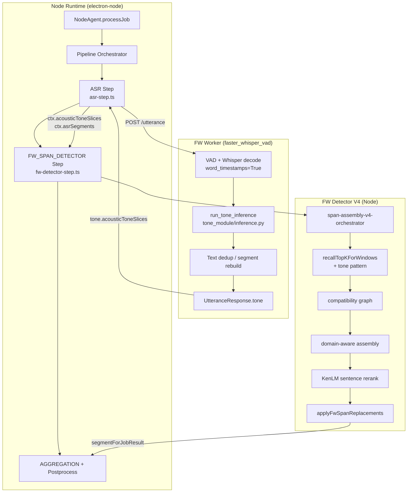

<!-- Documentation Hierarchy Metadata
Status: **HISTORICAL**
Superseded By: CURRENT SSOT + Acceptance Records
Archive Path: docs/archive/HISTORICAL/Tone_V2_Zero_Baseline_Rebuild_Readiness_Audit_2026_06_23.md
-->

> **HISTORICAL** — 非 CURRENT。阅读顺序：Framework Snapshot → `docs/current/` → Supporting → Acceptance → Archive。  
> Superseded By: CURRENT SSOT + Acceptance Records

# Tone V2 Zero Baseline Rebuild Readiness Audit

**审计日期**：2026-06-23  
**审计范围**：`electron_node/` 节点端（Node Runtime + FW Worker + Lexicon Recall）  
**事实来源（SSOT）**：当前仓库代码、接口、Runtime、数据结构  
**禁止项**：未参考已回滚的 Tone V2 文档 / 开发方案；未恢复历史实现；未生成开发方案  

---

## 审计摘要

| 项 | 结论 |
|----|------|
| 最终裁决 | **CONDITIONAL PASS** |
| 当前是否存在可重建基线 | 是 — **P0 声学 Tone 全链路仍接线并在 Runtime 中生效** |
| Tone V2 推荐 Extension Point | **FW Worker 内 `tone_module`（Posterior Provider）** + Node 侧既有 `acousticToneSlices` 消费契约 |
| Architecture Drift（Tone V2 历史） | **已清除** — 仓库内无 `tone-v2` 代码/文档/ Gateway-Benchmark harness 残留 |
| 主要缺口 | V2 模型/backend 契约、fail-closed 加载、字级时间戳、HTTP 不导出 PCM slice、KenLM 层 tone 参数未接线 |

---

# 一、Current Runtime Baseline

## 1.1 实际 Node Job Pipeline（FW 模式）

代码入口：

- Pipeline 模式：`electron_node/electron-node/main/src/pipeline/pipeline-mode-config.ts`
- FW 注入：`electron_node/electron-node/main/src/fw-detector/pipeline-mode-fw.ts`
- 步骤注册：`electron_node/electron-node/main/src/pipeline/pipeline-step-registry.ts`

当 `isFwDetectorEngineEnabled()` 为真时，典型语音转译链路为：

```text
NodeAgent.processJob
  ↓
Pipeline Orchestrator
  ↓
ASR Step                    (runAsrStep)
  ↓  HTTP POST /utterance → faster_whisper_vad
  ↓  [Worker 内: VAD → Whisper → run_tone_inference → dedup → response]
  ↓  ctx.asrResult.tone → ctx.acousticToneSlices（多 batch offset 合并）
  ↓
FW_SPAN_DETECTOR Step       (runFwDetectorStep → runFwDetectorOrchestrator)
  ↓  runFwDetectorV4Path
  ↓    runSpanAssemblyV4Orchestrator
  ↓      Recall      → recallTopKForWindows（含 tone pattern / penalty）
  ↓      Ranking     → buildCandidateCompatibilityGraph + resolveCompatibilityRelations
  ↓      Assembly    → runDomainAwareAssembly + coarse path / beam
  ↓    runFwSentenceRerankFromPrefilled（KenLM sentence rerank）
  ↓    applyFwSpanReplacements（Apply）
  ↓  ctx.segmentForJobResult
  ↓
AGGREGATION → PHONETIC_CORRECTION → … → TRANSLATION → TTS/YOURTTS
```

**与假设链路对比**：

| 假设阶段 | 代码中是否存在 | 实际位置 |
|----------|----------------|----------|
| FW | 部分 | ASR Worker（Whisper decode + word timestamps）|
| Tone | 是，但**不在独立 Pipeline Step** | `faster_whisper_vad/api_routes.py` 内嵌于 ASR |
| Recall | 是 | `recallTopKForWindows` → `recallSpanTopKV3` |
| Ranking | 是 | compatibility graph + tone penalty × candidateScore |
| Assembly | 是 | `runDomainAwareAssembly` + path/beam |
| KenLM | 是 | `runFwSentenceRerankFromPrefilled` |
| Apply | 是 | `applyFwSpanReplacements` |

Tone **不是** Node Pipeline 中 FW 与 Recall 之间的独立层；它是 **ASR Worker 内的 Posterior Provider**，经 HTTP `tone` 字段进入 Node，再在 FW Span Assembly 的 Recall 阶段消费。

## 1.2 Current Runtime Diagram



---

# 二、Tone Capability Audit

## 2.1 Tone Capability Matrix

| 能力 | 路径 / 符号 | 存在 | 说明 |
|------|-------------|------|------|
| tone module (Python) | `services/faster_whisper_vad/tone_module/` | ✅ | P0：`inference.py`, `classifier.py`, `mel.py`, `tone_types.py` |
| tone inference | `tone_module/inference.py::run_tone_inference` | ✅ | Mel + CNN → `acousticToneSlices` |
| tone classifier | `tone_module/classifier.py::ToneClassifier` | ✅ | 加载 `tone_cnn_p0.npz` 或 bootstrap 权重 |
| tone model | `tone_module/models/tone_cnn_p0.npz` | ✅ | P0 权重文件 |
| tone train | `tone_module/train_tone_cnn.py` | ✅ | 离线训练脚本 |
| tone API (HTTP) | `api_routes.py` → `UtteranceResponse.tone` | ✅ | FW 路径 dedup 前推理 |
| tone types (Python) | `tone_types.py`, `api_models.py` | ✅ | `UtteranceAcousticTonePayloadModel` |
| tone types (Node) | `task-router/types.ts` | ✅ | `UtteranceAcousticTonePayload`, `AcousticToneSlice`, `TonePosterior` |
| tone timestamp align | `fw-detector/tone-time-align.ts` | ✅ | word-level 对齐 + batch offset |
| tone match score | `fw-detector/tone-match-score.ts` | ✅ | Recall ranking penalty SSOT |
| tone recall glue | `span-assembly-shared/tone-recall.ts` | ✅ | `resolveTimestampToneState`, pattern extract |
| tone diagnostics | `span-assembly-shared/tone-diagnostics.ts` | ✅ | `CoarseAssemblyToneDiagnostics` |
| tone recall sort | `lexicon/tone-recall-sort.ts` | ✅ | SQL hit 排序 |
| tone pinyin | `lexicon/phonetic/tone-pinyin.ts` | ✅ | tone key 解析 |
| tone-first SQL tier | `lexicon-v2/tone-first-tier-collector.ts` | ✅ | `tone_exact` / plain fallback |
| tone service (独立微服务) | — | ❌ | 无独立 Tone Service；合并在 faster_whisper_vad |
| tone pipeline step (acoustic) | — | ❌ | Pipeline 无 acoustic tone step |
| tone feature loader (V2 registry) | — | ❌ | 无 `tone_module/v2/`, 无 backend registry |
| tone posterior (独立 HTTP API) | — | ❌ | posterior 嵌在 `acousticToneSlices[].tonePosterior` |
| TONEStage (YourTTS 音色克隆) | `agent/postprocess/tone-stage.ts` | ✅ | **`use_tone` TTS 后处理，与 acoustic tone 无关** |
| tone-step (YourTTS) | `pipeline/steps/tone-step.ts` | ✅ | 同上，非 FW acoustic tone |
| tone audit scripts | `tone_module/audit_*.py`, `tests/experiments/tone-*` | ✅ | 实验/验收脚本，**非 Runtime SSOT** |

---

# 三、FW Capability Audit

## 3.1 FW Capability Matrix

| 数据能力 | 实现状态 | 代码证据 | Tone V2 备注 |
|----------|----------|----------|--------------|
| **Word Timestamp** | ✅ 已实现 | `asr_worker_process.py` `word_timestamps: True`；`SegmentInfo.words[]` | Tone 推理依赖词级 start/end |
| **Segment Timestamp** | ✅ 已实现 | `SegmentInfo.start/end` | Node `buildWordTimeSpans` 使用 |
| **Character Timestamp** | ❌ 不存在 | 全仓库无 char-level TS 类型/字段 | 需新开发（若 V2 要求字级） |
| **Audio Slice (exported)** | ❌ HTTP 不导出 | `inference.py` 内部 `_slice_audio`，结果仅为 posterior | Worker 内存在，Node 不可见 |
| **PCM Segment (exported)** | ❌ 不存在 | ASR 请求含 base64 PCM；响应无 PCM slice 字段 | Node 仅在 ASR step 持有 batch PCM |
| **Raw Audio Offset** | ✅ 部分实现 | `asr-step.ts`：`segmentTimeOffsetsSec`, `segmentCharOffsets`, `offsetAcousticSlices` | 多 batch  utterance 级 offset 合并 |
| **processed_audio (internal)** | ✅ Worker 内 | `api_routes.py` → `run_tone_inference(processed_audio=…)` | 不跨 HTTP 边界 |
| **tone payload** | ✅ 已实现 | `UtteranceResponse.tone` | `acousticToneSlices` + metadata |
| **diagnostics.toneModule** | ✅ 已实现 | `p0_diagnostics["toneModule"]` | inference_ms, sliceCount 等 |

---

# 四、Recall Integration Audit

## 4.1 Recall Integration Matrix

| 输入 / 接口 | 存在 | 接线 | Runtime 参与 | 说明 |
|-------------|------|------|--------------|------|
| `acousticToneSlices` | ✅ | ✅ | ✅ | `asr-step` → `ctx.acousticToneSlices` → `recallTopKForWindows` |
| `wordTimeSpans` | ✅ | ✅ | ✅ | `buildWordTimeSpans(asrSegments, offsets…)` |
| `acousticTonePattern` | ✅ | ✅ | ✅ | 传入 `recallSpanTopKV3` SQL tier |
| `toneTimestampOnlyEnabled` | ✅ | ✅ | ✅ | 默认 `true`（`fw-config.ts`） |
| Tone 接口（独立 Recall API） | ❌ | — | — | 无独立接口；pattern 为 recall 参数 |
| Posterior 接口（独立） | ❌ | — | — | posterior 在 slice 内，Recall 用 argmax pattern |
| Timestamp 接口（独立） | ❌ | — | — | 复用 ASR `SegmentInfo.words` |
| `tonePayload`（orchestrator 参数） | ✅ 类型存在 | ❌ 未使用 | ❌ | 仅 `SpanAssemblyV4OrchestratorInput` 声明，函数体未读 |
| `UtteranceAcousticTonePayload`（KenLM rerank） | ✅ 类型存在 | ❌ 未使用 | ❌ | `runFwSentenceRerankFromPrefilled` 接受但未引用 |
| Lexicon `tone_exact` SQL | ✅ | ✅ | ✅ | `tone-first-tier-collector.ts` |
| `computeToneScoreResult` | ✅ | ✅ | ✅ | Recall hit `tonePenalty` × `candidateScore` |

Recall **真正需要的输入**（当前代码）：

1. `ctx.acousticToneSlices`（来自 ASR HTTP `tone`）
2. `ctx.asrSegments` + offset 元数据（词级时间对齐）
3. Lexicon `tonePinyinKey` / `tone_exact` tier
4. 配置 `toneTimestampOnlyEnabled`

---

# 五、Runtime Extension Audit

## 5.1 推荐 Extension Point

```text
FW Worker (faster_whisper_vad)
  ↓  [Extension Point A — 推荐]
Tone Module (tone_module/*)  ← Posterior Provider 替换/扩展
  ↓  HTTP: UtteranceAcousticTonePayload（契约不变或版本化）
Node ASR Step
  ↓  ctx.acousticToneSlices（Extension Point B — 可选薄层）
FW Span Assembly V4 / Recall
```

**不推荐**：

```text
FW → Tone → Recall   （作为 Node 第二条 Pipeline / Shadow Pipeline）
```

**原因（基于当前代码）**：

1. P0 已将 Tone 定义为 **ASR Worker 内 Posterior Provider**（`api_routes.py` dedup 前推理，保证 word timestamp 与 `processed_audio` 对齐）。
2. Node 侧 Recall 已围绕 `acousticToneSlices` + `wordTimeSpans` 完整接线；移动推理到 Node 需重复 PCM/对齐逻辑。
3. Pipeline 注册表无 acoustic tone step；新增独立 Runtime 分支会构成 Architecture Drift。
4. `docs/tone-module/ARCHITECTURE.md`（P0 冻结文档，非 Tone V2 方案）与代码一致：Tone 为 Ranking Signal，非 Apply 层。

**次要扩展点（仅当契约扩展时）**：

- `task-router/types.ts` — payload 版本/字段
- `fw-detector/tone-time-align.ts` — 新对齐粒度（如字级）
- `lexicon-v2/tone-first-tier-collector.ts` — Recall SQL 策略

---

# 六、Data Contract Audit

## 6.1 Data Contract Matrix

| 结构 | 位置 | 可直接复用 | 必须重新设计 | 说明 |
|------|------|------------|--------------|------|
| `TonePosterior` `{t1..t5}` | Python + Node | ✅ | — | 5 类 softmax，Recall argmax 使用 |
| `AcousticToneSlice` | Python + Node | ✅ | 视 V2 模型输出 | start/end + posterior + confidence |
| `UtteranceAcousticTonePayload` | Python + Node | ✅ | 视 V2 元数据需求 | toneEnabled, skippedReason, sliceCount |
| `ASRResult.tone` | Node task-router | ✅ | — | ASR → FW 桥接 |
| `JobContext.acousticToneSlices` | job-context.ts | ✅ | — | 多 batch offset 合并 SSOT |
| `CoarseAssemblyToneDiagnostics` | span-assembly-shared/types | ✅ | 可扩展计数器 | V4 trace 已集成 |
| `ToneScoreResult` | tone-match-score.ts | ✅ | penalty 常量或需冻结 | match/mismatch/no_pattern |
| `SegmentInfo.words` | ASR | ✅ | 字级 TS 需扩展 | 当前词级 |
| V4 trace (`v4-diagnostics-*`) | span-assembly-v4 | ✅ | Tone 专用 trace 字段可选增 | 不强制新 System Layer |
| KenLM rerank diagnostics | fw-detector/types | ✅ | tone 字段未接 | 预留未用 |
| V2 backend manifest / registry | — | ❌ | ✅ 需新设计 | 当前不存在 |
| Character-level alignment | — | ❌ | ✅ 需新设计 | 不存在 |
| Exported PCM / audio slice HTTP | — | ❌ | 视 V2 是否 Node 侧推理 | 当前无 |

---

# 七、Interface Contract Audit

## 7.1 Interface Matrix

| 接口 | 类型 | Tone V2 可复用 | 必须新增 |
|------|------|----------------|----------|
| `run_tone_inference(...)` | Python 函数 | ✅ 签名可扩展 | V2 backend 选择 / fail-closed 策略 |
| `ToneClassifier` | Python 类 | ⚠️ 需 MODIFY | 模型加载契约（当前 bootstrap fallback） |
| `POST /utterance` response.tone | HTTP | ✅ | 字段版本化（若 breaking） |
| `executeFasterWhisperASR` → `ASRResult.tone` | Node | ✅ | — |
| `normalizeAcousticSlices` / `offsetAcousticSlices` | Node | ✅ | 新粒度对齐函数（若字级） |
| `buildWordTimeSpans` | Node | ✅ | char 变体（若需要） |
| `extractAcousticTonePatternForRecall` | Node | ✅ | — |
| `computeToneScoreResult` | Node | ✅ | — |
| `recallSpanTopKV3({ acousticTonePattern })` | Lexicon | ✅ | — |
| `collectTierCandidates` (tone_exact) | Lexicon | ✅ | — |
| `runSpanAssemblyV4Orchestrator` | Node | ✅ | 清理未用 `tonePayload` 参数 |
| `runFwSentenceRerankFromPrefilled({ tone })` | Node | ⚠️ 签名存在 | 实现或删除 tone 参数 |
| 独立 Tone gRPC/HTTP 服务 | — | ❌ | 仅当刻意拆 Worker |
| V2 `backend_registry` | — | ❌ | 若多模型/backend |

---

# 八、Diagnostics Audit

## 8.1 可直接复用

| 类别 | 位置 | 内容 |
|------|------|------|
| Worker diagnostics | `api_routes.py` `p0_diagnostics.toneModule` | inference_ms, sliceCount, skippedReason |
| FW V4 tone diagnostics | `CoarseAssemblyToneDiagnostics` | windowTimeHit/Miss, toneExactHit, recallToneCompatible |
| V4 trace | `v4-diagnostics-trace.ts` | recall window / candidate trace（traceCaseId 门控） |
| Recall V2 diagnostics | `recall-v2-diagnostics.ts` | SQL query stats（非 tone 专用） |
| FW result | `FwDetectorResult.spanAssemblyV4.tone` | job result 可观测 |
| Config snapshot | `fw-detector-orchestrator` | `toneTimestampOnlyEnabled` |
| Python audit | `tone_module/audit_runtime_acceptance.py` | 链路验收（实验级） |
| Node experiments | `tests/experiments/tone-module-*`, `d001-timestamp-tone-probe.mjs` | 离线 probe |

## 8.2 需要补充（Gap，非方案）

| 缺口 | 说明 |
|------|------|
| V2 模型加载/版本 diagnostics | 当前仅 log + bootstrap；无 structured backend id |
| fail-closed 可观测性 | bootstrap 成功时 `tone_enabled=true`，难区分真实模型 |
| KenLM × tone 联合 diagnostics | `tone` 参数未接入 rerank |
| 字级对齐 miss 指标 | 无 char TS，无对应计数 |
| 端到端 V2 acceptance harness | `scripts/tone-v2/` 已回滚，当前无 SSOT harness |

**约束**：不得新增 System Layer；应扩展现有 `CoarseAssemblyToneDiagnostics` / `p0_diagnostics.toneModule` / V4 trace。

---

# 九、Architecture Boundary Audit

## 9.1 Boundary Matrix

| 模块 / 层 | 归属 | Tone V2 应处位置 | 不得扩展 |
|-----------|------|-------------------|----------|
| `tone_module` (Python) | Node 托管 FW Worker | ✅ Posterior Provider | — |
| ASR Step / Task Router | Node Runtime | ✅ 消费 HTTP tone | — |
| FW Span Assembly V4 | Node Runtime | ✅ Recall ranking 消费 | — |
| Lexicon Recall V2/V3 | Node Runtime | ✅ tone_exact SQL | — |
| KenLM rerank | Node Runtime | ⚠️ 可选扩展（当前未接 tone） | — |
| Apply (`applyFwSpanReplacements`) | Node Runtime | ❌ 不应直接改字 | — |
| Aggregation / Semantic Repair | Node Runtime | ❌ 非 tone 职责 | — |
| TONEStage / YourTTS | Node Runtime (TTS 后) | ❌ 不同域（音色克隆） | 勿与 acoustic tone 合并 |
| Gateway | Central | ❌ | **不得**为 Tone V2 扩展 |
| Scheduler | Central | ❌ | **不得**为 Tone V2 扩展 |
| Web / Cluster / Dispatcher | — | ❌ | **不得**为 Tone V2 扩展 |

**结论**：Tone V2（acoustic）**仍属于 Node Runtime 范畴**，具体在 **FW Worker + FW Detector Recall 子系统**内；不是 Gateway/Scheduler 职责。

---

# 十、Architecture Drift Audit

## 10.1 Tone V2 历史漂移扫描（当前代码）

| 漂移类型 | 扫描结果 | 位置 |
|----------|----------|------|
| `scripts/tone-v2/**` | ❌ 不存在 | 已回滚 |
| `docs/tone-v2/**`（旧方案） | ❌ 不存在（本审计文档除外） | 已回滚 |
| `tone_module/v2/**` | ❌ 不存在 | 已回滚 |
| Gateway/Scheduler Tone Benchmark | ❌ 不存在 | — |
| npm `tone-v2:*` scripts | ❌ 未检出 | — |
| Node Integration Benchmark contract | ❌ 不存在 | — |
| Offline manifest exit-2 harness | ❌ 不存在 | — |
| Shadow Pipeline（Tone 专用） | ❌ 不存在 | — |
| `shadowBeamSpanSets` | ✅ 存在 | FW V4 内部 beam 诊断，**非 Tone V2 shadow** |
| `tests/experiments/tone-*` | ✅ 存在 | P0/P1 实验，非 Runtime |
| `tone_module/audit_*.py` | ✅ 存在 | Worker 侧验收脚本 |

## 10.2 Required Repair（漂移相关）

| 项 | 动作 | 理由 |
|----|------|------|
| P0 Runtime 主链 | **KEEP** | 仍接线且为唯一 SSOT |
| `tests/experiments/tone-*` | **KEEP** | 实验资产，不进入 Runtime |
| `shadowBeamSpanSets` | **KEEP** | FW V4 诊断，与 Tone V2 无关 |
| 未使用的 `tonePayload` / `tone` 参数 | **MODIFY** | 死参数，易误导 V2 开发 |
| Gateway/Scheduler Tone harness | **DELETE** | 已不存在，保持清零 |
| V2 backend registry（历史） | **DELETE** | 已回滚，重建时从零定义 |

**RESTORE**（仅允许已冻结且当前缺失的 Runtime 能力）：

- 无 — 当前 P0 Runtime 能力**未缺失**，无需 RESTORE 历史 V2 漂移代码。

---

# 十一、Development Readiness

## 11.1 Minimal Entry Point

**最小开发入口（基于当前代码，非历史方案）**：

```text
1. electron_node/services/faster_whisper_vad/tone_module/
     inference.py + classifier.py
   ↳ 建立 V2 模型加载与推理输出（仍输出 UtteranceAcousticTonePayload 形状）

2. electron_node/services/faster_whisper_vad/api_routes.py
     run_tone_inference 调用点（dedup 前，word timestamps 对齐）

3. electron_node/electron-node/main/src/task-router/types.ts
     UtteranceAcousticTonePayload / AcousticToneSlice（契约 SSOT）

4. electron_node/electron-node/main/src/pipeline/steps/asr-step.ts
     normalizeAcousticSlices + offsetAcousticSlices → ctx.acousticToneSlices

5. electron_node/electron-node/main/src/fw-detector/span-assembly-v4/recall-topk-for-windows.ts
     验证 V2 posterior 仍驱动 recallTopK + tonePenalty
```

**必须建立的接口**：`run_tone_inference` → HTTP `tone` → `ctx.acousticToneSlices` → `recallTopKForWindows`。

**依赖能力**：

- FW `word_timestamps=True`
- `toneTimestampOnlyEnabled`（默认 true）
- Lexicon `tonePinyinKey` + `tone_exact` tier
- `tone-match-score.ts` penalty 逻辑

**验证方式（当前存在）**：`tests/experiments/d001-timestamp-tone-probe.mjs`、`tone_module/audit_runtime_acceptance.py`（实验级，非 CI SSOT）。

---

# 十二、Gap Analysis

| 能力 | 分类 | 说明 |
|------|------|------|
| P0 全链路接线 | **Already Exists** | Worker 推理 → Node recall penalty |
| `UtteranceAcousticTonePayload` 契约 | **Already Exists** | Python/Node 对齐 |
| Word-level 对齐 | **Already Exists** | `tone-time-align.ts` |
| tone_exact Recall SQL | **Already Exists** | `tone-first-tier-collector.ts` |
| V4 tone diagnostics | **Already Exists** | job result + trace |
| 生产级 V2 模型 + 加载 | **Need New Module** | 当前 P0 npz + bootstrap |
| fail-closed 模型加载 | **Need Extension** | bootstrap 掩盖 load failure |
| V2 backend registry / manifest | **Need New Module** | 无 v2 目录 |
| Character timestamp | **Need New Module** | 全仓库不存在 |
| HTTP 导出 audio slice | **Need Extension** | 仅 Worker 内部 |
| KenLM × tone 联合 rerank | **Need Extension** | 参数未实现 |
| 未使用 orchestrator/rerank tone 参数 | **Need Refactor** | 死代码清理 |
| 端到端 V2 benchmark harness | **Need New Module** | tone-v2 scripts 已删 |
| 字级 recall 对齐 | **Need Extension** | 依赖 char TS |

---

# 十三、Ownership Matrix

| 模块 | 归属 | 职责 |
|------|------|------|
| `faster_whisper_vad` (ASR+VAD) | Node 托管 Worker / **FW** | 解码、词级 TS、VAD segment |
| `tone_module/*` | **Tone** (Worker 内) | 声学 posterior 推理 |
| `asr-step` / Task Router | **Node Runtime** | HTTP 调用、slice offset 合并 |
| `fw-detector/*` (v4 path) | **Node Runtime / FW** | Span assembly orchestration |
| `recallTopKForWindows` + lexicon recall | **Recall** | 候选检索 + tone pattern SQL |
| `tone-match-score`, `tone-recall` | **Recall** (ranking signal) | penalty 计算 |
| `runFwSentenceRerankFromPrefilled` | **KenLM** | 句级 rerank / apply gate |
| `applyFwSpanReplacements` | **Node Runtime / Apply** | 文本替换 |
| `TONEStage` / YourTTS | **Node Runtime / TTS** | 音色克隆（非 acoustic tone） |
| Gateway / Scheduler | **未来系统层（集群）** | Job 分发；**不含 acoustic tone** |

---

# 十四、Exists vs Effective Matrix

| 能力 | 存在 | 已接线 | 真正参与 Runtime | 可复用 |
|------|------|--------|------------------|--------|
| `run_tone_inference` (Python) | ✅ | ✅ | ✅ (FW 中文路径) | ✅ |
| `ToneClassifier` P0 npz | ✅ | ✅ | ✅ | ⚠️ 需 V2 权重策略 |
| bootstrap fallback weights | ✅ | ✅ | ✅ (无 npz 时) | ❌ V2 应 fail-closed |
| HTTP `response.tone` | ✅ | ✅ | ✅ | ✅ |
| `ASRResult.tone` | ✅ | ✅ | ✅ | ✅ |
| `ctx.acousticToneSlices` | ✅ | ✅ | ✅ | ✅ |
| `buildWordTimeSpans` | ✅ | ✅ | ✅ | ✅ |
| `resolveTimestampToneState` | ✅ | ✅ | ✅ (gate by config) | ✅ |
| `extractAcousticTonePatternForRecall` | ✅ | ✅ | ✅ when toneActive | ✅ |
| `computeToneScoreResult` | ✅ | ✅ | ✅ | ✅ |
| `tone_exact` SQL tier | ✅ | ✅ | ✅ when pattern present | ✅ |
| `tonePayload` orchestrator 参数 | ✅ | ❌ | ❌ | ❌ 死参数 |
| `tone` KenLM rerank 参数 | ✅ | ❌ | ❌ | ❌ |
| `TONEStage` (YourTTS) | ✅ | ✅ | ✅ (use_tone jobs) | ❌ 非 acoustic |
| V2 backend registry | ❌ | ❌ | ❌ | ❌ |
| Gateway Tone benchmark | ❌ | ❌ | ❌ | — |

---

# 十五、Required Repair Matrix

| 对象 | 动作 | 说明 |
|------|------|------|
| P0 `tone_module` + Node recall 链 | **KEEP** | Zero Baseline SSOT |
| `UtteranceAcousticTonePayload` 契约 | **KEEP** | 跨 Python/Node |
| `toneTimestampOnlyEnabled` 默认 true | **KEEP** | freeze-contract.test 覆盖 |
| `docs/tone-module/*` (P0) | **KEEP** | 非 Tone V2 方案，描述当前 P0 |
| `tonePayload` unused param | **MODIFY** | 删除或接入 `acousticSlices` 源 |
| `runFwSentenceRerankFromPrefilled.tone` | **MODIFY** | 实现或移除 |
| `ToneClassifier` bootstrap | **MODIFY** | V2 加载/fail-closed |
| Character timestamp | **Need New** | 非 RESTORE |
| V2 registry / harness | **Need New** | 非 RESTORE 历史 drift |
| 已回滚 `tone-v2` scripts/docs | **DELETE（保持）** | 勿 RESTORE |
| Gateway/Scheduler tone harness | **DELETE（保持）** | 已清除 |

**RESTORE**：无（当前 Runtime 无已冻结但缺失的能力）。

---

# 十六、Final Verdict

## 16.1 必答六项

| # | 问题 | 答案 |
|---|------|------|
| 1 | 是否具备重新开发 Tone V2 的基础？ | **是（CONDITIONAL）** — P0 端到端仍运行；缺 V2 模型/契约/harness |
| 2 | Tone V2 应建立在哪个 Extension Point？ | **FW Worker `tone_module`（Posterior Provider）**；Node 继续消费 `acousticToneSlices` |
| 3 | 哪些接口可直接复用？ | `run_tone_inference`、HTTP `tone`、`UtteranceAcousticTonePayload`、`asr-step` offset、`recallTopKForWindows`、`computeToneScoreResult`、`tone_exact` SQL |
| 4 | 哪些模块必须重新开发？ | V2 模型/backend 加载、fail-closed 策略、（可选）字级对齐、V2 验收 harness；非 P0 主链重写 |
| 5 | 是否仍存在 Architecture Drift？ | **Tone V2 特定漂移：否**；存在少量 **死参数** 与 **bootstrap 语义** 需 MODIFY |
| 6 | 是否可以开始新的 Tone V2？ | **CONDITIONAL PASS** — 可基于当前 P0 契约开新基线；先冻结 V2 模型输出与加载语义 |

## 16.2 汇总 Matrix

### Runtime Matrix

| 阶段 | 组件 | 状态 |
|------|------|------|
| ASR+Tone | `faster_whisper_vad` | ✅ 内嵌 Tone |
| FW Detect | `fw-detector-v4-path` | ✅ |
| Recall | `recallTopKForWindows` | ✅ + tone |
| Ranking | compatibility graph + tonePenalty | ✅ |
| Assembly | domain-aware + beam | ✅ |
| KenLM | `runFwSentenceRerankFromPrefilled` | ✅（tone 未接） |
| Apply | `applyFwSpanReplacements` | ✅ |

### Capability Matrix

见 §二、§三。

### Interface Matrix

见 §七。

### Data Contract Matrix

见 §六。

### Ownership Matrix

见 §十三。

### Gap Matrix

见 §十二。

### Development Readiness Matrix

| 项 | 状态 |
|----|------|
| Runtime 主链 | ✅ Ready |
| 数据契约 | ✅ Ready |
| Recall 消费 | ✅ Ready |
| V2 模型 | ❌ Not Ready |
| V2 加载/fail-closed | ❌ Not Ready |
| Char TS | ❌ Not Ready |
| E2E harness | ❌ Not Ready |
| 死参数清理 | ⚠️ Recommended |

### Required Repair Matrix

见 §十五。

---

## 最终裁决：**CONDITIONAL PASS**

**通过条件**：

1. 新 Tone V2 以 **当前 P0 Runtime 契约** 为零基线，不恢复已回滚的 Gateway/Benchmark/Shadow 结构。  
2. 在 `tone_module` 层明确 V2 模型加载与 fail-closed 语义后再宣称 Production Ready。  
3. 清理 `tonePayload` / KenLM `tone` 死参数，避免二次架构漂移。  

**失败条件（若违反则降为 FAIL）**：

- 在 Gateway/Scheduler 重建 Tone 链路  
- 新增第二条 Node Shadow Pipeline  
- 未验证 `acousticToneSlices` 接线即改 Recall 契约  

---

*本报告仅反映 2026-06-23 仓库快照；审计方法：只读代码检索 + 关键路径文件审阅。*
