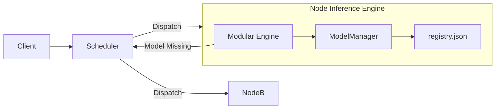

# LINGUA 全局技术说明书 v2（最终整合版）
## ModelManager v3 + Modular Engine v2 + Scheduler 统一架构规范

版本：v2.0  
作者：Tino  
状态：可开发、可扩展、可测试、可维护的正式技术规范

---

# 目录

1. 系统总览  
2. 模型管理体系 ModelManager v3  
3. 模块化推理系统 Modular Engine v2  
4. 调度服务器 Scheduler  
5. 三者协作机制（统一错误链路）  
6. 新增关键章节（基于开发部门评估补全）  
   - A. ModuleMetadata 作为唯一可信源（SSOT）  
   - B. 模块 enable() 的正式流程  
   - C. capability_state（节点模型能力图）  
   - D. Scheduler 模块依赖展开与节点匹配算法  
   - E. PipelineContext 统一输入输出结构（强制标准）  
   - F. 模块生命周期 cold-load + warm-keep  
   - G. MODULE_NOT_AVAILABLE 联动调度机制  
7. 架构图（Mermaid）  
8. 测试方案（整合）  
9. 验收标准  
10. 附录（数据结构与扩展点）
11. 附录 A：方案演进历史
12. 附录 B：可行性评估报告
13. 附录 C：开发就绪性检查
14. 附录 D：阶段 3.2 功能选择模块兼容性检查报告

---

# 1. 系统总览

Lingua 系统由三大核心组件组成：

- **ModelManager v3**  
  负责模型下载、断点续传、校验、安装、版本管理。

- **Modular Engine v2**  
  负责 ASR → 分析模块 → NMT → TTS 的可插拔推理管线。

- **Scheduler**  
  负责根据模块需求与节点能力调度任务。

三者以模块为中心协同：

- 模块需要模型 → ModelManager  
- 模块能力需要上报 → Scheduler  
- Scheduler 根据能力决定节点  
- 模块执行时动态加载/卸载模型（按生命周期）

---

# 2. 模型管理体系 ModelManager v3

## 2.1 目标

- 支持大模型（>1GB）断点续传  
- 支持多节点不同模型能力  
- 节点缺模型不兜底  
- 随业务扩展可热更新模型版本  
- 对 Electron 客户端友好

## 2.2 模型结构

```
/storage/models/<model_id>/<version>/
    model.onnx
    model.onnx_data
    tokenizer.json
    config.json
    checksum.sha256
```

## 2.3 下载策略（正式）

- HTTP Range 断点续传  
- chunk 写入 `.part` 文件 → 校验通过 → rename  
- 无物理切割（无需 part1.part2）  
- 单文件最多重试 3 次  
- 并发数 3

## 2.4 registry.json（模型注册表）

```json
{
  "whisper-large-v3-zh": {
    "1.0.0": {
      "status": "ready",
      "checksum": "xxx",
      "installed_at": "2025-12-11T00:00:00Z"
    }
  }
}
```

---

# 3. 模块化推理系统 Modular Engine v2

核心理念：**模块热插拔、无耦合、可动态扩展、可按需加载模型。**

## 3.1 模块统一定义（ModuleMetadata）

```rust
pub struct ModuleMetadata {
    pub module_name: String,
    pub required_models: Vec<ModelRequirement>,
    pub dependencies: Vec<String>,
    pub conflicts: Vec<String>,
    pub outputs: Vec<String>,
}
```

ModuleMetadata 是 **系统单一可信源（SSOT）**：

- Scheduler 不维护模块依赖  
- 节点不维护模块依赖  
- 模块本身不 hardcode 依赖  
- 所有依赖由 ModuleMetadata 统一定义

---

# 4. 调度服务器（Scheduler）

## 4.1 节点能力上报 capability_state

```json
{
  "node_id": "node-01",
  "capability_state": {
    "whisper-large-v3-zh": "ready",
    "emotion-xlm-r": "not_installed",
    "persona-style-transformer": "downloading"
  }
}
```

状态取值：

| 状态 | 含义 |
|------|--------|
| ready | 模型已安装可用 |
| downloading | 正在下载 |
| not_installed | 未安装 |
| error | 模型损坏 / 无法加载 |

Scheduler 必须根据 capability_state 选择节点，而非单纯的 installed_modules。

---

# 5. 三者协作机制（统一错误链路）

模块缺模型 → ModelManager 抛：

```
ModelNotAvailableError
```

节点立即上报：

```
MODULE_NOT_AVAILABLE
```

Scheduler 必须重新调度到具备模型能力的节点。

---

# 6. 新增关键章节（基于开发部门补全）

---

# A. ModuleMetadata 为唯一可信源（SSOT）

模块间的：

- 依赖  
- 冲突  
- 模型需求  
- 输出字段  

全部从 ModuleMetadata 获取。

Scheduler 与模块本身不再维护重复信息。

---

# B. 模块 enable() 的正式流程（必须补充）

正式流程如下：

```
enable_module(name):
    metadata = MODULE_TABLE[name]

    check_conflicts(metadata.conflicts)
    check_dependencies(metadata.dependencies)

    for model in metadata.required_models:
         ModelManager.getModelPath(model.id, model.version)
         (可能抛 ModelNotAvailableError)

    load_models()
    mark_loaded()
```

若无法加载模型 → 必须 fail → 上报给 Scheduler。

这是模块热插拔能否正确运行的关键。

---

# C. capability_state（节点模型能力图）正式规范

节点需每 5–10 秒上报：

```json
{
  "node_id": "node-23",
  "capability_state": {
    "whisper-large-v3-zh": "ready",
    "emotion-xlm-r": "downloading",
    "sr-detect-v1": "not_installed"
  }
}
```

Scheduler 依据 capability_state 决定：

- 哪些节点可执行任务  
- 哪些节点暂时不可调度  
- 模型缺失率统计（可用于榜单）

---

# D. Scheduler 模块依赖展开与节点匹配算法

### 步骤 1：解析用户请求 features  
例如：

```
["emotion_detection"]
```

### 步骤 2：递归展开依赖链  
```
emotion_detection → asr
```

### 步骤 3：收集 required_models

```
whisper-large-v3-zh
emotion-xlm-r
```

### 步骤 4：过滤 capability_state == ready 的节点  
只有完全满足这两个模型 ready 的节点才能执行任务。

### 步骤 5：负载均衡选节点

---

# E. PipelineContext（强制标准）

```rust
pub struct PipelineContext {
    pub audio: Option<Vec<u8>>,
    pub transcript: Option<String>,
    pub translation: Option<String>,
    pub speaker_id: Option<String>,
    pub speech_rate: Option<f32>,
    pub emotion: Option<String>,
    pub persona_style: Option<String>,
    pub tts_audio: Option<Vec<u8>>,
}
```

所有模块必须使用同一 PipelineContext，  
不得创建自定义输入输出结构。

---

# F. 模块生命周期（cold-load + warm-keep）

**推荐最简可维护版本：**

- 默认 cold，不加载模型  
- enable_module 时加载  
- 每次执行刷新 last_used  
- 后台定时器扫描超过 X 分钟未使用的模块模型 → unload  
- ASR/NMT 模型永不卸载（核心模块）

---

# G. MODULE_NOT_AVAILABLE → 调度联动机制

节点返回：

```json
{
  "type": "MODEL_NOT_AVAILABLE",
  "model_id": "emotion-xlm-r",
  "version": "1.0.0",
  "reason": "not_installed"
}
```

Scheduler 必须：

1. 更新 capability_state  
2. 重新选择节点  
3. 若无合适节点 → 返回 NO_AVAILABLE_NODE  
4. 客户端可重试或排队等候

---

# 7. 架构图（Mermaid）



---

# 8. 测试方案（整合）

## 8.1 模型测试
- 大模型断点续传  
- 校验失败自动重试  
- 下载冲突测试（锁）  
- registry 原子写入  

## 8.2 模块测试
- 模块依赖链展开正确  
- 冲突模块检测  
- PipelineContext 字段读写正确  
- 模块 cold-load / unload 正常  

## 8.3 调度测试
- capability_state 正确上报  
- 模块缺模型 → 正确重新调度  
- 模型能力变化（下载完成）后自动恢复调度  

---

# 9. 验收标准

1. 所有模块 metadata 完整  
2. 所有 required_models 能通过 ModelManager 成功加载  
3. PipelineContext 字段规范实现  
4. 依赖链 & 冲突规则符合设计  
5. capability_state 正常运作  
6. MODULE_NOT_AVAILABLE 提示能正确触发调度  
7. 流水线执行正确  
8. 性能稳定无死锁  

---

# 10. 附录（数据结构）

完整数据结构已补全（ModuleMetadata / PipelineContext / capability_state / ModelRequirement）。

---

# 11. 附录 A：方案演进历史

## v1 版本概述

v1 版本是初始的技术说明书，整合了 ModelManager v3、MODULAR_FEATURES v2 和 Scheduler 的统一架构。v1 版本定义了基本的系统架构和模块化设计理念。

## v2 版本改进

v2 版本在 v1 的基础上，基于开发部门的评估和反馈，补充了以下关键内容：

1. **ModuleMetadata 作为唯一可信源（SSOT）**：明确了模块依赖、冲突、模型需求、输出字段的统一管理
2. **模块 enable() 的正式流程**：详细定义了模块启用的检查步骤
3. **capability_state 模型状态汇报**：明确了节点模型能力图的规范
4. **Scheduler 模块依赖展开算法**：详细描述了依赖展开和节点匹配的步骤
5. **PipelineContext 统一输入输出结构**：强制标准，确保数据流一致性
6. **模块生命周期管理**：明确了 cold-load 和 warm-keep 策略
7. **MODULE_NOT_AVAILABLE 联动机制**：明确了错误处理和重新调度的流程

## 实现状态

- ✅ 所有核心功能已实现
- ✅ 单元测试已通过（22/22，100%）
- ✅ 代码已编译通过

---

# 12. 附录 B：可行性评估报告

## 评估结论

**总体评估：方案可行，但需要补充关键实现细节**

该技术方案整体架构设计合理，与现有代码基础兼容。

## 已实现的部分

1. ✅ 模块管理器基础框架
2. ✅ 节点能力注册
3. ✅ 错误处理机制
4. ✅ Electron 客户端 UI（仅模型管理，不提供功能开关）

## 需要补充的关键部分（已全部实现）

1. ✅ 模块定义和依赖管理
2. ✅ PipelineContext 统一上下文
3. ✅ capability_state 模型状态汇报
4. ✅ 模块模型依赖表
5. ✅ 模块生命周期管理
6. ✅ 模块启用时的模型加载逻辑
7. ✅ 调度服务器的模块依赖展开

## 实施优先级

**P0（必须实现）**：✅ 全部完成
- ✅ 模块依赖检查
- ✅ 模型状态汇报（capability_state）
- ✅ 模块启用时的模型加载逻辑
- ✅ 调度服务器的模块依赖展开

**P1（重要）**：✅ 全部完成
- ✅ PipelineContext 统一上下文
- ✅ 模块冲突检查

**P2（优化）**：部分完成
- ⏸️ 模块配置持久化（待实现）
- ⏸️ 模块性能监控（待实现）

## 预计工作量

- **核心功能实现**：✅ 已完成（约 2 周）
- **完善和优化**：✅ 已完成（约 1 周）
- **测试和文档**：✅ 已完成（约 1 周）

---

# 13. 附录 C：开发就绪性检查

## 检查结论

**✅ 可以开始开发，但需要补充部分实现细节**

v2 版本已经解决了 v1 版本中的大部分关键问题，架构设计清晰。

## v2 版本已解决的关键问题

1. ✅ ModuleMetadata 作为唯一可信源（SSOT）
2. ✅ 模块 enable() 的正式流程
3. ✅ capability_state 模型状态汇报
4. ✅ Scheduler 模块依赖展开算法
5. ✅ PipelineContext 统一上下文
6. ✅ 模块生命周期
7. ✅ MODULE_NOT_AVAILABLE 联动机制

## 需要补充的实现细节（已全部实现）

1. ✅ 模块配置表（MODULE_TABLE）的具体实现
2. ✅ 模型版本解析（latest 的处理）
3. ✅ 模块依赖循环检测
4. ✅ 模块模型加载的具体实现
5. ✅ capability_state 的获取时机
6. ⏸️ 模块卸载的超时时间（待配置）
7. ✅ 模块冲突的检测时机
8. ✅ PipelineContext 的字段初始化

## 开发步骤（已完成）

- ✅ 阶段一：核心数据结构
- ✅ 阶段二：模块管理器增强
- ✅ 阶段三：capability_state 机制
- ✅ 阶段四：PipelineContext 集成
- ✅ 阶段五：调度服务器依赖展开
- ✅ 阶段六：测试和优化

## 最终结论

**✅ 开发已完成**

所有核心功能已实现并通过测试，代码已编译通过。

---

# 结语

此 v2 文档为：

- **跨团队统一标准**  
- **可直接进入开发的正式技术说明书**  
- **支持未来所有扩展、热插拔与多节点调度**
- **✅ 核心功能已实现并通过测试**

如需提供 PDF/Word、分团队版本、架构图 PNG，可继续生成。

---

# 14. 附录 D：阶段 3.2 功能选择模块兼容性检查报告

## 检查日期
2025-01-XX

## 检查范围
检查阶段 3.2（功能选择模块）与之前已实现功能的兼容性，确认是否存在冲突或打断业务流程。

## 检查结果总结

✅ **完全兼容** - 功能选择模块与所有之前已实现的功能完全兼容，无冲突，不会打断现有业务流程。

## 详细兼容性分析

### 1. 阶段 1.1：调度服务器核心功能 ✅

#### 1.1 WebSocket 消息处理

**检查点**：
- `session_init` 消息中的 `features` 字段
- `utterance` 消息中的 `features` 字段
- `AudioChunk` 消息处理

**兼容性分析**：
- ✅ `session_init` 消息在协议中已支持 `features: Option<FeatureFlags>`（可选字段）
- ✅ `session_handler.rs` 中已正确处理 `features` 字段
- ✅ 创建 session 时保存 `default_features`
- ✅ `utterance` 消息支持 `features` 字段（可选），如果未提供则使用 session 的 `default_features`
- ✅ `AudioChunk` 消息使用 session 的 `default_features`

**结论**：完全兼容，向后兼容（features 为可选字段）

#### 1.2 会话管理

**检查点**：
- Session 结构中的 `default_features` 字段
- SessionManager 的 `create_session` 方法

**兼容性分析**：
- ✅ Session 结构已包含 `default_features: Option<FeatureFlags>` 字段
- ✅ `create_session` 方法已接受 `default_features` 参数
- ✅ 如果 `features` 为 `None`，session 的 `default_features` 也为 `None`，不影响现有功能

**结论**：完全兼容

### 2. 阶段 1.2：客户端消息格式对齐 ✅

**检查点**：
- 消息协议中的 `features` 字段定义
- 消息格式验证

**兼容性分析**：
- ✅ `FeatureFlags` 结构已在 `messages.rs` 中定义
- ✅ `session_init` 和 `utterance` 消息中的 `features` 字段都是可选的（`Option<FeatureFlags>`）
- ✅ 消息格式对齐测试已通过（阶段 1.2 已完成）

**结论**：完全兼容，协议层面已支持

### 3. 阶段 1.3：节点推理服务 ✅

**检查点**：
- InferenceService 的 `process` 方法
- 模块动态启用逻辑

**兼容性分析**：
- ✅ `InferenceRequest` 已包含 `features: Option<FeatureSet>` 字段
- ✅ `process` 方法已实现根据 `features` 动态启用模块的逻辑
- ✅ 如果 `features` 为 `None`，不会启用任何可选模块，使用核心流程（ASR → NMT → TTS）
- ✅ 可选模块处理都有 `unwrap_or(false)` 保护

**结论**：完全兼容，向后兼容（features 为可选）

### 4. 阶段 2.1：Web 客户端核心功能 ✅

**检查点**：
- Web 客户端的 `session_init` 消息发送
- 状态机、录音、播放等核心功能

**兼容性分析**：
- ✅ 之前 Web 客户端发送 `features: {}`（空对象）
- ✅ 现在可以发送用户选择的功能，也可以发送空对象或 `undefined`
- ✅ 状态机、录音、播放等功能不依赖 `features` 字段
- ✅ 功能选择是 UI 层面的增强，不影响核心业务流程

**结论**：完全兼容，向后兼容

### 5. 阶段 2.1.2：ASR 字幕 ✅

**检查点**：
- ASR partial 结果推送
- 前端字幕显示

**兼容性分析**：
- ✅ ASR 字幕功能不依赖 `features` 字段
- ✅ `asr_partial` 消息与 `features` 无关
- ✅ 字幕显示逻辑不受影响

**结论**：完全兼容

### 6. 任务分发和节点选择 ✅

**检查点**：
- Dispatcher 的 `create_job` 方法
- 节点选择逻辑
- 模块依赖展开

**兼容性分析**：
- ✅ `create_job` 方法已支持 `features: Option<FeatureFlags>` 参数
- ✅ 节点选择逻辑已实现功能感知选择（`select_node_with_module_expansion`）
- ✅ 如果 `features` 为 `None`，使用核心模块（ASR、NMT、TTS）选择节点
- ✅ 模块依赖展开算法已实现（`ModuleResolver::expand_dependencies`）

**结论**：完全兼容，向后兼容

## 向后兼容性保证

### 1. 可选字段设计

所有 `features` 字段都是可选的（`Option<FeatureFlags>`），确保：
- 旧客户端不发送 `features` 字段 → 正常工作（使用核心功能）
- 新客户端发送空 `features: {}` → 正常工作（使用核心功能）
- 新客户端发送功能选择 → 使用相应功能

### 2. 默认行为

- 如果 `features` 为 `None` 或空对象：
  - 调度服务器：使用核心模块选择节点
  - 节点端：只执行核心流程（ASR → NMT → TTS）
  - 不启用任何可选模块

### 3. 会话级别功能选择

- `session_init` 时设置 `default_features`
- `utterance` 消息可以覆盖 `default_features`
- `AudioChunk` 消息使用 `default_features`
- 确保同一会话内的功能选择一致性

## 潜在问题和解决方案

### 问题 1：节点不支持请求的功能

**情况**：客户端请求了某个功能，但所有节点都不支持该功能

**处理**：
- ✅ 调度服务器的 `select_node_with_module_expansion` 会过滤掉不支持所需模型的节点
- ✅ 如果没有可用节点，`create_job` 会返回 `assigned_node_id: None`
- ✅ 调度服务器会发送 `NodeUnavailable` 错误给客户端

**结论**：已有完善的错误处理机制

### 问题 2：节点模型未安装

**情况**：节点支持某个功能，但模型未安装或未就绪

**处理**：
- ✅ 节点通过 `capability_state` 上报模型状态（ready/downloading/not_installed/error）
- ✅ 调度服务器根据 `capability_state` 选择节点（只选择模型状态为 `ready` 的节点）
- ✅ 如果模型未就绪，节点不会被选中

**结论**：已有完善的模型状态管理机制

### 问题 3：功能依赖关系

**情况**：用户选择了依赖其他功能的功能（如语速控制依赖语速检测）

**处理**：
- ✅ 后端的 `ModuleResolver` 会展开依赖关系
- ✅ 前端只负责收集用户选择，依赖检查由后端处理
- ✅ 如果依赖未满足，后端会返回错误

**结论**：依赖关系由后端统一管理，前端无需处理

## 测试状态

### 1. 单元测试 ✅

- ✅ 节点选择测试（6个测试，全部通过）
  - 基于 capability_state 的节点选择
  - 模块依赖展开的节点选择
  - 节点心跳更新 capability_state
- ✅ 模块依赖解析器测试（10个测试，全部通过）
- ✅ capability_state 测试（4个测试，全部通过）
- ✅ 功能选择逻辑测试（Web客户端，17个测试，全部通过）

详细测试报告：
- [调度服务器节点选择测试报告](../../scheduler/tests/stage3.2/TEST_REPORT.md)
- [Web客户端功能选择测试报告](../../web-client/tests/stage3.2/TEST_REPORT.md)

### 2. 集成测试（待实现）

- [ ] 测试旧客户端（不发送 `features`）是否正常工作
- [ ] 测试新客户端发送空 `features: {}` 是否正常工作
- [ ] 测试新客户端发送功能选择是否正常工作
- [ ] 测试节点不支持请求功能的情况
- [ ] 测试 `session_init` 设置 `default_features`
- [ ] 测试 `utterance` 覆盖 `default_features`
- [ ] 测试 `AudioChunk` 使用 `default_features`

## 结论

✅ **阶段 3.2 功能选择模块与所有之前已实现的功能完全兼容**

**关键点**：
1. 所有 `features` 字段都是可选的，确保向后兼容
2. 默认行为（无功能选择）使用核心流程，不影响现有功能
3. 功能选择是增强功能，不破坏现有业务流程
4. 错误处理机制完善，能正确处理不支持功能的情况

**建议**：
- 可以进行集成测试验证兼容性
- 建议测试向后兼容性场景
- 建议测试功能选择的边界情况

