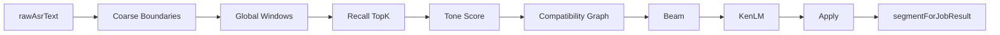

# FW Detector — V4 架构（已冻结）

**版本**：FW Repair **V4-only**（V2/V3 Pipeline 已退役，2026-06-06）  
**代码根**：`main/src/fw-detector/`  
**冻结日期**：2026-06-15（P1 Residue Cleanup 后文档对齐）

---

## 1. Executive Summary

| 项 | 结论 |
|----|------|
| 唯一 Pipeline | `runFwDetectorV4Path`，`pipelinePath = 'v4'` |
| 粗边界 | `pinyin-ime-v2/extractRawCoarseBoundaries`（非旧 IME span resolve 主链） |
| Recall | `recallTopKForWindows` → `recallSpanTopKV3`（内部 `recallSpanTopKV2` SQL helper） |
| Tone | **Tone Score** 排序信号（非 Hard Gate）；声学 payload 见 [tone-module](../tone-module/ARCHITECTURE.md) |
| KenLM | `kenlm/run-fw-sentence-rerank-from-prefilled.ts`；Apply 阈值 `minDeltaToReplace=0.03` |
| 写回 | 唯一 `applyFwSpanReplacements` → `ctx.segmentForJobResult` |

---

## 2. 主链调用图

```text
fw-detector-step.ts
  → runFwDetectorOrchestrator
      → ensureLexiconRuntimeV2Loaded
      → runFwDetectorV4Path
          → extractRawCoarseBoundaries (pinyin-ime-v2)
          → generateGlobalWindows / recallTopKForWindows
          → candidateCompatibilityGraph
          → coarsePathAssembly + runCoarseSentenceBeamV4
          → runFwSentenceRerankFromPrefilled (kenlm/)
          → applyFwSpanReplacements
```



---

## 3. 目录结构

| 目录/文件 | 职责 |
|-----------|------|
| `fw-detector-orchestrator.ts` | Lexicon gate → **仅** V4 path |
| `fw-detector-v4-path.ts` | V4 入口、apply 写回 |
| `span-assembly-v4/` | Global Window 编排、`recall-topk-for-windows.ts` |
| `span-assembly-shared/` | Graph、Path、Beam、Tone diagnostics 类型 |
| `kenlm/` | 句级 rerank（prefilled candidates） |
| `apply-span-replacements.ts` | D-greedy 局部替换 |
| `tone-time-align.ts` / `tone-match-score.ts` | 声调时间对齐与打分 |
| `pinyin-ime-v2/` | 粗边界（见 [pinyin-v2](../pinyin-v2/ARCHITECTURE.md)） |
| `legacy/fw-detector/` | P1.2b 归档回滚链（非默认） |

**已删除（不得恢复）**：`span-assembly-v3/`、`fw-detector-v3-path.ts`、`fw-sentence-rerank-pipeline.ts`、`resolve-pinyin-ime-v2-spans.ts`。

---

## 4. V4 Global Window

入口：`span-assembly-v4-orchestrator.ts`

1. 从粗边界生成 **global windows**（含 boundary-aware 扩展）
2. 按 window 调用 `recallTopKForWindows`
3. 构建 **compatibility graph**（候选冲突/共存）
4. **beam** 组装句级路径
5. KenLM rerank → pick → apply

关键限制见 `span-assembly-v4/v4-limits.ts` 与 shared 内 `CoarseAssemblyLimits`。

---

## 5. Recall

```text
recallTopKForWindows
  → recallSpanTopKV3 (lexicon-v2/recall-span-topkv3.ts)
      → recallSpanTopKV2 (exact SQL)
      → lookupParentFragments (parent fragment + tone penalty)
      → sortRecallHitsByToneCompatibility
```

- Bundle：`node_runtime/lexicon/v3`（`LexiconRuntimeV2`）
- `lexicon/local-span-recall.ts` **不在** V4 默认路径（仅 legacy）

---

## 6. Tone Score（非 Hard Gate）

| 阶段 | 行为 |
|------|------|
| 声学 | Faster-Whisper ASR 侧 `tone_module` → `UtteranceAcousticTonePayload` |
| 对齐 | `tone-time-align.ts`（timestamp-only，`toneTimestampOnlyEnabled`） |
| 打分 | `tone-match-score.ts` → `computeToneScoreResult` |
| Recall | `tonePenalty` 乘 `candidateScore`，**不** hard drop |
| 诊断 | `recallToneFallbackCount` = penalized；`recallToneIncompatibleCount` 为 deprecated alias |

默认：`features.fwDetector.toneTimestampOnlyEnabled: true`。

---

## 7. Compatibility / Graph / Beam

| 模块 | 文件 |
|------|------|
| Compatibility | `candidate-compatibility-graph.ts` |
| Graph | `span-assembly-shared/coarse-candidate-graph.ts` |
| Path | `span-assembly-shared/coarse-path-assembly.ts` |
| Beam | `run-coarse-sentence-beam-v4.ts` |

职责：在 Recall 候选上剪枝冲突组合，beam 产出句级 `SpanReplacementPick` 供 KenLM。

---

## 8. KenLM 与 Apply

**KenLM**：`rerank-fw-sentences.ts` 使用 `minDeltaToReplace`（默认 **0.03**）决定是否 pick。  
`kenlmDeltaThreshold`（0.8）**已 deprecated**，不参与 V4 逻辑。

**Apply**：`applyFwSpanReplacements` 为唯一 FW 写回；成功后 `ctx.asrRepairApplied = true`，segment 写锁阻止 5015/5016/5017。

---

## 9. segmentForJobResult 写点白名单

| 文件 | 场景 |
|------|------|
| `asr-step.ts` | init from rawAsrText |
| `fw-detector-step.ts` | skip/disabled |
| `fw-detector-orchestrator.ts` | empty / lexicon unavailable |
| `fw-detector-v4-path.ts` | no_spans / **apply** |
| `aggregation-step.ts` | turn 合并 |
| `pipeline/enhancement/*` | 5015/5016/5017（write-lock） |

主链 **禁止** `import legacy/asr-repair`（`fw-detector-gate.mjs`）。

---

## 10. Diagnostics（V4）

启用：`spanAssemblyV4DiagnosticsEnabled=true`，级别 `summary` | `trace`。

| 字段族 | 含义 |
|--------|------|
| `globalWindowGeneratedCount` / `boundaryWindowCount` | 窗口规模 |
| `windowCandidatePoolCount` / `droppedCandidateCount` | 池与剪枝 |
| `recallToneCompatibleCount` / `recallToneFallbackCount` | Tone 诊断 |
| `candidateLifecycle` | trace 级候选生命周期 |

批测分析：`tests/experiments/analyze-span-assembly-v4-dialog200.mjs`。

---

## 11. 构建与门禁

```powershell
npm run build:main          # 含 clean:main，清除 dist 内已删 V3 产物
node scripts/fw-detector-gate.mjs
npm run test:fw-detector
npx jest --testPathPattern="freeze-contract|freeze-config-ssot"
```

Gate 要点：源码无 `span-assembly-v3/`；README 含 `recallTopKForWindows`；dist 无 v3 目录。

---

## 12. 退役说明（简史）

| 代际 | 状态 |
|------|------|
| V2 sentence-level rerank pipeline | **已删除** |
| V3 `span-assembly-v3/` orchestrator | **已删除**（共享模块迁入 `span-assembly-shared/`） |
| `resolvePinyinImeV2Spans` 编排入口 | **已删除**（IME 仅粗边界） |
| P1.2b `legacy/fw-detector/` | 归档，手动 wiring |

---

## 13. 已知限制（运维）

| 现象 | 说明 |
|------|------|
| FW Apply 常为 0 | KenLM delta 未达 `minDeltaToReplace` 或 compatibility 丢弃；**独立议题** |
| 词库 ABI | Electron 启动前需 `npm run lexicon:rebuild-sqlite`（`better-sqlite3`） |
| CER 基线 | 批测以 Raw ASR CER 为主；Apply=0 时 final 常为空 |

---

## 14. 相关文档

| 文档 | 路径 |
|------|------|
| 配置 | [CONFIG.md](./CONFIG.md) |
| Pinyin IME | [../pinyin-v2/ARCHITECTURE.md](../pinyin-v2/ARCHITECTURE.md) |
| Tone Module | [../tone-module/ARCHITECTURE.md](../tone-module/ARCHITECTURE.md) |
| 代码 README | `main/src/fw-detector/README.md` |
