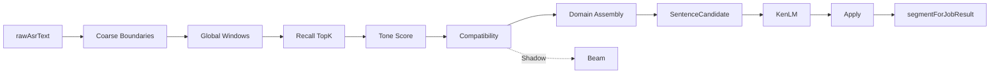

# FW Detector — V4 架构（已冻结）

**版本**：FW Repair **V4-only**（V2/V3 Pipeline 已退役，2026-06-06）  
**冻结模块**：SameDomain Assembly V1.2 · Coverage V1.2 · Compatibility Authority V1.1 · Tone-First Recall V1.0.1 · Diagnostics V1.0.2（2026-06-17）  
**代码根**：`main/src/fw-detector/`  
**最终裁决**：[freeze/FINAL_FREEZE_2026_06_17.md](./freeze/FINAL_FREEZE_2026_06_17.md)

---

## 1. Executive Summary

| 项 | 结论 |
|----|------|
| 唯一 Pipeline | `runFwDetectorV4Path`，`pipelinePath = 'v4'` |
| 粗边界 | `pinyin-ime-v2/extractRawCoarseBoundaries` |
| Recall | `recallTopKForWindows` → `recallSpanTopKV3`（Tone-First composite SQL + plain fallback） |
| Tone | **Tone Score** 排序信号（非 Hard Gate）；声学见 [tone-module](../tone-module/ARCHITECTURE.md) |
| Compatibility | `classifyOverlapRelation` → `resolveCompatibilityRelations` → `activeCandidates` |
| Assembly | Domain Assembly（Pool→Vote→Filter→Select→Assemble）→ `domainAwareSpanSets` |
| KenLM | `kenlm/run-fw-sentence-rerank-from-prefilled.ts`；Apply 阈值 `minDeltaToReplace=0.03` |
| 写回 | 唯一 `applyFwSpanReplacements` → `ctx.segmentForJobResult` |

---

## 2. 主链调用图

```text
fw-detector-step.ts
  → runFwDetectorOrchestrator
      → ensureLexiconRuntimeV2Loaded
      → runFwDetectorV4Path
          → runWithRecallV2Diagnostics (diagnostics 开启时)
              → extractRawCoarseBoundaries
              → generateGlobalWindows / recallTopKForWindows
              → resolveCompatibilityRelations → activeCandidates
              → runDomainAwareAssembly
              → buildSentenceCandidates(domainAwareSpanSets)
              → runFwSentenceRerankFromPrefilled
          → flushRecallV2Diagnostics (所有路径)
          → applyFwSpanReplacements
```



**Shadow**：`Emit → ParentSpanAssembly → Graph → Beam → shadowBeamSpanSets`（仅 diagnostics/trace）。

---

## 3. 目录结构

| 目录/文件 | 职责 |
|-----------|------|
| `fw-detector-orchestrator.ts` | Lexicon gate → **仅** V4 path |
| `fw-detector-v4-path.ts` | V4 入口、diagnostics flush wrapper、apply 写回 |
| `span-assembly-v4/` | Global Window、Domain Assembly、Compatibility、Recall |
| `span-assembly-shared/` | Graph、Path、Beam（Shadow）、Tone diagnostics、Vote |
| `kenlm/` | 句级 rerank（prefilled candidates） |
| `apply-span-replacements.ts` | D-greedy 局部替换 |
| `pinyin-ime-v2/` | 粗边界（见 [pinyin-v2](../pinyin-v2/ARCHITECTURE.md)） |
| `legacy/fw-detector/` | P1.2b 归档回滚链（非默认） |

**已删除（不得恢复）**：`span-assembly-v3/`、`fw-detector-v3-path.ts`、`fw-sentence-rerank-pipeline.ts`。

---

## 4. Global Window 与 Domain Assembly

入口：`span-assembly-v4-orchestrator.ts`

1. 从粗边界生成 global windows（含 boundary-aware 扩展）
2. `recallTopKForWindows`（Tone-First V2/V3）
3. `resolveCompatibilityRelations` → `activeCandidates`
4. **Main — Domain Assembly**（`runDomainAwareAssembly`）
5. `buildSentenceCandidates(domainAwareSpanSets)` → KenLM → apply

详约：[assembly/FROZEN_V1_2.md](./assembly/FROZEN_V1_2.md)

---

## 5. Recall（Tone-First V1.0.1）

```text
recallTopKForWindows
  → recallSpanTopKV3
      → recallSpanTopKV2 (tone-first tier collector)
      → lookupParentFragments (parentFragmentTopK=3)
      → mergeExactAndFragmentHits (exactTopK=2)
      → sortRecallHitsByToneCompatibility
```

| 要点 | 说明 |
|------|------|
| Strategy | 三 tier composite tone 查询 → merge → 不足再 unified plain fallback |
| Limit | V4 exact 路径 effectiveLimit = **2**（非 Assembly perSpanLimit 4/8） |
| Stage | `tone_exact` / `plain_fallback` / `plain_only_no_pattern` |
| 原则 | Tone 影响 score/penalty，**不** hard drop |

详约：[recall/TONE_FIRST_RECALL_FROZEN_V1_0_1.md](./recall/TONE_FIRST_RECALL_FROZEN_V1_0_1.md)

---

## 6. Tone Score

| 阶段 | 行为 |
|------|------|
| 声学 | Faster-Whisper `tone_module` → `UtteranceAcousticTonePayload` |
| 对齐 | `tone-time-align.ts`（`toneTimestampOnlyEnabled`） |
| 打分 | `computeToneScoreResult` → `tonePenalty` 乘 `candidateScore` |
| 诊断 | `recallToneFallbackCount` = penalized 次数 |

---

## 7. Compatibility

| 模块 | 主/影 | 文件 |
|------|-------|------|
| classify + resolve | **Main** | `classify-overlap-relation.ts` · `candidate-compatibility-graph.ts` |
| Domain Assembly | **Main** | `assemble-domain-aware-span-sets.ts` |
| Graph / Beam | Shadow | `span-assembly-shared/` · `run-coarse-sentence-beam-v4.ts` |

详约：[compatibility/COVERAGE_MERGE_FROZEN_V1_2.md](./compatibility/COVERAGE_MERGE_FROZEN_V1_2.md) · [compatibility/AUTHORITY_REDUCTION_FROZEN_V1_1.md](./compatibility/AUTHORITY_REDUCTION_FROZEN_V1_1.md)

**禁止**：`beam.spanSets` → KenLM / Apply。

---

## 8. KenLM 与 Apply

**KenLM**：`minDeltaToReplace`（默认 **0.03**）决定是否 pick。  
`kenlmDeltaThreshold`（0.8）**已 deprecated**。

**Apply**：唯一 FW 写回；成功后 `ctx.asrRepairApplied = true`。

---

## 9. segmentForJobResult 写点白名单

| 文件 | 场景 |
|------|------|
| `asr-step.ts` | init from rawAsrText |
| `fw-detector-step.ts` | skip/disabled |
| `fw-detector-orchestrator.ts` | empty / lexicon unavailable |
| `fw-detector-v4-path.ts` | no_spans / apply / diagnostics flush |
| `aggregation-step.ts` | turn 合并 |

---

## 10. Diagnostics（V1.0.2）

启用：`spanAssemblyV4DiagnosticsEnabled=true`，级别 `summary` | `trace`。

| 字段族 | 含义 |
|--------|------|
| 窗口/池 | `globalWindowGeneratedCount` · `windowCandidatePoolCount` · `droppedCandidateCount` |
| Tone（既有） | `recallToneCompatibleCount` · `recallToneFallbackCount` |
| Tone（V1.0.2） | `toneExactHitCount` · `plainFallbackHitCount` |
| Domain Assembly | `domainCandidateCount` · `sameDomainCandidateCount` · `mainDomainAwareSpanSetsTotal` |
| Shadow | `shadowBeamSpanSetsTotal` |
| Trace | `candidateLifecycle` · PreFilter/RecallHit/Pool tone 字段 |

Flush：方案 A，`runWithRecallV2Diagnostics` 包裹 Assembly+KenLM，全路径 flush。  
详约：[diagnostics/TRACE_FROZEN_V1_0_2.md](./diagnostics/TRACE_FROZEN_V1_0_2.md)

---

## 11. 构建与门禁

```powershell
npm run build:main
node scripts/fw-detector-gate.mjs
npm run test:fw-detector
npx jest --testPathPattern="freeze-contract|freeze-config-ssot"
```

---

## 12. 已知限制

| 现象 | 说明 |
|------|------|
| FW Apply 常为 0 | KenLM `maxDelta` 未达 0.03；下一阶段 KenLM 审计 |
| 词库 ABI | 启动前 `npm run lexicon:rebuild-sqlite` |
| d001 tone trace | 可能为 `plain_fallback`，KenLM 仍可命中 |

---

## 13. 模块文档索引

| 模块 | 文档 |
|------|------|
| 配置 | [CONFIG.md](./CONFIG.md) |
| Assembly V1.2 | [assembly/FROZEN_V1_2.md](./assembly/FROZEN_V1_2.md) |
| Recall V1.0.1 | [recall/TONE_FIRST_RECALL_FROZEN_V1_0_1.md](./recall/TONE_FIRST_RECALL_FROZEN_V1_0_1.md) |
| Diagnostics V1.0.2 | [diagnostics/TRACE_FROZEN_V1_0_2.md](./diagnostics/TRACE_FROZEN_V1_0_2.md) |
| Coverage V1.2 | [compatibility/COVERAGE_MERGE_FROZEN_V1_2.md](./compatibility/COVERAGE_MERGE_FROZEN_V1_2.md) |
| Authority V1.1 | [compatibility/AUTHORITY_REDUCTION_FROZEN_V1_1.md](./compatibility/AUTHORITY_REDUCTION_FROZEN_V1_1.md) |
| 最终冻结 | [freeze/FINAL_FREEZE_2026_06_17.md](./freeze/FINAL_FREEZE_2026_06_17.md) |
| Pinyin IME | [../pinyin-v2/ARCHITECTURE.md](../pinyin-v2/ARCHITECTURE.md) |
| Tone Module | [../tone-module/ARCHITECTURE.md](../tone-module/ARCHITECTURE.md) |
