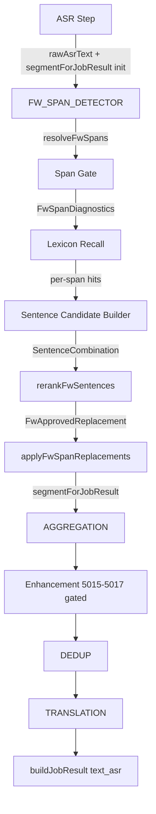

# Pinyin IME V1 主链解冻与新架构接入审计

**Date:** 2026-06-03  
**Type:** 只读代码审计（未修改代码、配置、Patch、Runtime、Scheduler、ASR Text Chain）  
**Scope:** `electron_node/electron-node/main/src` + `tests/spike/pinyin-ime-v1-*`

---

## Executive Summary

当前 ASR 后处理主链在 `asr.engine = fw_detector_v1` 下已 **冻结**：`rawAsrText` 仅 ASR 写入；`segmentForJobResult` 为 NMT/`text_asr` SSOT，写点白名单由 `freeze-contract.test.ts` 静态门禁；FW 编排为 **Metadata Span Gate → Lexicon Recall → Sentence Rerank → Apply**。

**pinyin-ime-v1 仅存在于 `tests/spike/`，`main/src` 零引用。** 离线 Spike 已证明：

| 能力 | 结论 |
|------|------|
| 整句修复（TopK → KenLM → Apply） | **失败**（Pipeline Success 0%） |
| Span Proposal（Diff → Coverage） | **有价值**（Top5 Case Span Recall 76.9%） |

**推荐新架构接入路径：**

```
FW ASR → [并行] Legacy Span Gate + IME Span Proposal
       → Span Fusion → ImeHintGate (Detector Gate)
       → ApprovedSpan → Lexicon Recall → Sentence Builder → KenLM → Apply
```

**推荐方案：C（并行 + Fusion）+ 分阶段 Shadow → Active。**  
**不推荐：** 删除旧 Detector、IME direct repair、IME 写 `segmentForJobResult`。

**是否可以进入开发？** 可以进入 **Phase 1–2（独立模块 + Shadow diagnostics）**；**不可**直接进入 Active 主链或删除 Legacy Detector。

---

## 1. Current ASR Post-processing Chain

### 1.1 调用顺序（FW 冻结主链）



### 1.2 十个必答问题

| # | 问题 | 代码事实 |
|---|------|----------|
| 1 | **rawAsrText 在哪里产生？** | `pipeline/steps/asr-step.ts` — 多段 ASR 合并后 `ctx.rawAsrText = mergedAsrText`；**唯一业务写点**（`freeze-contract.test.ts` 静态断言） |
| 2 | **segmentForJobResult 在哪里写入？** | 白名单：`asr-step.ts`（初始化）、`fw-detector-step.ts`（sync baseline）、`fw-detector-orchestrator.ts`（apply/no-span）、`aggregation-step.ts`、`enhancement/*`（5015–5017，未锁时）、`post-asr-routing.ts`（semantic repair）、legacy `legacy-apply-sentence-repair.ts`（非 FW 引擎） |
| 3 | **FW Detector 在哪里调用？** | Pipeline 步骤 `FW_SPAN_DETECTOR` → `pipeline/steps/fw-detector-step.ts` → `runFwDetectorOrchestrator()` |
| 4 | **Detector 输出 span 结构？** | `FwSpanDiagnostics`（`fw-detector/types.ts`）：`{ text, start, end, domain, riskScore, signals[], candidates: FwSpanCandidateDiag[], applied }`；候选含 `source: WindowCandidateSource`（V3 四类 lexicon 源） |
| 5 | **Phonetic Recall 如何接收 span？** | FW 主链 **不**走 legacy phonetic preview；Recall 入口为 `recallSpanTopK(runtime, span.text, profile, topK, minPrior, enabledDomains)`（`lexicon/local-span-recall.ts`），输入为 **span 文本**（2–5 音节约束），非 phonetic evidence 数组 |
| 6 | **Lexicon Recall 如何生成候选？** | V2（默认）：`recallSpanTopKViaRuntimeV2`；V1 回滚：`lookupTopKByPinyin`；输出 `LocalSpanRecallHit[]` → 句级组合 `buildSentenceCandidates` |
| 7 | **Sentence Candidate Builder 在哪里？** | `fw-detector/build-sentence-candidates.ts` — 各 span 候选笛卡尔积，cap `maxSentenceCandidates`；per-span 句片段由 `candidate-sentence-builder.ts` 构建 |
| 8 | **KenLM rerank 在哪里？** | 默认 P4：`fw-detector/fw-sentence-rerank-pipeline.ts` → `rerankFwSentences()`（`rerank-fw-sentences.ts`）；回滚 per-span：`legacy/fw-detector/fw-topk-decision-pipeline.ts` |
| 9 | **Apply 在哪里？** | `fw-detector/apply-span-replacements.ts` → `applyReplacementsRightToLeft`；orchestrator 写 `segmentForJobResult = apply(rawAsrText, approved)`；有替换时 `asrRepairApplied = true` |
| 10 | **SSOT 字段（IME 禁止直接写）** | **`rawAsrText`**（不可覆盖）、**`segmentForJobResult`**（NMT/`text_asr` 唯一来源）、**`asrRepairApplied`**（锁 enhancement 写点）、**`asrMergeProbeText`**（仅诊断）；禁止 IME 写 `text_asr`、final text、Apply 路径 |

### 1.3 当前 Span 发现机制（非 IME）

| 模式 | 实现 | 输入 |
|------|------|------|
| 默认 `fw_metadata_gate` | `fw-metadata-span-gate.ts` | ASR word probability、alias exact、segments |
| 回滚 `kenlm_span_gate` | `kenlm-span-selector.ts` | raw 文本 CJK 滑窗 + KenLM delta |
| 回滚 `legacy_detector` | `suspicious-span-detector-v1.ts` | 风险信号 + `span-detector-hint`（仅音节数 2–5） |
| Metadata fallback | orchestrator `resolveFwSpans` | 低 segment logprob → 最多 1 个 legacy span |

**关键事实：** 当前 Detector **从 rawAsrText + ASR metadata 凭空枚举 span**，**不存在** IME TopK / diff / instability 输入通道。

---

## 2. Current Pinyin IME V1 Spike Inventory

### 2.1 是否只在 tests/spike？

**是。** 全部实现在 `electron_node/electron-node/tests/spike/`；`main/src` **grep 零匹配** `pinyin-ime` / `pinyinIme`。

### 2.2 组件清单

| 组件 | 路径 | 可迁移性 |
|------|------|----------|
| 词典导出 | `pinyin-ime-v1-export.mjs`, `lib/dict-export-core.mjs` | 可迁为 build 脚本，非 runtime |
| 词典加载 | `lib/dict-load.mjs`, `dict-tsv.mjs`, `dict-weight.mjs` | 需 TypeScript 化 + 与 LexiconRuntime 解耦评估 |
| 解码器 | `lib/ime-dict-decoder.mjs` | **不宜原样迁入**（dict_dp spike，非 production IME） |
| 拼音流 | `lib/pinyin-stream.mjs`（pinyin-pro） | 可复用概念；主链 span 级拼音不同 |
| Diff Span | `lib/diff-align.mjs` | **评估/提案层**可迁；主链无等价物 |
| Sidecar | `pinyin-ime-v1-sidecar.mjs` | 长期 **进程隔离** 可行（GPL/延迟/词典热更新） |
| 评估 | dialog200 / analyze / kenlm audit / span coverage JSON | 留 `tests/`，不进 runtime |
| 单字层 | `data/pinyin-ime-v1/single_char_dictionary.tsv` | Spike 数据资产，非 Lexicon V3.1 正式表 |

### 2.3 TopK 数据结构（Spike）

```typescript
// decodePinyinStream 返回
{
  candidates: { text: string; score: number; source: 'pinyin-ime-v1' }[];
  diagnostics: {
    singleCharUsedCount, functionSingleCharUsedCount,
    contentFallbackUsedCount, fallbackTriggeredCount, beamBreakRecoveredCount
  };
}
```

### 2.4 已有 Diff / Coverage 代码

| 能力 | 位置 | 主链 |
|------|------|------|
| `diffReplacementSpans(raw, candidate)` | `tests/spike/lib/diff-align.mjs` | **无** |
| Span Coverage 审计 | 离线 JSON `tests/spike/tmp/pinyin-ime-v1-span-coverage-audit.json` | **无** |
| Instability Region | **未实现**（需 TopK 两两 diff 或投票） | **无** |

### 2.5 不能直接迁入主链

- 整包 dict_dp decoder 作为 final repair
- `kenlm-spike.mjs`（WSL 单 query；主链已有 `kenlm-scorer.ts`）
- dialog200 脚本直接挂 pipeline
- SQLite 直读（主链经 `LexiconRuntime` / bundle manifest）
- IME candidate `text` 直接进 Apply 或 `segmentForJobResult`

---

## 3. New Architecture Proposal

### 3.1 职责划分（与用户原则对齐）

| 层 | 职责 | 禁止 |
|----|------|------|
| **Pinyin IME V1** | TopK、分词边界 hint、raw↔candidate diff span、TopK 间 instability region | 写 final text、写 segment、直接 Apply |
| **Detector Gate (ImeHintGate)** | 对 IME hints 降噪、置信打分、输出 ApprovedSpan | 从 raw 盲目滑窗（作为主路径） |
| **Lexicon Recall** | 对 ApprovedSpan.text 查 SQLite V3.1 | 信任 IME candidate 文本为 repair target |
| **Sentence Builder + KenLM** | 组合句候选、minDelta 门控 | 变更现有 would-apply 语义 |
| **Apply** | 仅 `applyFwSpanReplacements(raw, approved)` | IME 绕过 |

### 3.2 目标链路

```
FW ASR (rawAsrText)
  ↓
Pinyin IME V1 ──→ ImeCandidate[] + ImeDiffSpan[] + ImeInstabilityRegion[]
  ↓
[并行] Legacy Metadata Span Gate (保留 shadow)
  ↓
Span Fusion → merged proposal spans
  ↓
ImeHintGate / Detector Gate → ApprovedSpan[]
  ↓
recallSpanTopK(span.text) × N
  ↓
buildSentenceCandidates → rerankFwSentences → applyFwSpanReplacements
  ↓
segmentForJobResult (不变 SSOT 规则)
```

---

## 4. New Data Structure Compatibility

### 4.1 建议结构 vs 现有类型

| 建议类型 | 现有最接近 | 兼容性 | 需要 Adapter |
|----------|------------|--------|--------------|
| `ImeCandidate` | 无（spike `{text, score, source}`） | 新增 | → 仅 diagnostics / hint，**不**映射为 `FwSpanCandidateDiag` |
| `ImeDiffSpan` | 无；评估用 `diff-align` `{start,end,source,target}` | 新增 | → `FwTextSpan` + `ImeHintMeta` |
| `ImeInstabilityRegion` | 无 | 新增 | → 合并进 Fusion 输入 |
| `ApprovedSpan` | `FwTextSpan` + gate metadata | **部分兼容** | `ApprovedSpan` → `FwSpanDiagnostics.text/start/end` 供 Recall |

### 4.2 关键约束

1. **`WindowCandidateSource`**（`lexicon/window-candidate-source.ts`）为 **冻结四类** lexicon 源；**不应**新增 `pinyin-ime-v1` 作为 recall candidate source。IME 只影响 **span 提案**，Lexicon 候选仍来自 SQLite。
2. **`recallSpanTopK`** 要求 span 文本 **2–5 音节**（`MIN_SYLLABLES=2`, `MAX_SYLLABLES=5`）。IME 平均 span **1.87 字** — Fusion **必须**合并相邻 span 或扩展窗口，否则大量提案被 Recall 跳过。
3. **保留 legacy span 字段**：`FwSpanDiagnostics.signals` 可新增 `ime_diff_hint` / `ime_instability`；`FwDetectorResult` 扩展 diagnostics，**不**替换现有字段。
4. **建议新增 diagnostics**（JobContext / FwDetectorResult extra）：
   - `imeCandidateCount`, `imeDiffSpanCount`, `imeInstabilityRegionCount`
   - `imeApprovedSpanCount`, `legacySpanCount`, `fusedSpanCount`
   - `imeRecallCandidateCount`, `imeApplied`, `imeRejectedByKenLM`

### 4.3 Compatibility Verdict

| 问题 | 结论 |
|------|------|
| 与现有 span 结构兼容？ | **需 Adapter**；核心 Recall 仍消费 `span.text` + offset |
| 破坏 Lexicon Recall？ | **不会**，若 IME 文本不进入 `SpanReplacementPick.word` |
| 保留 legacy 字段？ | **必须**；并行期 legacy + IME 双轨 diagnostics |
| 新增 diagnostics？ | **推荐**；Shadow 期仅写 extra，不改 segment |

---

## 5. Integration Option Comparison

| 维度 | A: IME 在 Detector 前 | B: no_span 时触发 IME | C: 并行 + Fusion | D: IME 替换 Detector |
|------|----------------------|----------------------|------------------|---------------------|
| 改动范围 | 中（orchestrator 前置步骤） | 小 | **中–大** | 大 |
| 风险 | 中 | 低但覆盖不足 | **中，可控** | **高** |
| 符合新架构 | 部分 | 否（仍 blind scan 优先） | **是** | 过度 |
| 容易回滚 | 中 | 易 | **易**（关 feature flag） | 难 |
| 保留 legacy diagnostics | 是 | 是 | **是** | 否 |
| 适合第一阶段 | 中 | 否 | **是（Shadow）** | **否** |

### 5.1 推荐方案：**C — 并行 + Span Fusion + ImeHintGate**

**理由（代码事实 + Spike 数据）：**

1. 本批 Dialog200 Detector span recall **0%**（Lexicon down），但 IME span recall **76.9%** — 并行可互补，无需先删 legacy。
2. `resolveFwSpans` 已是可插拔 gate 链（metadata / kenlm / legacy）；新增 **IME proposal 支路** 比重写 metadata gate 风险低。
3. Freeze contract 禁止 orchestrator import legacy asr-repair；并行 IME 模块应放在 **`fw-detector/ime-*`** 新文件，不触碰 legacy 分区。
4. Shadow 期：IME 跑完只写 `ctx.fwDetectorResult` extra / diagnostics，**不**改变 `resolveFwSpans` 输出 → **零行为变更**。

**Phase 1 最小插入点：** `fw-detector-step.ts` 之后或 orchestrator 内 **feature-gated** 调用 `runImeSpanProposal(rawAsrText)` → diagnostics only。

---

## 6. Detector Gate Refactor Report

### 6.1 当前 Detector 能否改造成 ImeHintGate？

| 组件 | 可复用 | 应废弃（作为主路径） | 说明 |
|------|--------|----------------------|------|
| `fw-metadata-span-gate.ts` | **保留** shadow/parallel | 不应是唯一 span 源 | alias / word prob 仍有效 |
| `suspicious-span-detector-v1.ts` | fallback only | 主路径 blind scan | 与 IME 提案重叠 |
| `kenlm-span-selector.ts` | 可选 weak signal | 作 span 发现主路径 | 与 IME instability 可能重复 |
| `span-detector-hint.ts` | 音节 2–5 校验 | — | 可并入 Gate 规则 |
| `resolveFwSpans` | 编排壳 | — | 扩展为 `resolveApprovedSpans({legacy, ime})` |

### 6.2 建议新建模块（本轮不开发，仅设计）

```
main/src/fw-detector/ime-hint-gate.ts      // 输入 ImeDiffSpan[] + Instability → ApprovedSpan[]
main/src/fw-detector/ime-span-proposal.ts  // 调 IME service / 内嵌 decoder
main/src/fw-detector/span-fusion.ts        // legacy + ime → proposal set
main/src/fw-detector/ime-span-types.ts     // ImeCandidate, ImeDiffSpan, ...
```

### 6.3 Gate 规则建议（对齐 Span Coverage 审计）

- Top5 Union diff spans 为输入
- 合并相邻 span（目标长度 2–6 字，对齐 Recall 音节约束）
- 单字 span **默认不单独** Approved（除非 function 单字 + 高 support）
- `supportCount >= 2`（跨 TopK 一致）→ 提升置信
- 无 Lexicon pinyin 近邻（`recallSpanTopK` 空）→ 降权或拒绝
- 过长 span 拆分；重叠 merge
- Legacy metadata span 与 IME span 重叠 → 提升置信（双源一致）

### 6.4 Legacy Detector 去留

| 问题 | 结论 |
|------|------|
| 是否删除旧 Detector？ | **否** — Phase 0–4 均保留 |
| 是否保留 shadow/fallback？ | **是** — `features.pinyinImeV1.mode=shadow` 时 legacy 仍为唯一 Active span 源 |
| 是否新建 ime-detector-gate.ts？ | **是**（推荐），而非改造 `suspicious-span-detector-v1.ts` |
| 配置开关？ | **必须**（见 §13） |

---

## 7. Span Fusion Design Report

### 7.1 输入 / 输出

```typescript
interface SpanFusionInput {
  rawAsrText: string;
  legacySpans: FwTextSpan[];           // from resolveFwSpans
  imeDiffSpans: ImeDiffSpan[];         // Top5 union
  imeInstabilityRegions: ImeInstabilityRegion[];
  lexiconRuntime: LexiconRuntime;      // 近邻探测
}

interface SpanFusionOutput {
  proposals: FwTextSpan[];             // 未门控提案
  diagnostics: {
    legacyCount, imeDiffCount, instabilityCount,
    mergedCount, droppedSingleChar, droppedNoLexiconNeighbor
  };
}
```

### 7.2 规则（与 Spike 指标对齐）

| 规则 | 依据 |
|------|------|
| Top5 Union | Span Coverage 审计：Case Recall 76.9%，Top5 FULL 优于 Top1 |
| 合并相邻 | Avg span 1.87 字 < Recall MIN 2 音节 |
| 单字默认丢弃 | 避免 Recall noise；function 单字例外需 Gate |
| supportCount ≥ 2 | TopK 一致性 = instability 代理 |
| 2–6 字窗口 | 对齐 `local-span-recall` + legacy detector 窗口习惯 |
| Lexicon 近邻 | Recall 空则 Fusion 降权（不浪费 KenLM query） |

### 7.3 输出下游

Fusion → **ImeHintGate** → `ApprovedSpan[]` → 现有 `FwSpanDiagnostics` 壳 → **不改** `recallSpanTopK` 签名。

---

## 8. Lexicon Recall Adaptation Report

| # | 问题 | 结论 |
|---|------|------|
| 当前 Recall 输入？ | `span.text`（trimmed string），2–5 音节；profile、topK、minPrior、enabledDomains |
| 是否要求 span 来自 Detector？ | **否** — 仅要求文本与偏移；来源是编排层概念 |
| 能否接受 `source="pinyin-ime-v1"`？ | **Recall 输入无 source 字段**；source 仅存在于 **候选 hit**（四类 lexicon 源） |
| 是否修改 Candidate 结构？ | **否**；`LocalSpanRecallHit` / `FwSpanCandidateDiag` 不变 |
| 复用 phonetic recall？ | FW 主链 **已统一** 为 `recallSpanTopK`；legacy phonetic preview 不在 FW 路径 |
| 新增 pinyinKey？ | **可选** diagnostics；Recall 内部已有 `tonePinyinKey` |
| span length 扩展窗口？ | **Fusion 层**负责；Recall 本身 **拒绝** <2 或 >5 音节 |
| IME candidate 直接变 repair target？ | **禁止** — 仅 Lexicon hit 进入 `SpanReplacementPick.word` |

**Adaptation 工作量：** 低 — 主要是 **ApprovedSpan → FwSpanDiagnostics** 适配与 **span 长度规范化**；Recall SQL/Runtime **无需改表**。

---

## 9. KenLM / Apply Compatibility Report

| 组件 | 可复用 | 需改动 |
|------|--------|--------|
| `buildSentenceCandidates` | **是** | 无（输入仍为 per-span Lexicon picks） |
| `rerankFwSentences` | **是** | 无 |
| `minDeltaToReplace`（默认 0.03） | **是** | 无 |
| `applyFwSpanReplacements` | **是** | 无 |
| `asrRepairApplied` 锁 | **是** | 无 |
| IME 直接 Apply | **禁止** | — |

**KenLM 审计回顾：** ref 在 TopK 仅 1.2% 时 KenLM 无法救场；新架构下 KenLM 仍只对 **Lexicon 句候选** 工作，**不**对 IME TopK 整句 rerank（除非 IME 文本已进入 sentence builder，**应禁止**）。

**建议 diagnostics：**

```typescript
imeSpanCount, approvedImeSpanCount, imeRecallCandidateCount,
imeKenlmWouldApply, imeApplied, imeRejectedByKenLM
```

---

## 10. Config and Freeze Contract Report

### 10.1 建议配置（本轮不修改）

```json
{
  "features": {
    "pinyinImeV1": {
      "enabled": false,
      "mode": "off",
      "topK": 5,
      "spanProposal": true,
      "directRepair": false,
      "sidecarUrl": "http://127.0.0.1:5031",
      "fusion": {
        "mergeAdjacent": true,
        "minSpanChars": 2,
        "maxSpanChars": 6,
        "minSupportCount": 2,
        "dropSingleChar": true
      }
    }
  }
}
```

`mode` 枚举建议：

| mode | 行为 |
|------|------|
| `off` | 不调用 IME |
| `spike` | 仅离线脚本（现状） |
| `shadow` | 主链调用 IME，**只写 diagnostics**，legacy span 仍驱动 Recall |
| `active` | Approved IME spans **进入** Fusion + Recall |

### 10.2 冻结约束

| 约束 | 机制 |
|------|------|
| 默认 off | `node-config-defaults.ts` + `freeze-config-ssot.test.ts` 扩展 |
| shadow 不改 final | orchestrator 分支：shadow 时不把 IME spans 传入 `recallSpanTopK` |
| directRepair 必须 false | 静态测试：IME 模块不得 import `applyFwSpanReplacements` |
| 防止 IME 写 final | 现有 **segment 写点白名单** 测试扩展：禁止 `ime-*` 路径赋值 `segmentForJobResult` |
| 可回滚 | `mode=off` 一键恢复；不删 legacy gate 代码 |

### 10.3 建议新增 freeze-contract 测试

1. `pinyinImeV1` 默认 `enabled: false`, `mode: off`, `directRepair: false`
2. IME 源文件 **不** 出现在 `segmentForJobResult` 写点白名单
3. `fw-detector-orchestrator` shadow 分支 **不** 改变 `segmentForJobResult` 相对 legacy-only 行为（golden test）
4. IME 模块 **不** import `apply-span-replacements` / `result-builder-core`
5. `WindowCandidateSource` **仍仅** V3 四类（IME 不得新增 source 枚举值）
6. `resolveBusinessAsrText` 仍只读 `segmentForJobResult`

---

## 11. Test Plan Report

### 11.1 单元测试（Phase 1+）

| 模块 | 测试点 |
|------|--------|
| IME TopK | 与 spike golden 一致（dialog200 子集） |
| diff span | `diff-align` 逻辑 TS 化；归一化映射 |
| instability region | TopK 两两 diff 投票 |
| span fusion | 合并/拆分/FP 过滤 |
| ime-hint-gate | Approved/Reject 规则 |
| freeze-contract | §10.3 |

### 11.2 离线测试（已有基础）

| 脚本 | 指标 |
|------|------|
| dialog200 | candidateCount, decode P95 |
| Span Coverage | imeSpanRecall, FULL/PARTIAL/MISS |
| KenLM audit | approved 后 kenlmWouldApply |
| Detector Miss 子集 | 46 样本基线 |

### 11.3 主链 Shadow 测试

- 117/200 Dialog200；对比 legacy-only vs shadow diagnostics
- **断言：** `segmentForJobResult` **bit-identical** legacy-only
- 收集：imeSpanRecall vs legacySpanRecall

### 11.4 Active 测试（Phase 3+）

- approved span → recall → KenLM → apply
- 指标：approvedSpanRecall/Precision, textChangedCount, CER delta, latency P95

---

## 12. Migration Plan Report

| Phase | 内容 | 主链影响 |
|-------|------|----------|
| **Phase 0** | 只读审计（本轮） | 无 |
| **Phase 1** | `main/src/fw-detector/ime-*` 独立模块 + 单元测试；词典仍 sidecar/离线 | 无 |
| **Phase 2** | `mode=shadow`：orchestrator 调用 IME，写 diagnostics | **行为不变** |
| **Phase 3** | `mode=active`：Fusion + ImeHintGate → Recall | segment 可能变化；A/B |
| **Phase 4** | Legacy blind scan 占比评估；metadata gate 仍保留 | 不下线 |
| **Phase 5** | Legacy detector 下线（需 Phase 4 数据支撑） | **远期** |

---

## 13. Risk Assessment

| 风险 | 等级 | 缓解 |
|------|------|------|
| IME 写 segment 破坏 SSOT | 高 | 写点白名单 + freeze test |
| span 过短 Recall 跳过 | 高 | Fusion 合并至 2–6 字 |
| FP span 过多 | 中 | Gate + Lexicon 近邻过滤 |
| Sidecar 延迟（KenLM 级 WSL ~5s/句） | 中 | 异步 shadow；缓存词典；内嵌 decoder 评估 |
| GPL / pinyin-pro 依赖 | 中 | sidecar 隔离 |
| 破坏 freeze-contract | 高 | 先 shadow + 静态门禁 |
| Lexicon SQLite ABI（当前批测） | 高 | **先修复 Runtime** 再 Active |

---

## 14. Final Recommendation

### 14.1 必答十三问

| # | 问题 | 答案 |
|---|------|------|
| 1 | **当前主链要怎么解冻？** | **不解冻 SSOT/Apply 规则**；通过 **新 feature flag + 新 fw-detector 子模块 + freeze-contract 扩展** 增加 IME **并行提案支路**；Shadow 期 **零行为变更** |
| 2 | **IME 应该放在哪个位置？** | **FW_SPAN_DETECTOR 内、resolveFwSpans 并行支路**（方案 C）；产出 hints → Fusion → Gate → 现有 Recall |
| 3 | **是否应直接删除旧 Detector？** | **否** — Phase 5 之前均保留 |
| 4 | **是否保留 legacy 作 shadow/fallback？** | **是** — metadata gate + legacy fallback 继续；IME 为增量 |
| 5 | **IME 输出应是什么？** | **三者组合：TopK（内部）+ Diff Span + Instability Region**；对外仅 **ApprovedSpan** 进 Recall |
| 6 | **Detector 是否改造成 ImeHintGate？** | **部分** — 新建 `ime-hint-gate.ts`；legacy gate **保留并行**，非重写 |
| 7 | **Lexicon Recall 是否能复用？** | **是** — 输入仍为 `span.text`；需 Fusion 满足 2–5 音节 |
| 8 | **KenLM 是否能复用？** | **是** — `rerankFwSentences` + `minDeltaToReplace` 不变 |
| 9 | **Apply 是否需要修改？** | **否** — 仍 `applyFwSpanReplacements(raw, approved)` |
| 10 | **第一阶段开发范围？** | Phase 1–2：IME 模块 TS 化 + sidecar 接口 + shadow diagnostics + fusion/gate 单测；**不接 Active Recall** |
| 11 | **需要哪些配置开关？** | `features.pinyinImeV1.{enabled, mode, topK, spanProposal, directRepair}` |
| 12 | **需要哪些 freeze-contract 测试？** | §10.3 六条 |
| 13 | **是否允许 direct repair？** | **否** — `directRepair: false` 硬编码默认 + 静态门禁 |
| 14 | **如何回滚？** | `mode=off`；不删 legacy；shadow 期无 segment 差异 |
| 15 | **是否可以进入开发？** | **可以 Phase 1–2**；**不可**直接 Active 或删 Detector；**须先**修复 Lexicon Runtime（Dialog200 批测 blocker） |

### 14.2 下一步优先级

```
1. Phase 1 模块骨架（ime-span-proposal / ime-hint-gate / span-fusion）+ 单测
2. Phase 2 Shadow diagnostics 接入 orchestrator
3. 修复 Lexicon Runtime（better-sqlite3 ABI）— Active 前置条件
4. Phase 3 Active span proposal A/B
5. KenLM / Apply 无需改动
6. Legacy Detector 下线 — 仅 Phase 4+ 数据驱动
```

---

## 15. Appendix — Key File Index

| 领域 | 路径 |
|------|------|
| ASR | `main/src/pipeline/steps/asr-step.ts` |
| FW Step | `main/src/pipeline/steps/fw-detector-step.ts` |
| Orchestrator | `main/src/fw-detector/fw-detector-orchestrator.ts` |
| Span Gate | `main/src/fw-detector/fw-metadata-span-gate.ts` |
| Legacy Detector | `main/src/fw-detector/suspicious-span-detector-v1.ts` |
| Recall | `main/src/lexicon/local-span-recall.ts` |
| Sentence Build | `main/src/fw-detector/build-sentence-candidates.ts` |
| KenLM Rerank | `main/src/fw-detector/rerank-fw-sentences.ts` |
| Apply | `main/src/fw-detector/apply-span-replacements.ts` |
| SSOT 路由 | `main/src/pipeline/post-asr-routing.ts` |
| Result | `main/src/pipeline/result-builder-core.ts` |
| Freeze | `main/src/fw-detector/freeze-contract.test.ts` |
| Spike | `tests/spike/lib/ime-dict-decoder.mjs`, `diff-align.mjs` |

---

*Read-only audit — 基于仓库代码事实与 2026-06-03 前 Spike 报告数据。未修改任何源码。*
