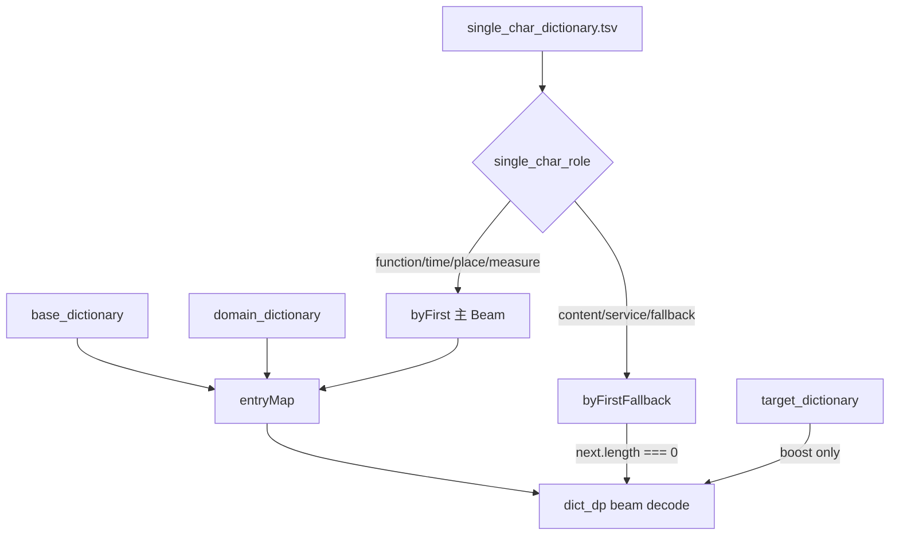

# Pinyin IME V1 Single Char Dictionary Import — Development Report

**Date:** 2026-06-03  
**Scope:** `tests/spike/` only — offline pinyin-ime-v1 spike  
**Input:** `docs/pinyin-v1/import/pinyin-ime-v1_single_char_dictionary_v2_2500.tsv`

---

## 1. Executive Summary

Single Character Dictionary V2 已成功纳入 pinyin-ime-v1 Spike 三层词典加载/解码流程。新增独立层 `single_char_dictionary`（不混入 base/domain/target），并按 `single_char_role` 区分主 Beam 单字与断链 fallback 单字。Dialog200 离线评测显示 **candidateCount 从 87/87 全零改善为 84/87 非空**，decode P95 **12ms**（远低于 200ms 门槛）。

---

## 2. Boundary Compliance

| 约束 | 状态 |
|------|------|
| 不修改 `main/src` | ✅ 未改动 |
| 不修改 Scheduler / Patch Service / FW Detector / ASR Text Chain | ✅ |
| 不新增 Runtime / 第二套 SQLite | ✅ |
| 不写入 `node_runtime/lexicon/v3/lexicon.sqlite` | ✅ |
| 产物仅写入 `tests/spike/data/` 或 `tests/spike/tmp/` | ✅ |
| 本轮仅接入 `tests/spike/pinyin-ime-v1` | ✅ |

---

## 3. Import Pipeline

### 3.1 校验脚本

新增 `tests/spike/import-pinyin-ime-v1-single-char.mjs`，校验项：

- UTF-8 编码
- TSV 13 列 header 完整
- `surface` 为单个 CJK 字
- `pinyin` 非空
- `weight` 为数字
- `single_char_role` 在允许集合内

npm 命令：`npm run spike:pinyin-ime-v1:import:single-char`

### 3.2 数据源落盘

| 源 | 目标 |
|----|------|
| `docs/pinyin-v1/import/pinyin-ime-v1_single_char_dictionary_v2_2500.tsv` | `tests/spike/data/pinyin-ime-v1/single_char_dictionary.tsv` |

校验通过：**2510 行**（header 除外）。

### 3.3 Role 分布

| single_char_role | 行数 | 用途 |
|------------------|------|------|
| function_single_char | 79 | 主 Beam（低 weight） |
| time_single_char | 22 | 主 Beam |
| place_direction_single_char | 33 | 主 Beam |
| measure_single_char | 32 | 主 Beam |
| service_content_single_char | 29 | fallback only |
| content_single_char | 698 | fallback only |
| content_single_char_fallback | 1617 | fallback only |
| **主 Beam 合计** | **166** | |
| **Fallback 合计** | **2344** | |

---

## 4. Code Changes

### 4.1 新增文件

- `tests/spike/lib/single-char-roles.mjs` — role 常量与 `FALLBACK_SCORE_FACTOR=0.06`
- `tests/spike/import-pinyin-ime-v1-single-char.mjs` — 校验 + 导入
- `tests/spike/data/pinyin-ime-v1/single_char_dictionary.tsv` — 数据源

### 4.2 修改文件

| 文件 | 变更 |
|------|------|
| `lib/paths.mjs` | `defaultSingleCharDictPath()` |
| `lib/dict-tsv.mjs` | `parseSingleCharDictLine()` 13 列解析 |
| `lib/dict-load.mjs` | 加载 `single_char_dictionary`；主 Beam / fallback 分索引 |
| `lib/ime-dict-decoder.mjs` | 断链 fallback + diagnostics |
| `run-pinyin-ime-v1-dialog200.mjs` | 记录 per-case diagnostics |
| `analyze-pinyin-ime-v1.mjs` | 单字词典与 fallback 聚合指标 |
| `pinyin-ime-v1-sidecar.mjs` | 适配新 decode 返回结构 |
| `package.json` | `spike:pinyin-ime-v1:import:single-char` |

### 4.3 加载逻辑（最终解码词表）

```
decode_entries = merge(base_dictionary, domain_dictionary, single_char_main_beam)
target_dictionary → boost only (×1.25)
single_char_fallback → byFirstFallback（仅断链时启用）
```

主 Beam 单字 role：`function_single_char`, `time_single_char`, `place_direction_single_char`, `measure_single_char` — 使用 TSV 原始 weight（0.22–0.30，低于多字词元）。

Fallback 单字 role：`service_content_single_char`, `content_single_char`, `content_single_char_fallback` — 当 `next.length === 0` 时启用，score × 0.06。

### 4.4 dict_dp Diagnostics

每次 decode 返回：

- `singleCharUsedCount`
- `functionSingleCharUsedCount`
- `contentFallbackUsedCount`
- `fallbackTriggeredCount`
- `beamBreakRecoveredCount`

---

## 5. Architecture Diagram



---

## 6. Known Limitations

1. **Fallback 计数为扩展事件数**，非唯一断链次数；case 级指标以 `casesWithRecovery` 为准。
2. **KenLM 本轮未跑**（环境缺少 `query.exe`）；analyze 使用 `--no-kenlm`。
3. **top1~top5 仍为 0%** — 单字层解决断链，但未解决 ASR 拼音流与 ref 对齐问题。
4. 剩余 3 条有拼音但 candidate=0（如 d004）需 unknown/gap/partial decode。

---

## 7. Recommendations

| 优先级 | 行动 |
|--------|------|
| P1 | 继续 unknown/gap/partial decode（剩余 3/87 仍全链断裂） |
| P2 | 收紧 fallback 触发条件（按 case 计 recovery 已 57/87，质量需 KenLM 验证） |
| P3 | 修复 KenLM `query.exe` 环境后重跑完整 analyze |
| — | **禁止**将本 TSV 导入 production lexicon.sqlite 或入主链 |

---

## 8. Acceptance Checklist

| # | 验收项 | 结果 |
|---|--------|------|
| 1 | single_char_dictionary 成功导入 | ✅ 2510 行 |
| 2 | 未改 main/src | ✅ |
| 3 | 未生成第二套 Runtime | ✅ |
| 4 | 未写入 lexicon.sqlite | ✅ |
| 5 | 单字按 role 区分加载 | ✅ |
| 6 | function 单字进入主 Beam | ✅ 79 条 |
| 7 | content 单字作为 fallback | ✅ 2344 条 fallback 索引 |
| 8 | candidateCount 改善 | ✅ 84/87 非空（前 0/87） |
| 9 | topK 改善 | ⚠️ top10=0.85%，refInDiff=9.4%（有改善但仍低） |
| 10 | 建议继续 unknown/gap/partial | ✅ 是 |

---

*本报告为 pinyin-ime-v1 offline spike 开发记录，不构成主链上线依据。*
