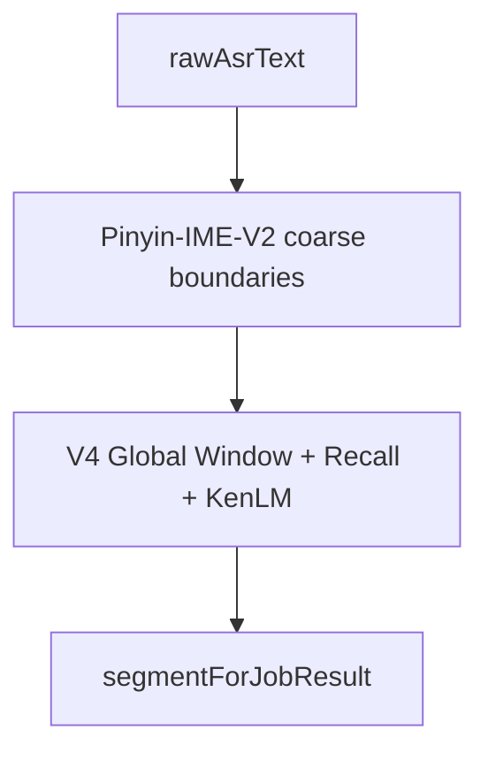

# Pinyin-IME-V2 — 架构（已冻结）

**版本**：Pinyin-IME-V2 **V2.0** · FW 主链 **V4**（2026-06-15 文档对齐）  
**冻结日期**：2026-06-03（IME 能力）  
**代码**：`main/src/fw-detector/pinyin-ime-v2/`

---

## 1. Executive Summary

| 项 | 结论 |
|----|------|
| IME 职责 | **Span Discovery** — 粗边界 prior + diff/instability 信号 |
| V4 主链角色 | **`extractRawCoarseBoundaries`** 供 Global Window；非独立 Apply 路径 |
| 4A–4D | **已实现并冻结** |
| IME 性能 | decode avg **~8ms**，非 pipeline 瓶颈 |
| 编排 | `runFwDetectorV4Path`（**无** `resolvePinyinImeV2Spans`） |

**允许**：Bug Fix、Regression、Freeze Contract、文档更新。  
**禁止**：架构回滚、Direct Repair、TopK>5、Lattice/Backpointer、绕过 V4 Recall/KenLM。

---

## 2. 项目目标与职责

ASR 崩坏时 FW 主链：

1. **IME** — 发现可疑 **rawSpan**（不写回业务文本）  
2. **SpanSelector** — normalize + 数量控制，输出 `ApprovedSpan`（`runPinyinImeV2HintGate` 已 deprecated）  
3. **Recall** — 词库候选（读 [Lexicon v3](../lexicon-v3/ARCHITECTURE.md)）  
4. **Candidate Builder** — 句级候选  
5. **KenLM** — weak_veto  
6. **Apply** — `segmentForJobResult`

IME **禁止**：生成最终替换、改 `segmentForJobResult`、过滤 TopK 候选、`directRepair`（恒 `false`）。

---

## 3. V4 主链中的 IME 职责

```text
rawAsrText
  → normalizeForImeAlignment + decode (pinyin-ime-v2)
  → extractRawCoarseBoundaries  ──→  span-assembly-v4 Global Window
  → (proposal/selector 仍可用于单测与 diagnostics，非 orchestrator 主链写回)
```

**编排**：`runFwDetectorOrchestrator` → `runFwDetectorV4Path` → `extractRawCoarseBoundaries`。

**早退**：无 lexicon / 无 window 等由 V4 path 处理；IME **不**写 `segmentForJobResult`。

---

## 4. 架构图



### 4.1 IME 内部（冻结）

```text
rawAsrText
  → normalizeForImeAlignment (NFKC + OpenCC t2cn, charMap; 不写业务 ASR)
  → extractRawCoarseBoundaries (prior only)
  → textToPinyinStream
  → decodeRawTextTopK (tokens[], beam≤48, topK≤5)
  → computeBoundaryAlignmentDiagnostics (4C, 不 filter 候选)
  → collectDiffSpans + buildInstabilityRegions
  → buildBoundaryCompatibleTopKDiff (4D, 唯一 boundary span 源)
  → boundaryCompatibleTopKSpans + diffSpans + instabilityRegions
```

---

## 5. 演进（简史）

```text
Legacy Detector / Metadata Gate / 四路 Boundary 草案
  → 唯一主链清理 (Phase 1–3)
  → Pinyin-IME-V2 + HintGate
  → 4A Token Path → 4B Normalization → 4B.1 OpenCC
  → 4C Boundary Alignment (diagnostics)
  → 4D Boundary-Compatible TopK Diff
  → V2.0 冻结 (2026-06-03)
```

---

## 6. IME V2.0 能力矩阵

| Phase | 能力 | 模块 | 要点 |
|-------|------|------|------|
| 4A | TopK Token Path | `pinyin-ime-v2-decoder.ts` | `PinyinImeV2Token[]` per candidate |
| 4B | Normalization | `normalize-for-ime-alignment.ts` | alignment-only |
| 4B.1 | OpenCC | `opencc-js/t2cn` | 非业务文本 |
| 4B | Raw Boundary Prior | `extract-raw-coarse-boundaries.ts` | **不**直出 HintGate span |
| 4C | Boundary Compatibility | `pinyin-ime-v2-boundary-align.ts` | soft score |
| 4D | Boundary TopK Diff | `pinyin-ime-v2-boundary-compatible-topk-diff.ts` | **唯一** boundary span |
| — | SpanSelector | `pinyin-ime-v2-span-selector.ts` | 见 §7 |

### 6.1 废弃为 Span 来源（仅 diagnostics）

- `raw_ime_boundary` 直出  
- `token_source_conflict` 直出  
- `normalized_text_diff` 直出  
- V1.1 四路并行 Boundary Conflict  

计数见 `PinyinImeV2ProposalDiagnostics`（如 `tokenSourceConflictDiagnosticCount`），**禁止**进 HintGate。

### 6.2 仍保留的 HintGate 输入

| 来源 | reason / signal |
|------|-----------------|
| 字符 diff | `ime_v2_diff` / `ime_v2_diff_hint` |
| instability | `ime_v2_instability` / `ime_v2_instability_hint` |
| 4D boundary | `ime_v2_boundary_topk_diff` / `ime_v2_boundary_topk_diff_hint` |

---

## 7. SpanSelector 与 Proposal 接线

| 步骤 | 函数 | 输出 |
|------|------|------|
| Proposal | `runPinyinImeV2SpanProposal` | `PinyinImeV2SpanProposal` |
| Selector | `selectPinyinImeV2Spans` | `PinyinImeV2ApprovedSpan[]`（`selected`） |
| Map | `mapApprovedSpansToFwSpans` | `FwSpanDiagnostics[]`（legacy 诊断） |

> **V4 说明**：`resolvePinyinImeV2Spans` 已删除。Selector/Proposal 模块保留供测试与离线分析。

**Normalizer**（Selector 内调）：`normalizePinyinImeV2Spans` 合并 diff + instability + `boundaryCompatibleTopKSpans`；音节/字数门控。

**邻居信号**（V1.1）：`lexiconNearNeighbor` → `recallSpanTopK(…,1,…)` 仅用于 **排序加权**（`+1000`）与 `confidence`；**不再 veto**。超额时 `ranked_capped`（权重：neighbor、supportCount、boundaryTopK、instability）。

> **冻结例外（2026-06-07）**：原 HintGate neighbor veto 已废止；`runPinyinImeV2HintGate` 保留为 deprecated 薄包装。

---

## 8. 数据结构（SSOT: `pinyin-ime-v2-types.ts`）

```typescript
// Token
{ word, syllableStart, syllableEnd, source }

// Candidate
{ text, score, rank, tokens?: PinyinImeV2Token[] }

// BoundaryAlignmentScore (4C, diagnostics)
{ candidateRank, matchedBoundaryCount, conflictedBoundaryCount, compatibilityScore }

// ApprovedSpan
{ rawSpan, start, end, confidence,
  reason: 'ime_v2_diff' | 'ime_v2_instability' | 'ime_v2_boundary_topk_diff' }

// BoundaryCompatibleTopKSpan (4D → HintGate)
{ rawSpan, start, end, syllableStart, syllableEnd, supportCount, confidence, variants, contributingRanks }
```

---

## 9. 冻结约束

### 9.1 禁止

| 类别 | 项 |
|------|-----|
| 回滚 | Detector V1、Runtime V1、Recall Rollback、TopK Rollback |
| 行为 | Direct Repair、绕过 KenLM、绕过 Recall |
| 新增 | Lattice、Backpointer DAG、Graph Search、TopK>5、新 Boundary 类型、新 Span 直进 HintGate |
| IME 越界 | `segmentForJobResult=`、`applyFwSpanReplacements`、`candidates.filter` 丢 TopK |

### 9.2 默认配置（参考）

`features.pinyinImeV2`：`enabled: true`，`topK: 5`，`maxApprovedSpans: 4`，`minSupportCount: 2`，`minSpanChars: 2`，`maxSpanChars: 6`，`minSyllables: 2`，`maxSyllables: 5`，`directRepair: false`。

---

## 10. Freeze Contract

| 门禁 | 命令 |
|------|------|
| IME 模块 | `pinyin-ime-v2-freeze-contract.test.ts` |
| FW 主链 | `freeze-contract.test.ts` |
| 静态 | `node scripts/fw-detector-gate.mjs` |
| Jest | `npx jest --testPathPattern="pinyin-ime-v2\|freeze-contract"` |

静态断言摘要：IME 目录无 `segmentForJobResult` / 无 `pinyin-ime-v1`；orchestrator **不含** `resolvePinyinImeV2Spans`；含 `extractRawCoarseBoundaries`。

---

## 11. 性能（摘要）

| 阶段 | avg |
|------|-----|
| decodeMs（生产） | **8 ms** |
| spanProposal（离线） | **6.2 ms** |
| OpenCC only | **0.02 ms** |
| 4C align | **0.04 ms** |
| 4D topk diff | **0.22 ms** |
| 占 pipeline | **<0.1%** |

FW `triggered` 时额外 **~2.7s/case** 为 Recall+KenLM，**非 IME**。词库 10× 在 `byFirst`+beam48 下可接受。

---

## 12. 机制验证（摘要）

Dialog200 批测验证：4D 后 `boundaryCompatibleTopKSpans` 显著增加，Recall 有候选；KenLM Apply 仍为下游议题（见 [fw-detector](../fw-detector/ARCHITECTURE.md)）。**不以 Apply=0 扩展 IME。**

---

## 13. 责任边界（冻结日）

```text
BoundaryCompatibleTopKSpan  190  ← IME ✅
        ↓ HintGate
FW spans                     49  ← B
        ↓ Recall
Candidates                  108  ← C ✅
        ↓ KenLM
Approved                      0  ← D ❌
        ↓ Apply
Applied                       0  ← E
```

| 层 | 冻结后 |
|----|--------|
| IME | **冻结** |
| SpanSelector | V1.1 已降级（neighbor 排序，非 veto） |
| Recall | 维持 API |
| KenLM | **下一阶段审计** |
| Apply | 依赖 KenLM |

---

## 14. 风险（运维）

| 风险 | 缓解 |
|------|------|
| charMap 错位 | 4B charMap；仅 alignment |
| raw boundary 当硬约束 | 4C soft score only |
| Span 过多 | SpanSelector `maxApprovedSpans` + ranked_capped |
| 精度控制 | KenLM weak_veto + Apply（非 IME 层 veto） |

原则：**IME 只发现位置**；误修防护由 Recall/KenLM/Apply 承担（IME 不写回）。

---

## 15. 调用表（V4）

| 顺序 | 组件 | 入口 |
|------|------|------|
| 0 | Pipeline | `fw-detector-step.ts` |
| 1 | IME 粗边界 | `extractRawCoarseBoundaries` |
| 2+ | V4 主链 | `span-assembly-v4-orchestrator.ts` |

---

## 16. 冻结结论

> **Pinyin-IME-V2 V2.0 与 FW 主链拓扑自 2026-06-03 起冻结。**  
> **IME Span Discovery 已完成。**  
> **禁止**以 Apply=0 为由扩展 IME。  
> **下一阶段：KenLM Audit。**

---

## 17. 相关文档

| 文档 | 路径 |
|------|------|
| 入口 | [README.md](./README.md) |
| 词典 | [DICTIONARY.md](./DICTIONARY.md) |
| Lexicon v3 | [../lexicon-v3/ARCHITECTURE.md](../lexicon-v3/ARCHITECTURE.md) |
| FW 模块 | [../fw-detector/ARCHITECTURE.md](../fw-detector/ARCHITECTURE.md) |
