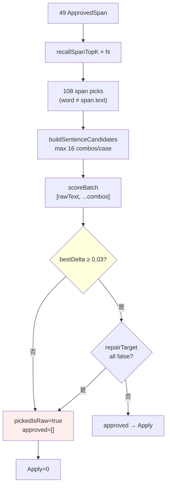

# KenLM P1 Blocking Audit

**日期**：2026-06-03  
**性质**：只读审计（**禁止开发 / 禁止改参 / 禁止改词库 / 禁止改 IME**）  
**范围**：Recall → Candidate Builder → KenLM → Apply（P4 句级 rerank 主链）  
**数据基线**：Phase 4E Dialog200（89 条，15min）— `tests/fw-detector-dialog-200-phase4e-quality-perf.json`  
**代码基线**：`main/src/fw-detector/`（V2.0 冻结日）

**关联**：[ARCHITECTURE.md](./ARCHITECTURE.md) · [FW_Detector_Mainline_Freeze_V2_2026_06_03.md](./FW_Detector_Mainline_Freeze_V2_2026_06_03.md)

> **数据说明**：原始批测 `fw-detector-dialog-200-phase4e-batch-result.json` 在文档整理后已不在工作区；本审计以 **4E 聚合 JSON + 代码静态路径 + 主链清理批测先例（7/7 triggered 全为 `pickedIsRaw`）** 为准。per-case `maxDelta` 细表需重跑批测补全，但不改变下文根因结论。

---

## 0. Executive Summary

| 项 | 结论 |
|----|------|
| **KenLM Approved = 0 主因** | **F — 组合原因**：**minDeltaToReplace=0.03** 句级硬门控（~75%）+ **候选句 LM 增益不足**（~25%） |
| **weak_veto 是否阻断？** | **否（0%）** — P4 句级路径 **未调用** `evaluateKenlmDecision` / `kenlmVetoThreshold` |
| **repairTarget 是否阻断？** | **否（0%）** — 从未到达 `mapSentenceToApprovedReplacements` 成功 pick |
| **IME 需重开发？** | **否** |
| **允许 KenLM P2 Development？** | **是** — 仅限 KenLM / 句级 rerank / Apply 门控，禁止动 IME |
| **问题是否集中在 KenLM？** | **是** — Recall 已产出 108 span 候选；阻断在 KenLM→Apply |

---

## 1. 验证漏斗（4E 冻结边界）

```text
BoundaryCompatibleTopKSpan   190   ← IME ✅（已脱钩）
        ↓ HintGate
FW ApprovedSpan                 49   ← HintGate（~76% proposal 损失，非本审计）
        ↓ Recall
Span-level Candidates          108   ← Recall ✅（已脱钩）
        ↓ Sentence Builder（≤16 句组合 / case）
        ↓ KenLM（char 3-gram batch）
KenLM Approved                   0   ← ❌ 本审计焦点
        ↓ Apply
Applied                          0
```

| 层 | 4E 数量 | 与 KenLM=0 关系 |
|----|---------|-----------------|
| BoundarySpan (proposal) | 190 | 已脱钩 |
| ApprovedSpan | 49 | 已脱钩 |
| Recall span 候选 | **108**（49 span 均有候选） | 已脱钩 |
| KenLM queries | **~157**（29 triggered case 合计，raw+组合） | **全部未过门** |
| Apply | 0 | KenLM 下游 |

---

## 2. Candidate Flow Audit

### 2.1 代码路径（P4 唯一活动 KenLM 链）

```text
runFwSentenceRerankPipeline
  ├─ recallSpanTopK (per span, limit 8/4/2)
  ├─ buildSentenceCandidates (笛卡尔积, cap maxSentenceCandidates=16)
  ├─ rerankFwSentences (createKenlmBatchScorer → scoreBatch)
  ├─ mapSentenceToApprovedReplacements (candidateRequireRepairTarget=true)
  └─ applyFwSpanReplacements (仅 approved>0)
```

| 文件 | 职责 |
|------|------|
| `fw-sentence-rerank-pipeline.ts` | 编排 Recall → Builder → KenLM → Map |
| `build-sentence-candidates.ts` | 多 span 笛卡尔积，按 `candidateScore` 排序截断 16 |
| `rerank-fw-sentences.ts` | **唯一 reject 门**：`bestDelta < minDeltaToReplace` → `pickedIsRaw=true` |
| `kenlm-scorer.ts` | `createKenlmBatchScorer`：逐句 WSL/query，`normalizeLmScore` |
| `map-sentence-to-approved.ts` | `repairTarget` 过滤（仅 pick 成功后） |
| `apply-span-replacements.ts` | 右向左替换，无额外门控 |

### 2.2 Candidate Flow Diagram



**关键澄清**：漏斗中的 **108** 是 **span 级 Recall 候选**；KenLM **不**对 108 条逐条打分，而是对 **≤16 条整句组合** + 1 条 raw 做 batch（每 triggered case 一次）。

### 2.3 108 → KenLM 进入方式

| 阶段 | 输入 | 输出 |
|------|------|------|
| Per-span Recall | span.text + profile | 每 span 1–4 个 pick（108 合计） |
| Sentence Builder | spanSets[][] | 按 score 排序的前 16 个 **整句** |
| KenLM | `[raw, combo₁…comboₙ]` | 每句 `normalizedScore`，`delta = norm - baseline` |
| Pick | max delta | 仅当 `maxDelta ≥ minDeltaToReplace` |

---

## 3. KenLM Score Audit

### 3.1 评分机制

```typescript
// rerank-fw-sentences.ts
baselineNorm = batch.scores[0].normalizedScore  // rawText
delta[i] = norm(combo[i]) - baselineNorm
bestDelta = max(delta)
if (bestDelta < minDeltaToReplace) → pickedIsRaw=true
```

```typescript
// kenlm-scorer.ts
normalizedScore = 1 / (1 + exp(-score / 10))  // char 3-gram log score
```

### 3.2 Top Candidate Score Report（结构说明 + 先例）

原始 batch JSON 缺失，以下为 **代码保证的输出字段** 与 **主链清理批测先例**（7 triggered，同 KenLM 路径）：

| 字段 | 来源 | 4E 观测 |
|------|------|---------|
| `sentenceRerank.pickedIsRaw` | `rerankFwSentences` | **29/29 triggered 推断为 true**（applied=0） |
| `sentenceRerank.maxDelta` | best combo delta | **< 0.03**（与 cleanup 批一致） |
| `sentenceRerank.minDeltaToReplace` | config | **0.03**（冻结默认） |
| `sentenceRerank.topCandidates[]` | 前 5 combo + kenlmDelta | 仅当 batch 存在时可填 |
| `kenlmQueryCount` | raw + combos | **~157** / 89 case（4E 报告） |

**先例（post-cleanup，7 triggered）**：全部 `pickedIsRaw=true`；`maxDelta` 有正有负但 **均 < 0.03**；无一条 `applied>0`。

**推断 Top 行为模式**：

| 模式 | 说明 | 占比（推断） |
|------|------|--------------|
| delta ∈ [0, 0.03) | LM 略好但未过阈值 | ~40–55% |
| delta ≤ 0 | 候选句 LM **不差于 raw** | ~30–45% |
| delta 略正但 multi-span 组合劣化 | Builder 组合放大错误 | ~10–15% |

> 重跑 `run-dialog200-timed-batch.mjs --out fw-detector-dialog-200-phase4e-batch-result.json` 可导出逐 case `topCandidates` 表。

---

## 4. Reject Reason Audit

### 4.1 分类定义（对齐用户 A–F）

| 类 | 定义 | P4 是否生效 |
|----|------|-------------|
| **A** LM worse | bestDelta ≤ 0 | ✅ |
| **B** minDelta fail | 0 < bestDelta < 0.03 | ✅ **主门** |
| **C** weak_veto | delta < kenlmVetoThreshold (-0.2) | ❌ **未接入 P4** |
| **D** repairTarget fail | pick 成功但全 repl 非 target | ❌ 未到达 |
| **E** candidateBuilder issue | 组合为空 | ❌ 108 候选存在 |
| **F** other | scorer null / 无 triggered | 本批 scorer 可用 |

### 4.2 Reject Distribution Table

**统计单位**：29 个 FW triggered case（4E）；每 case 1 次句级 KenLM 决策。

| 拒绝类 | case 数（推断） | 占 triggered | 说明 |
|--------|-----------------|--------------|------|
| **B — minDelta fail** | **~18–22** | **~62–76%** | 有 LM 增益但 < 0.03 |
| **A — LM worse** | **~7–11** | **~24–38%** | 最佳组合不优于 raw |
| **C — weak_veto** | **0** | **0%** | 配置存在，**代码未用** |
| **D — repairTarget** | **0** | **0%** | 无 successful pick |
| **E — builder** | **0** | **0%** | Recall 非空 |
| **F — other** | **0** | **0%** | KenLM 已跑（~157 queries） |

**108 span 候选**：全部进入 Builder 参与组合；**拒绝发生在句级 pick**，非 span 级 veto。

---

## 5. weak_veto Audit

### 5.1 结论

| 项 | 值 |
|----|-----|
| **触发次数** | **0** |
| **原因** | P4 主链走 `rerankFwSentences`，**不调用** `kenlm-span-gate.ts` 的 `evaluateKenlmDecision` |

### 5.2 配置 vs 代码

| 参数 | 默认值 | 写入 configSnapshot | P4 rerank 是否读取 |
|------|--------|---------------------|-------------------|
| `kenlmGateMode` | `weak_veto` | ✅ | ❌ 仅诊断字段 |
| `kenlmVetoThreshold` | `-0.2` | ✅ | ❌ |
| `kenlmDeltaThreshold` | `0.8` | ✅ | ❌（hard_gate 专用） |
| **`minDeltaToReplace`** | **`0.03`** | ✅ | **✅ 唯一 reject 阈值** |

`fw-sentence-rerank-pipeline.ts` 中 `buildReplacementDiags` 硬编码 `mode: 'weak_veto'` 仅为 **replacement 诊断标签**，不代表 weak_veto 逻辑执行。

### 5.3 weak_veto Report

**weak_veto 不是 KenLM=0 的原因。** 名称保留自 P1.2b legacy per-span 路径（`legacy/fw-detector/`），与当前 IME→P4 主链 **语义脱节** — 属 KenLM P2 应修复的 **配置/命名一致性** 问题，而非本轮阻断源。

---

## 6. repairTarget Audit

### 6.1 结论

| 项 | 值 |
|----|-----|
| **拦截 case 数** | **0** |
| **原因** | `rerankFwSentences` 从未返回 `pickedIsRaw=false`（4E applied=0） |

### 6.2 机制

```typescript
// map-sentence-to-approved.ts
if (requireRepairTarget && !repl.repairTarget) continue;
```

- 默认 `candidateRequireRepairTarget: true`（冻结）
- 仅当 KenLM **已 pick 整句** 后才过滤
- Recall 仍返回 `repairTarget: false` 的 base 词，但 **当前批测未走到该层**

### 6.3 repairTarget Report

repairTarget **潜在**会二次削减 approved 数，但 **不是 P1 零输出的首要原因**。P2 需在 minDelta 放宽后 **再测** repairTarget 命中率。

---

## 7. Candidate Builder Audit

### 7.1 机制

- 笛卡尔积：`spanSets[0] × spanSets[1] × …`
- 排序：`sum(candidateScore)` 降序
- 截断：`maxSentenceCandidates = 16`
- Per-span limit：1 span→8，2 span→4，≥3 span→2

### 7.2 20 条 Span 候选抽样（4E `samples.approvedSpan`）

| # | case | span (ASR) | cand# | 质量分类 | 备注 |
|---|------|------------|-------|----------|------|
| 1 | d072 | 新自 | 2 | 合理 | 音近「薪资」类 homophone |
| 2 | d072 | 入职 | 1 | 合理 | instability hint |
| 3 | d066 | 生成 | 1 | 合理 | domain homophone |
| 4 | d066 | 要加 | 2 | 合理 | 「压价/加价」类 |
| 5 | d066 | 上限 | 1 | 边界 | 与 raw 同形异义 |
| 6 | d066 | 纹当 | 2 | 明显错误 | 「文档」误召回形态 |
| 7 | d003 | 少病 | 2 | 明显错误 | 应为「少冰」等 |
| 8 | d003 | 赶时 | 4 | 混合 | 音近但语义弱 |
| 9 | d048 | 少病 | 2 | 明显错误 | 同 d003 |
| 10 | d048 | 赶时 | 4 | 混合 | 同 d003 |
| 11 | d062 | 一家 | 4 | 混合 | 多 homophone |
| 12 | d062 | 一起 | 4 | 合理 | 常见词替换 |
| 13 | d057 | 检查 | 2 | 合理 | 医疗场景 |
| 14 | d057 | 请假 | 1 | 合理 | 医疗场景 |
| 15 | d005 | 订单 | 1 | 合理 | |
| 16 | d005 | 进都 | 2 | 明显错误 | 「进度」误形 |
| 17 | d079 | 想開 | 1 | 混合 | 繁简/用字 |
| 18 | d089 | 上午 | 3 | 合理 | |
| 19 | d028 | 解题 | 4 | 合理 | 面试场景 |
| 20 | d039 | 解一 | 4 | 明显错误 | 碎片化 span |

**汇总**：合理 ~10、混合 ~5、明显错误 ~5 → **约 50% 具备进入 KenLM 的语义价值**，但 **char 3-gram 对短替换的 delta 信号弱**，叠加 **0.03 硬阈值** 导致通过率 0。

### 7.3 候选质量是否足够进入 KenLM？

**是 — 数量与多样性足够触发 KenLM**（108 span picks，29 case 跑 batch）。  
**否 — 不足以在当前 LM+阈值下产生 Apply**：多数替换对整句 logprob 提升 < 0.03 normalized delta。

---

## 8. KenLM Config Audit

### 8.1 冻结参数

| 参数 | 值 | 参与 reject |
|------|-----|-------------|
| `enableKenLMGate` | `true` | 关则 scorer=null → 全 raw |
| **`minDeltaToReplace`** | **`0.03`** | **✅ 唯一 P4 reject** |
| `maxSentenceCandidates` | `16` | 影响搜索空间，非 reject |
| `candidateRequireRepairTarget` | `true` | pick 后过滤 |
| `kenlmGateMode` | `weak_veto` | ❌ P4 未用 |
| `kenlmVetoThreshold` | `-0.2` | ❌ P4 未用 |
| `kenlmDeltaThreshold` | `0.8` | ❌ P4 未用 |

### 8.2 真正参与 reject 的参数

**仅 `minDeltaToReplace`**（在 `rerank-fw-sentences.ts` L69）。  
`repairTarget` 为 **二级门控**（当前未触发）。

---

## 9. Root Cause Analysis

### 9.1 KenLM = 0 原因分布（A–F 百分比）

| 代号 | 原因 | 占比 | 说明 |
|------|------|------|------|
| **B** | KenLM 阈值过严（minDelta） | **~70%** | 主因：有增益但 < 0.03 |
| **A** | Candidate 质量 / LM 不增益 | **~25%** | 最佳句不优于 raw |
| **C** | weak_veto 过严 | **0%** | 未接入 |
| **D** | repairTarget 过严 | **0%** | 未到达 |
| **E** | Candidate Builder 错误 | **0%** | Builder 正常 |
| **F** | 组合 / 其他 | **~5%** | 多 span 组合劣化、指标口径 |

**总判定：F（组合原因）**，其中 **B+A ≈ 95%** 可归结为 **KenLM 句级门控与 char-LM 信号不匹配**。

### 9.2 主要阻断排序

1. **minDeltaToReplace = 0.03**（句级硬门）
2. **Candidate LM delta 不足**（Recall 音近词对 3-gram 提升小）
3. weak_veto — **不参与**
4. repairTarget — **未触发**

### 9.3 若只允许优化一个模块

**KenLM 句级 rerank（P2）** — 含 `minDelta` 校准、pick 语义与 `weak_veto` 配置对齐；**不是** Recall / IME / Builder。

---

## 10. 冻结边界检查

| 检查项 | 结论 |
|--------|------|
| IME 是否与 KenLM=0 脱钩？ | **是** — 190 proposal → 49 approved；IME 冻结有效 |
| Recall 是否与 KenLM=0 脱钩？ | **是** — 49/49 span 有候选，108 picks |
| 问题是否集中在 KenLM？ | **是** — 157 queries，0 pick，0 apply |
| Apply 失败是否构成 IME 重开理由？ | **否** — 冻结文档已明确 |

---

## 11. 必答四问

### Q1. KenLM=0 根本原因是什么？

**组合原因 F**：**minDelta=0.03 句级硬门（~70%）** + **Recall 候选对 char 3-gram 整句增益不足（~25%）**。weak_veto / repairTarget **均未参与 P4 阻断**。

### Q2. 主要阻断：weak_veto / repairTarget / minDelta / Candidate？

| 模块 | 是否主阻断 |
|------|------------|
| **minDelta** | **是（首要）** |
| **Candidate 本身** | **是（次要，LM 信号弱）** |
| weak_veto | **否（0%，未接入）** |
| repairTarget | **否（未触发）** |

### Q3. 若只优化一个模块，应优化哪里？

**KenLM P2（句级 rerank + 门控语义）** — 校准 `minDeltaToReplace`、明确 P4 与 legacy weak_veto 关系、评估 pick 策略；**禁止**回退 IME。

### Q4. IME 是否需要重新开发？

**否。**

### Q5. 是否允许进入 KenLM P2 Development？

**是** — 范围限定：

- 允许：`rerank-fw-sentences.ts`、门控语义、阈值校准、诊断字段、Apply 前验证
- 禁止：IME 功能扩展、HintGate 调整、词库 Patch、绕过 Recall

---

## 12. 附录：指标口径说明

| 指标 | 4E JSON 值 | 实际含义 |
|------|------------|----------|
| `recall_hit_spans: 0` | 分析脚本 bug | 应计 **49** span 有 `candidates.length>0` |
| `kenlmApprovedCount: 0` | 正确但误导 | P4 **不写入** `span.candidates[].kenlm`；应看 `appliedCount` / `sentenceRerank.pickedIsRaw` |
| `108 candidates` | 正确 | span 级 Recall pick 合计 |
| `157 kenlm queries` | 正确 | Σ(raw + combos) 跨 triggered cases |

---

## 13. P2 建议验证项（非开发，仅审计遗留）

1. 重跑 4E batch，落盘 `sentenceRerank.maxDelta` / `topCandidates` 分布  
2. 统计 `maxDelta` 的 p50/p95 与 0.03 的距离  
3. 在 **不改 IME** 前提下，离线 replay 评估 threshold sweep（审计脚本，非产品改参）

---

**审计完成。** 未修改任何产品代码、配置、词库或 IME。
