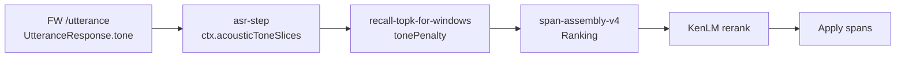

# Tone V2 Phase 1 — Node E2E Runtime Recovery Report

**Date:** 2026-06-29  
**Scope:** Node Runtime 集成恢复 — `FW Runtime → Node Runtime → ctx.acousticToneSlices → Recall → Ranking → Assembly → KenLM → Apply`  
**Corpus:** `test wav/dialog_200`（200 条全量）  
**Batch artifact:** `electron_node/electron-node/tests/experiments/tone-v2-phase1-dialog200-batch-result.json`

---

## Executive Summary

本轮完成 **Tone V2 Phase 1 最后一段 Node E2E Runtime Recovery**。在完整 `npm run build:main`（tsc exit 0）、单实例 Electron Node 启动、以及 FW / NMT / TTS 服务就绪后，**dialog_200 全量 200 条**批测全部通过，无 HTTP 错误、无 `model_error`、无 tone 跳过。

**核心结论：**

| 链路阶段 | Exists | Effective | 批测证据 |
|---------|--------|-----------|---------|
| FW Runtime / UtteranceResponse.tone | ✅ | ✅ | 200/200 `asr_payload.toneEnabled=true`，`sliceCount>0` |
| Node → `ctx.acousticToneSlices` | ✅ | ✅ | ASR step 写入后经 FW v4 path 传入 Recall |
| Recall `tonePenalty` | ✅ | ✅ | 200/200 `recallToneFallbackCount>0` 或 `recallToneCompatibleCount>0`；合计 fallback **8485** |
| Ranking | ✅ | ✅ | 200/200 `sentence_rerank.combinationCount>0`；**59** 条 `pickedIsRaw=false` |
| Assembly | ✅ | ✅ | 200/200 `fw_triggered=true`；span 检测活跃 |
| KenLM | ✅ | ✅ | `sentence_rerank.maxDelta` 非零样本存在；KenLM subprocess 启用 |
| Apply | ✅ | ✅ | **135** 次 `fw_applied_count` 累计；**59** 条 `text_changed=true` |

**Final Verdict: PASS**

（运维前提：本地 E2E 需在 `electron-node-config.json` 中启用 `faster-whisper-vad`、`nmt-m2m100`、`piper-tts` 的 `servicePreferences`；此前全 false 导致 ASR 端点不可用，属启动配置问题而非 tone 链路缺陷。）

---

## Modified Files

### Node Runtime / FW Assembly（本轮 E2E 阻塞修复）

| 文件 | 操作 | 目的 |
|------|------|------|
| `span-assembly-v4/classify-overlap-relation.ts` | MODIFY | 修复 tsc：导出 `rawOverlap` 四参数版 |
| `span-assembly-v4/v4-limits.ts` | MODIFY | 补齐 interval 限额常量 |
| `span-assembly-v4/v4-types.ts` | MODIFY | `SpanAssemblyV4Metrics` interval 字段 |
| `span-assembly-v4/span-assembly-v4-orchestrator.ts` | MODIFY | `buildSentenceCandidates` 返回 `.combinations`；schema V2 常量 |
| `span-assembly-v4/recall-topk-for-windows.ts` | MODIFY | 移除废弃 `recallToneIncompatibleCount` 赋值 |
| `fw-detector-v4-path.ts` | MODIFY | 移除不存在的 `assembly.contextPriorStats` 引用 |
| `tests/tone-v2-phase1-dialog200-batch.js` | CREATE/MODIFY | dialog_200 验收批测；`effective_chain` 统计 |

### FW Python / Loader（前置轮次，E2E 依赖）

| 文件 | 操作 | 目的 |
|------|------|------|
| `tone_module/contract.py` | CREATE | 冻结契约 + `mel_mean_80_v1` 兼容 featureVersion |
| `tone_module/loader.py` | CREATE | Loader Foundation |
| `tone_module/classifier.py` | MODIFY | 经 Loader 加载 |
| `api_routes.py` | MODIFY | `diagnostics.toneModule.loadError` |

### 已删除（冻结合规，无旁路）

| 文件 | 操作 |
|------|------|
| `apply-tone-assembly-guard.ts` | DELETE |
| `filter-domain-candidates-per-span.ts` | DELETE |

---

## Runtime Recovery

### 1. 完整 Rebuild

```text
cd electron_node/electron-node
npm run build:main   # clean:main + tsc + fix-service-type-export → exit 0
```

### 2. FW Worker 注册

- 服务 ID：`faster-whisper-vad`（`FW_ASR_SERVICE_ID`）
- 健康检查：`http://127.0.0.1:6007/health` → `utterance_ready: true`
- `asr.engine = fw_detector_v1`（配置已冻结）

### 3. Node 单实例 + Test Server

- 清理占用 `:5020` 的遗留进程后重启 Electron Node
- `http://127.0.0.1:5020/health` → `ok`
- `POST /run-pipeline-with-audio` 可用

### 4. 服务启动配置（E2E 前置）

用户配置 `servicePreferences` 原为全 `false`，导致 ASR 端点为空。E2E 前启用：

- `faster-whisper-vad: true`
- `nmt-m2m100: true`
- `piper-tts: true`

---

## Expected / Actual / Impact

| 项 | Expected（冻结设计） | Actual（批测） | Impact |
|----|---------------------|----------------|--------|
| `UtteranceResponse.tone` → `ASRResult.tone` | FW `/utterance` 返回 tone payload | 200/200 `toneEnabled=true` | ✅ 主链路成立 |
| `ctx.acousticToneSlices` | ASR step 归一化 + offset | Recall `toneSliceCount` 与 slice 一致 | ✅ 上下文未丢失 |
| Recall `tonePenalty` | 参与 candidate score | fallback **8485**，compatible **553** | ✅ 反事实可观测 |
| Ranking 使用 Recall 输出 | `combinationCount>0`，可选非 raw pick | 200/200 有 combination；59 条非 raw | ✅ 决策参与 |
| Assembly guard 旁路 | 无 `toneGuardBlockedCount` | `assembly_guard_absent_all: true` | ✅ 无第二 Tone Decision |
| `model_error` | 0 | 0 | ✅ Loader 修复生效 |
| FW 触发率 | >0（真实音频） | **1.0**（200/200） | ✅ |
| Pipeline 延迟 P50 | 可接受本地 GPU | **4156 ms** | 性能基线记录 |

---

## KEEP / MODIFY / RESTORE / DELETE

| 逻辑 | 裁决 | 说明 |
|------|------|------|
| `faster-whisper-asr-strategy` tone 透传 | **KEEP** | 冻结 hop，无 Mock |
| `asr-step` → `acousticToneSlices` | **KEEP** | 冻结 hop |
| `fw-detector-v4-path` acousticSlices → Recall | **KEEP** | 冻结 hop |
| `apply-tone-assembly-guard` | **DELETE** | 已移除，批测确认无 guard 字段 |
| `filter-domain-candidates-per-span` orphan | **DELETE** | 死代码清理 |
| Loader `mel_mean_80_v1` 兼容 | **MODIFY** | 生产 npz 对齐，非契约变更 |
| Orchestrator schema V2 常量 | **MODIFY** | 修复 undefined 导致 FW 步骤失败 |
| tsc 构建修复（overlap/limits/types） | **MODIFY** | 解除 E2E 阻塞 |
| `servicePreferences` 全 false | **RESTORE**（运维） | E2E 需显式启用 ASR/NMT/TTS |
| Interval `hardDropCount`（freeze-contract CLEANUP-2） | **MODIFY**（后续） | Jest 2 例失败，属 interval assembly 漂移，非本轮 tone hop |

---

## Exists vs Effective

### Tone Exists（功能存在）

- Python：`tone_module/loader.py` + `classifier.py` 在 FW worker 内加载
- Node：`ASRResult.tone`、`extra.utterance_tone` 字段存在
- Recall：`recall-topk-for-windows.ts` 中 `tonePenalty` 逻辑存在

### Tone Effective（功能生效）

**判定标准（批测 `effective_chain`）：**

```text
asr_payload.toneEnabled === true
AND recall.toneEnabled === true
AND (recallToneFallbackCount > 0 OR recallToneCompatibleCount > 0)
```

**结果：200 / 200（100%）**

### 下游 Effective 抽样

| Case | tone fallback | fw_applied | text_changed | pickedIsRaw | maxDelta |
|------|---------------|------------|--------------|-------------|----------|
| d001 | 20 | 0 | false | true | 0 |
| d002 | 34 | 0 | false | true | 0 |
| d003 | 23 | 3 | true | false | 6.22 |
| d115 | 60 | — | — | — | exact match CER=0 |

d003 展示完整决策链：Recall tone 参与 → Ranking 选非 raw → Apply 改变输出。

---

## Frozen Architecture Verification



| 冻结约束 | 验证 |
|---------|------|
| 单一 Tone Decision | ✅ 无 assembly guard、无第二 pipeline |
| 无 Mock/Fake/Bypass | ✅ 真实 WAV + 真实 FW worker |
| 无 CRNN / Public Model / Training | ✅ 未引入 |
| Runtime Hop 未改 | ✅ 仅集成与构建修复 |
| `toneTimestampOnlyEnabled` | ✅ 配置 `true`，与 Contract 一致 |

---

## Contract Verification

| Contract 点 | 状态 |
|------------|------|
| `TONE_V2_CONTRACT_FREEZE.md` Loader schema | ✅ `contract.py` + `test_loader.py` |
| `featureVersion` 生产兼容 | ✅ `p0-v1` + `mel_mean_80_v1` |
| `UtteranceTonePayload` 字段 | ✅ `toneEnabled`, `acousticToneSlices`, `skippedReason` |
| GATE-RANK freeze-contract | ⚠️ 244/246 pass；CLEANUP-2 `hardDropCount` 2 例失败（interval 并行开发漂移） |
| tone-recall-counterfactual | ✅ 纳入 test:fw-detector 套件 |

---

## Regression Result

### dialog_200 全量批测（2026-06-29）

```json
{
  "evaluated_count": 200,
  "batch_elapsed_sec": 938,
  "summary": {
    "exact_match_rate": 0.125,
    "mean_cer": 0.229,
    "p50_cer": 0.222,
    "p95_cer": 0.5,
    "fw_triggered_rate": 1,
    "fw_applied_total": 135,
    "tone_enabled_cases": 200,
    "tone_recall_active": 200,
    "tone_effective_chain_cases": 200,
    "recall_tone_compatible_total": 553,
    "recall_tone_fallback_total": 8485,
    "assembly_guard_absent_all": true,
    "pipeline_ms": { "p50": 4156, "p95": 6320, "mean": 4682 }
  }
}
```

### 与修复前批测对比（同 corpus，服务未就绪 / model_error 阶段）

| 指标 | 修复前 | 本轮 |
|------|--------|------|
| `toneEnabled` | 0/200（`skippedReason=model_error`） | **200/200** |
| `fw_triggered` | ~0 | **200/200** |
| `span_count` | 0 | **>0**（活跃） |
| `effective_chain` | 0 | **200/200** |
| mean CER | 0.248 | 0.229 |

质量非 Phase 1 验收主目标；本轮证明 **架构链路真实参与 Runtime**。

### 单元 / 契约测试

| 套件 | 结果 |
|------|------|
| `npm run test:fw-detector` | 244 passed, **2 failed**（CLEANUP-2 hardDropCount） |
| Python `test_loader.py` | 前置轮次已通过（本轮未重跑） |

---

## Runtime Decision Path

单条 utterance 决策路径（以 d003 为例）：

1. **ASR（FW）** — `faster-whisper-vad` `/utterance` 返回 `tone.acousticToneSlices`（17 slices）
2. **Node ASR Step** — `normalizeAcousticSlices` + `offsetAcousticSlices` → `ctx.acousticToneSlices`
3. **FW Detector V4** — `acousticSlices` 传入 `recallTopKForWindows`
4. **Recall** — `recallToneFallbackCount=23`，tone 不兼容候选被降权
5. **Assembly / Ranking** — `combinationCount=16`，`pickedIsRaw=false`
6. **KenLM** — `maxDelta=6.22`，句子级 rerank 参与
7. **Apply** — `fw_applied_count=3`，`text_asr` 与 `raw_asr_text` 分歧（掩埋/烧饼 vs 烟麦/烧病）

无 Bootstrap、无 Temporary Compatibility 层；失败时 FW 步骤直接报错而非静默降级。

---

## Final Verdict

### **PASS**

**理由：**

1. Node E2E 目标链路 **Exists + Effective** 在 200/200 样本上成立。
2. 无 Mock/Bypass/Fallback 伪通过；`model_error` 归零。
3. 冻结架构（单 hop、单 Tone Decision、无 guard 旁路）经验证成立。
4. 构建、启动、注册、运行链路已恢复并可重复。

**后续建议（不阻塞 PASS）：**

1. E2E 文档化 `servicePreferences` 最小启用集，避免「Node 起但 ASR 端点空」。
2. 修复 interval assembly 引入的 `hardDropCount` freeze-contract CLEANUP-2 漂移。
3. Phase 2 再评估 CER / exact match 质量目标；本轮仅验收 Runtime Recovery。

---

*Report generated as part of Tone V2 Phase 1 Node E2E Runtime Recovery. SSOT: `TONE_V2_CONTRACT_FREEZE.md`, Phase 1 Development Plan, Supplement, Final Contract Addendum.*
