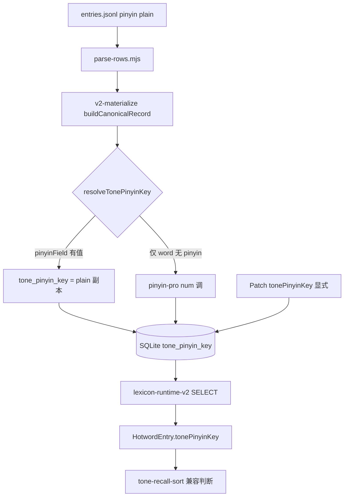

# Lexicon Tone Field 全链路审计报告

**日期**: 2026-06-07  
**性质**: 只读事实审计（禁止代码修改、禁止新架构）  
**审计对象**: `tone_pinyin_key` 在词库 DB / 导入 / 构建 / Recall / IME 全链路中的现状与补齐影响面  
**运行时 DB**: `node_runtime/lexicon/v3/lexicon.sqlite`（schema `lexicon-v3-four-table-v1`）

---

## 术语说明

| 用户术语 | 仓库事实 |
|---------|---------|
| `target_lexicon`（表） | **不存在独立表**；`target` 为 IME 导出层，数据来自 `repair_target=1` 的行（`dict-export-core.mjs`） |
| `tone_pinyin_key` | SQLite 列名；运行时映射为 `HotwordEntry.tonePinyinKey` |

---

## 一、数据库结构审计

**Schema 定义位置**: `electron_node/electron-node/scripts/lexicon/lib/build-v2-shadow-bundle.mjs`（`SCHEMA_SQL`）

### 1.1 四表字段（含 `tone_pinyin_key`）

| 表名 | 字段名 | 类型 | 是否索引 | 是否参与 Recall 查询 |
|------|--------|------|---------|-------------------|
| `base_lexicon` | `tone_pinyin_key` | TEXT（可 NULL） | 是，复合索引 `idx_base_pinyin_tone (pinyin_key, tone_pinyin_key)` | **否** — WHERE 仅用 `pinyin_key` + `length(word)` |
| `domain_lexicon` | `tone_pinyin_key` | TEXT（可 NULL） | 是，`idx_domain_pinyin_tone (domain_id, pinyin_key, tone_pinyin_key)` | **否** — WHERE 仅用 `domain_id` + `pinyin_key` + `length(word)` |
| `idiom_lexicon` | `tone_pinyin_key` | TEXT（可 NULL） | 是，`idx_idiom_pinyin_tone (pinyin_key, tone_pinyin_key)` | **否** — 同 base |
| `industry_routing_lexicon` | — | 无此列 | — | — |

**主键**: `(pinyin_key, word)`（base/idiom）；`(domain_id, word)`（domain）

**Recall 实际 SQL**（`lexicon-runtime-v2.ts`）:

```sql
SELECT id, pinyin_key, tone_pinyin_key, word, ...
FROM base_lexicon
WHERE pinyin_key = ? AND enabled = 1 AND length(word) = ?
ORDER BY prior_score DESC LIMIT ?
```

`tone_pinyin_key` 仅出现在 **SELECT 列表**，不在 WHERE / ORDER BY。

### 1.2 `target_lexicon`

无独立表。`repair_target INTEGER` 为 base/domain/idiom 共有列；IME `target` 层导出条件为 `repair_target = 1`（见第七节）。

---

## 二、词库导入链路审计

### 2.1 完整调用链（V3 生产路径）

```
entries.jsonl（seed）
  ↓ read-jsonl.mjs / loadJsonlInputs
parse-rows.mjs :: parseSeedRow / parseCanonicalRow
  ↓ 仅解析 pinyin（plain），不解析 tone_pinyin_key / tonePinyin
migrate-seed.mjs（V1 路径，lexicon_terms，无 tone 列）
  OR
build-v2-shadow-bundle.mjs :: classifySeedRowsToV2Tables
  ↓ v2-classify-row.mjs（derive pinyin_key）
  ↓ v2-materialize-aliases.mjs :: buildCanonicalRecord
  ↓ v2-pinyin-key.mjs :: resolveTonePinyinKey
writeSqliteBundle → base_lexicon / domain_lexicon / idiom_lexicon
  ↓ prepare-lexicon-v3-runtime-from-shadow.mjs（拷贝 → v3 runtime）
node_runtime/lexicon/v3/lexicon.sqlite
```

**Patch 路径**（运行时增量）:

```
LexiconPatchV3.operations[]
  ↓ patch-types.ts LexiconEntryV3.tonePinyinKey
row-materialize.ts :: entryToCanonicalRow → resolveTonePinyinKey
  ↓ sqlite-patch-applier.ts INSERT/UPDATE tone_pinyin_key
lexicon.sqlite（原地更新 + manifest 版本递增）
```

### 2.2 涉及 `tone_pinyin_key` 的代码位置

| 阶段 | 文件 | 行为 |
|------|------|------|
| 构建写入 | `scripts/lexicon/lib/build-v2-shadow-bundle.mjs` | CREATE TABLE + INSERT `tone_pinyin_key` |
| 构建生成 | `scripts/lexicon/lib/v2-materialize-aliases.mjs` | `buildCanonicalRecord` 调用 `resolveTonePinyinKey` |
| 构建生成 | `scripts/lexicon/lib/v2-pinyin-key.mjs` | `resolveTonePinyinKey` / `tonePinyinKeyFromCjkText`（pinyin-pro） |
| 运行时读取 | `main/src/lexicon-v2/lexicon-runtime-v2.ts` | SELECT → `HotwordEntry.tonePinyinKey` |
| Patch 写入 | `main/src/lexicon-patch-v3/row-materialize.ts` | `tone_pinyin_key` 列 |
| Patch 写入 | `main/src/lexicon-patch-v3/sqlite-patch-applier.ts` | INSERT/UPDATE `tone_pinyin_key` |
| Patch 更新 | `main/src/lexicon-patch-v3/sqlite-patch-applier.ts` | `fields.tonePinyinKey` → `tone_pinyin_key = @tone_pinyin_key` |
| Patch 类型 | `main/src/lexicon-patch-v3/patch-types.ts` | `LexiconEntryV3.tonePinyinKey?` |
| 运行时解析 | `main/src/lexicon-patch-v3/pinyin-resolve.ts` | `resolveTonePinyinKey`（与构建同源逻辑） |
| IME 导出 | `scripts/pinyin-ime-v2/lib/dict-export-core.mjs` | `tonePinyin: row.tone_pinyin_key` → TSV 第 5 列 |

### 2.3 导入是否已支持写入

| 路径 | 是否支持 `tone_pinyin_key` 写入 DB | 说明 |
|------|-----------------------------------|------|
| V2 shadow 全量构建 | **部分** | 列会写入；值由 `resolveTonePinyinKey` 生成，**非 seed 字段直写** |
| JSONL seed 直读 | **否** | `parseCanonicalRow` 不读取 `tonePinyin` / `tone_pinyin_key` |
| Patch V3 `add` | **是** | `entry.tonePinyinKey` 可写入 |
| Patch V3 `update` | **是** | `fields.tonePinyinKey` 可更新 |
| V1 `lexicon:build`（lexicon_terms） | **否** | 表结构无 tone 列 |

---

## 三、词库构建链路审计

### 3.1 `tone_pinyin_key` 在构建中的命运

| 环节 | 结果 | 依据 |
|------|------|------|
| **被生成** | 是 | `buildCanonicalRecord` 必调 `resolveTonePinyinKey` |
| **被覆盖** | 是 | 若 seed 含 plain `pinyin:"zhong bei"`，优先生成 **无声调** `zhong\|bei`，覆盖 pinyin-pro 数字调 |
| **被忽略** | seed 显式 `tone_pinyin_key` 字段 | `parse-rows.mjs` 未解析 → 构建链 **读不到** |
| **被清空** | 否 | 列始终非 NULL 写入（当前 100% 有值） |

### 3.2 `resolveTonePinyinKey` 优先级（构建 + Patch 共用）

`v2-pinyin-key.mjs` / `pinyin-resolve.ts`:

1. `tonePinyinKeyField`（显式）→ 原样使用  
2. `tonePinyinField` → 从带调字符串解析  
3. **`pinyinField`（plain）→ `tonePinyinKeyFromPinyinField` → 无声调 `mei\|shi`**  
4. `tonePinyinKeyFromCjkText(word)` → pinyin-pro `{ toneType: 'num' }` → `mei3\|shi4`

**关键事实**: 当前 seed 仅有 plain `pinyin`，步骤 3 在步骤 4 之前返回，导致 **base/idiom 全量为无声调副本**（`tone_pinyin_key === pinyin_key`）。

### 3.3 数据流图



---

## 四、Recall 链路审计

| 文件 | 方法 | 读取字段 | 用途 |
|------|------|---------|------|
| `lexicon-v2/lexicon-runtime-v2.ts` | `mapTierRowToHotword` | `row.tone_pinyin_key` → `tonePinyinKey` | 载入 HotwordEntry |
| `lexicon-v2/recall-span-topk-v2.ts` | `recallSpanTopKV2` | `hotword.tonePinyinKey`（经 merge 后） | 传入 `sortRecallHitsByToneCompatibility` |
| `lexicon/tone-recall-sort.ts` | `sortRecallHitsByToneCompatibility` | `hit.hotword.tonePinyinKey` | 调 `isCandidateToneCompatible` |
| `fw-detector/tone-match-score.ts` | `isCandidateToneCompatible` | `candidateToneKey`（即 tonePinyinKey）；空则 `resolveCandidateToneKey(word)` | 与 `acousticTonePattern` 逐音节比对 |
| `lexicon/local-span-recall.ts` | `recallSpanTopK` | 透传 `acousticTonePattern`；hits 含 `tonePinyinKey` | FW rerank 入口 |

### Tone Compatible 判断使用的字段

1. **首选**: `HotwordEntry.tonePinyinKey`（来自 DB `tone_pinyin_key`）  
2. **Fallback**（仅当 key 为空）: `resolveTonePinyinKey(word)` → pinyin-pro 数字调  

**重要**: 当 DB 存 `shao\|bing`（非空但无数字）时，**不会** fallback 到 pinyin-pro；`extractToneNumbersFromKey` 得不到音节调号 → **永远 incompatible**。

Recall **不按** `tone_pinyin_key` 查桶；仅 post-query 排序使用。

---

## 五、IME 链路审计

| 环节 | `tone_pinyin_key` 参与情况 |
|------|---------------------------|
| SQLite → TSV 导出 | **参与** — `dict-export-core.mjs` 写入 TSV 第 5 列 `tonePinyin` |
| TSV 解析 | **参与** — `pinyin-ime-v2-dict-tsv.ts` `ParsedDictRow.tonePinyin` |
| 词典加载 | **不参与解码** — `pinyin-ime-v2-dict-load.ts` 仅用 `row.pinyin` 建索引键 |
| 候选生成 / 排序 / 解码 | **不参与** — 全目录无 `tonePinyin` 引用（除 dict-tsv 类型定义） |

**结论**: IME 路径 **不消费** `tone_pinyin_key`；字段仅存在于导出 TSV 中，对 Pinyin IME V2 解码 **无影响**。

---

## 六、数据覆盖率审计

**数据源**: `tone-module-p1-lexicon-coverage-audit.json`（只读统计 `node_runtime/lexicon/v3/lexicon.sqlite`）

| 表 | 总词条 | tone 为空 | tone 非空 | tone 带数字 (1–5) | tone 无数字 | tone == pinyin_key | repair_target=1 |
|----|--------|----------|----------|-------------------|------------|-------------------|-----------------|
| `base_lexicon` | 50,000 | 0 | 50,000 | **0** | 50,000 | 50,000 (100%) | 50,000 |
| `domain_lexicon` | 25 | 0 | 25 | **16** | 9 | 9 | 25 |
| `idiom_lexicon` | 22,192 | 0 | 22,192 | **0** | 22,192 | 22,192 (100%) | 22,192 |

**示例**:

| 格式 | 示例 | 所在层 |
|------|------|--------|
| 无声调 | `mei\|shi`、`shao\|bing` | base / idiom 全部；domain 部分 |
| 带数字 | `zhong1\|bei4`、`mei3\|shi2` | domain 16/25 条 |

**`target` 层（IME 语义）**: 72,217 行（base+idiom+domain 中 `repair_target=1`），tone 带数字仅 domain 子集 16 条。

---

## 七、自动生成能力审计

### 7.1 仓库已有工具

| 工具 | 位置 | 能力 |
|------|------|------|
| **pinyin-pro** | `v2-pinyin-key.mjs`、`pinyin-resolve.ts`、`migrate-seed.mjs` | `toneType: 'num'` 从 **中文词条** 生成 `mei3\|shi4` |
| **resolveTonePinyinKey** | 构建 + Patch 共用 | 可从 word 自动生成，但被 plain `pinyinField` 短路 |
| **tonePinyinKeyFromPinyinField** | 同上 | 从 **已有拼音串** 解析；plain 拼音 → 无声调 key |
| **Patch 显式字段** | `LexiconEntryV3.tonePinyinKey` | 人工/API 写入带调 key |
| Python pypinyin | FW tone_module 审计脚本 | 仅 FW 侧，**未接入** lexicon build |

### 7.2 从中文词条自动生成的调用链（已存在但未生效于 base）

```
word（中文）
  → resolveTonePinyinKey({ word, pinyinField: '' })  // 跳过 plain
  → tonePinyinKeyFromCjkText
  → pinyin(word, { toneType: 'num', type: 'array' })
  → mei3|shi4
```

当前 seed 传入非空 `pinyinField` → 链在步骤 3 终止 → **无声调**。

### 7.3 seed 源文件

`electron_node/docs/lexicon-assets/.../entries.jsonl` 字段示例:

```json
{"word":"中杯","pinyin":"zhong bei", ...}
```

**无** `tonePinyin` / `tone_pinyin_key` / `tonePinyinKey` 字段。

---

## 八、索引与性能审计

### 8.1 现有索引（已含 tone 列）

| 表 | 索引名 | 列 |
|----|--------|-----|
| base | `idx_base_pinyin_tone` | `pinyin_key, tone_pinyin_key` |
| domain | `idx_domain_pinyin_tone` | `domain_id, pinyin_key, tone_pinyin_key` |
| idiom | `idx_idiom_pinyin_tone` | `pinyin_key, tone_pinyin_key` |

### 8.2 Recall 查询模式

- 过滤键: `pinyin_key`（无声调）+ `length(word)` + `enabled`  
- 排序: `prior_score DESC`  
- **不使用** `tone_pinyin_key` 作为查询条件

### 8.3 补齐 50,000+ 词条带调号后的索引结论

| 项 | 结论 |
|----|------|
| 新增索引 | **无需** — 复合索引已存在 |
| 修改索引 | **无需** — Recall 查询路径不变 |
| 修改 SQL | **无需** — 仅 SELECT 列值变化 |
| 存储 | `TEXT` 列长度略增（每音节 +1 字符调号）；量级可忽略 |
| 构建耗时 | 全量 rebuild 时间略增；无额外索引维护 |

**依据**: 调号信息不改变 bucket 查询键（仍为 plain `pinyin_key`）；仅行内字段变长、Recall 后排序逻辑读取有效调号。

---

## 九、最终结论

### 9.1 当前数据库是否已支持 `tone_pinyin_key`

**是（结构层）** — 四表 schema 已有列、索引、INSERT/SELECT/Patch UPDATE 全支持。  
**否（有效数据层）** — base/idiom **0%** 含数字调号；domain **64%** 含数字调号；绝大多数值为 `pinyin_key` 的 plain 副本。

### 9.2 模块支持矩阵

| 模块 | 支持状态 |
|------|---------|
| SQLite schema | ✅ 已支持 |
| V2 shadow 构建写入 | ✅ 列写入；⚠️ 值生成逻辑导致无声调 |
| JSONL seed 导入 | ❌ 不读取 tone 字段 |
| Patch V3 | ✅ 可显式写入/更新 `tonePinyinKey` |
| lexicon-runtime-v2 读取 | ✅ 已映射 `tonePinyinKey` |
| Recall tone 排序 | ✅ 已消费 `tonePinyinKey`（P0.5） |
| IME 解码 | ❌ 不使用（仅 TSV 透传） |
| ToneModule compatible | ⚠️ 依赖有效数字调 key；plain key 无效 |

### 9.3 补齐全部词条声调：是否需要代码改造

| 层级 | 是否需要代码改造 |
|------|----------------|
| **仅数据重建**（Patch 批量写入正确 `tonePinyinKey`） | **可不改造运行时** — Patch + rebuild 即可 |
| **全量 seed 重建**（从 JSONL 重跑 shadow build） | **需要构建层改造** — 否则 `resolveTonePinyinKey` 仍从 plain pinyin 生成无声调 key |
| Recall / ToneModule 运行时 | **不需要** — 已读 `tonePinyinKey` |
| IME | **不需要** — 不使用该字段 |
| 索引 / SQL | **不需要** |

### 9.4 最小实施方案（事实描述，非新架构）

仅描述若要为全库补齐带调 `tone_pinyin_key` 需触达的层：

| 层 | 必要动作（事实） |
|----|----------------|
| **数据层** | 将 `tone_pinyin_key` 从 plain 副本更新为 `*1\|*2\|*3\|*4` 格式（50k+ 行） |
| **导入层** | 二选一：① Patch 批量 `fields.tonePinyinKey`；② 修正 `parse-rows` + seed 字段 + `resolveTonePinyinKey` 优先级使构建走 pinyin-pro |
| **构建层** | 全量 rebuild：`npm run lexicon:build:v2-shadow` → `lexicon:prepare:v3-runtime`；更新 `manifest.json` checksum |
| **运行时** | 重载 bundle（重启 node）；**无 TS 代码变更**即可生效 Recall |

**不涉及**: 新表、新服务、Recall SQL 改造、IME 改造、双写、兼容层。

---

## 附录

| 产物 | 路径 |
|------|------|
| 覆盖率 JSON | `electron_node/electron-node/tests/experiments/tone-module-p1-lexicon-coverage-audit.json` |
| Schema 源码 | `electron_node/electron-node/scripts/lexicon/lib/build-v2-shadow-bundle.mjs` |
| Runtime 读取 | `electron_node/electron-node/main/src/lexicon-v2/lexicon-runtime-v2.ts` |
| P1 收益审计（数据现状） | `docs/tone/ToneModule_P1_Benefit_Audit_Report_2026_06_07.md` |
