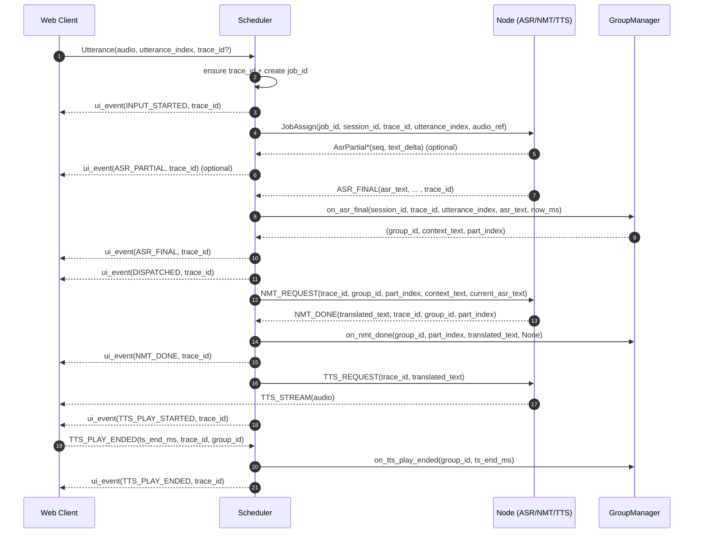

# Utterance Group 功能完整文档

**版本**: v1.1  
**状态**: ✅ **所有组件已完成，需要 Python M2M100 服务端支持上下文参数**  
**适用范围**: Web Client / Scheduler / Node (ASR / NMT / TTS)  
**目标**: 在实时语音翻译中，通过 Utterance Group 实现连续上下文拼接、自然语义延续与稳定用户体验，同时避免声学回响与上下文污染。

**文档说明**:
- ⭐ 本文档为 Utterance Group 功能的**完整文档**，包含规范、实施状态和可行性评估
- 📝 日志支持：✅ 已添加结构化日志支持（GroupManager 和 NMT 引擎），包含 `trace_id` 和 `group_id` 追踪

---

## 📊 实施进度总览

| 组件 | 状态 | 完成度 | 测试状态 |
|------|------|--------|----------|
| **Scheduler** | ✅ 已完成 | 100% | ✅ 10/10 测试通过 |
| **Node Inference** | ✅ 已完成 | 100% | ⚠️ 需要 Python M2M100 服务端支持 |
| **Web Client** | ✅ 已完成 | 100% | ✅ 4/4 测试通过 |

**测试统计**: ✅ **14/14 测试通过**（10个 Scheduler 测试 + 4个 Web Client 测试）

---

## 1. 核心设计目标

- 提升连续对话翻译的上下文一致性  
- 避免短句切分导致的语义割裂  
- 不引入音频级拼接复杂度  
- 与半双工交互、TTS 播放节奏天然对齐  
- 与日志 / trace / 调度系统天然兼容  

---

## 2. 基本概念

### 2.1 Utterance
一次完整的用户发言尝试，对应一次 ASR Final。

### 2.2 Utterance Group
一组在时间与语义上连续的 utterances，用于构建翻译上下文。

### 2.3 Group Part
Group 内的一个最小单元，来源于一个 ASR Final。

---

## 3. 标识符与索引规则（强制）

### 3.1 trace_id
- 每个 Utterance 必须对应一个唯一 trace_id  
- trace_id 的生命周期 = 单个 Utterance  
- 一个 trace_id 只能属于一个 Group  
- 一个 Group 可以包含多个 trace_id  

### 3.2 utterance_index
- utterance_index 在 Session 内单调递增  
- 与 Group 无关  
- 用于 UI、日志、幂等与回放  

### 3.3 part_index
- part_index 仅在 Group 内有意义  
- 从 0 开始递增  
- 不因失败或空翻译回滚  

---

## 4. Utterance Group 结构

```json
{
  "group_id": "group_42",
  "session_id": "sess_xxx",
  "created_at": 1765600000123,
  "last_tts_end_at": 1765600002450,
  "parts": [
    {
      "part_index": 0,
      "trace_id": "trace_a",
      "utterance_index": 10,
      "asr_text": "我们刚才说到",
      "translated_text": "We were just talking about"
    }
  ]
}
```

---

## 5. Group 归属判断逻辑

### 5.1 判断输入
- 当前 Utterance 的 ASR Final 到达时间  
- Scheduler 记录的 last_tts_end_at  

### 5.2 核心规则
- 如果 `asr_final_time - last_tts_end_at <= GROUP_WINDOW_MS`  
  → 归属当前 Group  
- 否则 → 创建新 Group  

### 5.3 时间权威
- Scheduler 记录的时间为最终权威  
- Web 发送的时间戳仅作为参考输入  

---

## 6. Group 生命周期与清理

### 6.1 正常结束条件
- 超出 GROUP_WINDOW_MS  
- 达到 max_parts_per_group  
- 显式标记新话题（v2 扩展）  

### 6.2 兜底结束条件（必须）
- Session 结束  
- WebSocket 断开  
- Session 超时  

---

## 7. 上下文拼接与裁剪策略

### 7.1 拼接内容
- 仅使用 Group.parts 中的 ASR Final  
- ASR Partial 永不进入 Group  

### 7.2 裁剪顺序（强制）
1. 按 max_parts_per_group 裁剪  
2. 按 max_context_length（字符数）裁剪  
3. 若仍超限，仅保留最近的 parts（倒序）  

---

## 8. ASR Partial 的处理原则

- ASR Partial：
  - 仅用于 UI 实时字幕  
  - 可用于日志/debug  
- 不得进入 Group.parts  
- 不参与上下文拼接或翻译上下文  

---

## 9. Node 失败 / 超时场景下的 Group 行为

### 9.1 ASR 成功，NMT 失败
- 允许加入 Group  
- translated_text = null  
- 记录 error_code  

### 9.2 ASR 成功，TTS 失败
- 允许加入 Group  
- Group 节奏不回滚  
- TTS 可重试  

### 9.3 ASR 失败 / Node 超时
- 不加入 Group  
- 不生成 part_index  
- 允许用户重新发言  

---

## 10. GroupManager 设计与实现

### 10.1 核心职责

- 为每个 `session_id` 管理当前活跃 Group（active group）
- 接收 `ASR_FINAL` 并决定归属
- 维护 `last_tts_end_at`（权威时间）
- 生成 NMT 输入上下文（context stitching + trimming）
- 在 Session 结束 / WS 断开 / 超时等场景，关闭并清理 Group

### 10.2 配置参数

- `GROUP_WINDOW_MS: u64`（默认 2000ms）
- `MAX_PARTS_PER_GROUP: usize`（默认 8）
- `MAX_CONTEXT_LENGTH: usize`（默认 800 chars）

### 10.3 核心方法

```rust
// ASR Final 处理
on_asr_final(session_id, trace_id, utterance_index, asr_text, now_ms) 
  -> (group_id, context_text, part_index)

// NMT 完成处理
on_nmt_done(group_id, part_index, translated_text, error_code)

// TTS 播放结束处理
on_tts_play_ended(group_id, tts_end_ms)

// Session 结束清理
on_session_end(session_id, reason)
```

**实现文件**: `scheduler/src/group_manager.rs`

---

## 11. 消息协议扩展

### 11.1 JobAssign 消息扩展
- 添加 `group_id: Option<String>`
- 添加 `part_index: Option<u64>`
- 添加 `context_text: Option<String>`

### 11.2 JobResult 消息扩展
- 添加 `group_id: Option<String>`
- 添加 `part_index: Option<u64>`

### 11.3 SessionMessage 扩展
- 添加 `TtsPlayEnded` 消息类型

---

## 12. 完整时序图



---

## 13. 实施详情

### 13.1 Scheduler 侧实施 ✅

**文件**: `scheduler/src/group_manager.rs`

**功能**:
- ✅ Group 生命周期管理（创建、关闭、清理）
- ✅ 时间窗口判断（基于 `last_tts_end_at`）
- ✅ 上下文拼接与裁剪
- ✅ ASR Final 处理（`on_asr_final`）
- ✅ NMT 完成处理（`on_nmt_done`）
- ✅ TTS 播放结束处理（`on_tts_play_ended`）
- ✅ Session 结束清理（`on_session_end`）
- ✅ 结构化日志支持

**集成文件**:
- `scheduler/src/app_state.rs` - 添加 GroupManager 到 AppState
- `scheduler/src/websocket/node_handler.rs` - 集成 GroupManager 调用
- `scheduler/src/websocket/session_handler.rs` - 处理 TTS_PLAY_ENDED 和 Session 结束清理
- `scheduler/src/main.rs` - 初始化 GroupManager

**测试**: ✅ 10/10 测试通过（`scheduler/tests/group_manager_test.rs`）

### 13.2 Node Inference 侧实施 ✅

**功能**:
- ✅ 扩展 `InferenceRequest` 支持 `context_text` 字段
- ✅ 扩展 NMT 引擎支持上下文参数
- ✅ 消息透传 `group_id`、`part_index`

**实施文件**:
- `node-inference/src/nmt.rs` - 扩展 NMT 引擎接口，添加结构化日志
- `node-inference/src/inference.rs` - 添加 `context_text` 字段并传递
- `node-inference/src/http_server.rs` - 接收并传递 `context_text`
- `electron-node/main/src/inference/inference-service.ts` - 传递 `context_text` 到 HTTP 请求

**状态**: ⚠️ 代码已完成，需要 Python M2M100 服务端支持上下文参数

### 13.3 Web Client 侧实施 ✅

**功能**:
- ✅ 扩展消息类型（`TtsPlayEndedMessage`、`TranslationResultMessage`）
- ✅ 保存 `group_id` 和 `trace_id`
- ✅ 发送 `TTS_PLAY_ENDED` 消息

**实施文件**:
- `web-client/src/types.ts` - 添加消息类型
- `web-client/src/websocket_client.ts` - 添加 `sendTtsPlayEnded` 方法
- `web-client/src/main.ts` - 集成 TTS_PLAY_ENDED 消息发送逻辑

**测试**: ✅ 4/4 测试通过（`web-client/tests/stage2.1.3/utterance_group_test.ts`）

---

## 14. 测试方案与验收标准

### 14.1 测试用例（已通过 ✅）

- ✅ TC-UG-01：同组归属（窗口内）
- ✅ TC-UG-02：跨组切换（窗口外）
- ✅ TC-UG-03：ASR Partial 不进入 Group
- ✅ TC-UG-04：裁剪顺序（parts → length → recent）
- ✅ TC-UG-05：NMT 失败仍入组
- ✅ TC-UG-06：TTS 失败不破坏 Group
- ✅ TC-UG-07：TTS_PLAY_ENDED 更新 last_tts_end_at
- ✅ TC-UG-08：Session 结束兜底关闭
- ✅ TC-UG-09：并发与乱序处理
- ✅ TC-UG-10：重复 ASR Final 幂等

### 14.2 验收标准

- ✅ A1：在窗口内连续发言，翻译上下文连续且不丢失
- ✅ A2：窗口外自动分组，group_id 可观测，context 不跨组污染
- ✅ A3：ASR Partial 仅用于字幕，不影响翻译上下文
- ✅ A4：NMT/TTS 失败不导致 Group 结构异常
- ✅ A5：Session 结束无悬空 group
- ✅ A6：context 裁剪符合顺序规则，且不会超出 max_context_length
- ✅ A7：日志可按 trace_id 聚合并追溯 group_id

---

## 15. 日志系统支持

### 15.1 Scheduler 侧日志 ✅

**GroupManager 模块** (`scheduler/src/group_manager.rs`):
- ✅ 使用 `tracing` 进行结构化日志记录
- ✅ `on_asr_final`: 记录 ASR Final 处理完成（包含 `trace_id`, `group_id`, `part_index`, `context_len` 等）
- ✅ `on_nmt_done`: 记录 NMT 处理完成/失败
- ✅ `on_tts_play_ended`: 记录 TTS 播放结束
- ✅ `on_session_end`: 记录 Session 结束和 Group 清理
- ✅ `create_new_group`: 记录新 Group 创建
- ✅ `close_group`: 记录 Group 关闭

### 15.2 Node Inference 侧日志 ✅

**NMT 引擎** (`node-inference/src/nmt.rs`):
- ✅ 使用结构化日志记录翻译请求
- ✅ 区分有/无上下文的日志记录
- ✅ 记录 `context_text` 长度信息

### 15.3 Web Client 侧日志 ⚠️

- ⚠️ 当前使用 `console.log` 记录关键操作（TTS_PLAY_ENDED 发送）
- ⚠️ 建议后续升级为结构化日志（与日志系统集成）

---

## 16. 可行性评估摘要

### 16.1 架构兼容性 ✅

- ✅ Scheduler 侧：高度兼容，已有完整基础设施支持
- ✅ Node Inference 侧：需要扩展 NMT 引擎（代码已完成）
- ✅ Web 客户端侧：改动较小（已完成）

### 16.2 技术实现路径 ✅

- ✅ Scheduler 侧：路径清晰，规范提供完整实现骨架
- ✅ Node Inference 侧：代码已完成，需要 Python M2M100 服务端支持
- ✅ Web 客户端侧：路径清晰，改动较小

### 16.3 关键技术点 ✅

- ✅ 时间窗口判断：技术成熟
- ✅ 上下文拼接与裁剪：实现简单
- ✅ ASR Partial 不进入 Group：无需额外改动
- ✅ 失败场景处理：逻辑清晰

### 16.4 潜在风险

- ⚠️ NMT 服务端上下文支持：代码已完成，需要 Python M2M100 服务端支持
- ✅ 时间同步：风险低，规范已明确时间权威
- ✅ 并发与乱序：风险低，现有架构已处理
- ✅ 内存管理：风险低，有明确的清理机制

---

## 17. 当前实现说明

### 17.1 工作流程

1. **当前流程**（已实现）:
   - Scheduler 收到 `JobResult` 时，如果有 `text_asr`，调用 `GroupManager.on_asr_final` 生成 `group_id`、`context_text`、`part_index`
   - 如果有 `text_translated`，调用 `GroupManager.on_nmt_done` 更新 Group
   - Web 客户端发送 `TTS_PLAY_ENDED` 时，Scheduler 调用 `GroupManager.on_tts_play_ended` 更新 `last_tts_end_at`

2. **后续优化**（代码已就绪）:
   - ✅ Node 端代码已支持接收和传递 `context_text`
   - ⚠️ 当前流程：ASR 和 NMT 在 Node 端顺序执行，首次 `JobAssign` 时 `context_text` 为 `None`
   - ⚠️ 可选优化：在 ASR Final 后，Scheduler 重新发送 NMT 请求（包含上下文）到 Node
   - ⚠️ Python M2M100 服务端需要支持 `context_text` 参数

### 17.2 注意事项

- ✅ **代码已就绪**：Node 端代码已支持接收和传递 `context_text`，如果将来优化流程，可以直接使用
- ⚠️ **当前流程限制**：由于 ASR 和 NMT 在 Node 端顺序执行，首次 `JobAssign` 时还没有 ASR 结果，所以 `context_text` 为 `None`
- ⚠️ **Python M2M100 服务端**：需要更新 Python 服务端以支持 `context_text` 参数（向后兼容，如果未提供则忽略）

---

## 18. 相关文档

- [开发计划](../project_management/DEVELOPMENT_PLAN.md) - 项目开发计划
- [项目状态](../project_management/PROJECT_STATUS.md) - 项目当前状态
- [日志系统实现状态](../logging/IMPLEMENTATION_STATUS.md) - 日志系统支持情况
- [Web 端实时语音翻译统一设计方案 v3](./Web_端实时语音翻译_统一设计方案_v3.md) - Web 客户端设计方案

---

**文档版本历史**:
- v1.1 (2025-01-XX): 完整文档，合并规范、实施状态和可行性评估

