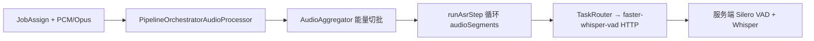
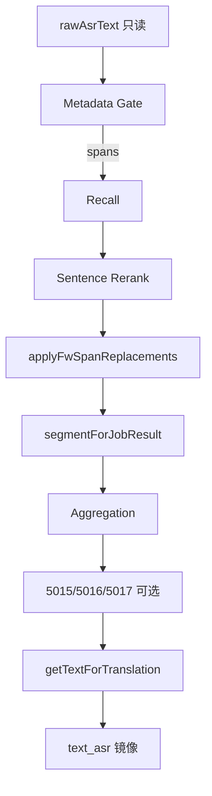

# ASR → FW → Lexicon V2 → P4 Rerank → NMT 主链只读代码审计报告

**日期：** 2026-05-27  
**范围：** `electron_node/electron-node/main/src` pipeline / asr / fw-detector / lexicon-v2 / lexicon / asr-repair / nmt + `services/faster_whisper_vad`  
**方法：** 全仓 grep + 关键文件精读 + 2 条 smoke（general d004 / restaurant d001）+ d090 批测失败复核  
**约束：** 只读；未改代码、未调参、未跑大批测。

**关联产物：**

| 文件 | 说明 |
|------|------|
| 本文 | 主审计报告 |
| `electron_node/electron-node/tests/asr-fw-nmt-audit-smoke.json` | Smoke 结构化结果 |
| `electron_node/docs/lexicon_v2/P1_P4_冻结前总验收报告_2026_05_27.md` | P1~P4 验收（同周期） |
| `electron_node/electron-node/tests/d090-rerun-result.json` | d090 ASR 空返回复核 |

---

## 1. 执行摘要

| 维度 | 结论 |
|------|------|
| 重复逻辑 | **少量、可控**：`segmentForJobResult` 多写点但职责分层清晰；FW skip 与 orchestrator 均写 baseline（同值） |
| 冗余路径 | **存在但未激活**：5015/5016/5017、KenLM Span Gate、P1.2b topK、metadata legacy fallback、Recover/CTC 步骤 |
| 矛盾字段 | **无 SSOT 硬冲突**；`repairedText` 已从 JobContext 移除；配置默认 `useLexiconRuntimeV2Recall:false` 与 P4 验收配置不一致（配置层） |
| Legacy 残留 | Recover/CTC/nbest **未进入 FW 运行时**；代码仍保留供非 FW 引擎与测试 |
| 多处写回 ASR | **FW 修复唯一函数** `applyFwSpanReplacements`；`segmentForJobResult` 另有聚合/enhancement 写点（有 write-lock） |
| 双模块重复执行 | **P4 路径无** per-span KenLM + sentence KenLM 双轨；dedup **不改文本** |

**ASR前→ASR后→NMT前 主链是否可以冻结：YES**

附条件：生产配置须显式开启 `useLexiconRuntimeV2Recall`；5015/5016/5017 保持默认关闭或依赖 `asrRepairApplied` write-lock。

---

## 2. ASR 前处理调用链

| 检查项 | 结论 | 证据 |
|--------|------|------|
| 单条 Node 主路径 | ✅ | `asr-step.ts:43-68` → `audioProcessor.processAudio` |
| 重复 VAD | ⚠️ 两层、非重复同一模块 | Node **能量切批**（`audio-aggregator.ts`）+ 服务 **Silero VAD**（`faster_whisper_vad`） |
| CTC/Recover ASR 前 | ❌ 不参与 | FW 模式 `resolve-preferred-asr-service.ts:21-22` 固定 FW |
| FW/CTC 隔离 | ✅ | `task-router-asr.ts` 误路由时强制改 FW；FW 不写 `asrNbest`（`asr-step.ts:256-262`） |
| 词库/KenLM/语义修复 ASR 前 | ❌ | ASR step 无 lexicon import |
| 双 ASR 并行 | ❌ | 单 `preferredServiceId` 循环 |

---

## 3. ASR 返回结构与 JobContext 映射

**主链服务：** `faster-whisper-vad`（`ctx.asrServiceId` / `extra.asr_service_id`）

| ASR 字段 | JobContext | FW 写入 |
|----------|------------|---------|
| `text` | `asrText`, `rawAsrText`（首段 `=== undefined` _guard） | ✅ |
| `segments[]` | `asrSegments` | ✅ metadata gate |
| `segments[].words[].probability` | 经 gate 读取 | ✅ |
| `segments[].avg_logprob` | fallback 判定 | ✅ |
| `compression_ratio` / `no_speech_prob` | gate config 阈值 | ✅ |
| `language_probabilities` | `languageProbabilities` | ✅ |
| `nbest` / CTC hypotheses | — | ❌ FW 跳过 |
| `diagnostics` | `asrDiagnostics` | ✅ |

**空返回路径：**

1. 音频缓冲：`audioProcessor.shouldReturnEmpty` → 提前 return（`asr-step.ts:55-61`）
2. ASR 空文本：`rawAsrText=''` → FW `reason:'empty_raw'` 早退（`fw-detector-orchestrator.ts:247-268`）
3. 聚合空段：`aggregation-step.ts:24-31` → `deferTranslation`

**ASR 失败：** catch 记录 error；不进入 FW recall（无 rawText）。**不会**误触发 Lexicon rerank。

---

## 4. 字段 SSOT 表

| 字段 | 职责 | 写 | 读（NMT/输出） |
|------|------|-----|----------------|
| `rawAsrText` | ASR 原文，**不可变基线** | `asr-step.ts:251-252`（一次）；mock 测试 | FW orchestrator、metadata gate、`extra.raw_asr_text` |
| `segmentForJobResult` | **NMT 前唯一业务 SSOT** | ASR 初始化 → FW apply → 聚合 → 5015/5016/5017（write-lock 外） | `getTextForTranslation` → `text_asr` |
| `repairedText` | **已移除** | — | — |
| `text_asr` | 结果镜像 | `result-builder.ts:62` 从 `resolveBusinessAsrText` | 客户端展示 |
| `asrText` | ASR 多段拼接工作副本 | asr-step | **不**作为 NMT fallback |

**冻结目标达成度：**

- ✅ `rawAsrText` 生产仅一处写入（guard）
- ✅ NMT 仅 `segmentForJobResult`（`translation-step.ts:27-41` 日志 `source=segmentForJobResult`）
- ✅ `repairedText` 不在 JobContext（`freeze-contract.test.ts:145-147`）
- ⚠️ `segmentForJobResult` 多处写入，但有 precedence + `isSegmentWriteLocked`

**segmentForJobResult 写点（生产）：**

| 顺序 | 模块 | 条件 |
|------|------|------|
| 1 | `asr-step.ts:354` | FW 模式初始化 |
| 2 | `fw-detector-orchestrator.ts:317,363` | 无 span / apply 后 |
| 3 | `aggregation-step.ts` | turn 累积 / finalize merge |
| 4 | `post-asr-routing.ts:82,105` | 5015 语义修复 |
| 5 | `phonetic-correction-step.ts:87` | 5016 |
| 6 | `punctuation-restore-step.ts:83` | 5017 |

FW 成功 apply 后 `ctx.asrRepairApplied=true` → 5015/5016 **不得覆盖**（`post-asr-routing.ts:55-57`）。

---

## 5. FW Metadata Span Gate 审计

| 项 | 结论 |
|----|------|
| 输入 text | ✅ `rawAsrText`（orchestrator:221） |
| 输入 segments | ✅ `asrSegments ?? asrResult.segments` |
| 读 segmentForJobResult | ❌ |
| spanGateMode | ✅ 默认 `fw_metadata_gate`（`node-config-defaults.ts:107`） |
| maxSpans | ✅ config `maxSpans:4` + gate `fwMetadataSpanGate.maxSpans:4` |
| KenLM Span Gate | ✅ 默认 `enabled:false` |
| 0 span | ✅ 早退 `no_spans`，不写 recall（orchestrator:316-321） |
| detector_pinyin_hint | ✅ legacy fallback **过滤**（`fw-metadata-span-gate.ts:206-216`） |
| Legacy detector | ⚠️ 仅 metadata 缺失时 fallback `detectSuspiciousSpansV1`，max 1 span |

**早退路径：** empty_text → disabled → no candidates → `no_spans` →（有 span）recall/rerank

---

## 6. Lexicon Runtime V2 Recall 审计

| 项 | 结论 |
|----|------|
| Runtime 只读 SQLite | ✅ `lexicon-runtime-v2.ts` better-sqlite3 readonly |
| 不读 JSONL | ✅ bundle 路径 `lexicon_v2.sqlite` |
| domain_patch 在 SQLite | ✅ 验收 bundle domain=25 |
| base+domain limit | ✅ P4 `perSpanLimit` + `mergeSpanCandidatesCombined`（domain>alias>base **合计 cap**） |
| tier 叠加模式 | 仅 V2 recall **无** perSpanLimit 时（P4 始终传 perSpanLimit） |
| general domainIds | ✅ `[]`（`domain-recall-merge.ts:18-19`） |
| restaurant domainIds | ✅ `[primary]` |
| candidateRequireRepairTarget | ✅ 默认 true（`fw-config.ts`） |
| tone_pinyin_key | ✅ 排序/距离，非硬过滤（`fw-sentence-rerank-pipeline.ts:140-152`） |

**入口：** `local-span-recall.ts:80+` → `isLexiconRuntimeV2RecallEnabled()` → `recallSpanTopKViaRuntimeV2`

---

## 7. P4 Sentence-Level Rerank 审计

| 项 | 结论 |
|----|------|
| useSentenceLevelRerank=true | ✅ 默认 true → `runFwSentenceRerankPipeline`（orchestrator:327-341） |
| runFwTopKDecisionPipeline | ✅ 仅 `useSentenceLevelRerank=false` 回滚 |
| per-span weak_veto | ✅ P4 路径不走 topK pipeline |
| raw 入 KenLM batch | ✅ `rerank-fw-sentences.ts:43` `[rawText, ...candidates]` |
| maxSentenceCandidates | ✅ 默认 16 |
| KenLM batch | ✅ raw + combos ≤17 |
| minDeltaToReplace | ✅ 默认 0.03 |
| pickedIsRaw=true | ✅ `approved=[]`，不 apply（`fw-sentence-rerank-pipeline.ts:176-178`） |
| apply 函数 | ✅ 唯一 `applyFwSpanReplacements`（orchestrator:363） |

**决策链：** metadata gate → recallSpanTopK → tone 排序 → buildSentenceCandidates → rerankFwSentences → mapSentenceToApprovedReplacements → apply

---

## 8. KenLM 调用点清单

| # | 调用 | 条件 | 文件 |
|---|------|------|------|
| 1 | `selectKenlmSuspiciousSpans` | kenlm_gate_filter + enabled | orchestrator:166-178 **默认关** |
| 2 | `scoreSpanCandidateSentences` | topK 路径 + enableKenLMGate | fw-topk-decision-pipeline **P4 不开** |
| 3 | `scorer.scoreBatch` | P4 sentence rerank | `rerank-fw-sentences.ts:43-44` **默认唯一活跃** |

旧 `asr-repair/kenlm-span-gate` **未**在 P4+metadata 默认路径接入 orchestrator 主分支。

---

## 9. Apply / 写回路径

- ✅ 无 apply 时 `segmentForJobResult === rawText`（无 span 或 pickedIsRaw）
- ✅ diagnostics：`spans`, `sentenceRerank`, `replacements`, `pickedIsRaw`, `recallV2Diagnostics`
- ⚠️ 重叠 span：apply 右向左替换（`apply-span-replacements.ts`），需 span 不重叠（gate 保证）

---

## 10. NMT 输入确认

| 项 | 结论 |
|----|------|
| NMT 读取字段 | **`segmentForJobResult`** via `getTextForTranslation` |
| 读 rawAsrText | ❌ |
| FW 后再改文本 | 5015/5016/5017（默认关 + write-lock） |
| Dedup | **只** `shouldSend`，不改 `segmentForJobResult`（`dedup-step.ts:28-31`） |
| Aggregation | 可能 merge 多段 turn 文本到 `segmentForJobResult`（业务语义，非第二套 FW） |

---

## 11. Legacy / 冗余路径清单

| 模块 | import/注册 | FW 运行时调用 | 影响 FW | 建议 |
|------|-------------|---------------|---------|------|
| CTC ASR | ✅ | ❌ FW 模式 | 无 | keep isolated |
| Recover pipeline steps | registry | ❌ 已从 FW steps 移除 | 无 | remove later |
| `legacy/recover/*` | 存在 | ❌ orchestrator 无 import | 无 | rename legacy |
| CTC nbest → ctx | asr-step | ❌ FW guard | 无 | keep |
| KenLM Span Gate | fw-config | ❌ 默认 off | 无 | keep isolated |
| metadata legacy fallback | fw-metadata-span-gate | ⚠️ 窄条件 | 低 | needs cleanup 文档化 |
| SEMANTIC_REPAIR 5015 | pipeline step | ⚠️ step 在链上，**默认 disabled** | 低（write-lock） | keep gated |
| PHONETIC 5016 / PUNCT 5017 | 同上 | 同上 | 低 | keep gated |
| `buildLegacyRecoverResultExtra` | result-builder | ❌ FW 用 `buildFwResultExtra` | 无 | keep |
| `repairedText` | — | 已删除 | 无 | — |
| agent AggregationStage | pipeline 调用 | ✅ 唯一聚合实现 | 无重复并行 | keep |

---

## 12. Smoke 验证结果

| 用例 | rawAsrText | segmentForJobResult | fw_reason | spanGateMode | domain_hits | pickedIsRaw | NMT 字段 |
|------|------------|---------------------|-----------|--------------|-------------|-------------|----------|
| general d004 | 有 | 同 raw | no_spans | fw_metadata_gate | **0** | — | segmentForJobResult |
| restaurant d001 | 有 | 同 raw（δ<0.03） | — | fw_metadata_gate | **4** | true | segmentForJobResult |
| d090 批测失败 | **空** | 空 | — | — | — | — | — |
| d090 重跑 | 有 | 同 raw | no_spans | — | 0 | — | segmentForJobResult |

**d090 结论：** 批测失败时 `fw_metadata_span_gate=null`、`recall_v2=null` → **FW/Lexicon 未执行**；根因在 ASR 空返回。

---

## 13. 冗余 / 矛盾 / 重复逻辑汇总

| 类型 | 项 | 严重度 |
|------|-----|--------|
| 冗余 | FW pipeline 仍含 5015/5016/5017 step（默认 gate 关） | 低 |
| 冗余 | metadata gate legacy fallback → suspicious-span-detector-v1 | 低 |
| 冗余 | asr-step + orchestrator 均初始化 segmentForJobResult | 低（同值） |
| 矛盾 | 代码默认 `useLexiconRuntimeV2Recall:false` vs P4 验收 true | **配置**（非运行时 SSOT 冲突） |
| 重复执行 | 无 P4 双 KenLM、无 Recover+FW 双 repair | — |
| 写回竞争 | enhancement 与 FW 通过 `asrRepairApplied` 隔离 | 可控 |

---

## 14. 冻结判定

**ASR前→ASR后→NMT前 主链是否可以冻结：YES**

| 阻塞类 | 项 |
|--------|-----|
| A SSOT 冲突 | 无 |
| B 重复写回 | 无（apply 唯一；enhancement write-lock） |
| C 旧链路仍被调用 | Recover/CTC 步骤未执行；5015 等默认关 |
| D Runtime 路径 | SQLite-only 正确 |
| E NMT 输入 | 唯一 segmentForJobResult |
| F 测试环境 | d090 ASR flake（非代码） |

---

## Target List

- [x] rawAsrText 单次写入
- [x] segmentForJobResult NMT SSOT
- [x] repairedText 移除
- [x] FW steps 移除 LEXICON_RECALL/SENTENCE_REPAIR
- [x] P4 sentence rerank 默认路径
- [x] metadata gate 默认、KenLM span gate 关
- [ ] 代码默认对齐 `useLexiconRuntimeV2Recall:true`（配置债务）
- [ ] 文档化 metadata legacy fallback 触发条件

## Check List

- [x] faster-whisper-vad 唯一 FW ASR
- [x] CTC/nbest 不写 FW ctx
- [x] applyFwSpanReplacements 唯一 FW apply
- [x] dedup 不改 ASR 文本
- [x] general domainIds=[]
- [x] restaurant domain recall 可激活
- [x] ASR 空 → FW empty_raw，不进 recall
- [x] text_asr 与 NMT 同源

---

## 附录 A：关键代码文件索引

| 阶段 | 文件 |
|------|------|
| ASR 前处理 | `pipeline/steps/asr-step.ts`, `pipeline-orchestrator/pipeline-orchestrator-audio-processor.ts`, `pipeline-orchestrator/audio-aggregator.ts` |
| ASR 路由 | `asr/resolve-preferred-asr-service.ts`, `task-router/task-router-asr.ts`, `task-router/faster-whisper-asr-strategy.ts` |
| SSOT / NMT 入口 | `pipeline/post-asr-routing.ts`, `pipeline/result-builder.ts`, `pipeline/steps/translation-step.ts` |
| FW 步骤 | `pipeline/steps/fw-detector-step.ts`, `fw-detector/fw-detector-orchestrator.ts` |
| Metadata Gate | `fw-detector/fw-metadata-span-gate.ts` |
| P4 Rerank | `fw-detector/fw-sentence-rerank-pipeline.ts`, `fw-detector/build-sentence-candidates.ts`, `fw-detector/rerank-fw-sentences.ts`, `fw-detector/map-sentence-to-approved.ts`, `fw-detector/apply-span-replacements.ts` |
| V2 Recall | `lexicon/local-span-recall.ts`, `lexicon-v2/recall-span-topk-v2.ts`, `lexicon-v2/lexicon-runtime-v2.ts`, `lexicon-v2/domain-recall-merge.ts`, `lexicon-v2/merge-span-candidates.ts` |
| FW 模式 | `fw-detector/pipeline-mode-fw.ts`, `fw-detector/freeze-contract.test.ts` |
| 聚合 / Dedup | `pipeline/steps/aggregation-step.ts`, `pipeline/steps/dedup-step.ts` |
| Legacy 隔离 | `pipeline/recover-result-bridge.ts`, `legacy/recover/*`（FW 不 import） |

---

## 附录 B：全仓关键词分类（grep 摘要）

### ASR 输入 / 输出

| 符号 | FW 主链角色 |
|------|-------------|
| `rawAsrText` | ASR 原文 SSOT；生产仅 `asr-step.ts` 写入 |
| `asrText` | 多段拼接工作副本；非 NMT 源 |
| `segmentForJobResult` | NMT / `text_asr` 唯一业务 SSOT |
| `text_asr` | `result-builder` 输出镜像 |
| `repairedText` | **已移除**（仅 freeze-contract 测试断言） |
| `asrResult` / `asrSegments` | metadata gate 与 diagnostics |

### 旧链路（FW 主链不激活）

| 符号 | 状态 |
|------|------|
| `Recover` / `LEXICON_RECALL` / `SENTENCE_REPAIR` | FW mode 从 steps 移除 |
| `ctc` / `nbest` | 非 FW ASR；FW 不写 ctx |
| `kenlmSpanGate` | 代码在，默认 `enabled:false` |
| `semantic repair` / 5015 | step 在链上，默认 `enabled:false` |
| `asr-repair` KenLM | 仅 FW scorer（P4 batch / 回滚 topK） |

### FW / Lexicon

| 符号 | 默认路径 |
|------|----------|
| `fw_metadata_gate` | ✅ 默认 spanGateMode |
| `useSentenceLevelRerank` | ✅ true → P4 pipeline |
| `runFwSentenceRerankPipeline` | ✅ P4 主路径 |
| `runFwTopKDecisionPipeline` | 回滚（rerank=false） |
| `applyFwSpanReplacements` | ✅ 唯一 apply |
| `recallSpanTopKV2` / `LexiconRuntimeV2` | opt-in：`useLexiconRuntimeV2Recall`（代码默认 false，验收 config true） |
| `domain_hits` / `active_domain` | `recallV2Diagnostics.spans[]` |

### 写回

| 符号 | 说明 |
|------|------|
| `segmentForJobResult =` | 见 §4 写点表；FW apply 仅 orchestrator:363 |
| `ctx.asrRepairApplied` | FW apply 后 lock 5015/5016 |
