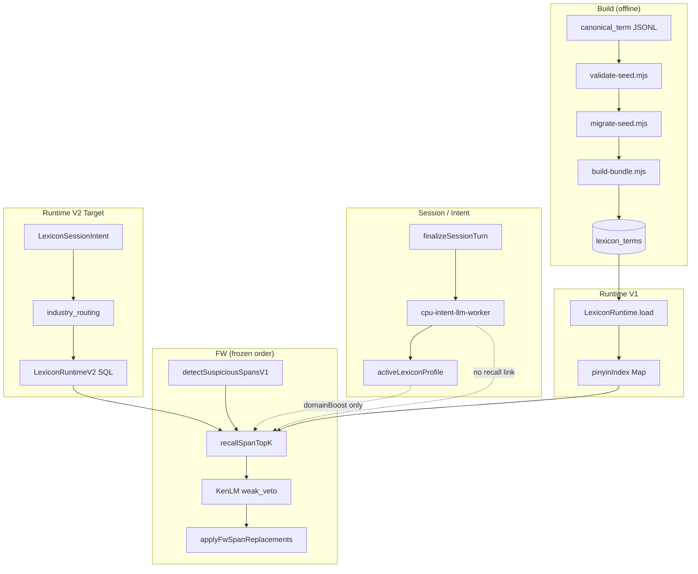

# Lexicon Runtime V2 — 开发前只读代码审计报告

**版本：** V1.0（只读，无代码变更）  
**日期：** 2026-05-30  
**审计依据：** 当前仓库源码 + [词库_Runtime_V2_SessionIntentSSOT_技术方案_2026_05_30.md](./词库_Runtime_V2_SessionIntentSSOT_技术方案_2026_05_30.md)  
**主链状态：** ASR → FW_SPAN_DETECTOR → AGGREGATION → DEDUP → TRANSLATION **已冻结**  
**业务 SSOT：** `ctx.segmentForJobResult`

---

## 1. 执行摘要

| 问题 | 结论 |
|------|------|
| **是否可以进入 Runtime V2 Phase 0？** | **可以**。现有 build 管线（validate / migrate / checksum / manifest）可复用；Phase 0 仅新增 shadow build + stats，**不替换** `LexiconRuntime`，**不触碰** FW 主链。 |
| **Phase 0 是否影响主链？** | **否**。Phase 0 为离线脚本产物 + 报告；runtime 仍走 V1 全量 load。 |
| **当前最大风险** | ① V1 全量内存 load 无规模上界；② Session Intent 与 recall **未接通**；③ `matchEnabledDomain` 对 `general` **硬拒绝** 与 P1.3 base 包（全 `general`）冲突；④ 改 recall 必触 `fw-topk-decision-pipeline` / `local-span-recall`，需 freeze 例外 + dialog_200。 |

**最小可行开发路径（MVP 路线）：**

```text
Phase 0  shadow build + validate + stats（零 runtime 切换）
Phase 1  LexiconRuntimeV2 并行 + feature flag（SQL 按 pinyin_key，LRU cache）
Phase 2  LexiconSessionIntent 写入 + diagnostics（仍用 V1 recall）
Phase 3  recallSpanTopKV2：base ∪ domain（KenLM 后置不变）
Phase 4  industry_routing_lexicon + Session topicKeywords 定域
```

---

## 2. 当前 Build Pipeline 现状

### 2.1 入口与调用链

| 命令 | 入口文件 | 实际执行 |
|------|----------|----------|
| `npm run lexicon:validate` | `scripts/lexicon/validate-lexicon-seed.mjs` | `lib/validate-seed.mjs` → `validateSeedFiles` |
| `npm run lexicon:build` | `scripts/lexicon/build-for-electron.mjs` | `rebuild-sqlite-for-electron` + `build-lexicon-bundle.mjs` |
| `npm run lexicon:build:raw` | `scripts/lexicon/build-lexicon-bundle.mjs` | validate → migrate → `lib/build-bundle.mjs` |
| `npm run lexicon:patch-merge` | `scripts/lexicon/patch-merge.mjs` | `lib/patch-merge.mjs` |
| `npm run lexicon:report` | `scripts/lexicon/report.mjs` | 读 manifest + verify checksum → `bundle-report.json` |

### 2.2 SQLite Schema 定义位置

**唯一 SSOT：** `scripts/lexicon/lib/build-bundle.mjs` → `buildSqliteBundle()`

当前 **仅一张表** `lexicon_terms`：

```sql
CREATE TABLE lexicon_terms (
  id TEXT PRIMARY KEY,
  word TEXT NOT NULL,
  normalized TEXT NOT NULL,
  pinyin TEXT NOT NULL,           -- 空格分隔音节字符串，非 pinyin_key 列
  prior_score REAL NOT NULL,
  frequency INTEGER DEFAULT 1,
  domain TEXT,
  domains TEXT,                   -- JSON 数组字符串
  aliases TEXT NOT NULL DEFAULT '[]',
  source TEXT,
  updated_at INTEGER NOT NULL,
  tags TEXT,
  repair_target INTEGER NOT NULL DEFAULT 0,
  enabled INTEGER DEFAULT 1
);
CREATE INDEX idx_lexicon_terms_word ON lexicon_terms(word);
```

| 审计项 | 结论 |
|--------|------|
| 是否只有 `lexicon_terms` 单表？ | **是** |
| 是否有 `pinyin_key` 字段？ | **否**；build 时 `pinyinSyllables()` 统计 index 键，**不落库** |
| pinyin 如何存储？ | migrate 后 **空格分隔** 字符串（如 `zhong bei`），runtime `parsePinyinField` 再拆为 `string[]` |
| checksum | `lib/checksum.mjs`：`sha256(lexicon.sqlite)` → manifest.checksum + checksum.txt |
| schemaVersion | `lib/constants.mjs`：`LEXICON_SCHEMA_VERSION = 'final-v1'` 写入 manifest |
| bundle_tag | `build-lexicon-bundle.mjs`：`process.env.BUNDLE_TAG \|\| 'final-v1-from-seed'` |

### 2.3 profile-registry 与 validate

- 路径：`data/lexicon/profile-registry.json`
- 加载：`lib/domain-registry.mjs` → `loadDomainRegistry` / `validateDomainId` / `normalizeDomains`
- validate 行为：未知 domain → **error**；disabled domain → **error**；缺省 domains → **`general`**
- **与 FW 的脱节：** seed 可标 `general`，但 FW `matchEnabledDomain` 对含 `general` 的词条 **硬拒绝**

### 2.4 rejected.jsonl / stats / bucket report

| 能力 | 现状 |
|------|------|
| `rejected.jsonl` | **无**；拒绝行仅进入 `validation-report.json` 的 errors |
| `stats.json` | build 管线 **无**；P1.3 资产包手工维护；`lexicon:report` 产出 `bundle-report.json` |
| bucket report | **无** 独立报告；manifest 含 `pinyinIndexCount`、`domainDistribution`、`priorScoreByDomain` |
| validation report | `validation-report.json`（validate/build 均写） |

### 2.5 多 seed 合并

| 机制 | 实现 |
|------|------|
| 目录输入 | `lib/paths.mjs` `resolveInputFiles`：目录下所有 `.jsonl` 排序合并 |
| 同行合并 | `lib/migrate-seed.mjs`：按 **word** dedupe，`mergeCanonical` 合并 domains/aliases/prior |
| patch 合并 | `lib/patch-merge.mjs` + `patch-merge.mjs` CLI |
| base/idiom/domain 分层 | **构建期 seed 组织**（如 P1.3 分包）；migrate 后 **层信息丢失**，仅留 `domains` 标签 |

### 2.6 Phase 0 Shadow Build — 复用与新增建议

**可复用（不修改行为，仅 import）：**

| 模块 | 路径 |
|------|------|
| validate | `lib/validate-seed.mjs`、`lib/domain-registry.mjs` |
| pinyin 规范 | `lib/pinyin-complete.mjs`（`pinyinSyllables`）、runtime `syllablesKey` 规则需 **文档对齐** |
| checksum | `lib/checksum.mjs` |
| parse row | `lib/parse-rows.mjs` |
| prior | `lib/prior-score.mjs` |

**建议新增（Phase 0 专用，不动 V1）：**

| 文件 | 职责 |
|------|------|
| `scripts/lexicon/lib/v2-classify-row.mjs` | 2/3 字 base、4 字 idiom、domain 专词分类 + reject 规则 |
| `scripts/lexicon/lib/build-v2-shadow-bundle.mjs` | 写四表 + `manifest_v2.json` + checksum |
| `scripts/lexicon/build-lexicon-v2-shadow.mjs` | CLI：`--input` `--output node_runtime/lexicon/v2_shadow` |
| `scripts/lexicon/lib/v2-shadow-stats.mjs` | bucket 分布、表行数、reject 汇总 → `stats_v2.json` |

**npm script 建议名：** `lexicon:build:v2-shadow`（与 `lexicon:build` 并存）

---

## 3. 当前 Runtime 现状

### 3.1 加载路径

```text
ensureLexiconRuntimeLoaded()          // lexicon-runtime-holder.ts（单例）
  → new LexiconRuntime().load()
      → resolveLexiconBundleDir()     // LEXICON_BUNDLE_PATH 或 PROJECT_ROOT/node_runtime/lexicon/current
      → readManifest + verifySqliteChecksum
      → better-sqlite3 readonly
      → SELECT ... FROM lexicon_terms  // 全表，无 WHERE
      → mapHotwordRow → HotwordEntry[]
      → buildHotwordPinyinIndex(indexable)
      → buildExactWordIndex / buildAliasIndexes
      → db 保持打开但 recall 不再查询
```

### 3.2 审计问答

| # | 问题 | 结论 |
|---|------|------|
| 1 | 是否全表 SELECT？ | **是** |
| 2 | 内存结构 | `Map<string, HotwordEntry[]>` ×3（pinyin / exact / alias）+ `hotwordsById` |
| 3 | 是否支持 reload？ | `load()` 内 `close()` 后重建；holder **单例**，无版本热切换 API |
| 4 | bundle version？ | 读 `manifest.version` / `schemaVersion` 写入 state；**无**按版本选 bundle 逻辑 |
| 5 | 多 bundle？ | **否**；单路径 `current` |
| 6 | 按 domain load？ | **否** |
| 7 | Runtime SQL 查询？ | load 后 **不查**；仅 startup 一次 SELECT |
| 8 | pinyin bucket key | **`zhong|bei`**（`syllablesKey`：`normalizeSyllable` 后 `\|` 连接） |
| 9 | per-bucket 上限 | bucket **无硬 cap**；`lookupTopKByPinyin` 按 `topK` slice（FW 默认 3） |
| 10 | termLength 过滤 | `word.length === syllables.length`（2–5 字 span） |

### 3.3 lookupTopKByPinyin

**输入：** `{ syllables, windowText, termLength, topK, profile? }`  
**输出：** `{ hits: LexiconTopKHit[], maxDomainBoostApplied }`  
**排序：** `candidateScore` 降序（prior + phonetic + domainBoost − editPenalty），再 `slice(0, topK)`  
**路径：** exact pinyin bucket + alias pinyin bucket；latin 走 `lookupExactLatin`

### 3.4 LexiconRuntimeV2 最小 API 建议（不影响 V1）

```typescript
/** V2 只读查询面 — 供 recallSpanTopKV2 / shadow 对比使用 */
export interface LexiconRuntimeV2Query {
  lookupBaseByPinyinKey(key: string, termLength: number, topK: number): HotwordEntry[];
  lookupDomainByPinyinKey(domainId: string, key: string, termLength: number, topK: number): HotwordEntry[];
  lookupIdiomByPinyinKey(key: string, termLength: number, topK: number): HotwordEntry[];
  lookupIndustryRoutes(pinyinKeys: readonly string[]): IndustryRouteHit[];
  getManifestV2(): LexiconManifestV2;
  getState(): LexiconRuntimeV2State;
}

/** Feature flag: features.lexiconRuntimeV2.enabled + bundle path 分离 */
```

- V1 `LexiconRuntime` / holder **保持不变**  
- FW 在 Phase 3 前仍调用 V1；Phase 3 通过 flag 在 `local-span-recall.ts` 内部分派

---

## 4. 当前 FW Recall 现状

### 4.1 调用链（冻结边界内）

```text
fw-detector-step.ts
  → fw-detector-orchestrator.ts
      detectSuspiciousSpansV1          // 禁止含 recallSpanTopK（freeze-contract ✓）
      runFwTopKDecisionPipeline      // 唯一决策链 SSOT
  → local-span-recall.recallSpanTopK
  → kenlm-span-gate (weak_veto)      // recall 之后
  → pickApprovedReplacementsGreedy
  → applyFwSpanReplacements → ctx.segmentForJobResult
```

**recallSpanTopK 调用点：** 仅 `fw-topk-decision-pipeline.ts:232-238`

### 4.2 recallSpanTopK 参数

| 参数 | 来源 |
|------|------|
| `runtime` | `getLexiconRuntime()` |
| `spanText` | `span.text` |
| `profile` | `getProfileSnapshotFromContext(ctx) ?? defaultGeneralProfile()` |
| `topK` | `config.topK`（默认 3） |
| `minPrior` | `config.minPrior`（默认 0.5） |
| `enabledDomains` | ctx override 或 `config.enabledDomains` |

### 4.3 candidateRequireRepairTarget

- 配置：`fw-config.ts`，默认 **true**
- 生效点：`fw-topk-decision-pipeline.ts:255-257` — **pick 池**过滤，非 recall 过滤
- `repairTarget === false`：**可进入 recall hits**，但 **不可被 pick**（当 flag true 时）

### 4.4 KenLM weak_veto 位置

| 阶段 | 顺序 |
|------|------|
| recall | 先 `recallSpanTopK` |
| score | `scoreRecallHits` → `scoreSpanCandidateSentences` |
| veto | `evaluateKenlmDecision` mode=`weak_veto`：`delta < vetoThreshold` → vetoed |
| pick | veto 后 `finalScore=0`，再 `pickBestCandidatePerSpan` |

**约束：Phase 3+ 不得改 `kenlm-span-gate.ts` weak_veto 语义。**

### 4.5 base ∪ domain 双路 recall — 最小改动点

| 层级 | 可否改 | 说明 |
|------|--------|------|
| `suspicious-span-detector-v1.ts` | **否** | freeze：无 lexicon |
| `fw-detector-orchestrator.ts` detect/apply | **否** | 仅 orchestrate |
| `fw-topk-decision-pipeline.ts` | **慎改** | 可改 **recall 调用**（换 `recallSpanTopKV2`），KenLM/pick 结构不变 |
| **`local-span-recall.ts`** | **是（首选）** | 内部 V1 bucket 或 V2 双路 merge → 统一 `LocalSpanRecallHit[]` |
| `domain-filter.ts` | Phase 3 可 **旁路** | V2 应用 **tier 路由** 替代 `general` 硬拒绝（见 §8.7） |

### 4.6 freeze-contract / fw-gate 需新增断言（建议）

| 断言 | 目的 |
|------|------|
| Detector 仍无 `recallSpanTopK` | 主链分层 |
| orchestrator 仍 `runFwTopKDecisionPipeline` | 决策链 SSOT |
| `kenlmGateMode === 'weak_veto'` 默认不变 | KenLM 冻结 |
| pipeline steps 顺序不变 | 主链 |
| Phase 3 起：`local-span-recall` 若 flag 开，必须有 V2 单测 + dialog_200 | 防劣化 |
| **禁止** `local-span-recall` import `legacy/recover` | Recover 隔离 |

现有 gate：`scripts/fw-detector-gate.mjs`、`main/src/fw-detector/freeze-contract.test.ts`

---

## 5. 当前 Session Intent / CPU LLM 现状

### 5.1 配置默认值

```typescript
// node-config-defaults.ts
lexiconV2: {
  enabled: false,        // ← 总开关关闭
  intentEnabled: true,   // 仅 enabled=true 时有效
  intentMode: 'cpu_llm',
  cpuWorker: { serviceUrl: 'http://127.0.0.1:5018', ... }
}
```

### 5.2 CPU LLM 服务启动

| 环节 | 路径 |
|------|------|
| 服务定义 | `services/lexicon_intent_cpu/service.json`（id: `lexicon-intent-cpu`, port 5018） |
| Python | `services/lexicon_intent_cpu/service.py` + `intent_engine.py` |
| 进程 | `ServiceProcessRunner-internal.ts` → `MODEL_PRELOAD_SERVICES` 含该服务 |
| Node 客户端 | `lexicon-v2/cpu-llm-model-runner.ts` → `POST /intent` |
| 调度 | `session-finalize.ts` → `enqueueIntentJob` |

### 5.3 /intent API Schema（当前）

**请求（Node 构建）：** `lexicon-intent-prompt-builder.ts`

```json
{
  "sessionId": "...",
  "currentPrimary": "general",
  "finalizedTurnCount": 3,
  "turns": [{ "turnId", "rawAsrText", "finalText", "activeProfileAtTurn", "recoverStats" }],
  "allowedDomains": [{ "id", "displayName", "enabled", "allowLLMSelect" }],
  "promptPackVersion": "v1"
}
```

**响应（LLM JSON，经 parser 校验）：**

```json
{
  "summary": "...",
  "primaryDomain": "restaurant",
  "secondaryDomains": [],
  "confidence": 0.86,
  "shouldSwitch": true,
  "reason": ["..."],
  "effectiveFromTurn": 4
}
```

| 审计项 | 结论 |
|--------|------|
| 是否有 `topicKeywords`？ | **否**（代码与 prompt 均无） |
| LLM 直接 pick 词条？ | prompt 明确禁止（Rule 4） |

### 5.4 Session 写入字段（Intent 成功时）

| 字段 | 写入位置 | 内容 |
|------|----------|------|
| `lexiconIntentSummary` | `session-finalize.ts:196` | `{ summary, updatedAt }` |
| `lastIntentAtMs` | 同上 | timestamp |
| `pendingProfile` | `stagePendingProfile` | 下一 turn 生效的 profile |
| `profileHistory` | `appendProfileHistory` | 切换审计 |
| `intentDiagnostics` | `recordIntentOutcome` | outcome / health |

**未写入：** `topicKeywords`、`lexiconSessionIntent`、routing 缓存

### 5.5 Profile → JobContext → FW

```text
beginTurnForJob (session-finalize)
  → activatePendingProfileForTurn
  → bindProfileSnapshotToContext(ctx, snapshot)   // turn-profile-binding.ts

fw-detector-orchestrator
  → profile = getProfileSnapshotFromContext(ctx) ?? defaultGeneralProfile()
  → runFwTopKDecisionPipeline({ profile, ... })

domainBoost: candidate-score.ts → computeDomainBoost(profile, hotword.domains)
```

**FW 不读取** `lexiconIntentSummary`；**不读取** session 对象（仅 ctx profile）

### 5.6 LexiconSessionIntent 放置建议

| 项 | 建议 |
|----|------|
| 类型定义 | `main/src/session-runtime/types.ts`（与 `LexiconProfileDecision` 同文件） |
| Session 字段 | `SessionObject.lexiconSessionIntent?: LexiconSessionIntent` |
| JobContext | Phase 2 起：`lexiconSessionIntent?: Readonly<LexiconSessionIntent>`（`job-context.ts`） |
| 绑定 | `turn-profile-binding.ts` 扩展 `bindLexiconSessionIntentToContext` |
| `lexiconIntentSummary` | Phase 2 **双写**；Phase 4 弃用 |

### 5.7 topicKeywordPinyinKeys 计算

**应在 Node 侧统一计算**（与 FW 一致）：

```typescript
import { textToSyllables } from '../lexicon/phonetic/pinyin';
import { syllablesKey } from '../lexicon/pinyin-index';

function topicKeywordPinyinKeys(keywords: string[]): string[] {
  return keywords
    .map((kw) => syllablesKey(textToSyllables(kw.trim())))
    .filter((k) => k.length > 0);
}
```

- **单字 keyword：** syllables 长度 1 → key 如 `bei`；可用于 industry routing，**不进入** base_lexicon recall（base 不收 1 字）
- **禁止** LLM 输出 pinyin 字符串作为 SSOT（易与 `syllablesKey` 不一致）

### 5.8 保证 LLM 不参与词条 pick

| 机制 | 现状 | 目标 |
|------|------|------|
| Prompt Rule 4 | 禁止生成 replacement | 保持 |
| 决策链 | pick 仅来自 `recallSpanTopK` + KenLM | 保持 |
| LLM 输出 | 仅 profile + summary | 扩展 topicKeywords **仍不输出词条** |
| 代码隔离 | Intent 模块无 `lookupTopKByPinyin` import | gate 断言保持 |

---

## 6. Domain / Industry Routing 现状

### 6.1 组件职责

| 组件 | 路径 | 作用 |
|------|------|------|
| `domain_anchor.json` | `data/lexicon/domain_anchor.json` | FW **Detector** 信号 `domain_anchor_nearby` |
| `profile-registry.json` | `data/lexicon/profile-registry.json` | validate 域白名单 + LLM `allowLLMSelect` |
| `domain-filter.ts` | `matchEnabledDomain` | **`general` 硬拒绝**；否则 domains ∩ enabledDomains |
| `enabledDomains` | 默认 `['tech_ai','travel','transport','restaurant']` | FW recall 硬白名单 |
| `domainBoost` | `domain-boost-calculator.ts` | primary ×0.12，secondary ×0.06，max 0.2 |

### 6.2 industry_routing_lexicon 建议形态

| 选项 | 建议 |
|------|------|
| Build 表 | **是** — 与 V2 bundle 同库，离线从 domain 锚词 + 人工 curation 生成 |
| Runtime | Phase 4 前：**只读 SQL** `WHERE pinyin_key IN (...)`；热点 key **LRU** |
| 数据源 | LLM `topicKeywords` 拼音键 + 可选静态 seed |

### 6.3 定域 Fallback（目标）

```text
1. lexiconSessionIntent.primaryDomain（confidence ≥ 0.75）
2. else industry_routing 命中加权最高 domain_id
3. else domain_anchor 统计（source=fallback_anchor）
4. else enabledDomains 全量 union（Phase 3 前等同 V1）
5. 永不 fallback 到 general 词条表（V2 无 general tier）
```

### 6.4 LLM domain vs routing 冲突

**建议策略（需 DEC）：** LLM `primaryDomain` 优先；routing 仅作 **校验/secondary**；冲突时 `confidence < 0.75` 则不切换并打 `intentDiagnostics` 标记。

### 6.5 general 硬拒绝与 V2 原则

**现状问题：** `domains.includes('general')` → recall **全部拒绝**（P1.3 v1 包死锁）

**V2 目标（约束 #9）：**  
- **不再**用 `general` 标签作 FW 绕路/过滤键  
- base_lexicon **无 domain 字段**（tier=`base`）  
- domain_lexicon **必须**显式 `domain_id`  
- V2 recall **不走** `matchEnabledDomain(..., general)` 逻辑；改 tier + session 路由

---

## 7. Runtime V2 Schema 建议（基于现有 canonical_term 映射）

### 7.1 表结构草案

#### base_lexicon

| 列 | 类型 | 说明 |
|----|------|------|
| pinyin_key | TEXT | **索引键**，`syllablesKey`，如 `zhong|bei` |
| id | TEXT | PK 或与 pinyin_key+word 复合 |
| word | TEXT | 2–3 字 CJK |
| normalized | TEXT | |
| prior_score | REAL | |
| repair_target | INTEGER | 0/1 |
| aliases | TEXT | JSON array |
| source | TEXT | |
| enabled | INTEGER | |

**索引：** `CREATE INDEX idx_base_pinyin ON base_lexicon(pinyin_key);`  
**约束：** word 长度 ∈ {2,3}；**禁止** domain 列；**禁止** 1 字 / 普通 4 字 / 5+ 短语

#### idiom_lexicon

| 列 | 类型 | 说明 |
|----|------|------|
| pinyin_key | TEXT | 4 音节键 |
| word | TEXT | 4 字成语/熟语 |
| … | | 同 base |

**索引：** `idx_idiom_pinyin (pinyin_key)`

#### domain_lexicon

| 列 | 类型 | 说明 |
|----|------|------|
| domain_id | TEXT | profile-registry id，**非 general** |
| pinyin_key | TEXT | |
| word | TEXT | 行业/专名/专词 |
| prior_score | REAL | |
| repair_target | INTEGER | |
| aliases | TEXT | |

**PK/索引：** `PRIMARY KEY (domain_id, word)` + `INDEX (domain_id, pinyin_key)`

#### industry_routing_lexicon

| 列 | 类型 | 说明 |
|----|------|------|
| pinyin_key | TEXT | 来自 topicKeyword |
| domain_id | TEXT | |
| weight | REAL | 可选 |
| keyword | TEXT | 原中文（审计） |

**索引：** `INDEX (pinyin_key)`

### 7.2 manifest_v2 草案

```json
{
  "schemaVersion": "lexicon-v2-shadow-v1",
  "buildTime": 0,
  "bundle_tag": "v2-shadow",
  "checksum": "sha256:...",
  "tables": {
    "base_lexicon": { "rowCount": 0, "pinyinKeyCount": 0 },
    "idiom_lexicon": { "rowCount": 0 },
    "domain_lexicon": { "rowCount": 0, "byDomain": {} },
    "industry_routing_lexicon": { "rowCount": 0 }
  },
  "profileRegistryVersion": "hash or path",
  "rejectStats": { "one_char": 0, "four_char_non_idiom": 0, "mixed_into_base": 0 }
}
```

### 7.3 canonical_term JSONL → V2 映射

| JSONL 字段 | base | idiom | domain |
|------------|------|-------|--------|
| `word` | len 2–3 | len 4 + idiom tag/规则 | 其余专业词 |
| `domains[]` | **忽略**（不得进 base） | 可选 | **必须**非 general |
| `pinyin` | → pinyin_key | 同 | 同 |
| `repairTarget` | 同列 | 同 | 同 |
| `aliases` | JSON | 同 | 同 |

**pinyin_key 生成位置：** build 脚本 `syllablesKey(pinyinSyllables(row.pinyin))` — **与 runtime `syllablesKey` 对齐**（审计发现 build 用 `join('|')` on syllables，runtime 用 `syllablesKey` — **已一致**）

### 7.4 alias 存储

- V1：SQLite `aliases` JSON + runtime `buildAliasIndexes` 展开为 alias pinyin bucket  
- V2 建议：各表保留 `aliases` JSON；runtime 查询 pinyin_key 时 **UNION** canonical + alias 键（或 build 时物化 alias 行）

---

## 8. LexiconSessionIntent Schema 建议

```typescript
export type LexiconSessionIntent = {
  summary: string;
  topicKeywords: string[];
  topicKeywordPinyinKeys: string[];
  primaryDomain: string;
  secondaryDomains: string[];
  confidence: number;
  updatedAt: number;
  effectiveFromTurn: number;
  source: 'cpu_llm' | 'manual' | 'fallback_anchor';
  reason: string[];
};
```

| 字段 | SSOT 用途 |
|------|-----------|
| `primaryDomain` | domain_lexicon 路由 |
| `topicKeywordPinyinKeys` | industry_routing_lexicon 查询 |
| `summary` | 可观测 / 人工审计 |
| `source` | fallback 策略区分 |

**CPU LLM 扩展输出（Phase 2）：**

```json
"topicKeywords": ["咖啡", "中杯", "外卖"]
```

Node 解析后立即计算 `topicKeywordPinyinKeys` 再写 Session。

---

## 9. Phase 0–4 迁移方案

### Phase 0 — Shadow Build（**可立即进入**）

| 项 | 内容 |
|----|------|
| 修改文件 | **无**（仅新增 scripts） |
| 新增 | `build-v2-shadow-bundle.mjs`、`build-lexicon-v2-shadow.mjs`、`v2-classify-row.mjs`、`v2-shadow-stats.mjs` |
| 触碰主链 | **否** |
| Feature flag | 不需要 |
| 回滚 | 删除 shadow 输出目录 |
| 测试 | V2 schema build test；base 2/3 字；idiom 4 字；reject stats |

### Phase 1 — LexiconRuntimeV2 并行

| 项 | 内容 |
|----|------|
| 修改 | `lexicon-runtime-holder.ts`（可选 factory）；**不改** V1 class |
| 新增 | `lexicon-runtime-v2.ts`、`lexicon-runtime-v2-holder.ts`、`lexicon-types-v2.ts` |
| 触碰主链 | **否**（V2 未接入 FW） |
| Flag | `features.lexiconRuntimeV2.enabled` + `bundlePath` |
| 回滚 | flag false |
| 测试 | SQL query test；LRU test；memory benchmark |

### Phase 2 — LexiconSessionIntent（diagnostics only）

| 项 | 内容 |
|----|------|
| 修改 | `types.ts`、`session-finalize.ts`、`lexicon-profile-decision-parser.ts`、`prompt_templates.py`、`cpu-llm-model-runner` 消费链、`job-context.ts`、`turn-profile-binding.ts`、`session-result-extra.ts` |
| 触碰主链 | **否**（recall 仍 V1） |
| Flag | `lexiconV2.enabled` + `sessionIntentWriteEnabled` |
| 回滚 | flag false；字段可空 |
| 测试 | Intent 写入 test；topicKeywords→pinyinKey test |

### Phase 3 — base ∪ domain 双路 recall

| 项 | 内容 |
|----|------|
| 修改 | **`local-span-recall.ts`**（首选）；`fw-topk-decision-pipeline.ts` 仅当 API 签名变化 |
| 触碰主链 | **行为变更**（候选集），步骤顺序 **不变** |
| Flag | `features.fwDetector.useLexiconRuntimeV2Recall` |
| 回滚 | flag false → V1 recall |
| 测试 | merge test；KenLM weak_veto 不变 test；dialog_200；p95 recall |

### Phase 4 — industry_routing + 定域

| 项 | 内容 |
|----|------|
| 修改 | `local-span-recall.ts` 路由；可选 `industry-routing.ts`；Session 读取 |
| 触碰主链 | 同 Phase 3 |
| Flag | `useIndustryRouting` |
| 回滚 | Phase 3 行为 |
| 测试 | routing keyword→domain；定域错误 fallback；no degradation |

---

## 10. 文件级改造清单（汇总）

### 10.1 仅 Phase 0 新增

```
scripts/lexicon/build-lexicon-v2-shadow.mjs
scripts/lexicon/lib/build-v2-shadow-bundle.mjs
scripts/lexicon/lib/v2-classify-row.mjs
scripts/lexicon/lib/v2-shadow-stats.mjs
tests/lexicon/v2-shadow-build.test.ts        // 或 jest under main/
```

### 10.2 Phase 1–4 新增/修改（按优先级）

| P | 新增 | 修改 |
|---|------|------|
| P1 | `lexicon-runtime-v2.ts`, holder, types-v2 | `node-config-types.ts`, defaults（flag） |
| P2 | — | `session-runtime/types.ts`, `session-finalize.ts`, `lexicon-v2/*`, `job-context.ts`, `turn-profile-binding.ts` |
| P3 | `recall-span-v2.ts`（可选） | `local-span-recall.ts`, `domain-filter.ts`（V2 旁路） |
| P4 | `industry-routing.ts` | `local-span-recall.ts`, shadow build routing 表 |

### 10.3 冻结不可改（审计确认）

- `suspicious-span-detector-v1.ts` detect 逻辑  
- `applyFwSpanReplacements` / `segmentForJobResult` SSOT  
- `kenlm-span-gate.ts` weak_veto 语义  
- pipeline step 顺序  
- `legacy/recover/**` 不得回流 FW  

---

## 11. 测试与门禁清单

| # | 测试 | Phase | 门禁 |
|---|------|-------|------|
| 1 | V2 schema build test | P0 | CI optional |
| 2 | base 仅 2/3 字 | P0 | shadow stats assert |
| 3 | idiom 仅 4 字 | P0 | 同上 |
| 4 | domain domain_id+pinyin_key 查询 | P1 | unit |
| 5 | industry_routing keyword→domain | P4 | unit |
| 6 | LexiconRuntimeV2 SQL test | P1 | unit |
| 7 | LRU cache test | P1 | unit |
| 8 | LexiconSessionIntent 写入 | P2 | unit + smoke |
| 9 | topicKeywords→pinyinKey | P2 | unit |
| 10 | FW base∪domain merge | P3 | unit |
| 11 | KenLM weak_veto 不变 | P3 | 现有 `kenlm-span-gate` test + freeze-contract |
| 12 | dialog_200 全量 | P3+ | `run-fw-detector-dialog-200-batch` |
| 13 | memory benchmark | P1 | 脚本 |
| 14 | p95 recall latency | P3 | benchmark |
| 15 | no degradation | P3+ | apply 率 / 误修 golden |

**现有可复用 gate：** `scripts/fw-detector-gate.mjs`、`freeze-contract.test.ts`、`npm run lexicon:v3-gate`

---

## 12. Target List（P0–P3）

### P0（Shadow，零 runtime 风险）

- [ ] `lexicon:build:v2-shadow` CLI  
- [ ] 四表 + manifest_v2 + checksum  
- [ ] `stats_v2.json`（reject / bucket / byDomain）  
- [ ] base 2/3、idiom 4、domain 分流 validate  
- [ ] 与 V1 `combined_entries` 对比 diff 报告  

### P1（Runtime V2 查询面）

- [ ] `LexiconRuntimeV2` + SQL + LRU  
- [ ] feature flag + 独立 bundle 路径  
- [ ] memory / p95 micro-benchmark  

### P2（Session Intent SSOT）

- [ ] `LexiconSessionIntent` 类型 + 写入  
- [ ] LLM `topicKeywords` schema  
- [ ] Node `topicKeywordPinyinKeys`  
- [ ] `result.extra` diagnostics（仍不改 recall）  
- [ ] 启用 `lexiconV2.enabled` 生产 checklist  

### P3（Recall 切换）

- [ ] `recallSpanTopK` V2 双路 merge  
- [ ] 移除 V2 路径对 `general` 硬拒绝依赖  
- [ ] dialog_200 + freeze 例外文档  
- [ ] fw-gate 新增 V2 flag 测试  

### P4（Industry Routing）

- [ ] industry_routing_lexicon 表 + 查询  
- [ ] Session topicKeywords 定域  
- [ ] fallback_anchor 与 LLM 冲突策略  

---

## 13. Check List（开发前确认）

- [ ] 主链步骤顺序未变  
- [ ] `segmentForJobResult` SSOT 未变  
- [ ] Recover / legacy/recover 未接入 FW  
- [ ] KenLM weak_veto 未改  
- [ ] V1 LexiconRuntime 仍默认  
- [ ] Phase 0 无 runtime 替换  
- [ ] base 不含专业词 / 1 字 / 普通 4 字  
- [ ] general 不作为 V2 FW 过滤绕路  
- [ ] LLM 不输出 repair 词条  
- [ ] 每项 Phase 有 flag + 回滚  

---

## 14. 开发风险与回滚

| # | 风险 | 缓解 | 回滚 |
|---|------|------|------|
| 1 | SQL 比 Map 慢 | prepared statement + LRU hot bucket | flag → V1 |
| 2 | bucket 过大 | build 时 per-key cap + prior 截断 | shadow stats 预警 |
| 3 | domain_lexicon 过大 | 按 session domain 只查单域表 | SQL WHERE domain_id |
| 4 | Intent 错域误修 | confidence 门限 + KenLM + repairTarget | 降域 confidence |
| 5 | topicKeywords 不稳定 | 长度/字符校验；fallback_anchor | 忽略 routing |
| 6 | base∪domain 候选污染 | merge dedupe by word；prior 排序 | V1 单 bucket 对照 |
| 7 | KenLM 候选增多 | topK 仍 3；merge 后再 slice | 限制 merge 上限 |
| 8 | FW 劣化 | dialog_200 + golden false repair | flag off |
| 9 | general 死锁再现 | V2 不用 general tier | 数据规范 |
| 10 | ABI sqlite | `lexicon:rebuild-sqlite` 文档 | 同 V1 |

---

## 15. 需要决策的问题

| ID | 问题 | 审计建议 |
|----|------|----------|
| DEC-V2-1 | Phase 0 shadow 输出目录 | `node_runtime/lexicon/v2_shadow/` |
| DEC-V2-2 | idiom 识别规则 | tag `idiom` + 4 字 + 可选 allowlist |
| DEC-V2-3 | Phase 3 是否含 idiom_lexicon recall | span len=4 时第三路查询 |
| DEC-V2-4 | LLM vs routing 冲突 | LLM primary 优先，routing 校正 |
| DEC-V2-5 | `lexiconV2.enabled` 生产默认 | P2 完成后 true |
| DEC-V2-6 | FW freeze 例外范围 | 仅允许 `local-span-recall` + runtime 数据源 |
| DEC-V2-7 | merge 上限 | 建议 merge 后 ≤ `topK * 2` 再 KenLM |

---

## 16. 代码边界图（真实依赖）



---

## 17. 附录：关键词索引命中摘要

| 关键词 | 主文件 |
|--------|--------|
| `LexiconRuntime` | `lexicon-runtime.ts`, `lexicon-runtime-holder.ts` |
| `lexicon_terms` | `build-bundle.mjs`, `lexicon-runtime.ts` |
| `buildHotwordPinyinIndex` | `pinyin-index.ts` |
| `syllablesKey` | `pinyin-index.ts` |
| `lookupTopKByPinyin` | `pinyin-topk-lookup.ts` |
| `recallSpanTopK` | `local-span-recall.ts` ← **V2 最小侵入点** |
| `matchEnabledDomain` | `domain-filter.ts` |
| `computeDomainBoost` | `domain-boost-calculator.ts` |
| `LexiconProfileDecision` | `session-runtime/types.ts` |
| `lexiconIntentSummary` | `session-finalize.ts:196` |
| `topicKeywords` | **仅文档**；代码 **未实现** |
| `weak_veto` | `kenlm-span-gate.ts`, `fw-config.ts` |
| `legacy/recover` | 隔离；FW gate 禁止 import |

---

**审计结论：** 仓库 **具备** Phase 0 全部前置（validate/migrate/checksum/manifest）；**不具备** V2 四表、Session Intent SSOT、行业 routing 运行时。**可以立即启动 Phase 0 shadow build**；Phase 3 起需 FW 冻结合约例外与全量回归。

**关联文档：**

- [词库_Runtime_V2_SessionIntentSSOT_技术方案_2026_05_30.md](./词库_Runtime_V2_SessionIntentSSOT_技术方案_2026_05_30.md)  
- [../ASR_unity/词库架构_Session意图与行业词库_只读审计报告_2026_05_30.md](../ASR_unity/词库架构_Session意图与行业词库_只读审计报告_2026_05_30.md)
