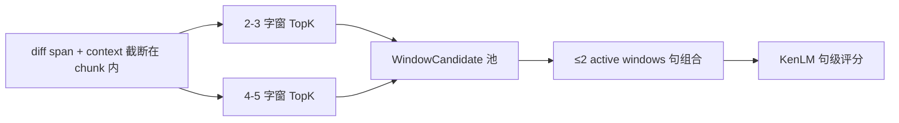

# Recover V5 冻结决策（产品 / 架构）

**版本**：V5-Frozen-Decisions  
**日期**：2026-05-22  
**状态**：已确认，覆盖 Phase A–E 补充文档中的待定项  
**依据**：[Recover V5 冻结方案.md](./Recover%20V5%20冻结方案.md)、[只读审计](./Recover_V5_Readonly_Code_Audit_2026-05-22.md)

---

## 决策总表

| ID | 决策 | 冻结值 / 行为 |
|----|------|----------------|
| D-01 | V5 与 V4 recall 主链 | **彻底替换**（非并行、非 observed 主路径保留） |
| D-02 | Near pinyin | **允许**，严格限额（非全表、非无限 near_phoneme） |
| D-03 | Active windows | **固定 2**（第一版不可配置为 3+） |
| D-04 | Runtime 学习 | **绝对禁止** |
| D-05 | 英文 token | **仅 exact token lookup**（bundle 显式 pinyin，禁止 runtime 拼音化） |
| D-06 | KenLM baseline 容差 | **`kenlmBaselineTolerance = 0.15`**（冻结默认） |
| D-07 | 窗与 chunk | **禁止跨 chunk**；**仅在 diff context 内** 做 2–3 / 4–5 **双尺度**（禁止整 chunk / 无 diff fallback） |
| D-08 | 句级组合 | 小窗/大窗各自 TopK → 组合为 **有限 SentenceCandidate** → **仅 KenLM** 句级评分选优 |
| D-09 | 开发与发布策略 | **完全替换、单路径、无过渡版**；A–E 开发完成后 **统一集成测试**（见 §D-09） |

---

## D-09：开发策略 — 完全替换、单路径、统一测试

### 冻结（产品 / 工程确认 2026-05-22）

| 原则 | 要求 |
|------|------|
| 无过渡版 | **不**维护 V4/V5 双主链并行；**不**用 `observedRecallEnabled`、`LEXICON_LEGACY_V4`、`historical-restore-v1` 与 v5 切换跑生产 |
| 单一路径 | 删除或替换旧逻辑后，recall 仅一条调用链（diff context → 双尺度 → TopK → ≤2 窗 → KenLM → gates → 写回） |
| 开发顺序 | 仍按 **A → B → C → D → E** 实现（依赖顺序不变） |
| 测试节奏 | **允许**全部开发完成后再做 dialog_200 / 契约 **统一集成测试**；不要求每 Phase 单独跑全量批测 |

### 实施含义

**应删除或彻底改写（而非 flag 旁路）**：

- `enumerateAsrWindows` 作为 recall 主路径的调用
- `buildSegmentWindows` 中 observed/confusion 窗枚举
- `hotword-recall` 中 observed-first、`recallHotwordsByFuzzyPinyin` 全表主召回
- `augmentFromNbestSlices` 先滑窗再 slice 流程
- `RECOVER_CONTRACT_VERSION = 'historical-restore-v1'` → 直接改为 `v5-scored-lexicon-topk`（在 E 一并改 assess）

**不应保留**：

```typescript
if (useV5) { ... } else { ... }  // 禁止长期双路径
if (observedRecallEnabled) { ... }  // 禁止，observed 非主链
```

### 仍建议的最低限度（非「过渡版」）

即使统一集成测试，**每个 Phase 合并前**仍建议：

- `npm run build:main` 通过
- 本 Phase 相关 **单元测试** 提交（避免 E 阶段一次修几百处编译错误）
- A 完成后跑一次 `build-lexicon-bundle`，避免 C 才发现词库 schema 不对

这不等于维护两套行为，只是 **分阶段可编译**，降低最后统一测试的排错成本。

### 统一测试入口（E 收口）

```text
npm run build:lexicon-bundle
npm run build:main
npm run start
node tests/run-dialog-200-batch.js
node tests/run-homophone-expectation.js
npx jest …（V5 单测套件）
```

Pass 以 [Phase E](./Recover_V5_Phase_E_Observability_Tests_Batch_Contract_2026-05-22.md) + 本文 D-01～D-08 为准。

### 风险（接受则可行）

- 大 diff 一次性回归，问题定位需靠 diagnostics / 单测分层
- 开发周期内 dialog_200 可能长期红灯，直到 E 完成 — **可接受**若团队不依赖中途批测绿灯

---

## D-01：V5 彻底替换 V4 recall 主链

### 冻结

**无过渡开关**：下列路径在 V5 落地时 **移除**，而非仅在「启用 V5」时禁用：

```text
禁止作为主路径：
  enumerateAsrWindows 全段滑窗（2–8）
  observed / confusion / fuzzy_observed 窗枚举
  observed-first 的 recallHotwordsForWindow 顺序
  augmentFromNbestSlices 作为「先滑窗再 slice」的增强
```

**唯一主路径**：

```text
n-best diff → diff context（不跨 chunk）
→ 2/3 与 4/5 双尺度窗（见 D-07）
→ pinyin TopK（exact + 限额 near，见 D-02/D-05）
→ candidateScore 排序
→ ≤2 active windows 句组合
→ KenLM rerank → safety gates → applySentenceRepair
```

### 与当前代码关系

| V4 模块 | V5 处置（D-09：删除/改写，非并行） |
|---------|---------|
| `buildSegmentWindows` 四类窗 | **删除**；由 diff context 双尺度枚举替代 |
| `hotword-recall` observed / fuzzy 全表 | **删除主路径**；仅 `lookupTopKByPinyin` |
| `historical-restore-v1` 契约 | **删除**；仅 `v5-scored-lexicon-topk` |
| segment-first 坐标、`applySentenceRepair` 单次写回 | **保留** |

### 验收

- `sliding_window_count === 0`
- `lexicon_pinyin_topk` 为 **唯一** WindowCandidate 主 source（辅助 observed 计数为 0）

---

## D-02：Near pinyin（允许但限额）

### 冻结

- **允许** near pinyin，用于 CTC 差音节下的合法词召回。
- **禁止**：
  - `recallHotwordsByFuzzyPinyin` 式 **全表扫描**
  - 无上限 near_phoneme 扩展
  - near 结果绕过 priorScore / candidateScore / TopK 上限

### 实现约束

| 项 | 值 |
|----|-----|
| 音节长度差上限 | `recallFuzzyPinyinMaxSyllableDelta = 2`（沿用 quality-config，V5 可改名 `nearPinyinMaxSyllableDelta`） |
| 查找范围 | 仅 **同 termLength** 候选池；先 exact bucket，再 **索引邻居桶** 或预计算 near 表（禁止 O(N) 全库） |
| TopK | 仍受 `topKByTermLength` 约束（2/3→5，4→3，5→2） |
| source | near 命中标记 `lexicon_pinyin_topk_near` 或统一 `lexicon_pinyin_topk` + `matchType: exact\|near` |

### 与 D-05 关系

- **中文窗**：exact syllable key + 限额 near syllable。
- **英文窗**：**无 near**（仅 exact token，见 D-05）。

---

## D-03：固定 2 active windows

### 冻结

```json
{
  "maxActiveWindows": 2,
  "maxReplacements": 2,
  "maxWindowsPerSentence": 2
}
```

- **禁止** `window_multi`（3+ 替换）进入 V5 rerank 池。
- 句候选组合：仅 **single**、**pair** 两类；pair 必须为 **非重叠** span（沿用 `spansOverlap` 语义）。

### 代码对齐

- `sentence-expansion/types.ts` 的 `maxWindowsPerSentence: 4` **必须改为 2**。
- `candidate-source.ts` 在 V5 模式下 **不得** 产出 `window_multi`。

---

## D-04：绝对禁止 runtime 学习

### 冻结

Recover 运行时 **不得**：

| 禁止项 | 说明 |
|--------|------|
| 学习 priorScore | 不得用 frequency/log1p/批测统计更新词条分 |
| 学习词库 | 不得 runtime 写入 sqlite / 新增词条 |
| 用 frequency 作 TopK 排序 | 仅 manifest 中的 **priorScore** |
| `priorScoreFromFrequency` 进 V5 主路径 | 仅 **构建脚本迁移** 可用，须写入 DB 后只读 |
| observed 抬底 | `Math.max(phonetic, recallMin)` 进 TopK **禁止** |
| homophone learner 影响 recall | aggregator 学习不得回流词库 recall |

### Phase A 要求

- `terms_without_prior_count = 0` 为构建门禁。
- runtime loader：无 `prior_score` → **不索引、不召回**。

---

## D-05：英文仅 exact token lookup

### 冻结

对 **纯英文/数字 token 窗**（如 `AI`、`GPU`、`RTX4060`、`taxi`）：

```text
允许：bundle 中显式 word + pinyin（或 tokenKey）→ 精确键查找
禁止：pinyin-pro / textToSyllables 生成英文音节
禁止：英文 near pinyin / fuzzy 全表
禁止：把英文窗用中文拼音规则打分后排进 TopK
```

### 词库要求（Phase A）

- 每个英文 token 一条 `HotwordEntry`，`pinyin` 为运营维护的 lookup key（如 `ei ai`、`ji pi you` 或规范 token id）。
- `mixed_token_count` 写入 manifest。

### 窗枚举（Phase B）

- 英文 token 若出现在 diff context 内，可形成 **独立窗**（长度计入 2–5 规则：按 **字符数** 或 **token 单元** 冻结为 **字符数**，与中文一致）。
- 跨 chunk 仍 **禁止**（D-07）。

---

## D-06：kenlmBaselineTolerance = 0.15

### 冻结

```typescript
kenlmBaselineTolerance: 0.15  // 默认值，写入 quality-config + node-config-defaults
```

### 语义（Phase D）

```text
若 picked.kenlmNormalizedScore < baseline.kenlmNormalizedScore - 0.15
→ skipReason = kenlm_worse_than_baseline
→ 不 applySentenceRepair
```

- 使用与 `combined-score.ts` 相同的 **normalizedScore** 空间，避免混用 raw logP。
- KenLM 不可用时：**不** 因本 gate 误杀（gate 跳过并记 `kenlm_unavailable` 诊断，非 V5 六项之一）。

---

## D-07：禁止跨 chunk + 长 chunk 双尺度窗

### 7.1 禁止跨 chunk（硬约束）

- 沿用 `detectSuspiciousSpans`（标点断句）划分 **chunk**。
- 任意窗 `[start, end)` 必须满足：存在 chunk 使 `chunk.start <= start` 且 `end <= chunk.end`。
- diff context expansion（左右各 2 字）**不得** 越过 chunk 边界；触界则 **截断到 chunk 内**。
- 违反时：**不生成该窗**，记 `window_rejected_reason: cross_chunk`（诊断），不计入枚举。

与现有 `cross_boundary_risk` 一致：**只报告跨边界 observed 风险**；V5 窗本身 **不允许** 跨 chunk。

### 7.2 双尺度窗：**仅**在 diff context 内（硬冻结）

**唯一合法枚举区域** = 由 n-best diff span 经 **±2 context** 扩展后、再与 chunk 求交得到的 `[contextStart, contextEnd)`。

在该闭区间内 **且仅在该区间内**：

```text
尺度 A（fine）：枚举窗长 2、3 → 各自 pinyin TopK
尺度 B（coarse）：枚举窗长 4、5 → 各自 pinyin TopK
```

**明确禁止**（无例外、无 fallback）：

| 禁止行为 | 说明 |
|----------|------|
| 整 chunk 双尺度 | 不得因 chunk 较长而在无 diff 区域扫 2–3 / 4–5 |
| 无 diff → 扫 chunk | 无 diff span → **仅** `no_diff_span` skip，**不得** 用 chunk 代替 diff |
| diff 很稀时扩成全 chunk | context 不得扩成「整个 chunk」；context 仅来自 **diff span ±2** 与 chunk 交集 |
| 全段滑窗 | `enumerateAsrWindows` 及等价逻辑 |
| 1 / 6+ 字窗 | 见 allowedWindowLengths |



**意图**：差 ASR 文本常同时存在 **局部音节错误**（2–3 字）与 **词组/术语错误**（4–5 字）；仅单尺度易漏召回。两尺度候选进入 **同一** WindowCandidate 池，由 candidateScore + 句组合 + KenLM 统一择优。

### 7.3 与 n-best diff 的关系

- 先有 **diff span**（top1 vs 某条 n-best），才有 context，才有双尺度窗。
- context 很长（例如 diff 区几乎铺满 chunk）时：仍视为 **diff context**，不是 chunk 扫描；但 context 长度上限可在实现中加 cap（可选配置，默认不扩大 diff 区域本身）。

### 7.4 预算

- 双尺度共享 per-window TopK 与全局 `maxWindowCandidates` / `candidate_budget_exceeded`（Phase D）。
- 建议配置：`maxWindowsPerDiffContext`（可选，默认由 diff 区域长度推导上限）。

---

## D-08：句级 KenLM（与 D-07 衔接）

- **仅** 对由 ≤2 个 active window 替换组合出的 **SentenceCandidate** 做 KenLM + combinedScore。
- **禁止** 用 KenLM 在 TopK 阶段筛词。
- 句候选上限 **`maxSentenceCandidates: 32`**（冻结，Phase D/E）。
- 目标：在 CTC 识别质量最差时，靠 **多尺度窗 + 多句候选 + KenLM** 提高正确写回率，而非增加 observed 映射或滑窗覆盖。

---

## 配置快照（合并决策）

```json
{
  "contractVersion": "v5-scored-lexicon-topk",
  "allowedWindowLengths": [2, 3, 4, 5],
  "windowScalesInContext": {
    "fine": [2, 3],
    "coarse": [4, 5]
  },
  "diffContextLeft": 2,
  "diffContextRight": 2,
  "forbidCrossChunkWindows": true,
  "topKByTermLength": { "2": 5, "3": 5, "4": 3, "5": 2 },
  "nearPinyinMaxSyllableDelta": 2,
  "nearPinyinEnabled": true,
  "englishLookupMode": "exact_token_only",
  "maxActiveWindows": 2,
  "maxReplacements": 2,
  "maxWindowsPerSentence": 2,
  "maxSentenceCandidates": 32,
  "minCandidateScore": 0,
  "kenlmBaselineTolerance": 0.15,
  "runtimeLearningForbidden": true,
  "singleCodePathOnly": true
}
```

---

## 对各 Phase 文档的覆盖

| Phase | 受影响的决策 |
|-------|----------------|
| A | D-04、D-05（英文 token、prior 只读） |
| B | D-01、D-07（diff、不跨 chunk、2–3 + 4–5 双尺度） |
| C | D-01、D-02、D-04、D-05（TopK 主路径、near 限额、英文 exact） |
| D | D-03、D-06、D-07 预算、kenlm gate |
| E | 全量 metrics + 契约 v5 + `windowScalesInContext` 批测 |

---

## 修订记录

| 日期 | 说明 |
|------|------|
| 2026-05-22 | 初始冻结：替换 V4、near 限额、2 窗、禁学习、英文 exact、KenLM 0.15、不跨 chunk、双尺度窗 |
| 2026-05-22 | **D-07 收紧**：双尺度 **仅在 diff context 内**；禁止整 chunk / 无 diff fallback |
| 2026-05-22 | **D-09**：完全替换、单路径、A–E 后统一集成测试 |
