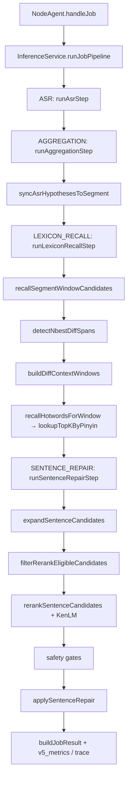

# Recover V5 实施后只读代码审计报告

| 项 | 值 |
|----|-----|
| 版本 | Post-Implementation Audit |
| 日期 | 2026-05-22 |
| 状态 | 只读审计（未改代码） |
| 依据 | [Recover V5 冻结方案](./Recover%20V5%20冻结方案.md)、[Frozen Decisions](./Recover_V5_Frozen_Decisions_2026-05-22.md)、Phase A–E 文档 |
| 批测证据 | `electron-node/tests/dialog-200-batch-result.json`（200/200 PASS） |
| 前置审计 | [Recover_V5_Readonly_Code_Audit_2026-05-22.md](./Recover_V5_Readonly_Code_Audit_2026-05-22.md)（开发前缺口清单，**部分条目已过时**） |

---

## 审计范围与约束

- **只读**：未修改任何生产代码、ASR 模型或 KenLM 权重。
- **不覆盖**：KenLM 性能优化、semantic rewrite、hypothesis-first 恢复。
- **不开启**：near pinyin 关闭实验、cross-segment recall、动态造词。

### V5 设计目标（审计基准）

```text
CTC n-best
→ n-best diff span detection
→ context window expansion
→ 2/3/4/5 字切片
→ pinyin normalize
→ scored legal lexicon TopK lookup
→ WindowCandidate
→ SentenceCandidate combination
→ KenLM rerank
→ safety gates
→ applySentenceRepair
```

### 核心原则核对清单

| # | 原则 | 默认路径结论 |
|---|------|--------------|
| P1 | V5 TopK recall 是主 recall | ✅ |
| P2 | V4 observed/confusion/sliding-window 非主路径 | ✅ |
| P3 | 候选必须来自 scored legal lexicon | ✅ |
| P4 | 拼音仅作 lookup key，禁止 runtime 造词 | ✅ |
| P5 | KenLM 只做有限候选句级过滤 | ✅ |
| P6 | raw CTC 仅 baseline，禁止 final pick | ✅ |
| P7 | 无高质量候选时 skip，不强修 | ✅ |

---

## 1. 总体结论

**当前代码在「生产默认路径」上已基本实现 V5 主链。** V4 observed/confusion/全句滑窗已退出默认路径（仅 `LEXICON_LEGACY_SLIDING_WINDOW=1` 可恢复调试路径）。

**dialog_200 批测** 验证了主链硬指标：

| 指标 | 批测值 | 验收 |
|------|--------|------|
| 契约 PASS | 200/200 | ✅ |
| `sliding_window_count_total` | 0 | ✅ |
| `windows_from_nbest_diff_ratio` | 1.0 | ✅ |
| `out_of_bundle_total` | 0 | ✅ |
| `picked_from_raw_ctc_nbest_count` | 0（聚合） | ✅ |
| `recall_fuzzy_observed_attempt_total` | 0 | ✅ |

**与冻结文档仍有差距**（不导致当前批测 FAIL）：

- **P1**：`maxSentenceCandidates` 默认 16（冻结 32）；`candidateScore` 缺 `editDistancePenalty`；`maxReplacements` 与 `maxActiveWindows` 双轨。
- **P2**：diff span 无相邻合并；trace 缺部分字段；`assertV5ManifestReady` 未接入 runtime load；非 V5 skip 原因并行存在。

**是否符合 V5？** 主链与门控：**是（约 85%）**；配置/公式/可观测细项：**部分符合**。

---

## 2. 当前真实链路

### 2.1 调用链图



### 2.2 逐步对照表

| 步骤 | 文件 | 函数 | 关键输入 | 关键输出 | Active | Legacy/Test |
|------|------|------|----------|----------|--------|-------------|
| Job 入口 | `agent/node-agent-simple.ts` | `handleJob` | `JobAssignMessage` | pipeline ctx | ✅ | — |
| 编排 | `pipeline/job-pipeline.ts` | `runJobPipeline` | step registry | `JobContext` | ✅ | mock 同路径 |
| CTC ASR | `pipeline/steps/asr-step.ts` | `runAsrStep` | audio, `src_lang` | `asrText`, `asrNbest`, `asrHypotheses` | ✅ | — |
| Hypothesis | `asr/build-asr-hypotheses.ts` | `buildAsrHypotheses` | top1, nbest | `hypotheses[]`, `nbestSynthetic` | ✅ | synthetic→常无 diff |
| 聚合 | `pipeline/steps/aggregation-step.ts` | `runAggregationStep` | ctx | `segmentForJobResult` | ✅ | — |
| n-best 同步 | `asr/sync-asr-hypotheses-to-segment.ts` | `syncAsrHypothesesToSegment` | segment, hyps | 保留 CTC n-best | ✅ | — |
| Lexicon 步 | `pipeline/steps/lexicon-recall-step.ts` | `runLexiconRecallStep` | segment, hypotheses | `windowCandidates` | ✅ | feature 默认 off |
| Diff span | `lexicon/nbest-diff-span.ts` | `detectNbestDiffSpans` | segment, rank≠0 | `NbestDiffSpan[]` | ✅ | — |
| Context 窗 | `lexicon/diff-context-windows.ts` | `buildDiffContextWindows` | diffSpans, cfg | `AsrWindow[]` + meta | ✅ | — |
| TopK 召回 | `lexicon/hotword-recall.ts` | `recallHotwordsForWindow` | `AsrWindow` | `HotwordRecallHit[]` | ✅ | observed→`[]` |
| TopK 查找 | `lexicon/pinyin-topk-lookup.ts` | `lookupTopKByPinyin` | syllables, termLength, topK | `LexiconTopKHit[]` | ✅ | — |
| 窗候选 | `lexicon/window-recall.ts` | `recallSegmentWindowCandidates` | segment, hyps | `WindowCandidate[]` | ✅ | `LEXICON_LEGACY_SLIDING_WINDOW=1` |
| 句展开 | `asr-repair/sentence-expansion/sentence-expansion.ts` | `expandSentenceCandidates` | windowCandidates | `SentenceCandidate[]` | ✅ | cap 16 |
| KenLM | `asr-repair/sentence-rerank/rerank.ts` | `rerankSentenceCandidates` | eligible only | `picked` | ✅ | 拒绝 raw baseline |
| 门控 | `asr-repair/recover-safety-gates.ts` | `evaluate*` | candidates, kenlm | V5 skip | ✅ | — |
| 写回 | `asr-repair/sentence-rerank/apply-sentence-repair.ts` | `applySentenceRepair` | picked | `repairedText` | ✅ | 唯一写回 |
| 结果 | `pipeline/result-builder.ts` | `buildJobResult` | ctx | `v5_metrics`, trace | ✅ | trace 部分字段 |

### 2.3 V5 目标链路 vs 实现差异

| 设计环节 | 实现 | 差异 |
|----------|------|------|
| CTC n-best | ✅ | 中文 `asr-sherpa-lm` |
| diff span | ✅ | **无相邻 span 合并** |
| context 扩 1~2 | ✅ | `diffContextLeft/Right` 默认 2 |
| 2/3/4/5 切片 | ✅ | fine `[2,3]` + coarse `[4,5]` |
| scored TopK | ✅ | exact + near 索引桶 |
| candidateScore | ⚠️ | **无 editDistancePenalty** |
| KenLM 句级 | ✅ | `isRerankEligible` |
| safety gates | ⚠️ | 6 项 V5 + 额外 skip |
| 无候选 skip | ✅ | 不强修 |

---

## 3. V5 主 recall 是否替换 V4

| 检查项 | 结论 | 证据 |
|--------|------|------|
| sliding window 已关闭 | ✅ | 默认 `buildV5DiffWindows`；批测 `sliding_window_count_total=0` |
| windows 全部来自 n-best diff | ✅ | `windows_from_nbest_diff_ratio=1` |
| observed/confusion/fuzzy 非主 recall | ✅ | `observedRecallEnabled=false`；`recall_fuzzy_observed_attempt_total=0` |
| V4 fallback 不存在（默认） | ✅ | 仅 `LEXICON_LEGACY_SLIDING_WINDOW=1` |
| segment 全句滑窗 | ✅ 默认无 | legacy `enumerateAsrWindows` 2–8 字 |
| observed 绕过 TopK | ✅ 无 | `observedRecallEnabled=true` 时 `recallHotwordsForWindow` 返回 `[]` |
| near_phoneme / 自由拼音扩展 | ⚠️ | **索引 near 桶**（`forEachPinyinBucket`），非全表 fuzzy |

### 批测统计字段

```text
sliding_window_count_total = 0
windows_from_nbest_diff_ratio = 1.0
out_of_bundle_total = 0
recall_fuzzy_observed_attempt_total = 0
recall_pinyin_attempt_total = 6263
recall_pinyin_hit_total = 252
skip_reason_v5_distribution: { "no_topk_candidate": 147 }
picked_candidate_source_distribution: { "window_single": 37, "window_pair": 16 }
lexicon_homophone: 12/12 PASS
```

**P0 验收（用户清单）**：三项均满足，**无 P0**。

---

## 4. CTC n-best diff span detection

| 项 | 状态 | 说明 |
|----|------|------|
| top1 与 n-best diff | ✅ | LCS 编辑脚本 `charDiffSpansInTop1` |
| diff span 合并 | ❌ | 仅 `diffSpanId` 去重，无相邻合并 |
| 左右扩 context | ✅ | `expandDiffSpanContext`，默认 ±2，clamp 到 chunk |
| context 仅来自 diff | ✅ | 无 diff → 空窗 + `no_diff_span` |
| 无 diff → `no_diff_span` | ✅ | `window-recall.ts` + `lexicon-recall-step.ts` |
| 记录 hypothesis rank | ✅ | `NbestDiffSpan.hypothesisRank` / `meta.hypothesisRank` |
| 避免重复窗口 | ✅ | `windowKey(start,end,text)` |
| 追溯 diffSpanId | ⚠️ | `AsrWindow.meta` 有；**trace 未输出** |

**风险**：`nbestSynthetic=true` 时几乎必 `no_diff_span`（无真实多假设）。

**segment-first 全枚举**：默认路径未混入；legacy env 才启用 `enumerateAsrWindows`。

---

## 5. 2/3/4/5 字窗口切片

| 项 | 状态 |
|----|------|
| `allowedWindowLengths` | `[2,3,4,5]`（`node-config-defaults.ts`） |
| 1 字窗 | ❌ 默认不产生 |
| 6+ 字窗 | ❌ 默认不产生（legacy 2–8） |
| 全句窗 | ❌ 默认无 |
| 配置化 | ✅ `resolveRecoverQualityConfig()` |
| `window_length_distribution` | ✅ `v5_metrics` + 批测契约校验 |

**验收**：`window_length ∈ {2,3,4,5}` — **满足**。

---

## 6. Scored Legal Lexicon 数据结构

### 6.1 Entry Schema（runtime）

```typescript
// hotword-types.ts — HotwordEntry
{
  id: string;
  word: string;
  pinyin: string[];
  priorScore: number;      // V5 必填，索引 gate
  frequency: number;
  domain?: string;
  enabled: boolean;
  tags?: string[];
}
```

| 检查项 | 状态 |
|--------|------|
| priorScore 存在 | ✅ SQLite `prior_score`；无则跳过索引 |
| priorScore ∈ [0,10] | ⚠️ **无 runtime 夹紧**；build 用 `log1p(frequency)` |
| 无 prior 禁止 TopK | ✅ `isIndexableHotwordEntry` |
| enabled=false 过滤 | ✅ |
| tags/domain 保留 | ✅ |
| frequency 不替代 priorScore | ✅ TopK 排序用 candidateScore |
| 英文 token | ✅ `lookupExactLatin` |

### 6.2 Manifest（build）

| 字段 | 状态 |
|------|------|
| `scored_lexicon_version` | `v5` |
| `term_count` / `enabled_term_count` | ✅ |
| `terms_with_prior_count` / `terms_without_prior_count` | ✅（目标 0） |
| `mixed_token_count` | ✅ |
| `pinyin_index_count` | ⚠️ build 脚本写 **0**（未统计） |
| `assertV5ManifestReady` | ⚠️ 存在但 **load 未调用** |

---

## 7. Pinyin Index / TopK Lookup 接口

**API**：`lexicon/pinyin-topk-lookup.ts` — `lookupTopKByPinyin(runtime, input)`

```typescript
input: { syllables, windowText, termLength, domain?, topK }
output: LexiconTopKHit[] // word, priorScore, phoneticScore, candidateScore,
                         // termLength, rankInTopK, source: 'lexicon_pinyin_topk', matchType
```

| 检查项 | 状态 |
|--------|------|
| 按 pinyin 查 | ✅ exact 桶 + near 桶 |
| 按 termLength 过滤 | ✅ |
| candidateScore 排序 | ✅ |
| TopK 截断 | ✅ `slice(0, topK)` |
| 禁止 out-of-bundle | ✅ 主路径仅 bundle |
| 禁止 free-form 生成 | ✅ |
| same pinyin only | ❌ 无独立模式（有 near 桶） |
| near pinyin | ✅ 默认开（`recallFuzzyPinyinMaxSyllableDelta=2`） |

**调用点**：`hotword-recall.ts` → `window-recall.ts` → `lexicon-recall-step.ts`。

---

## 8. TopK 分级规则

**冻结值**（与实际一致）：

```json
{
  "topKByTermLength": { "2": 5, "3": 5, "4": 3, "5": 2 }
}
```

- 配置来源：`node-config-defaults.ts` / `quality-config.ts`
- 应用点：`hotword-recall.ts` `topKForTermLength`
- 无统一 `maxCandidatesPerWindow` 覆盖
- 批测 `topk_hit_jobs_by_term_length`: `{ "2": 11, "3": 10, "4": 44, "5": 3 }`

---

## 9. candidateScore 逻辑

**冻结公式**：

```text
candidateScore =
  priorScore
  + phoneticSimilarity
  + exactLengthBonus
  + domainBoost
  - editDistancePenalty
```

**实际实现**（`candidate-score.ts`）：

```text
candidateScore = priorScore + phonetic + exactLengthBonus(0.5) + domainBoost(0.2)
```

| 检查项 | 状态 |
|--------|------|
| candidateScore 存在 | ✅ |
| priorScore 主导 | ✅ |
| phonetic ∈ [0,1] 量级 | ✅ `scorePinyinSimilarity` |
| exactLengthBonus 有上限 | ✅ 0.5 |
| domainBoost 有上限 | ✅ 0.2 |
| editDistancePenalty | ❌ **未实现** |
| 用于 TopK recall | ✅ |
| KenLM 不参与 TopK | ✅ |
| combinedScore 不参与 TopK | ✅ |

**缺口**：**P1** — 与 Phase C / 冻结文档不一致。

---

## 10. 多窗口组合约束

| 项 | 冻结 | 实际 | 状态 |
|----|------|------|------|
| maxActiveWindows | 2 | 2（门控） | ✅ |
| maxSentenceCandidates | 32 | **16** | ❌ **P1** |
| maxReplacements | 2（语义） | 默认 2；用户配置可为 4 | ⚠️ **P1** |
| candidate_budget_exceeded | 有 | `truncated` + gate | ✅ |
| window_pair/multi | 来自多 diff 窗 | 批测 37+16 picks | ✅ |
| 组合仅用 TopK 候选 | ✅ | expansion 来自 `WindowCandidate` |

**批测**：`expansion_drop_reason_totals.max_replacements_reached=247`。

---

## 11. KenLM 边界

| 用途 | 状态 |
|------|------|
| SentenceCandidate rerank | ✅ `rerankSentenceCandidates` |
| TopK recall | ❌ 未使用 |
| raw CTC final pick | ❌ `filterRerankEligible` + `isRerankEligible` |
| kenlm_worse_than_baseline gate | ✅ tolerance **0.15** |
| 裸 hypotheses 选句 | ❌ |

**批测**：`picked_from_raw_ctc_nbest_count = 0`（全量聚合）。

---

## 12. Safety Gates

### 12.1 V5 skipReason（代码枚举）

```typescript
// recover-safety-gates.ts
'no_diff_span' | 'no_topk_candidate' | 'low_candidate_score'
| 'kenlm_worse_than_baseline' | 'replacement_count_exceeded' | 'candidate_budget_exceeded'
```

| 检查项 | 状态 |
|--------|------|
| 六项齐全 | ✅ |
| 进入 result json | ✅ `repair_skip_reason` / `v5_metrics.skip_reason_v5` |
| 影响 batch report | ✅ `summarizeV5Metrics` |

### 12.2 非 V5 skip（并行存在）

- `no_window_expansion_candidate` — 句展开无 eligible 候选（批测大量出现）
- `no_hypotheses`

**缺口**：**P2** — 未纳入 `skip_reason_v5` 分布，审计时易误判为 silent skip。

---

## 13. Raw Baseline 约束

| 检查项 | 状态 |
|--------|------|
| raw 仅 baseline | ✅ `raw_ctc_baseline` 不可 rerank |
| final pick 来自 window_* | ✅ |
| `picked_from_raw_ctc_nbest_count = 0` | ✅ 批测 |
| `modified_without_replacement = 0` | ✅ 批测 |
| 绕过 applySentenceRepair | ❌ 无 |

**P0**：满足。

---

## 14. 多音字 / 中英混合

| 检查项 | 状态 |
|--------|------|
| 多音字由词条 pinyin | ✅ bundle 维护 |
| runtime 全量多音组合 | ❌ 未发现 |
| `polyphone_runtime_expansion_count` | **0**（符合） |
| 英文 exact lookup | ✅ `lookupExactLatin` |
| 英文拼音 expansion | **0** |
| AI/GPU/taxi 等合法 token | ✅ 若 bundle 含词条且 prior>0 |
| 中英混合不破坏切片 | ✅ CJK 窗需 `hasCjk` |

---

## 15. Observability / Result Builder

### 15.1 冻结 per-candidate 字段

| 字段 | trace | 缺口 |
|------|-------|------|
| windowText, windowPinyin | ✅ | — |
| candidate, candidatePinyin | ✅ | — |
| candidateScore, priorScore, phoneticScore | ✅ | — |
| termLength, rankInTopK, source | ✅ | — |
| windowTrigger, diffSpanId | ❌ | meta 有，trace 未填 |
| kenlmScore, picked | picked 部分 | kenlmScore 未回填 |

### 15.2 其它输出

- `extra.v5_metrics` — ✅
- `extra.qualityConfig` — ✅（缺文档中的 `mode` / `nearPinyinEnabled`）
- `modified_without_replacement_count` — ⚠️ **恒 0**（桩）
- console diagnostics — startup / step 日志仍有

---

## 16. 配置审计

| 配置项 | 代码默认 | 冻结/审计清单 | 接线 |
|--------|----------|---------------|------|
| `contractVersion` | `v5-scored-lexicon-topk` | 同 | ✅ |
| `allowedWindowLengths` | [2,3,4,5] | 同 | ✅ |
| `diffContextLeft/Right` | 2 | 2 | ✅ |
| `topKByTermLength` | 2:5,3:5,4:3,5:2 | 同 | ✅ |
| `maxActiveWindows` | 2 | 2 | ✅ 门控 |
| `maxSentenceCandidates` | **16** | **32** | ⚠️ |
| `minCandidateScore` | 0 | 0 | ✅ |
| `kenlmBaselineTolerance` | 0.15 | 0.15 | ✅ |
| `observedRecallEnabled` | false | false | ✅ |
| `nearPinyinEnabled` | **无字段** | 清单 false；Frozen **允许 near** | ⚠️ 用 delta=2 |
| `crossSegmentRecallEnabled` | **无字段** | false | 隐式 diff-only |
| `lexiconRecall.enabled` | **false** | — | 需用户配置开启 |

**Hidden hardcode**：`window-recall.ts` 中 `fineLengths: [2,3]`、`coarseLengths: [4,5]`（与 allowed 一致但未从配置读取）。

---

## 17. 测试契约审计

### 17.1 已有测试

| 领域 | 文件 |
|------|------|
| diff span | `nbest-diff-span.test.ts` |
| context expansion | `diff-context-windows.test.ts` |
| window recall V5 | `window-recall.test.ts` |
| scored lexicon | `scored-lexicon.test.ts` |
| TopK lookup | `pinyin-topk-lookup.test.ts` |
| candidateScore | `candidate-score.test.ts` |
| safety gates | `recover-safety-gates.test.ts` |
| lexicon step | `lexicon-recall-step.test.ts` |
| nbest rerank 集成 | `recover-nbest-rerank.test.ts` |
| quality config | `quality-config.test.ts` |
| 批测契约 | `recover-contract-assess.js` + `run-dialog-200-batch.js` |

### 17.2 缺失 / 弱覆盖

- `maxSentenceCandidates === 32`
- `editDistancePenalty` 公式
- trace 全字段（`windowTrigger`, `diffSpanId`, `kenlmScore`）
- English token e2e
- raw baseline **集成**禁止 final pick（单测有，批测未断言 pick source 分布细项）
- `nearPinyinEnabled` 开关行为
- runtime `assertV5ManifestReady` on load
- `modified_without_replacement` 真实计数

### 17.3 批测是否足够验收 V5

| 维度 | 足够？ |
|------|--------|
| 主链 P0（滑窗/out-of-bundle/窗长/raw pick） | ✅ |
| 配置 32 / score 公式 / trace 完整 | ❌ |
| near 关闭 / same-pinyin strict | ❌ |

---

## 18. 完成度评分

| 模块 | 完成度 | 证据 | 缺口 |
|------|--------|------|------|
| V5 recall 主链 | **92%** | 代码 + dialog_200 | near 桶；observed 开关陷阱 |
| n-best diff window | **88%** | 实现 + ratio=1 | 无 span 合并；trace 未接线 |
| scored lexicon schema | **90%** | prior 必填；manifest | load 未 assert；prior 无 [0,10] |
| TopK pinyin lookup | **90%** | API + 252 hits | 非 strict same-pinyin |
| candidateScore | **75%** | 排序已实现 | 缺 editDistancePenalty |
| safety gates | **85%** | 6 项 + 单测 | 非 V5 skip 并行 |
| KenLM boundary | **95%** | isRerankEligible + gate | — |
| raw baseline isolation | **95%** | 批测 0 raw pick | — |
| observability | **70%** | v5_metrics + 部分 trace | meta/kenlm 未导出 |
| tests | **78%** | 10+ 单测 + batch | 32 cap、trace、集成项 |

---

## 19. P0 / P1 / P2 汇总

### P0

**无**（默认路径 + dialog_200 批测下，用户清单三项硬指标均已满足）。

### P1

1. `maxSentenceCandidates` 默认 **16**，冻结要求 **32**。
2. `candidateScore` **缺少 `editDistancePenalty`**。
3. `maxReplacements`（selector/expansion）与 `maxActiveWindows`（门控）**双轨**，用户配置 `maxReplacements:4` 时行为易混淆。
4. Near 拼音桶默认开启 — 与审计清单 `nearPinyinEnabled:false` 表述冲突；与 [Frozen_Decisions](./Recover_V5_Frozen_Decisions_2026-05-22.md)「near 允许 delta=2」一致，需产品统一口径。

### P2

1. diff span 无相邻合并；无 `diff_span_merged_count` 指标。
2. `lexicon_recall_trace` 缺 `windowTrigger`、`diffSpanId`、`kenlmScore`。
3. `assertV5ManifestReady` 未接入 `lexicon-runtime.load()`。
4. `modified_without_replacement_count` 桩 0；`no_window_expansion_candidate` 未纳入 V5 skip 分布。
5. `manifest.pinyin_index_count` build 恒 0。
6. Legacy 路径保留（`LEXICON_LEGACY_SLIDING_WINDOW=1`）— 需文档标明 debug-only。

---

## 20. 最终问答

| 问题 | 回答 |
|------|------|
| 当前代码是否真正符合 V5 设计？ | **主链基本符合**；配置/公式/观测有缺口 |
| V5 是否已替换 V4 recall 主链？ | **是**（默认路径） |
| 是否仍有 observed/confusion/sliding 主路径？ | **否**（除非 legacy env） |
| 是否存在动态造词或 out-of-bundle？ | **否**（批测 `out_of_bundle_total=0`） |
| TopK 是否按 priorScore/candidateScore 工作？ | **是** |
| KenLM 是否只做有限候选句级过滤？ | **是** |
| raw CTC 是否仍可能 final pick？ | **否** |
| 当前最大 P0 | **无** |
| 当前最大 P1 | **maxSentenceCandidates 16**、**candidateScore 缺 penalty**、**maxReplacements/ActiveWindows 分裂** |
| 下一步建议 | 对齐 32 cap 与 score 公式 → 补 trace/manifest assert → 扩展批测契约 → 重跑 dialog_200 |

---

## 21. Target List

1. 配置与冻结对齐：`maxSentenceCandidates=32`，`maxReplacements` 与 `maxActiveWindows` 合一。
2. `candidateScore` 公式与 Phase C 文档一致（含 `editDistancePenalty`）。
3. 可观测性：`buildLexiconRecallTrace` 补全字段；`modified_without_replacement` 真实统计。
4. 批测契约：断言 32 cap、trace 字段、pick source 细项。
5. 产品裁定：near index（delta=2）是否算 V5 合规 — 统一 Frozen 与审计清单。

---

## 22. Check List

- [x] 默认路径无全句滑窗
- [x] 窗 100% 来自 n-best diff（批测）
- [x] TopK 主召回 `lexicon_pinyin_topk`
- [x] out_of_bundle=0（批测）
- [x] KenLM 仅句级 eligible 候选
- [x] raw CTC 不能 final pick（批测）
- [ ] `maxSentenceCandidates=32`
- [ ] `candidateScore` 含 editDistancePenalty
- [ ] trace 含 diffSpanId / windowTrigger / kenlmScore
- [ ] runtime manifest assert
- [ ] V5 skip 覆盖 expansion 空池原因

---

## 23. 文件修改建议（实施阶段参考，本次未改代码）

| 优先级 | 文件 | 建议 |
|--------|------|------|
| P1 | `node-config-defaults.ts`, `asr-repair/sentence-expansion/types.ts` | `maxSentenceCandidates` → 32 |
| P1 | `lexicon/candidate-score.ts` | 实现 `editDistancePenalty` 及上限 |
| P1 | `recover-quality/quality-config.ts` | 统一 `maxReplacements` 与 `maxActiveWindows` |
| P2 | `pipeline/v5-metrics.ts` | trace 填充 `windowTrigger`, `diffSpanId`, `kenlmScore` |
| P2 | `lexicon/nbest-diff-span.ts` | 可选相邻 diff 合并 + 指标 |
| P2 | `lexicon/lexicon-runtime.ts` | load 时 `assertV5ManifestReady` |
| P2 | `tests/lib/recover-contract-assess.js` | 断言 32、trace 字段 |
| P2 | `pipeline/steps/sentence-repair-step.ts` | 映射或文档化 `no_window_expansion_candidate` |

---

## 24. 相关文档索引

| 文档 | 说明 |
|------|------|
| [Recover V5 冻结方案](./Recover%20V5%20冻结方案.md) | 架构基准 |
| [Recover_V5_Frozen_Decisions_2026-05-22.md](./Recover_V5_Frozen_Decisions_2026-05-22.md) | 冻结决策 |
| [Recover_V5_Development_Report_2026-05-22.md](./Recover_V5_Development_Report_2026-05-22.md) | 开发报告 |
| [Recover_V5_Test_Report_2026-05-22.md](./Recover_V5_Test_Report_2026-05-22.md) | 测试报告 |
| [Recover_V5_Readonly_Code_Audit_2026-05-22.md](./Recover_V5_Readonly_Code_Audit_2026-05-22.md) | **开发前**缺口审计（部分已过时） |

---

*本报告由只读代码审计生成，未修改仓库代码。*
