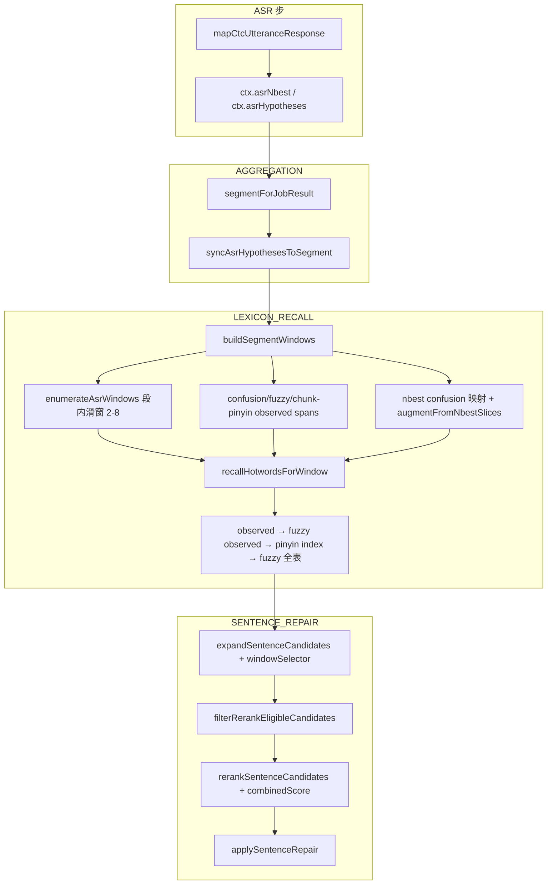

# Recover V5 冻结方案 — 详细只读代码审计报告

**版本**：V5-Readonly-Audit  
**日期**：2026-05-22  
**依据**：[Recover V5 冻结方案.md](./Recover%20V5%20冻结方案.md)（V5-Freeze）  
**审计范围**：`electron_node/electron-node/main/src`（Recover 主链 + 词库构建脚本 + 批测契约）  
**审计性质**：只读；未修改任何代码  
**当前契约**：`historical-restore-v1`（V3/V4 segment-first 历史恢复版）

---

## 执行摘要

| 维度 | 结论 |
|------|------|
| **架构距离** | **大**：V5 要求「n-best diff → scored lexicon TopK」；当前为「segment 滑窗 + observed/confusion 主召回」 |
| **可复用部分** | 主链骨架、segment 坐标、KenLM 句级 rerank、`raw_ctc_baseline` 隔离、写回锁、部分 diagnostics |
| **必须新建** | diff span 检测、diff context 窗枚举、TopK lookup API、`candidateScore`、V5 六项 safety gate、per-candidate 观测 |
| **批测现状** | `dialog_200`（2026-05-21）大量 case `window_candidate_count=0`、`skipReason=no_window_expansion_candidate` — 瓶颈在窗/召回来源，而非 KenLM |

**一句话**：当前不是「差几个参数」，而是 **窗从哪里来、词怎么召回** 两条主轴与 V5 不一致；需在 P0 替换窗管线与 TopK recall，而不是在 `hotword-recall.ts` 上叠补丁。

---

## 0. 审计方法与代码基线

- **主链注册**：`pipeline/pipeline-step-registry.ts` → `LEXICON_RECALL` → `SENTENCE_REPAIR`
- **模块文档**：`electron_node/docs/RECOVER.md` 描述 segment-first（与 V5 diff-first **文档级已分叉**）
- **批测**：`tests/run-dialog-200-batch.js` + `tests/lib/recover-contract-assess.js`
- **V5 符号在 `main/src` 中**：`diffSpanDetector`、`nbest_diff`、`allowedWindowLengths`、`topKByTermLength`、`lookupTopKByPinyin`、`no_diff_span`、`lexicon_pinyin_topk` — **均未实现**

### 命名说明

审计提纲中的「V4.2」与本文档依据的 **「Recover V5 冻结方案」** 指同一套规格（Scored Legal Lexicon TopK Recall）。文中 **V5** 指冻结目标；**V3/V4** 指当前已实现的 `historical-restore-v1` 代码。

---

## 一、总体链路审计

### 1.1 当前真实链路（代码级）



**关键入口**：`pipeline/steps/lexicon-recall-step.ts` → `recallSegmentWindowCandidates(segmentText, ctx.asrHypotheses, runtime)`。

### 1.2 V5 目标链路

```text
CTC n-best
→ diff span detection（top1 vs hypotheses）
→ context expansion（左右 1~2 字）
→ 2/3/4/5 字切片
→ pinyin normalize
→ scored legal lexicon TopK lookup
→ WindowCandidate
→ SentenceCandidate combination（≤2 active windows）
→ KenLM rerank（仅句级）
→ safety gates
→ applySentenceRepair
```

### 1.3 对比结论

| 环节 | V5 | 当前 | 差距 |
|------|-----|------|------|
| 窗触发 | n-best **diff** | 段内 **滑动窗** + observed 子串 | **架构级** |
| 窗长 | 仅 2–5 | 2–**8**（默认） | **P0** |
| 召回 | TopK by length + **candidateScore** | observed 优先 + 统一 maxHits=16 | **架构级** |
| 句级 | KenLM 过滤 | ✅ 已实现 | 小（缺 baseline gate） |
| 门控 | 六项 skipReason | 2–3 项为主 | **P0** |

### 1.4 已满足部分

1. CTC n-best 进入 `ctx` 并写入 `result.extra`（`asr_nbest`、`ctc_nbest_preserved`）
2. segment-first 坐标（`SEGMENT_HYPOTHESIS_INDEX = 0`，`window-recall.ts`）
3. `WindowCandidate` → `SentenceCandidate` → KenLM → `applySentenceRepair`
4. `raw_ctc_baseline` 不进入 rerank 池（`asr-repair/candidate-source.ts`）
5. `priorScore` 字段存在（由 `frequency` 推导，`pinyin-index.ts`）
6. `maxReplacements` 默认 2（与 V5 双窗写回方向一致）

### 1.5 缺失部分（架构）

1. `detectNbestDiffSpans` / `expandDiffSpanContext`
2. `allowedWindowLengths: [2,3,4,5]`，禁止 6+ 与全段滑窗
3. `lookupTopKByPinyin` + `topKByTermLength`
4. manifest 级 `priorScore`（运营维护）
5. V5 六项 `skipReason` + per-candidate JSON
6. `maxSentenceCandidates: 32`（当前 16）

### 1.6 主要修改文件与优先级

| 优先级 | 文件 |
|--------|------|
| P0 | **新建** `lexicon/nbest-diff-span.ts`、`lexicon/pinyin-topk-lookup.ts`、`lexicon/candidate-score.ts`、`asr-repair/recover-safety-gates.ts` |
| P0 | `lexicon/window-recall.ts`、`lexicon/hotword-recall.ts`、`lexicon/enumerate-asr-windows.ts` |
| P0 | `hotword-types.ts`、`lexicon-runtime.ts`、`scripts/build-lexicon-bundle.mjs` |
| P0 | `recover-quality/quality-config.ts`、`node-config-types.ts` |
| P1 | `sentence-repair-step.ts`、`asr-repair/sentence-rerank/rerank.ts`、`pipeline/result-builder.ts` |
| P1 | `tests/run-dialog-200-batch.js`、`tests/lib/recover-contract-assess.js` |

---

## 二、CTC n-best 差异触发审计

### 2.1 检查清单

| # | 检查项 | 结论 |
|---|--------|------|
| 1 | top1 与 n-best 文本 diff | ❌ 无通用 diff |
| 2 | diff span detection | ❌ 无 `diffSpanDetector` |
| 3 | diff 左右扩 1~2 字 | ❌ 无 `expandDiffSpanContext` |
| 4 | 基于 diff 生成 window | ❌ 窗来自 `buildSegmentWindows` |
| 5 | 避免全句滑窗 | ❌ `enumerateAsrWindows` 在 chunk 内全滑动 |

### 2.2 当前与 n-best 相关的机制

**`augmentFromNbestSlices`**（`window-recall.ts`）：

- 前提：对**已枚举的每个窗**，在 `hypText.length === segmentText.length` 时比较 slice
- 若 `hypSlice !== fromText`，用 hyp 切片文本再跑 `recallHotwordsForWindow`
- **不是**先 diff 再开窗；而是 **先滑窗，再 slice 增强**

**nbest confusion 窗**：在 hypothesis 文本上找 confusion `observed` 子串，再映射到 segment — 仍依赖 confusion 表，不是字符级 diff。

### 2.3 当前 window source 类型

| 来源 | 标签/行为 | V5 |
|------|-----------|-----|
| 滑动枚举 | `enumerateAsrWindows` → `h0-aw-*` | ❌ 等价全句滑窗 |
| confusion 精确 | `cf` | observed，非 TopK |
| fuzzy observed | `cffz` | observed |
| chunk 拼音对齐 observed | `cfpy` | observed |
| n-best confusion 映射 | `nb{rank}cf` | confusion |
| slice augment | `*-nb{rank}` | 部分接近 diff，依赖已有窗 |

- **`windowTrigger = nbest_diff`**：❌ 不存在  
- **`full_sentence_sliding_window`**：无此字符串；行为上 `enumerateAsrWindows` 即为 V5 禁止的全段扫描

### 2.4 无 diff 时的 skip

- V5：`no_diff_span`
- 当前：空窗 → `no_window_expansion_candidate`；`noWindowBucket` 为 `pinyin_no_hit` / `no_observed_substring` / `segment_alignment_risk` 等（`no-window-bucket.ts`）

### 2.5 P0 改造与验收

```text
detectNbestDiffSpans(top1, hypotheses) → DiffSpan[]
expandDiffSpanContext(span, left=1~2, right=1~2) → ContextSpan
enumerateWindowsFromDiffContext(context, lengths=[2,3,4,5]) → AsrWindow[]
```

验收：每个 `WindowCandidate` 可追溯到 `windowTrigger: 'nbest_diff'`；无 diff → `skipReason: no_diff_span`。

---

## 三、2/3/4/5 字切片审计

### 3.1 当前配置（硬编码）

`enumerate-asr-windows.ts`：

```typescript
DEFAULT_ENUMERATE_ASR_WINDOWS_OPTIONS = {
  minChars: 2,
  maxChars: 8,
  maxWindows: 192,
};
```

实现允许 **6、7、8** 字窗（注释写 2–6，代码到 `maxChars`）。

### 3.2 V5 对照

| 窗长 | V5 | 当前 |
|------|-----|------|
| 1 字 | 禁止 | ✅ minChars=2 |
| 2–5 字 | 允许 | ✅ |
| 6+ 字 | 禁止 | ❌ 6–8 允许 |
| 全句窗 | 禁止 | selector 拒整句替换 |

### 3.3 P0

新增 `allowedWindowLengths: [2,3,4,5]`；diff 枚举路径仅生成上述长度；关闭或 flag 关闭滑窗主路径。

---

## 四、Scored Legal Lexicon 数据结构审计

### 4.1 当前类型（`hotword-types.ts`）

```typescript
HotwordEntry = { id, word, pinyin: string[], frequency, domain?, enabled }
WindowCandidate = { ..., phoneticScore, priorScore, source }
```

`source` 取值：`hotword` | `exact` | `confusion_evidence` | `fuzzy_observed` — **无** `lexicon_pinyin_topk`。

### 4.2 与 V5 schema 对照

| 字段 | V5 | 当前 |
|------|-----|------|
| `priorScore` | 运营维护 | ❌ `priorScoreFromFrequency(frequency)` |
| `tags` | ✅ | ❌ |
| `priorScore` 缺失不得进 TopK | ✅ | ❌ observed 可抬底进池 |

### 4.3 构建脚本

`build-lexicon-bundle.mjs`：`frequencyFromPriority`；`MAX_WORD_LEN = 8`；无 priorScore/tags。

### 4.4 修改点

| 层级 | 动作 |
|------|------|
| manifest | `priorScore`、`tags`、统计字段 |
| SQLite | `prior_score`、`tags` 列 |
| build | seed 支持运营 prior |
| runtime | 无 prior 不进 TopK；禁止 observed 抬底进 TopK final |

---

## 五、Pinyin Index TopK Lookup 审计

### 5.1 当前 API

| API | 行为 |
|-----|------|
| `recallHotwordsByPinyin(syllables, max=16)` | 精确音节键桶，按 frequency 排序 |
| `recallHotwordsByFuzzyPinyin` | 全表扫描，音节长度差 ≤2 |
| `recallHotwordsByObserved*` | confusion / exact |

### 5.2 召回顺序（与 V5 冲突）

`hotword-recall.ts`：**observed → fuzzy observed → pinyin index → fuzzy 全表**。V5 应以 **scored lexicon TopK** 为主路径。

### 5.3 V5 目标 API（未实现）

```typescript
lookupTopKByPinyin(input: {
  pinyin: string;
  termLength: 2 | 3 | 4 | 5;
  domain?: string;
  topK: number;
}): LexiconCandidate[]  // source: "lexicon_pinyin_topk"
```

### 5.4 能力对照

| 能力 | 当前 |
|------|------|
| same pinyin | ✅ |
| near pinyin | ⚠️ fuzzy 全表 |
| 按词长 TopK | ❌ |
| candidateScore 排序 | ❌ |
| `rankInTopK` | ❌ |
| 表外词 | ❌ 不造词 |

---

## 六、TopK 分级规则审计

### V5 冻结

| 词长 | TopK |
|------|------|
| 2 | 5 |
| 3 | 5 |
| 4 | 3 |
| 5 | 2 |

### 当前

- `DEFAULT_MAX_HITS = 16`（全长度统一）
- `DEFAULT_MAX_WINDOW_CANDIDATES = 192`
- 无 `topKByTermLength`

句池：`maxSentenceCandidates = 16`，V5 要求 **32**。

---

## 七、Candidate Score 审计

### V5 公式（TopK 阶段）

```text
candidateScore =
  priorScore + phoneticSimilarity + exactLengthBonus + domainBoost - editDistancePenalty
```

### 当前

`window-recall.ts` 排序：`phoneticScore DESC → priorScore DESC`。无 `candidateScore` 及 V5 各 bonus/penalty。

KenLM / `combinedScore` 仅在 `rerank.ts` — ✅ 符合 V5（不参与 TopK）。

---

## 八、多窗口组合约束审计

| 参数 | V5 | 当前 |
|------|-----|------|
| maxActiveWindows | 2 | maxReplacements=2，但 maxWindowsPerSentence=**4** |
| maxCandidatesPerWindow | 5 | **16** |
| maxSentenceCandidates | 32 | **16** |
| 3+ 窗 | 禁止 | `window_multi` 仍存在 |
| 超限诊断 | candidate_budget_exceeded | truncated + window_budget_exceeded bucket |

Silent truncation：有 `truncated`，无 V5 级 skipReason。

---

## 九、KenLM 角色审计

### 符合 V5

- 仅 `rerankSentenceCandidates` 句级
- `raw_ctc_baseline` 被 `isRerankEligible` 排除
- `expandSentenceCandidates` 跳过 raw baseline

### 缺失

- `kenlm_worse_than_baseline` gate ❌
- KenLM 不可用时 kenlmScore 可能 undefined

---

## 十、Safety Gates 审计

| V5 skipReason | 当前 |
|---------------|------|
| `no_diff_span` | ❌ |
| `no_topk_candidate` | ⚠️ `pinyin_no_hit` bucket |
| `low_candidate_score` | ❌ |
| `kenlm_worse_than_baseline` | ❌ |
| `replacement_count_exceeded` | ⚠️ selector 内部 reason |
| `candidate_budget_exceeded` | ⚠️ bucket only |

已有：`no_window_expansion_candidate`、`no_hypotheses`、`feature_or_job_disabled`、`empty_segment` 等。

P0：新建 `asr-repair/recover-safety-gates.ts`，统一写入 `recover_lifecycle` / `sentence_repair` / `repair_skip_reason`。

---

## 十一、Raw Baseline 约束审计

| 指标 | 当前 |
|------|------|
| raw final pick | ✅  blocked |
| picked_from_raw_ctc_nbest_count | ✅ 批测/restore_metrics |
| modified_without_replacement | ✅ 批测 assess |
| picked source 主类型 | hotword/exact/confusion — 非 lexicon_pinyin_topk |

---

## 十二、多音字与中英混合审计

- 多音字：无 runtime 全展开 ✅；词条 `pinyin[]` 优先 ✅
- 英文 token：可入库；**窗枚举跳过无 CJK**；无音节则无 lookup
- 混合句：窗拼音可能由 `pinyin-pro` 生成，与词条 pinyin 不一致 — P1 需英文窗策略

---

## 十三、Observability 审计

### V5 要求（per candidate）

`windowText`、`windowPinyin`、`candidate`、`candidatePinyin`、`candidateScore`、`priorScore`、`phoneticScore`、`termLength`、`rankInTopK`、`source`、`kenlmScore`、`picked`。

### 当前

`result.extra` 有聚合级 `window_candidates`、`window_recall_diagnostics`、`qualityConfig` 等 — **无** per-candidate 明细数组。

修改：`result-builder.ts` 新增 `lexicon_recall_trace`；批测扩展 KPI。

---

## 十四、配置审计

### 当前 `RecoverQualityConfig` 默认

| 字段 | 默认 |
|------|------|
| recallMinPhoneticScore | 0.5 |
| expansionMinPhoneticScore | 0.5 |
| selectionMinPhoneticScore | 0.85 |
| maxReplacements | 2 |
| maxSentenceCandidates | 16 |
| recallFuzzyPinyinMaxSyllableDelta | 2 |

### 硬编码

窗长 2–8、maxWindows 192、maxHits 16、expansion maxWindowsPerSentence 4。

### V5 目标配置块（需新增）

```json
{
  "allowedWindowLengths": [2, 3, 4, 5],
  "diffContextLeft": 2,
  "diffContextRight": 2,
  "topKByTermLength": { "2": 5, "3": 5, "4": 3, "5": 2 },
  "maxActiveWindows": 2,
  "maxSentenceCandidates": 32,
  "minCandidateScore": 0,
  "kenlmBaselineTolerance": 0
}
```

`result.extra.qualityConfig` 已输出 — 扩展字段即可。

**文档不一致**：`RECOVER.md` 写 maxReplacements: 4；代码默认 **2** — 以代码为准。

---

## 十五、测试与报告审计

### 已有（V3/V4）

`window-recall.test.ts`、`lexicon-recall.test.ts`、`recover-nbest-rerank.test.ts`、`recover-contract-batch-assess.test.js`、`run-dialog-200-batch.js`。

### V5 缺失

diff span、TopK by length、candidateScore、gates、mixed token、out-of-bundle=0、V5 skipReason 专项测试。

### 批测新增指标

`windows_from_nbest_diff_ratio`、`sliding_window_count`（→0）、`skip_reason_v5_distribution`、`topk_hit_rate_by_term_length`、`lexicon_pinyin_topk_picked_ratio`。

### dialog_200 实证（2026-05-21）

典型：`window_candidate_count=0` → `no_window_expansion_candidate`；`noWindowBucket` 多为 `segment_alignment_risk` / `no_observed_substring`；`picked_from_raw_ctc_nbest_count=0`。与 V5「需 TopK recall 而非 observed」判断一致。

---

## 十六、可执行开发方案

### 16.1 模块对照表

| V5 模块 | 当前状态 | 缺口 | 优先级 |
|---------|----------|------|--------|
| Diff Span Gate | slice augment only | 无 diff/context/触发标记 | P0 |
| 2/3/4/5 切片 | 2–8 滑窗 | 禁 6+；diff 枚举 | P0 |
| Scored Lexicon | frequency→prior | manifest priorScore、tags | P0 |
| Pinyin TopK | 精确桶+fuzzy 全表 | lookupTopKByPinyin | P0 |
| Candidate Score | phonetic+prior | 完整公式 | P0 |
| 多窗组合 | expansion 4 窗 | maxActiveWindows=2，句池 32 | P1 |
| KenLM 句级 | ✅ | kenlm_worse_than_baseline | P1 |
| Safety Gates | 部分 | 六项统一 | P0 |
| Raw Baseline | ✅ 契约 | source=lexicon_pinyin_topk | P1 |
| 可观测性 | 聚合 | per-candidate trace | P1 |
| 配置 | 部分 | V5 全量+去硬编码 | P0 |
| 测试/批测 | V4 | V5 KPI | P0–P1 |

### 16.2 P0 必须调整

1. n-best diff 窗管线，替代滑窗主路径  
2. lookupTopKByPinyin + topKByTermLength + candidateScore  
3. manifest/runtime priorScore；无 prior 不进 TopK  
4. 六项 safety gate 进 result JSON  
5. V5 配置项入 RecoverQualityConfig  

### 16.3 P1 建议

maxActiveWindows=2、kenlm baseline gate、per-candidate trace、英文 token 窗、更新 homophone/RECOVER.md。

### 16.4 P2 后置

fuzzy 全表优化、性能、Markdown 批测报告。

### 16.5 分阶段 PR

| Phase | 内容 |
|-------|------|
| A 数据 | build-lexicon-bundle、SQLite、hotword-types、manifest |
| B Diff 窗 | nbest-diff-span.ts、window-recall.ts |
| C TopK | pinyin-topk-lookup.ts、candidate-score.ts、hotword-recall.ts |
| D 门控 | recover-safety-gates.ts、sentence-repair-step、rerank.ts |
| E 观测+测 | result-builder、批测、单测 |

### 16.6 Target List

| ID | 指标 |
|----|------|
| T1 | windows_from_nbest_diff / windows_enumerated ≥ 95%（有 diff 时） |
| T2 | sliding_window_count = 0 |
| T3 | 窗长 ⊆ {2,3,4,5} |
| T4 | picked_from_raw_ctc_nbest_count = 0 |
| T5 | modified_without_replacement_count = 0 |
| T6 | out_of_bundle_candidate_count = 0 |
| T7 | V5 六项 skipReason 可统计 |
| T8 | TopK 5/5/3/2 |
| T9 | 有修复时 picked 以 lexicon_pinyin_topk 为主 |

### 16.7 Check List

- [ ] 无 diff → no_diff_span  
- [ ] 无 TopK → no_topk_candidate  
- [ ] 低分 → low_candidate_score  
- [ ] KenLM 劣 baseline → kenlm_worse_than_baseline  
- [ ] 替换超限 → replacement_count_exceeded  
- [ ] 预算超限 → candidate_budget_exceeded（非 silent）  
- [ ] qualityConfig 含 V5 全字段  
- [ ] TopK 候选含 rankInTopK、candidateScore、source  

### 16.8 测试计划

单元（diff/TopK/score/gates）→ 集成（recall+repair 步）→ dialog_200 回归 → 契约 assess 扩展。

### 16.9 风险

| 风险 | 缓解 |
|------|------|
| 短期无窗率上升 | 扩 scored lexicon；diff context ±2 |
| n-best 不等长 | diff 对齐不绑等长 slice |
| observed 下线 | observedRecallEnabled flag |
| 组合爆炸 | candidate_budget_exceeded + 句池 32 硬顶 |
| prior 冷启动 | build 默认分 + 运营导入 |

---

## 附录 A：关键代码索引

| 主题 | 路径 |
|------|------|
| 窗枚举 | `lexicon/enumerate-asr-windows.ts` |
| 窗汇总 | `lexicon/window-recall.ts` |
| 召回 | `lexicon/hotword-recall.ts`、`lexicon/lexicon-runtime.ts` |
| observed/confusion | `lexicon/confusion-observed-spans.ts` |
| 句扩展 | `asr-repair/sentence-expansion/sentence-expansion.ts` |
| 选择器 | `lexicon/selector/windowSelector.ts` |
| KenLM | `asr-repair/sentence-rerank/rerank.ts` |
| 配置 | `recover-quality/quality-config.ts` |
| 输出 | `pipeline/result-builder.ts` |
| 构建 | `electron-node/scripts/build-lexicon-bundle.mjs` |
| 批测契约 | `tests/lib/recover-contract-assess.js` |

---

## 附录 B：V5 搜索词在代码库中的状态

以下符号在 `electron-node/main/src` **均未实现**（仅存在于本目录冻结方案文档）：

`diffSpan`、`diffSpanDetector`、`nbest_diff`、`allowedWindowLengths`、`topKByTermLength`、`maxActiveWindows`、`lookupTopKByPinyin`、`no_diff_span`、`lexicon_pinyin_topk`、`candidate_budget_exceeded`（作为 skipReason）、`kenlm_worse_than_baseline`。

---

*本报告为只读审计产物；实施时请另附开发报告与测试报告。*
