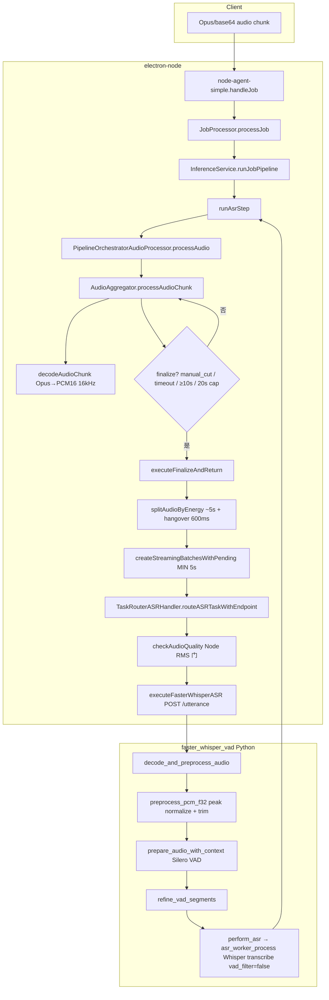
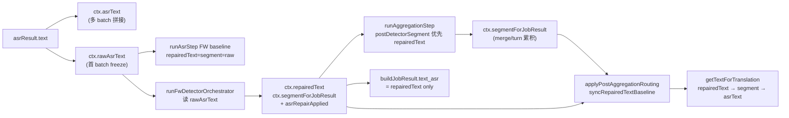

# 节点端 ASR 前后处理链路审计报告

> **⚠ 废止说明（2026-05-30）：** 本报告基于 SSOT 改造前代码（仍描述 `repairedText` / `syncRepairedTextBaseline`）。  
> 当前主链规范请参阅：**`docs/ASR_FW_MAIN_CHAIN_FROZEN_FINAL.md`**、`docs/FW_DETECTOR.md`。

**审计日期：** 2026-05-27  
**审计类型：** 只读代码审计（未修改任何代码）  
**审计范围：** 音频进入节点端 → ASR 前处理 → faster-whisper-vad → FW Detector → Aggregation → NMT 前文本准备  
**架构基线：** FW-only 冻结（`asr.engine = fw_detector_v1`，主链 `ASR → FW_SPAN_DETECTOR → AGGREGATION → … → NMT`）

---

## 1. 执行摘要

| 维度 | 结论 |
|------|------|
| ASR 前处理是否清晰 | **基本清晰**。Node 侧 `AudioAggregator` 负责缓冲/能量切分/~5s 批次；FW 侧 Silero VAD + 峰值归一化/首尾静音裁剪。两层分段职责不同，但边界可能不一致（已有 diagnostics 观测）。 |
| ASR 后处理是否清晰 | **主链清晰**。FW 模式下 `LEXICON_RECALL` / `SENTENCE_REPAIR` 已从步骤列表物理移除；Detector 分层（detect → recall/decision → apply）与冻结合约一致。 |
| 是否存在冲突/冗余 | **存在可接受冗余 + 1 项 turn 场景字段风险**（见 §9、§11）。默认配置下 5015/5016/5017 均关闭，不与 FW 双写。 |
| 是否符合冻结架构 | **默认配置下符合**。`freeze-contract.test.ts` + `fw-detector-gate.mjs` 与代码路径一致。 |
| 是否可进入 P1.3 Recall Coverage | **有条件通过**：单 job / `manual_cut` 路径可进入；**turn 流式累积 + finalize 路径需先确认 NMT 输入与 turn 全文对齐**（§11 阻塞项）。 |

**总体判定：** 默认 FW-only 主链干净、无 Recover 句级修复双跑；CTC/Sherpa/nbest/rerun/secondary decode 未进入默认主链。需关注 turn buffer finalize 时 `repairedText` 与 `segmentForJobResult` 语义分裂。

---

## 2. 当前 ASR 前处理链路图



### 2.1 阶段明细表

| 阶段 | 文件/函数 | 输入 | 输出 | 必要 | 重复 | 风险 |
|------|-----------|------|------|------|------|------|
| Job 接收 | `agent/node-agent-simple.ts` → `handleJob` | WS job + audio | pipeline job | 是 | 否 | 低 |
| 音频缓冲 | `audio-aggregator.ts` → `processAudioChunk` | Opus chunk | buffer key=`turn_id\|tgt_lang` | 是 | 否 | 低 |
| Opus 解码 | `audio-aggregator-decoder.ts` → `decodeAudioChunk` | Opus | PCM16 @16kHz | 是 | 否（FW 收 PCM16） | 低 |
| Finalize 触发 | `audio-aggregator.ts` L204–208 | job flags | finalize 决策 | 是 | 否 | 中：依赖客户端 `is_manual_cut` |
| 能量切分 | `audio-aggregator-process-finalize.ts` → `splitAudioByEnergy(5000,2000,600)` | PCM buffer | 多段 PCM | 是 | 与 FW VAD **不同机制** | 中：句中切开 |
| 流式批次 | `audio-aggregator-stream-batcher.ts` → `createStreamingBatchesWithPending` | 切分段 | ~5s `audioSegments[]` | 是 | 否 | 中：短 batch |
| ASR 路由 | `resolve-preferred-asr-service.ts` | lang | `faster-whisper-vad` | 是 | 否 | 低 |
| Sherpa 强制改道 | `task-router-asr.ts` L52–61 | endpoint | 若 FW 模式则改 FW | 是（防护） | 否 | 低 |
| Node RMS 门 | `task-router-asr-audio-quality.ts` → `checkAudioQuality` | PCM16 | pass/reject | 可选 | **与 Python 质量检查重叠** | 低 |
| HTTP 请求 | `faster-whisper-asr-strategy.ts` → `executeFasterWhisperASR` | PCM16 base64 | ASR JSON | 是 | 否 | 低 |
| FW 归一化/trim | `audio_preprocess.py` → `preprocess_pcm_f32` | PCM | f32 normalized | 是 | Node **无** normalize | 低 |
| FW Silero VAD | `utterance_audio.py` → `prepare_audio_with_context` | f32 | vad_segments + speech audio | 是 | **非 Silero 双跑** | 中 |
| Whisper | `asr_worker_process.py` `vad_filter=False` | speech f32 | text + segments | 是 | 否 | 低 |

**session-runtime**（`session-finalize.ts` 等）不参与音频预处理，仅 turn profile / rolling context。

---

## 3. 当前 ASR 服务路由与模型配置

| 项 | 当前状态 | 文件/函数 | 是否符合冻结 |
|----|----------|-----------|--------------|
| 默认 engine | `fw_detector_v1` | `node-config-defaults.ts` L24–26 | ✅ |
| 首选 ASR 服务 | 固定 `faster-whisper-vad` | `resolve-preferred-asr-service.ts` L21–23 | ✅ |
| Sherpa 误入主链 | FW 模式下强制改道 FW | `task-router-asr.ts` L52–61 | ✅ |
| CTC 路径 | 仅 `!isFwDetectorEngineEnabled()` 时 | `ctc-asr-strategy.ts` + `resolve-preferred-asr-service.ts` | ✅（非默认） |
| nbest / hypotheses | FW 模式 `runAsrStep` 跳过填充 | `asr-step.ts` L256–262 | ✅ |
| ASR rerun | 代码存在，默认 **关闭** | `faster-whisper-asr-strategy.ts` L117–119 + `disableAsrRerun: true` | ✅ |
| secondary decode | `@deprecated`，主链 null | `secondary-decode-worker.ts` L3 | ✅ |
| beam_size | Node 请求 `beam_size: 1`（FW P0） | `faster-whisper-asr-strategy.ts` L44 | ✅ |
| condition_on_previous_text | `false` | `faster-whisper-asr-strategy.ts` L39 | ✅ |
| use_context_buffer / text_context | FW P0 下 `false` / `undefined` | L41–43 | ✅ |
| temperature | `0`（FW P0） | L45–46 | ✅ |
| 模型 preset | 默认 `ASR_MODEL=medium` | `faster_whisper_vad/config.py` L36–42 | ✅ |
| compute_type | CUDA 默认 `int8_float16` | `config.py` L131–133 | ✅ |
| Python 默认 beam | `BEAM_SIZE=1`（可被 request 覆盖） | `config.py` L180 | ✅ |

**说明：** Node 请求体显式传 `beam_size: 1`；Python worker 使用 `task.get("beam_size", BEAM_SIZE)`，默认一致。

---

## 4. 当前 ASR 输出字段流



### 4.1 字段表

| 字段 | 写入位置 | 覆盖位置 | 是否 raw | 是否 final | 风险 |
|------|----------|----------|----------|------------|------|
| `asrResult.text` | FW `/utterance` 响应 | — | 是 | 否 | 低 |
| `ctx.asrText` | `runAsrStep` 首 batch + 后续拼接 | 多 batch 追加 | 是 | 否 | 低：FW 不读拼接后全文作 detect 输入 |
| `ctx.rawAsrText` | `runAsrStep` **仅 i===0 且 undefined 时** | 不应再写 | 是（freeze） | 是（immutable 语义） | 低 |
| `ctx.repairedText` | ASR 末 baseline → FW apply → post-asr sync | `applyPostAggregationRouting` defer 时 **清空**；5015 可写（有 lock） | 否 | **NMT 权威** | **中：turn finalize** |
| `ctx.segmentForJobResult` | ASR baseline → FW → Aggregation merge | 5016/5017 改 segment；Aggregation merge turn | 否 | 聚合视图 | 中 |
| `text_asr` | `buildJobResult` = `repairedText` | 无 fallback | 否 | 对外 ASR 文本 | 低 |
| NMT input | `getTextForTranslation(ctx)` | — | 否 | 翻译输入 | 见 §11 |

**rawAsrText 只写一次：** ✅ `asr-step.ts` L251–253 条件赋值。

**多 batch 注意：** 仅首 batch 冻结 `rawAsrText`；后续 batch 只拼 `asrText`。FW Detector 对 **首 batch raw** 做 span 检测——若 Node 切多 batch，Detector 可能未覆盖后续 batch 文本（设计边界，非字段覆盖 bug）。

---

## 5. 当前 ASR 后处理至 NMT 前链路图

**FW 模式（`applyFwDetectorPipelineMode` 后）：**

```text
ASR
→ FW_SPAN_DETECTOR
  ├ detectSuspiciousSpansV1        (无 recall / repair_target / KenLM)
  ├ runFwTopKDecisionPipeline      (recallSpanTopK → candidate → KenLM weak veto → pick)
  └ applyFwSpanReplacements        (写 repairedText / segmentForJobResult)
→ AGGREGATION                      (postDetectorSegment 优先 repairedText)
→ [PHONETIC_CORRECTION 5016]       默认跳过
→ [PUNCTUATION_RESTORE 5017]       默认跳过
→ [SEMANTIC_REPAIR 5015]           默认跳过
→ DEDUP
→ TRANSLATION                      (getTextForTranslation)
→ TTS                              (不在本次范围)
```

**旧 Recover 步骤在 FW 主链中的状态：**

| Step | 是否执行 | 执行条件 | 是否应保留 | 风险 |
|------|----------|----------|------------|------|
| `LEXICON_RECALL` | **否**（从 steps 移除） | 非 FW engine + feature on | FW 下不应保留 | 低（已移除） |
| `SENTENCE_REPAIR` | **否**（从 steps 移除） | 同上 | FW 下不应保留 | 低（已移除） |
| `PHONETIC_CORRECTION` | 默认 **否** | `use_phonetic=true` + feature + gate | 可选增强 | 低（默认 off；有 write lock） |
| `PUNCTUATION_RESTORE` | 默认 **否** | feature + gate | 可选增强 | **中**（无 write lock，仅改 segment） |
| `SEMANTIC_REPAIR` | 默认 **否** | `use_semantic` + feature + gate | 可选增强 | 低（默认 off；有 write lock） |

**编排入口：** `job-pipeline.ts` → `runJobPipeline` → `pipeline-step-registry.ts` → `executeStep`。

---

## 6. Detector 分层检查

| 检查项 | 结果 | 证据 |
|--------|------|------|
| Detector 不读取 `repair_target` | ✅ | `suspicious-span-detector-v1.ts` 头部注释 + 无 `repair_target` 引用 |
| Detector 不依赖 `hasReplacementCandidate` | ✅ | detector 文件无该符号 |
| Detector 不用 `candidate.word !== span.text` 作入口 gate | ✅ | 枚举 CJK span + risk signals |
| Detector 不调用 local recall | ✅ | recall 在 `fw-topk-decision-pipeline.ts` → `recallSpanTopK` |
| Detector 不使用 `finalScore` | ✅ | finalScore 在 `candidate-scorer.ts` / decision pipeline |
| Detector 不使用 KenLM delta | ✅ | KenLM 在 `kenlm-span-gate.ts`，由 decision pipeline 调用 |
| Recall 才查词库 | ✅ | `local-span-recall.ts` → `lookupTopKByPinyin` |
| Candidate 才用 `repair_target` | ✅ | `candidateRequireRepairTarget` 默认 true，pick 过滤 |
| KenLM 只做 weak veto | ✅ | 默认 `kenlmGateMode: 'weak_veto'`；`kenlm-span-gate.ts` |

**分层调用链（唯一决策链注释）：** `fw-topk-decision-pipeline.ts` L1–4。

**无阻塞项**（Detector 分层符合 P1.2c-fix 冻结合约）。

---

## 7. Aggregation / post-asr-routing 检查

| 场景 | 当前行为 | 是否符合预期 | 风险 |
|------|----------|--------------|------|
| `manual_cut=true` 单 job | 无 turn 累积；Aggregation 一次 merge；FW → repairedText → NMT | ✅ | 低 |
| non-finalize segment（turn 内） | `appendTurnSegment`；`deferTranslation=true`；**`repairedText=''`** | ✅（故意延后翻译） | 低：中间 chunk FW 结果仅进 turn buffer |
| finalize segment | merge accumulated + 当前段 → `segmentForJobResult`；`repairedText` 保留 **当前 job FW 输出** | ⚠️ 部分符合 | **高：NMT 可能只用末 chunk repairedText** |
| turn buffer | `aggregatorManager.appendTurnSegment(detectorSegment)` | ✅ 累积 FW/ASR 段文本 | 中 |
| session-finalize | `session-finalize.ts` 写 rolling context；不改动 pipeline 字段 | ✅ | 低 |
| `syncRepairedTextBaseline` | `repairedText` 非空则 **不覆盖** | ✅ 保护 FW 写回 | 低 |
| `isRecoverWriteLocked` | `asrRepairApplied===true` 时 5015/5016 不改 repairedText | ✅ | 低 |
| Aggregation 覆盖 detector | 改 `segmentForJobResult`，**不改** 已有 `repairedText` | ✅（设计意图） | 中：segment 与 repaired 可能分叉 |
| defer 清空 repairedText | `post-asr-routing.ts` L63–65 | ✅（非 finalize 不翻译） | 低 |

**AGGREGATION 不绕过：** ✅ FW 模式下步骤顺序强制 `AGGREGATION` 依赖 `FW_SPAN_DETECTOR`（`pipeline-mode-fw.ts`）。

---

## 8. NMT 前最终文本来源

| 项 | 值 |
|----|-----|
| **NMT input field** | `getTextForTranslation(ctx)` 返回值 |
| **来源文件/函数** | `post-asr-routing.ts` L88–95 → `translation-step.ts` L27 |
| **fallback 顺序** | `repairedText` → `segmentForJobResult` → `asrText` |
| **日志** | `[TRANSLATION_INPUT] source=repairedText\|segmentForJobResult\|asrText` |
| **Result 对外 ASR** | `buildJobResult` → `text_asr = ctx.repairedText`（无 segment fallback） |

**正常路径（manual_cut / 单 utterance）：** NMT 与 `text_asr` 均来自 FW 修复后的 `repairedText`。✅

**turn finalize 风险路径：** `segmentForJobResult` = 全文；`repairedText` = 末 job 的 FW 输出（可能仅为最后一段）。`getTextForTranslation` **优先 repairedText** → NMT 可能翻译 **短于 turn 全文** 的文本。⚠️

---

## 9. 冗余与冲突清单

| 冗余/冲突 | 是否存在 | 是否可接受 | 建议 |
|-----------|----------|------------|------|
| Node 能量切分 vs FW Silero VAD | 是（两层分段） | **有条件可接受** | 保持 diagnostics；P1.3 不扩大 Node 侧切分 |
| Node RMS 门 vs Python `check_audio_quality` | 是 | 可接受 | 可合并为单层（非必须） |
| Node normalize vs FW normalize | 否（仅 FW） | ✅ | 保持 |
| Node resample vs FW resample | 通常否（16kHz PCM16） | ✅ | 保持 |
| FW Detector vs old LEXICON_RECALL | 否（FW 下移除 step） | ✅ | 可删 Recover step 注册（低优） |
| FW Detector vs SENTENCE_REPAIR | 否 | ✅ | 同上 |
| KenLM weak veto vs old sentence KenLM rerank | 否（主链无 SENTENCE_REPAIR） | ✅ | Recover 路径仍保留 rerank 代码 |
| post-asr baseline sync vs detector apply | 否（sync 不覆盖已有 repairedText） | ✅ | 保持 |
| 5017 改 segment 无 write lock | 潜在（feature 开启时） | 可接受（默认 off） | 开启 5017 时应加 lock 或 skip |
| turn finalize repairedText vs 全文 segment | **是** | **不可接受（流式 turn）** | **修复：finalize 时 sync 全文或 NMT 优先 segment** |

---

## 10. 性能风险清单

| 阶段 | diagnostics | 预算 | 风险 |
|------|-------------|------|------|
| Opus 解码 + 缓冲 | AudioAggregator logs | 无硬预算 | 低 |
| 能量切分 + 5s batch | `asr_diagnostics.audio_segmentation` | 无 | 中：过碎 batch → 多次 HTTP |
| FW `/utterance` | `asr_latency_ms`, `fw_vad_segment_count` | 无 | 中：主延迟 |
| ASR rerun | metrics（默认 off） | `max_rerun_count` | 低（默认关） |
| FW Detector detect | `fw_detector.summary`, spanSelection | `spanDetectBudget` | 中 |
| Local span recall | per-span topK | `topK` | 中 |
| KenLM batch | `kenlmTiming`, `kenlmQueryCount` | gate mode weak_veto | 中 |
| Aggregation | `aggregationMetrics` | 无 | 低 |
| 5015/5016/5017 | step timing fields | HTTP 10s timeout | 低（默认 off） |

---

## 11. 必须修改项

| # | 项 | 严重度 | 说明 |
|---|-----|--------|------|
| 1 | **turn finalize 时 NMT 输入与 turn 全文不一致** | **高** | `getTextForTranslation` 优先 `repairedText`（末 chunk），而 `segmentForJobResult` 为 accumulated 全文。流式 turn + finalize 场景下 NMT/`text_asr` 可能错误。 |
| 2 | （建议）5017 开启时缺少 `isRecoverWriteLocked` | 中 | `punctuation-restore-step.ts` 仅改 `segmentForJobResult`；默认 feature off，非立即阻塞。 |

**非必须但建议跟踪：**

- Node batch 与 FW `vad_segments` 边界不一致：已有观测字段，暂无自动对齐。
- 多 Node batch 时 `rawAsrText` 仅首 batch：FW 检测范围与 `asrText` 全文可能不一致。

---

## 12. 可以冻结项

- 默认 `asr.engine = fw_detector_v1` + `resolvePreferredAsrServiceId` → `faster-whisper-vad`
- `applyFwDetectorPipelineMode` 移除 `LEXICON_RECALL` / `SENTENCE_REPAIR`，插入 `FW_SPAN_DETECTOR`
- Detector 三层：`detectSuspiciousSpansV1` → `runFwTopKDecisionPipeline` → `applyFwSpanReplacements`
- `rawAsrText` 单次 freeze；FW 只读 raw
- `disableAsrRerun: true`；FW 请求 `beam_size=1`, `condition_on_previous_text=false`
- `isRecoverWriteLocked` + 5015/5016 保护
- `syncRepairedTextBaseline` 不覆盖已有 `repairedText`
- `freeze-contract.test.ts` + `fw-detector-gate.mjs` 静态门禁

---

## 13. 可以删除 / 禁用的旧逻辑

| 逻辑 | 状态 | 建议 |
|------|------|------|
| `LEXICON_RECALL` / `SENTENCE_REPAIR` step 实现 | FW 下不执行，代码仍在 registry | P2 删除或 `#ifdef Recover` 隔离 |
| `executeCTCASR` / Sherpa 路由 | 非 FW engine 备用 | 保留至 Recover 正式下线 |
| `ASRRerunHandler` | FW 默认 disable | 保留代码，默认保持 off |
| `secondary-decode-worker` | @deprecated | 可删 worker + tests（已部分清理） |
| `aggregator-middleware` | @deprecated | 文档标注，后续删 |
| `pipeline-mode-config` 中 Recover steps 模板 | 运行时由 FW transform 覆盖 | 可简化模板减少误导 |

**禁止在 P1.3 前删除：** Recover 契约单测、`recover-contract.ts`（仍写 extra）、CTC 回退路径（配置切换用）。

---

## 14. P1.3 前置条件

1. ✅ FW-only 路由与 ASR 参数冻结（默认配置）
2. ✅ Detector 分层无 recall/repair_target 混入
3. ✅ `local-span-recall` 仅在 decision pipeline 调用
4. ✅ KenLM `weak_veto` 默认开启
5. ✅ 旧 LEXICON_RECALL / SENTENCE_REPAIR 不进 FW 主链
6. ⚠️ **turn 流式 finalize 的 NMT 文本对齐需产品/架构确认或修复**
7. ✅ P0 pipeline 单测 + FW gate 可通过（2026-05-27 验证 6+54 tests PASS）

**P1.3 Recall Coverage 建议：** 在 **manual_cut / dialog_200 批测路径** 上推进；turn 流式场景单独开项修复字段优先级。

---

## 15. Target List

| 优先级 | Target | 文件 |
|--------|--------|------|
| P0 | turn finalize NMT 全文对齐 | `post-asr-routing.ts`, `aggregation-step.ts` |
| P1 | 5017 write lock 与 FW 一致 | `punctuation-restore-step.ts` |
| P2 | 多 batch rawAsrText / detect 范围文档化或扩展 | `asr-step.ts`, `fw-detector-orchestrator.ts` |
| P3 | Recover step 代码隔离/删除 | `pipeline-step-registry.ts`, `lexicon-recall-step.ts`, `sentence-repair-step.ts` |
| P3 | Node/Python 双层 RMS 门合并评估 | `task-router-asr-audio-quality.ts`, `utterance_audio.py` |

---

## 16. Check List

| # | 项 | 状态 |
|---|-----|------|
| 1 | FW-only 路由稳定 | ✅ |
| 2 | CTC / Sherpa 不进入主链（默认） | ✅ |
| 3 | rerun / secondary decode 未恢复 | ✅ |
| 4 | rawAsrText 只写一次 | ✅ |
| 5 | text_asr 来自最终修复文本 | ✅（manual_cut）；⚠️ turn finalize |
| 6 | NMT 输入来自最终修复文本 | ✅（manual_cut）；⚠️ turn finalize |
| 7 | Detector 不读 repair_target | ✅ |
| 8 | Detector 不调用 recall | ✅ |
| 9 | recall 只在 Detector 后运行 | ✅ |
| 10 | KenLM 只做 weak veto | ✅ |
| 11 | old LEXICON_RECALL 不进入 FW 主链 | ✅ |
| 12 | old SENTENCE_REPAIR 不进入 FW 主链 | ✅ |
| 13 | PHONETIC / SEMANTIC 不与 FW 双写（默认 off） | ✅ |
| 14 | Aggregation 不覆盖 detector repairedText | ✅ |
| 15 | post-asr-routing 不错误清空 repairedText（finalize 路径） | ✅ |
| 16 | post-asr-routing defer 清空 repairedText（non-finalize） | ✅（by design） |
| 17 | Node/FW 双层 VAD 有明确职责 | ✅（能量切分 vs Silero） |
| 18 | ASR 前处理无重复 normalize/resample/trim | ✅ |
| 19 | P0 / P1 / P1.2 gates 继续通过 | ✅（pipeline + fw-detector + freeze-contract + fw-gate） |

---

## 附录 A：关键文件索引

| 职责 | 路径 |
|------|------|
| 音频聚合 | `main/src/pipeline-orchestrator/audio-aggregator.ts` |
| ASR 步骤 | `main/src/pipeline/steps/asr-step.ts` |
| FW 步骤 | `main/src/pipeline/steps/fw-detector-step.ts` |
| 聚合步骤 | `main/src/pipeline/steps/aggregation-step.ts` |
| 聚合收尾 | `main/src/pipeline/complete-aggregation.ts` |
| Post-ASR 路由 | `main/src/pipeline/post-asr-routing.ts` |
| 结果构建 | `main/src/pipeline/result-builder.ts` |
| FW 模式注入 | `main/src/fw-detector/pipeline-mode-fw.ts` |
| FW orchestrator | `main/src/fw-detector/fw-detector-orchestrator.ts` |
| Span 检测 | `main/src/fw-detector/suspicious-span-detector-v1.ts` |
| TopK 决策 | `main/src/fw-detector/fw-topk-decision-pipeline.ts` |
| Span recall | `main/src/lexicon/local-span-recall.ts` |
| ASR 路由 | `main/src/task-router/task-router-asr.ts` |
| FW 策略 | `main/src/task-router/faster-whisper-asr-strategy.ts` |
| 默认配置 | `main/src/node-config-defaults.ts` |
| 冻结合约测试 | `main/src/fw-detector/freeze-contract.test.ts` |
| Python ASR | `services/faster_whisper_vad/utterance_audio.py` |
| Python worker | `services/faster_whisper_vad/asr_worker_process.py` |

---

## 附录 B：审计方法

- 全仓符号搜索 + 重点文件逐行阅读
- 对照 `FW_DETECTOR.md`、`freeze-contract.test.ts`、`fw-detector-gate.mjs`
- 未运行 E2E 批测；结论以代码路径与默认配置为准

**审计人：** Cursor Agent（只读）  
**报告版本：** 1.0
