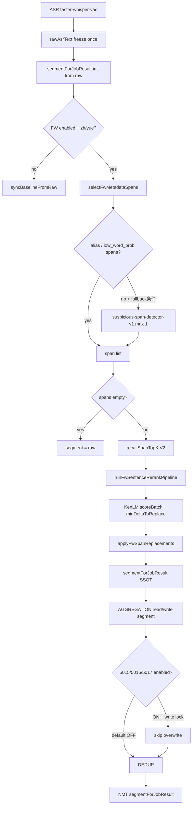

# P1~P4 冻结主链 — Freeze Simplification 只读审计

**日期：** 2026-05-27  
**范围：** `electron-node/main/src` 冻结主链（`asr.engine = fw_detector_v1`）  
**方法：** 静态代码与配置对照；**未改代码、未跑批测**

---

## 执行摘要

冻结主链在代码层已收敛为单路径：**Metadata Gate → V2 Recall → P4 Sentence Rerank → apply**。  
但配置面仍携带 **P1.2b / P3.2 / legacy detector / Recover / 5015–5017** 三套时代的开关与默认值，导致：

1. **约 35+ FW 相关配置项**中，冻结默认路径实际读取 **~15 项**；其余为回滚、legacy fallback 或**已加载但未使用**（死配置）。
2. **6 条可选 span 选择路径**仍驻留在 `fw-detector-orchestrator.ts`；默认仅走 1 条，另 1 条为 metadata 内嵌 fallback。
3. **KenLM weak_veto / hard_gate / deltaThreshold** 在 P4 默认路径**不参与决策**（P4 仅用句级 `minDeltaToReplace`）；`enableKenLMGate` 在 P4 仍**必须**为 true（否则无 scorer、无法 rerank）。
4. **写回 SSOT 清晰**，但 `asr-step` / `fw-detector-step` 初始化 segment 时仍保留 `rawAsrText ?? asrText` fallback，与冻结合约表述不完全一致。
5. **测试脚本**通过 `patch-p4-config.mjs` 写 `%APPDATA%` 配置；与 `node-config-defaults.ts` 已对齐，但多份 batch 脚本重复硬编码同一 config 块。

**是否需要开发清理：YES**

| 优先级 | 主题 |
|--------|------|
| **P0** | 死配置移除或文档标注；types 注释与默认不一致；`maxSpans` 双源 |
| **P1** | legacy 路径/config 迁入 `legacy/` 或 `rollback` 命名空间；KenLM P1.2b 配置折叠；测试 config SSOT |
| **P2** | JobContext Recover 字段、5015–5017 步骤物理迁移、CTC/Recover pipeline 模板 |

---

## 一、配置项精简

### 1.1 冻结主链必须保留（A）

| 配置项 | 默认（`node-config-defaults.ts`） | 读取点 |
|--------|-----------------------------------|--------|
| `asr.engine` | `fw_detector_v1` | `fw-mode.ts` |
| `features.fwDetector.enabled` | `true` | `fw-mode.ts` |
| `features.fwDetector.spanGateMode` | `fw_metadata_gate` | `fw-config.ts` |
| `features.fwDetector.fwMetadataSpanGate.enabled` | `true` | `fw-metadata-span-gate.ts` |
| `fwMetadataSpanGate.maxSpans` | `4` | span 选择上限 |
| `fwMetadataSpanGate.min/maxSpanChars` | `2` / `4` | 词概率 span |
| `fwMetadataSpanGate.wordProbabilityThreshold` | `0.65` | 低词概率 |
| `fwMetadataSpanGate.segmentAvgLogprobThreshold` | `-1.0` | fallback 条件 |
| `fwMetadataSpanGate.allowAliasExactHit` | `true` | alias gate |
| `fwMetadataSpanGate.fallbackLegacyMaxSpans` | `1` | fallback 上限 |
| `features.fwDetector.useSentenceLevelRerank` | `true` | orchestrator 分支 |
| `features.fwDetector.maxSentenceCandidates` | `16` | P4 组合上限 |
| `features.fwDetector.minDeltaToReplace` | `0.03` | P4 KenLM 句级阈值 |
| `features.fwDetector.minPrior` | `0.5` | recall 过滤 |
| `features.fwDetector.recallMinPhoneticScore` | `0.5` | recall（经 local-span-recall） |
| `features.fwDetector.candidateRequireRepairTarget` | `true` | pick / apply |
| `features.fwDetector.enabledDomains` | 四域 | domain 过滤 |
| `features.fwDetector.enableKenLMGate` | `true` | **P4 必需**（创建 scorer） |
| `features.lexiconRuntimeV2.enabled` | `true` | V2 bundle |
| `features.fwDetector.useLexiconRuntimeV2Recall` | `true` | V2 SQL recall |
| `lexiconRuntimeV2.maxBaseCandidates` | `2` | SQL LIMIT |
| `lexiconRuntimeV2.maxDomainCandidates` | `3` | SQL LIMIT |
| `lexiconRuntimeV2.maxIdiomCandidates` | `0` | 关闭 idiom 层 |
| `lexiconRuntimeV2.bundlePath` | `v2_shadow` | runtime 加载 |

### 1.2 仅回滚需要保留（B）

| 配置项 | 回滚目标 | 切换方式 |
|--------|----------|----------|
| `useSentenceLevelRerank: false` | P1.2b `runFwTopKDecisionPipeline` | 配置 |
| `topK` | P1.2b per-span recall 上限 | 配置 |
| `finalScoreWeights` | P1.2b `candidate-scorer` | 配置 |
| `kenlmGateMode` (`weak_veto` / `hard_gate`) | P1.2b `kenlm-span-gate` | 配置 |
| `kenlmDeltaThreshold` | P1.2b hard_gate | 配置 |
| `kenlmVetoThreshold` | P1.2b weak_veto | 配置 |
| `repairTargetScoreBoost` | P1.2b 加分（默认 0） | 配置 |
| `spanGateMode: kenlm_gate_filter` + `kenlmSpanGate.enabled: true` | P3.2 KenLM span gate | 配置 |
| `kenlmSpanGate.*` | P3.2 窗口扫描参数 | 配置 |
| `spanGateMode: legacy_detector` | `suspicious-span-detector-v1` 全量 | 配置 |
| `useLexiconRuntimeV2Recall: false` | V1 `recallSpanTopKV1` | 配置 |
| `useIndustryRouting: true` | `industry_routing_lexicon` 域解析 | 配置（冻结默认 false） |
| `features.lexiconRecall.enabled: true` | Recover 主链 | engine + config |
| `features.fwDetector.enabled: false` | 跳过 FW 步骤 | 配置 |

### 1.3 Legacy 专用，建议隐藏或迁移（C）

| 配置项 | 用途 | 建议 |
|--------|------|------|
| `spanDetectBudget` | legacy detector 预算 | 移入 `legacyDetector` 子对象 |
| `minRiskScore` | legacy detector 截断 | 同上 |
| `windowChars` | domain anchor 邻近 | legacy detector / fallback |
| `domainAnchorPath` + `domainAnchors` | legacy 场景信号 | fallback 内嵌 |
| `signalWeights` | legacy 信号加权 | 同上 |
| `minSpanChars` / `maxSpanChars`（**根级**） | legacy detector 枚举 | 与 `fwMetadataSpanGate.*` 重复 |
| `noSpeechProbThreshold`（**根级**） | legacy `low_no_speech_prob` | metadata gate 未读 |
| `features.lexiconRecall.*`（整段） | Recover V5 | 保留于 `legacy/recover` 文档 |
| `features.lexiconV2.*` | Intent CPU LLM | FW 主链默认关；独立特性 |
| `features.semanticRepair / phoneticCorrection / punctuationRestore` | 5015–5017 | 默认 OFF；enhancement 命名空间 |
| JobContext Recover 字段 | CTC n-best、window recall 等 | 类型层 legacy 分区 |

### 1.4 已无效 / 不再读取 / 可删除（D）

| 配置项 | 证据 |
|--------|------|
| `fwMetadataSpanGate.compressionRatioThreshold` | 仅 `fw-config.ts` 加载；`fw-metadata-span-gate.ts` **无读取**；`high_compression_ratio` 信号权重为 0 |
| `fwMetadataSpanGate.noSpeechProbThreshold` | metadata gate **未使用**；根级 `noSpeechProbThreshold` 仅 legacy detector |
| `enableRepairTargetFilter` | `@deprecated` 别名，合并进 `candidateRequireRepairTarget` |
| `fwDetector.maxSpans`（根级） | P4 路径仅写入 `configSnapshot`；span 上限由 `fwMetadataSpanGate.maxSpans` 控制；apply 无 D-greedy maxSpans 截断 |
| `allowSegmentFallbackScan` | 若设为 false 可禁用 fallback；**有行为**，但可合并为单一 `metadataGate.fallbackMode` |

### 1.5 默认值与冻结不一致，必须修正（E）

| 项 | 问题 |
|----|------|
| `node-config-types.ts` L122 | 注释写 `lexiconRuntimeV2`「默认 false」；**代码默认 true** |
| `fw-config.ts` L171 | `spanDetectBudget` fallback 用 `(cfg.maxSpans ?? 2)`；根 `maxSpans` 默认 4，逻辑不一致 |
| `asr-step.ts` / `fw-detector-step.ts` | `segmentForJobResult = rawAsrText ?? asrText`；冻结合约禁止业务 fallback，此处为初始化 |
| `phonetic-correction-step.ts` L37 | skip reason 仍写 `RECOVER_WRITE_LOCKED`（应为 segment write lock） |
| `freeze-contract.test.ts` | 标题仍「P1.2c-fix / V1.1」；未断言 `useLexiconRuntimeV2Recall` 在 `loadFwDetectorRuntimeConfig` |

---

## 二、路径精简

### 2.1 冻结默认路径（实际执行）



### 2.2 可选路径清单

| 路径 | 默认启用 | P1~P4 主链调用 | 回滚保留 | 移 legacy | 可删 | freeze guardrail |
|------|----------|----------------|----------|-----------|------|------------------|
| `legacy_detector` (`spanGateMode`) | **否** | 仅显式配置 | 是 | 是 | 否 | 已有 `freeze-contract` |
| `kenlm_gate_filter` | **否** | 仅显式配置 | 是 | 是 | 否 | 建议加静态断言默认 inactive |
| Metadata 内嵌 fallback → `suspicious-span-detector-v1` | **条件** | 是（非主路径） | 文档化 | 部分 | 否 | fallbackLegacyMaxSpans=1 |
| `runFwTopKDecisionPipeline` | **否** | `useSentenceLevelRerank=false` | 是 | 是 | 否 | freeze-contract 含源码引用 |
| `runFwSentenceRerankPipeline` | **是** | 是 | — | 否 | 否 | 已有 |
| 5015 semantic repair | **否** | 注册但 gate OFF | 可选 enhancement | 是 | 否 | `isSegmentWriteLocked` |
| 5016 phonetic correction | **否** | 同上 | 同上 | 同上 | 否 | 同上 |
| 5017 punctuation restore | **否** | 同上 | 同上 | 同上 | 否 | 同上 |
| CTC n-best / ASR rerun | **否** | FW engine 不写 nbest | Recover only | 是 | P2 | `task-router-asr` 重定向 |
| Recover `LEXICON_RECALL` + `SENTENCE_REPAIR` | **否** | FW mode 移除步骤 | 非 fw engine | 已隔离 | P2 | `pipeline-mode-fw.ts` |
| V1 `recallSpanTopKV1` | **否** | `useLexiconRuntimeV2Recall=false` | 是 | 是 | 否 | — |

---

## 三、写回逻辑精简

### 3.1 写点矩阵

| 字段 | 写点 | 冻结主链 | 分类 |
|------|------|----------|------|
| `rawAsrText` | `asr-step.ts` 首段一次 | 必须 | 必要 |
| `segmentForJobResult` | `asr-step` 初始化 | 必须 | 必要（init） |
| `segmentForJobResult` | `fw-detector-orchestrator` no_spans / apply | 必须 | 必要 |
| `segmentForJobResult` | `aggregation-step` turn 合并 | 必须 | 必要 |
| `segmentForJobResult` | 5015/5016/5017 | 默认不写（OFF 或 lock） | enhancement |
| `text_asr` | `result-builder` ← `resolveBusinessAsrText` | 必须 | 镜像 SSOT |
| `asrRepairApplied` | orchestrator apply 成功 | 必须 | 写锁 |
| `extra.raw_asr_text` | `result-builder` | 观测 | 必要 |

### 3.2 判断

1. **重复写回：** `asr-step` 与 `fw-detector-orchestrator` 均写 `segmentForJobResult` — 顺序正确（init → FW apply），非 bug。
2. **必要业务层：** FW apply + Aggregation 为唯二 mutator；NMT 只读。
3. **可收敛：** `syncBaselineFromRaw` 中 `?? ctx.asrText` 可改为仅 `rawAsrText`（需验证 FW skip 路径）。
4. **仅需文档化：** `buildFwResultExtra` vs `buildLegacyRecoverResultExtra` 分支已按 engine 分离；Recover extra 不进入 FW。

### 3.3 Extra 构建

| 函数 | 路径 | 建议 |
|------|------|------|
| `buildFwResultExtra` | FW 默认 | 保留；已最小化 |
| `buildLegacyRecoverResultExtra` | 非 fw engine | P2 移入 `legacy/recover` |
| `buildCoreResultExtra` | 共用 | 保留 |

---

## 四、KenLM 配置精简

### 4.1 冻结 P4 实际使用

`rerankFwSentences`：`scoreBatch([raw, ...candidates])` → `delta >= minDeltaToReplace`  
**不使用** `kenlm-span-gate.evaluateKenlmDecision` / weak_veto / hard_gate。

### 4.2 分类

| 配置 / 模块 | 分类 | 说明 |
|-------------|------|------|
| `enableKenLMGate` + `createKenlmBatchScorer` | **A P4** | false 则 P4 永不 apply |
| `minDeltaToReplace` | **A P4** | 句级唯一阈值 |
| `kenlm-span-gate.ts` `scoreSpanCandidateSentences` | **B P3.3/P1.2b** | topK 路径 |
| `kenlmGateMode` / `kenlmVetoThreshold` / `kenlmDeltaThreshold` | **B** | P1.2b only |
| `finalScoreWeights.kenlm` | **B** | P1.2b finalScore |
| `kenlmSpanGate` + `selectKenlmSuspiciousSpans` | **B** | P3.2 span 选择 |
| `hard_gate` mode | **C** | 代码存在；无冻结默认；可标记 experimental |
| KenLM scorer 共用模块 | **A+B 共用** | 不属 legacy Recover |

---

## 五、测试配置精简

### 5.1 `patch-p4-config.mjs`

- 写入 `%APPDATA%/lingua-electron-node/electron-node-config.json`
- 与 `node-config-defaults.ts` **关键字段一致**（metadata gate、P4 rerank、V2 recall）
- **未覆盖：** `enableKenLMGate`、`minPrior`、`candidateRequireRepairTarget` 等 — 依赖已有用户 config 或代码 fallback（`fw-config.ts` 默认）

### 5.2 批测脚本 config 重复

| 脚本 | 硬编码 config | 风险 |
|------|---------------|------|
| `patch-p4-config.mjs` | 权威 patch | 低 |
| `run-lexicon-v2-p4-batch.js` | report.config 镜像 | 与 patch 重复 |
| `run-p4-freeze-batch.js` | 同上 + session migration | 重复 |
| `run-lexicon-v2-phase3-p32-batch.js` | `kenlm_gate_filter` | **非冻结**；应标 legacy |
| `run-lexicon-v2-phase3-p33-batch.js` | metadata | 可被 p4 替代 |

### 5.3 问题

| 问题 | 严重度 |
|------|--------|
| 新环境仅依赖代码默认、未跑 patch → 行为仍正确（Freeze Cleanup 后） | 低 |
| 旧 `%APPDATA%` 配置残留 `useSentenceLevelRerank: false` | **中** — 与冻结不一致 |
| 多脚本各自写 config 块 | **低** — 维护成本 |
| `run-p1-freeze-audit.py` / `run-p2-freeze-probes.mjs` | 验收专用；非生产 config |

**建议：** 单一 `tests/freeze-config-ssot.json` + 各脚本引用；CI 跑 patch 或 assert defaults。

---

## 六、可冻结默认配置清单（最小集）

```json
{
  "asr": { "engine": "fw_detector_v1" },
  "features": {
    "lexiconRecall": { "enabled": false },
    "lexiconRuntimeV2": {
      "enabled": true,
      "bundlePath": "node_runtime/lexicon/v2_shadow",
      "maxBaseCandidates": 2,
      "maxDomainCandidates": 3,
      "maxIdiomCandidates": 0
    },
    "semanticRepair": { "enabled": false },
    "phoneticCorrection": { "enabled": false },
    "punctuationRestore": { "enabled": false },
    "fwDetector": {
      "enabled": true,
      "spanGateMode": "fw_metadata_gate",
      "useLexiconRuntimeV2Recall": true,
      "useSentenceLevelRerank": true,
      "useIndustryRouting": false,
      "enableKenLMGate": true,
      "maxSentenceCandidates": 16,
      "minDeltaToReplace": 0.03,
      "minPrior": 0.5,
      "recallMinPhoneticScore": 0.5,
      "candidateRequireRepairTarget": true,
      "kenlmSpanGate": { "enabled": false },
      "fwMetadataSpanGate": {
        "enabled": true,
        "maxSpans": 4,
        "wordProbabilityThreshold": 0.65,
        "segmentAvgLogprobThreshold": -1.0,
        "allowAliasExactHit": true,
        "allowSegmentFallbackScan": true,
        "fallbackLegacyMaxSpans": 1
      }
    }
  }
}
```

**回滚包（独立文件 `freeze-rollback-config.json`，不进生产默认）：**

- P1.2b：`useSentenceLevelRerank: false` + topK / finalScoreWeights / kenlmGateMode*
- P3.2：`spanGateMode: kenlm_gate_filter`, `kenlmSpanGate.enabled: true`
- Legacy detector：`spanGateMode: legacy_detector`

---

## 七、Target List

| ID | 目标 | 优先级 |
|----|------|--------|
| T1 | 删除或停止导出 `compressionRatioThreshold`、`fwMetadataSpanGate.noSpeechProbThreshold` | P0 |
| T2 | 修正 `node-config-types` lexiconRuntimeV2 注释 | P0 |
| T3 | 合并 `maxSpans`：gate 用 `fwMetadataSpanGate.maxSpans` 为 SSOT | P0 |
| T4 | `useLexiconRuntimeV2Recall` 与 `lexiconRuntimeV2.enabled` 合并为单开关（或 assert 联动） | P1 |
| T5 | P1.2b KenLM 配置移入 `fwDetector.rollbackTopK` 子对象 | P1 |
| T6 | `suspicious-span-detector-v1` + `fw-topk-decision-pipeline` 移 `legacy/fw-detector/` | P1 |
| T7 | 测试 config SSOT 文件化 | P1 |
| T8 | JobContext Recover 字段拆类型或 `@legacy` 标记 | P2 |
| T9 | 5015–5017 步骤注册移 enhancement 模块 | P2 |
| T10 | `PIPELINE_MODES.*` 基模板去 Recover 步骤（仅 legacy engine 注入） | P2 |

---

## 八、Check List（清理前验收）

- [ ] `freeze-contract.test.ts` 扩展：断言 metadata gate 死字段未进入 runtime gate
- [ ] `loadFwDetectorRuntimeConfig()` 在零 user config 下与上表 JSON 一致
- [ ] P4 dialog_200 批测在 patch 前后结果一致
- [ ] P1.2b 回滚：`useSentenceLevelRerank: false` 仍 PASS 历史 golden
- [ ] `fw-detector-gate.mjs` 仍 PASS
- [ ] 文档 `PIPELINE.md` / `FW_MAINLINE_FREEZE.md` 同步最小 config 集
- [ ] 无 `legacy/recover` import 进入 fw-detector 主链

---

## 九、最终判定

### 是否需要开发清理：**YES**

### P0 — 必须做（否则冻结配置不一致或误导）

1. 移除 **D 类死配置**（`compressionRatioThreshold` 等）或 gate 内实现/删除加载。
2. 修正 **node-config-types** 与 **freeze-contract** 文档/断言与 P4 冻结对齐。
3. **`maxSpans` 双源**收敛：冻结 SSOT = `fwMetadataSpanGate.maxSpans`；根级仅回滚或删除。
4. 标注 **`enableKenLMGate` 对 P4 为必需**，非「可选 KenLM gate」。

### P1 — 建议做（降低维护成本）

1. 回滚配置折叠为 `rollback` 子树；主 config 只暴露 A 类。
2. legacy span 路径代码移 `legacy/fw-detector/`（行为不变，import 隔离）。
3. 测试 config 单一 SSOT；phase3 batch 脚本标 deprecated。
4. 初始化写回去掉 `asrText` fallback（或 freeze guard 测试覆盖）。

### P2 — 可延后（legacy 清理）

1. JobContext Recover 字段分区。
2. `PIPELINE_MODES` 基模板与 Recover 步骤解耦。
3. 5015–5017 与 `buildLegacyRecoverResultExtra` 物理归档。

---

## 附录：审计文件清单

| 文件 | 结论摘要 |
|------|----------|
| `fw-config.ts` | 三 mode 解析 + 大量 legacy 默认共存 |
| `node-config-defaults.ts` | P4 默认已对齐；仍含整段 lexiconRecall |
| `fw-detector-orchestrator.ts` | 三分支 span + 双分支 decision；结构清晰但路径多 |
| `fw-metadata-span-gate.ts` | 主路径；含 documented fallback |
| `fw-sentence-rerank-pipeline.ts` | P4 主决策链 |
| `fw-topk-decision-pipeline.ts` | 仅 rollback |
| `kenlm-span-gate.ts` | P1.2b；P4 不调用 evaluateKenlmDecision |
| `post-asr-routing.ts` | SSOT + write lock 正确 |
| `pipeline-step-registry.ts` | FW + legacy + enhancement 同表 |
| `result-builder.ts` | FW/legacy extra 分支正确 |
| `patch-p4-config.mjs` | 与 defaults 基本一致；非全量覆盖 |

**相关文档：** [PIPELINE.md](./PIPELINE.md) · [FW_MAINLINE_FREEZE.md](./FW_MAINLINE_FREEZE.md)
