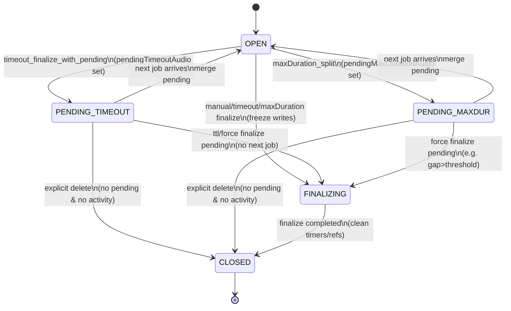
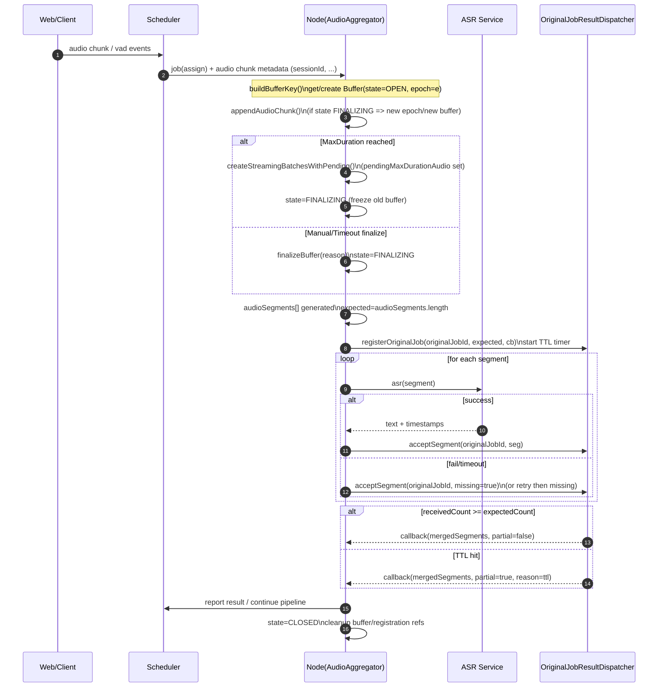

# 节点端流式 ASR：落地 TaskList / 最小 Patch 清单 / Buffer 状态机图 / 自测 Checklist（交付版）

> 面向：开发部门（节点端 / ASR / Pipeline）  
> 目标：以**最小改动**完成“job 可合并、不中断、可观测、可排障”的闭环  
> 说明：本文件不考虑兼容历史行为；若需兼容，另起变更评审。

---

## 0. 约定与命名

为避免歧义，以下术语在本文件中含义固定：

- **Buffer**：以 `bufferKey` 唯一标识的一条输入音频连续流的缓存对象（包含 pending / segments / timers / epoch 等）。
- **Epoch**：同一 bufferKey 下，当进入 FINALIZING 或遇到关键边界后递增的“代次”，用于避免“旧 buffer 被 finalize 后又被写入”。
- **Registration**：OriginalJobResultDispatcher 为某个 originalJob 注册的聚合上下文，等待 segment 返回并触发回调。

---

## 1) TaskList（可直接拆 JIRA）

> 建议按 P0/P1/P2 分期推进。P0 完成后可显著降低“job 无法合并/丢字/卡死”。

### P0：合并稳定性 + 可观测性（阻断级）
1. **定义并冻结 bufferKey 规范**
   - 输出：`buildBufferKey()` 工具函数 + 文档注释 + 全链路日志字段（bufferKey/epoch）
2. **Buffer 生命周期状态机化（最小实现）**
   - 输出：Buffer 增加 `state` 与 `epoch`，并将 finalize 过程置入 FINALIZING 冻结写入
3. **统一 expectedSegmentCount 的来源**
   - 输出：`expectedSegmentCount = audioSegments.length`（强制一致）+ 日志
4. **Dispatcher 增加 registration TTL 兜底**
   - 输出：超时强制 finalize（partial）+ 清理，避免永远等不齐
5. **ASR 失败 segment 的“核销/重试”策略**
   - 输出：失败 segment 必须进入“已结算”路径（重试有限次或标记 missing），确保 registration 可完成
6. **统一 batch → originalJobId 归属策略**
   - 输出：全局采用“头部对齐”，MaxDuration/Manual/Timeout 行为一致
7. **删除/清理路径增加“删除原因”与 pending 状态日志**
   - 输出：任何 buffer delete 必须打印：reason、pending lengths、state、epoch

### P1：性能与抗压（强烈建议）
8. **ASR 并发与背压（per-session + per-node）**
   - 输出：并发上限、队列化执行、超限策略
9. **参数 profile 化（交互/精度）**
   - 输出：配置结构 + 默认 profile + 运行时可切换
10. **语言感知的 segment 拼接器**
   - 输出：CJK/拉丁语系差异化 join 规则（或按标点策略）

### P2：质量与工程化（可选）
11. **测试用例与回归脚本（3 类关键场景）**
12. **指标与埋点（utterance_gap、registration_timeout、buffer_recreate）**
13. **状态机可视化与调试页面（可选）**

---

## 2) 逐文件“最小 Patch 清单”（按常见工程结构给出）

> 说明：以下文件名为你当前模块命名的合理映射；若实际路径不同，按模块职责对照迁移即可。  
> 原则：**不加锁、少引入新模块、以状态机 + epoch 解决异步交错问题**。

### A. `main/src/pipeline-orchestrator/audio-aggregator.ts`
**目标**：冻结 bufferKey；引入 state/epoch；统一 finalize 入口；杜绝 finalize 后写入旧 buffer。

最小改动：
1. **新增：bufferKey 生成**
   - 增加函数：
     - `buildBufferKey(job, ctx): string`
   - 推荐字段（按你系统情况选最小稳定集合）：
     - `session_id`（必选）
     - `room_code`（房间模式）
     - `input_stream_id` 或 `speaker_id`（多输入流/多说话人）
   - 在每个入口日志打印：`bufferKey`, `epoch`, `state`

2. **新增：Buffer 状态字段**
   - `buffer.state: 'OPEN'|'PENDING_TIMEOUT'|'PENDING_MAXDUR'|'FINALIZING'|'CLOSED'`
   - `buffer.epoch: number`（默认 0）
   - `buffer.lastWriteAt / lastFinalizeAt`（可选，便于排障）

3. **写入前检查（关键）**
   - 在 `appendAudioChunk(...)` 或任何写入 PCM 的地方：
     - 若 `state === FINALIZING || state === CLOSED` → **切换 epoch 并创建新 buffer 容器**（或拒绝写入并记录）
   - 记录：`write_rejected_due_to_state`

4. **统一 finalize 入口**
   - 将 manual/timeout/maxDuration 的 finalize 收敛到：
     - `finalizeBuffer(bufferKey, reason, jobContext)`
   - finalize 函数内部第一步：`state = FINALIZING`，递增 `epoch`（或在 finalize 结束后递增，以你实现为准，但需一致）

5. **清理前打印删除原因**
   - 每次 delete buffer 时输出：
     - `reason`, `pendingTimeoutLen`, `pendingMaxDurLen`, `state`, `epoch`, `expectedSegmentCount`（如有）

---

### B. `main/src/pipeline-orchestrator/createStreamingBatchesWithPending.ts`（或同名模块）
**目标**：确保 batch 生成逻辑对 pending 的消费一致；并返回“头部对齐”所需的 batchJobInfo。

最小改动：
1. 返回结构必须包含：
   - `batches[]`
   - `batchJobInfo[]`（至少包含每个 batch 的 `firstSegmentJobId` 或 `firstSegmentUtteranceIndex`）
2. 当 pending 合并发生时：
   - 输出日志：`pending_merge_type`, `pending_len_before/after`, `utterance_gap`
3. 对 `utteranceIndex` 差值 > 阈值（如 >2）：
   - 立即执行明确策略：`force_finalize_pending` 或 `drop_pending_with_reason`
   - 不允许“静默失败”

---

### C. `main/src/pipeline-orchestrator/runAsrStep.ts`（或 ASR step 执行处）
**目标**：expectedSegmentCount 强一致；失败 segment 的核销/重试；并发控制（P1）。

最小改动（P0）：
1. 强制：
   - `expectedSegmentCount = audioSegments.length`
2. 每个 segment 请求必须携带：
   - `bufferKey`, `epoch`, `originalJobId`, `segmentIndex`, `expectedSegmentCount`
3. 失败处理二选一（至少实现其一）：
   - **有限重试**（建议 1–2 次）→ 仍失败则进入核销
   - **直接核销**：dispatch 一个 `missing=true` 的 segment 回来，使 registration 可以完成

---

### D. `main/src/pipeline-orchestrator/original-job-result-dispatcher.ts`
**目标**：registration TTL 兜底；segment-level 计数一致；防内存泄露。

最小改动：
1. `registerOriginalJob(originalJobId, expectedCount, cb)`：
   - 保存：`startedAt`, `expectedCount`, `receivedCount`, `segments[]`, `timerHandle`
2. 增加 TTL：
   - `setTimeout(() => forceFinalizePartial(originalJobId, reason='registration_ttl'), TTL_MS)`
3. `acceptSegment(originalJobId, seg)`：
   - 允许 seg 标记 `missing=true` 计入 receivedCount
   - 当 `receivedCount >= expectedCount` → clear timer + finalize
4. finalize 输出：
   - `partial: boolean`
   - `missingCount`
   - `reason`（正常完成/ttl/abort）
5. 超时 finalize 后必须清理 registration map，避免悬挂

---

### E. `main/src/pipeline-orchestrator/assignOriginalJobIdsForBatches.ts`（若仍存在）
**目标**：统一归属策略，避免 MaxDuration 与 Finalize 行为分裂。

最小改动：
1. 标记该模块为：
   - **deprecated**（仅用于 debug/统计），或
   - 改为头部对齐策略的薄封装（推荐）
2. 全局对外只暴露一个策略：
   - `assignByHeadAlignment(batches, batchJobInfo)`

---

### F. `main/src/pipeline-orchestrator/text-merge.ts`（或拼接处）
**目标**：避免 `join(' ')` 在 CJK 等语言上造成粘连/多空格（P1）。

最小改动（P1）：
1. 新增 `mergeSegments(segments, langHint)`：
   - CJK：不加空格或按标点规则
   - 拉丁语系：空格拼接
2. 将拼接与“过滤/核销”解耦：文本过滤不能影响 buffer 生命周期。

---

## 3) Buffer 生命周期：一页状态图 + 时序图（Mermaid）

> 可直接复制到支持 Mermaid 的文档/看板（GitHub / Notion / Obsidian 等）。

### 3.1 状态机（State Diagram）

### 3.2 单页时序图（Sequence Diagram）

---

## 4) “开发自测 Checklist”（建议作为 PR Gate）

> 每项给出：步骤、预期、关键日志关键字。  
> 通过这些项，基本可以覆盖你当前遇到的“合并失败、切碎、丢字、卡死”。

### A. BufferKey 稳定性（必测）
- [ ] **同一句话期间 bufferKey 不变化**
  - 步骤：持续说话 8–12 秒；中途不要手动停止
  - 预期：同一 session 的所有 chunk/ finalize 日志 `bufferKey` 一致
  - 日志关键字：`bufferKey=... epoch=... state=...`

- [ ] **重连后 bufferKey 行为符合预期**
  - 步骤：说话 3 秒 → 断开 WS → 1 秒内重连 → 继续说话
  - 预期：若设计为“重连视为新流”，则 epoch 或 bufferKey 变化；否则保持一致
  - 关键：不得出现“旧 FINALIZING buffer 被写入”

### B. Pending 合并（必测）
- [ ] **短句 timeout pending 合并到下一 job**
  - 步骤：说 0.6–1.0 秒短句停顿（触发 timeout finalize）→ 1 秒内继续说
  - 预期：输出文本包含短句与后续句，且不丢字
  - 日志：`pending_merge_type=timeout`、`utterance_gap<=threshold`

- [ ] **MaxDuration 尾巴 pending 合并到下一 job**
  - 步骤：持续说话超过 MaxDuration（如 35 秒）
  - 预期：分段输出连续、无重复、无丢失
  - 日志：`pending_merge_type=maxdur`

- [ ] **utterance_gap 超界策略可观测**
  - 步骤：构造 gap>2（例如中途强制重置 utteranceIndex 或模拟丢 job）
  - 预期：触发你定义的策略（force finalize / drop），且有明确 reason
  - 日志：`utterance_gap=... action=force_finalize_pending`

### C. Finalize 行为一致性（必测）
- [ ] **MaxDuration 与 Manual/Timeout 的 batch→job 归属一致**
  - 步骤：分别触发 MaxDuration 与 Manual finalize，各运行一次
  - 预期：同等输入下，batch 归属规则一致（头部对齐）
  - 日志：`assign_strategy=head_alignment`

### D. Dispatcher 兜底（必测）
- [ ] **ASR segment 永远等不齐时不会卡死**
  - 步骤：人为让一个 segment 超时（断网/注入失败）
  - 预期：TTL 到时 partial 输出，registration 被清理
  - 日志：`registration_ttl`、`partial=true`

- [ ] **missing segment 计数正确**
  - 步骤：注入 1 个失败 segment
  - 预期：`missingCount==1`，且最终仍触发 callback
  - 日志：`missing=true receivedCount/expectedCount`

### E. 删除/清理正确性（必测）
- [ ] **buffer delete 必有原因且不会误删 pending**
  - 步骤：触发 pendingTimeout/pendingMaxDur 后观察清理
  - 预期：有 pending 时不 delete；delete 时 reason 明确
  - 日志：`delete_buffer reason=... pendingTimeoutLen=... pendingMaxDurLen=...`

### F. 性能与背压（建议 P1 测）
- [ ] **并发 5 个会话不会把节点打爆**
  - 步骤：5 路同时说话 15 秒
  - 预期：ASR 队列增长但可收敛；无大量 TTL
  - 指标：队列长度、平均延迟、TTL 次数

---

## 5) 建议的最小日志字段（统一格式）
> 用于你们以后做“从日志直接定位合并失败原因”的闭环。

建议在所有关键日志打印以下字段（JSON 或 key=value）：

- sessionId, roomCode（如有）
- bufferKey, epoch, state
- originalJobId, utteranceIndex
- finalizeReason（manual/timeout/maxdur/ttl）
- pendingTimeoutLen, pendingMaxDurLen
- expectedSegmentCount, receivedCount, missingCount
- assignStrategy=head_alignment
- action（merge/force_finalize/drop/recreate）

---

## 6) 验收标准（建议作为合入条件）
- P0 全部完成后：
  - “Buffer not found / recreate” 在正常用例中**趋近于 0**
  - 任何情况下不会出现 registration 永久悬挂
  - MaxDuration/Timeout/Manual 行为一致
  - 关键日志可直接定位：是 key 不稳定、是误删 pending、还是 finalize 过频

---

## 7) 附：开发拆分建议（便于并行）
- 人员 A：BufferKey + 状态机（audio-aggregator.ts）
- 人员 B：Dispatcher TTL + missing 核销（original-job-result-dispatcher.ts）
- 人员 C：runAsrStep expectedCount + 失败策略（runAsrStep.ts）
- 人员 D：统一归属策略 + 拼接器（assignOriginalJobIdsForBatches.ts / text-merge.ts）
