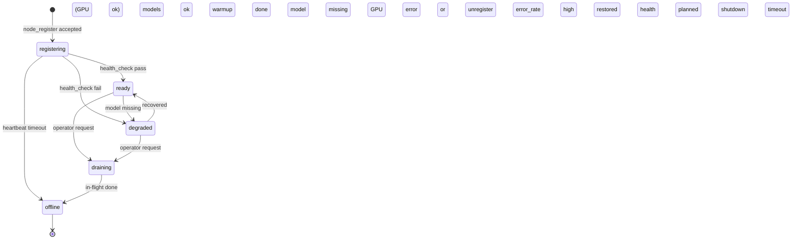

# NodeStatus 状态机与调度过滤流程图 + 测试清单
## Node Registration & Lifecycle (v1.1-aligned)

版本：v1.0  
适用：Scheduler / Third-Party Electron Node / Web UI  
前提：GPU 强制（注册硬门槛）

---

## 1. NodeStatus 状态机（Scheduler 权威）

### 1.1 状态定义（回顾）

- **registering**：已完成注册，但尚未参与调度（能力/模型仍可能在 warm-up）
- **ready**：可被调度
- **degraded**：能力下降（模型缺失、GPU 不可用、连续失败等）
- **draining**：准备下线，不再接新任务，但允许完成在途任务
- **offline**：心跳丢失/主动下线/被移除

### 1.2 状态机图（Mermaid）



### 1.3 触发条件（建议在 Scheduler 侧落地为规则表）

| From → To | 触发 | 建议判定条件（示例） |
|---|---|---|
| registering → ready | 健康检查通过 | 最近 N 次 heartbeat ok；必需模型 ready；GPU 可用 |
| registering → degraded | 健康检查失败 | 缺必需模型；GPU 不可用；warmup 超时 |
| ready → degraded | 运行期退化 | 连续失败率 > X%；模型被移除；GPU OOM/driver error |
| degraded → ready | 恢复 | 模型恢复 + 健康检查连续通过 |
| ready/degraded → draining | 主动下线 | operator/策略触发；node 设置 accept_public_jobs=false 也可触发 draining（可选） |
| draining → offline | 退出完成 | 无在途任务或等待超时 |
| any → offline | 心跳丢失 | heartbeat 超时（例如 15–30s * 3 次） |

---

## 2. 调度过滤流程图（Scheduler）

### 2.1 过滤目标

在调度决策前，把**不满足硬条件/策略条件**的节点剔除，保证：
- 正确性（不派给不可用节点）
- 可解释性（为什么没被派单）

### 2.2 流程图（Mermaid）

```mermaid
flowchart TD
    A[Incoming Job
(job_id, tenant_id, required_models, priority)] --> B[Load Candidate Nodes Pool]
    B --> C{NodeStatus == ready ?}
    C -- No --> Cx[Exclude
reason: status_not_ready]
    C -- Yes --> D{accept_public_jobs == true
or job is private/allowed ?}
    D -- No --> Dx[Exclude
reason: not_in_public_pool]
    D -- Yes --> E{GPU present & usable ?}
    E -- No --> Ex[Exclude
reason: gpu_unavailable]
    E -- Yes --> F{required_models available & enabled ?}
    F -- No --> Fx[Exclude
reason: model_not_available]
    F -- Yes --> G{node capacity ok ?
(concurrency, mem, vram)}
    G -- No --> Gx[Exclude
reason: capacity_exceeded]
    G -- Yes --> H[Score Nodes
(latency, load, affinity)]
    H --> I[Pick Best Node]
    I --> J[Assign Job
emit logs + ui_event DISPATCHED]
```

### 2.3 “硬过滤”与“软评分”建议分层

- **硬过滤（必须通过才可候选）**：status、public/private、GPU、必需模型、容量底线  
- **软评分（在候选集内比较）**：延迟、负载、亲和性、历史成功率、地理位置（如未来需要）

---

## 3. Node 注册与状态流转测试清单（开发/联调/验收）

> 说明：本清单覆盖注册、状态流转、调度过滤、异常处理四类。  
> 建议配合日志：trace_id、node_id、status_change_event、dispatch_exclude_reason。

### 3.1 注册协议测试（Registration）

**TC-R-01：无 GPU 注册失败（硬门槛）**  
- Given: node_register.hardware.gpus 缺失或空数组  
- When: 发送 node_register  
- Then: 返回 node_error(GPU_REQUIRED)；Scheduler 不创建 node 记录

**TC-R-02：单 GPU 注册成功**  
- Given: gpus=[{name,memory_gb>0}]  
- Then: node_register_ack 返回 node_id；status=registering

**TC-R-03：多 GPU 注册成功**  
- Given: gpus 有 2+ 张  
- Then: ack 正常；Scheduler 记录多卡信息（用于后续调度/容量）

**TC-R-04：capability_schema_version 缺失（软引入）**  
- Given: 不带 capability_schema_version  
- Then: Scheduler 视为 "1.0" 并接受注册

**TC-R-05：capability_schema_version 不支持**  
- Given: capability_schema_version="9.9"  
- Then: node_error(INVALID_CAPABILITY_SCHEMA)

**TC-R-06：node_id 冲突（最小实现）**  
- Given: 使用已存在的 node_id 再次注册（且策略为拒绝）  
- Then: node_error(NODE_ID_CONFLICT)  
- And: 提示客户端清理本地 node_id 后重试

### 3.2 状态机流转测试（Lifecycle）

**TC-S-01：registering → ready**  
- Given: 注册成功后开始 heartbeat/health_check  
- When: 连续 N 次健康检查通过，且必需模型 ready  
- Then: Scheduler 将状态置为 ready，并广播 node_status（如实现）

**TC-S-02：registering → degraded（warmup 超时）**  
- When: warmup 超过阈值（例如 60s）仍未满足模型/健康条件  
- Then: 状态变为 degraded，记录原因（model_missing/warmup_timeout）

**TC-S-03：ready → degraded（模型缺失）**  
- When: Scheduler 收到模型状态变更：required model missing/disabled  
- Then: 状态变 degraded；该节点不再被派单

**TC-S-04：degraded → ready（恢复）**  
- When: 模型恢复 + 健康检查连续通过  
- Then: 状态回 ready；重新进入候选池

**TC-S-05：ready → draining → offline（主动下线）**  
- When: operator 触发 draining  
- Then: 新任务不再派发；在途任务结束后转 offline  
- And: 若等待超时也必须转 offline（避免悬挂）

**TC-S-06：any → offline（心跳丢失）**  
- When: heartbeat 超时 N 次  
- Then: 状态 offline；调度剔除

### 3.3 调度过滤测试（Dispatch Filtering）

**TC-D-01：status_not_ready 被过滤**  
- Given: 节点状态 registering/degraded/draining/offline  
- When: 调度  
- Then: 该节点被剔除，reason=status_not_ready

**TC-D-02：not_in_public_pool 被过滤**  
- Given: accept_public_jobs=false 且 job 为 public  
- Then: 剔除，reason=not_in_public_pool  
- And: 若 job 为私有/允许范围内，则可继续候选（按策略）

**TC-D-03：gpu_unavailable 被过滤**  
- Given: 节点 ready 但 GPU 标记不可用  
- Then: 剔除，reason=gpu_unavailable

**TC-D-04：model_not_available 被过滤**  
- Given: 节点 ready 但缺 required_models 任一项  
- Then: 剔除，reason=model_not_available

**TC-D-05：capacity_exceeded 被过滤**  
- Given: 节点达到并发上限/VRAM 低于阈值  
- Then: 剔除，reason=capacity_exceeded

**TC-D-06：候选为空（调度失败）**  
- Given: 全部节点被过滤  
- Then: Scheduler 返回 NO_AVAILABLE_NODE（或重试策略）  
- And: 记录排除原因统计（用于运维优化）

### 3.4 回归与验收标准（Acceptance）

- A1：无 GPU 的 node 永远无法注册  
- A2：注册成功后初始状态固定为 registering；只有 ready 可调度  
- A3：所有过滤原因可被日志解释（至少包含 node_id + reason）  
- A4：心跳丢失能在限定时间内将节点置为 offline，并停止派单  
- A5：degraded 节点不会接新任务；恢复后可重新接单  
- A6：draining 节点不接新任务，但允许完成在途任务，最终进入 offline  
- A7：调度候选为空时能给出明确错误码与可观测原因聚合

---

## 4. 建议的最小日志点（便于联调）

- node_register_received(node_id?, schema_version, gpu_count)
- node_status_changed(node_id, from, to, reason)
- dispatch_candidate_excluded(node_id, reason)
- job_assigned(job_id, node_id, required_models)
- heartbeat_timeout(node_id, last_seen_ms)

（如你已接入全链路 Logging v3.1，可直接复用 trace_id + fields。）

