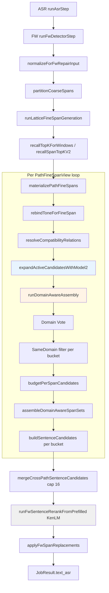

# Model3 Audit — Current Actual Runtime Diagram

**Source:** code trace `span-assembly-v4-orchestrator.ts` + `job-pipeline.ts` (2026-08-23)

**ORDER_DRIFT (comment only):** `span-assembly-v4-orchestrator.ts` header says `Tone → Vote → Bucket → Assembly` but **runtime** is `Tone → Compatibility → **Model2** → Vote → Bucket → Assembly`. Stage-J docs match runtime.
