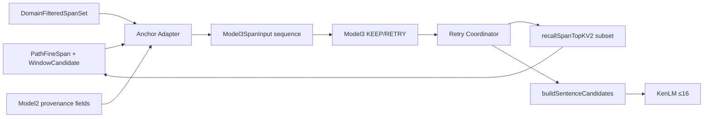

# Model3 Dataflow Diagram

**Types (proposed CREATE):**

- `Model3SpanInput`: spanId, surface, anchor, anchorSource, toneEvidence, pinyinEvidence, model2Evidence, domainBucket
- `Model3UtteranceDecision`: spanId → KEEP | RETRY (non-anchor only)
