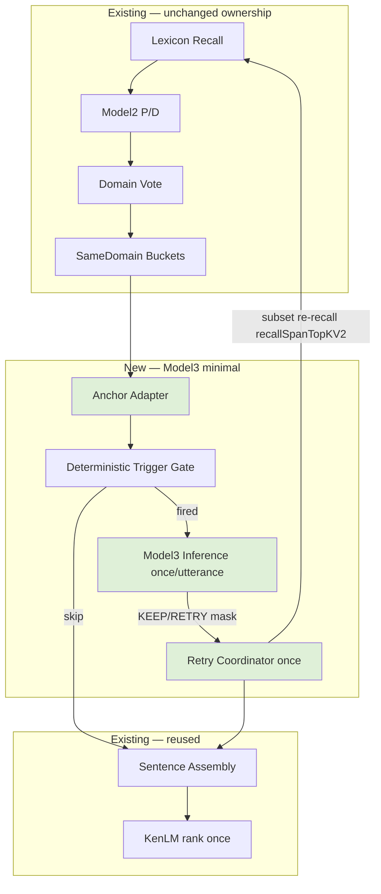

# Model3 Target Minimal Architecture Diagram

**Insertion:** after `runDomainAwareAssembly` (anchor formation), **before** `buildSentenceCandidates` / KenLM.

**Feedback:** one-shot re-recall → re-assembly → **single** KenLM (not before first assembly).
